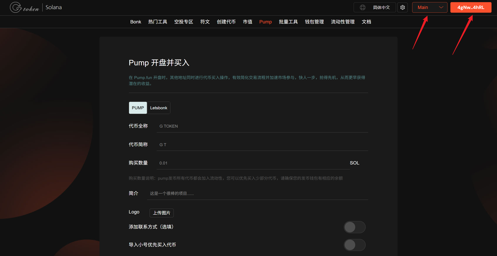
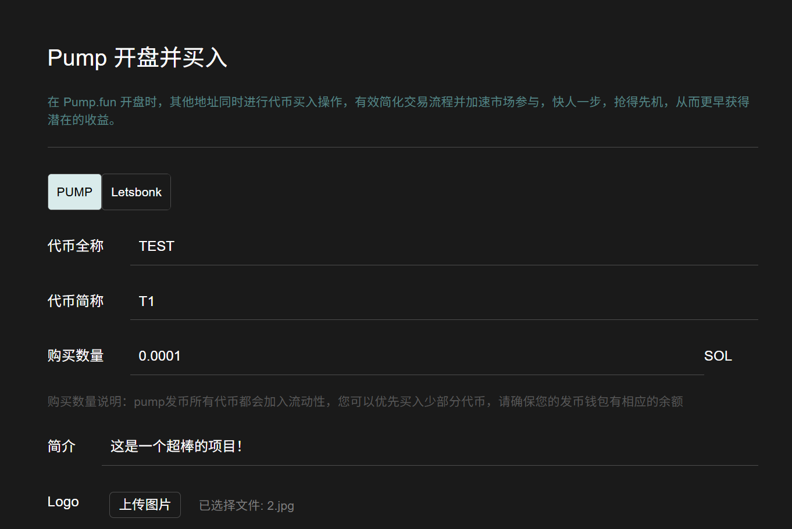
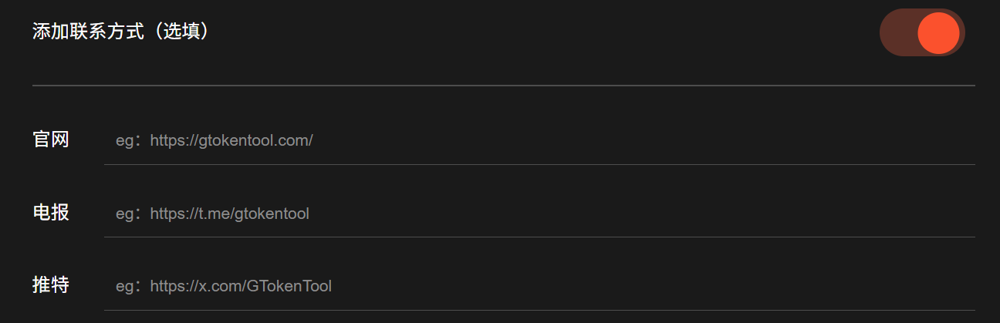
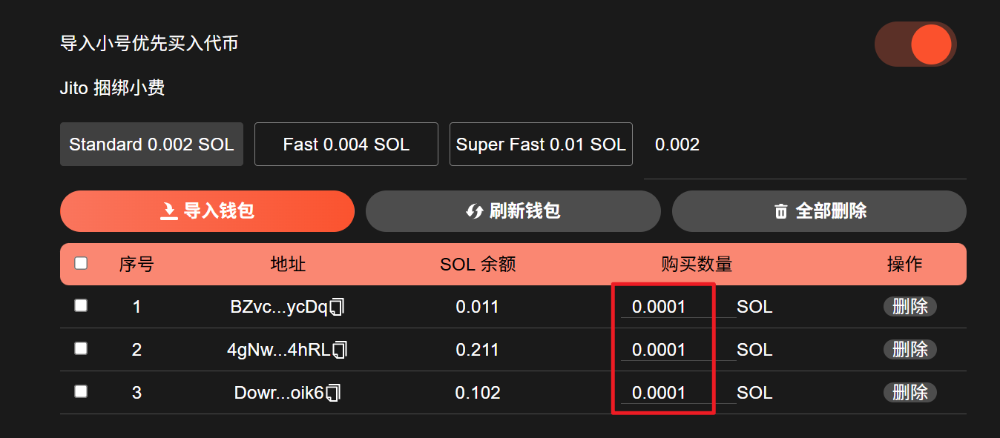
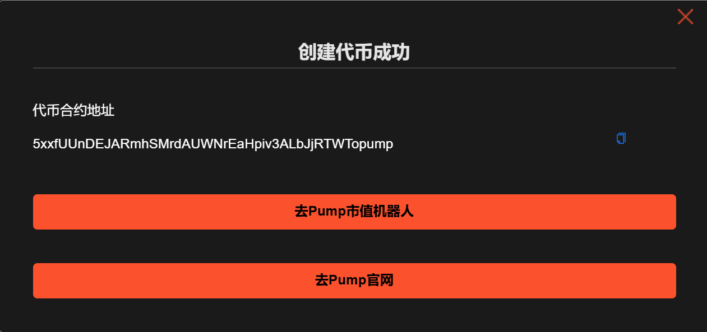

# 💊 PUMP发币和捆绑买入教程

## 📌核心摘要

* **平台背景（Pump.fun 生态）**：基于 Solana 链上最热门的 Meme 币发射平台 **Pump.fun**，针对其独特的 bonding curve（联合曲线）机制，提供专门的代币发行与交易策略支持。
* **核心功能（捆绑买入）**：利用 **GTokenTool** 工具实现**发币与买入的原子化操作**，支持在代币生成的同一区块或极短时间内完成批量建仓（捆绑），确保在开盘第一时间锁定筹码。
* **技术优势（速度与效率）**：解决手动操作延迟高的问题，通过自动化脚本实现**毫秒级响应**，大幅提升在 PUMP 平台发射新币后的抢筹成功率与资金利用率。

## 视频演示



## PUMP发币准备事项

1. Solana 钱包（[幻影钱包Phantom安装教程](https://docs.gtokentool.com/solana/auxiliary-tutorial/phantom-wallet-installation)）
2. 钱包准备充足的SOL
3. 代币的相关信息和 Logo

## PUMP发币步骤

### 一、连接钱包

PUMP发币和开盘捆绑买入工具：[https://sol.gtokentool.com/zh-CN/pump/bundle](https://sol.gtokentool.com/zh-CN/pump/bundle)

进入GTokenTool平台Pump发币入页面，选择 Main 网络，连接钱包，选择幻影钱包Phantom，连接后就可以看到钱包地址。

<figure><figcaption>
连接钱包并选择Main网络
</figcaption></figure>

### 二、必填代币相关参数

<figure><figcaption>
填写代币参数
</figcaption></figure>

### 三、选填代币相关参数

根据自己的需求进行填写或者不填。

<figure><figcaption>
添加联系方式
</figcaption></figure>

### 四、导入小号优先买入代币


Pump（每个 0.03 SOL）最多导入 16 个钱包，发币前请确保每个钱包资金来源不一样。

**特别说明**：<mark style="color:purple;">购买数量最好不要超过当前钱包的90%，最少预留0.007 SOL（最好预留10%）</mark>。不会填写请咨询我们再操作。

创建失败请增加 jito 小费，失败不扣钱。

<mark style="color:purple;">所有服务费由创建代币的钱包支付。</mark>


打开导入小号优先买入代币选项。设置Jito捆绑小费，点击“`导入钱包`”，输入钱包私钥。

导入成功后，可以看到钱包内的余额。填写买入金额，<mark style="color:purple;">注意购买数量最好不要超过当前钱包的90%，最少预留0.007 SOL。</mark>

<figure><figcaption>
导入钱包设置买入金额
</figcaption></figure>

### 五、完成创建

所有信息填写完成后，点击`立即创建`，完成Pump发币与开盘买入。

<figure><figcaption>
创建代币成功提示
</figcaption></figure>


此功能实现依赖于 Jito 的捆绑功能。由于网络环境、Jito节点、RPC节点和区块处理引擎的复杂影响，该功能可能面临较高的失败率。 若操作失败，不会开盘成功也不会产生任何费用，请尝试更换RPC节点，区块处理引擎，增加Jito的小费(建议0.01SOL)，并考虑在链上活跃度较低的时段再次尝试。


## **❓常见问题 FAQ**

### **Q: 代币创建后如何推广？**

**A:** 在 Pump.fun 的“新代币”列表展示; 通过社交媒体（Twitter、Telegram）和社区宣传。

### **Q: 为什么我的代币无法交易？**

**A: 流动性不足**：需确保添加了足够的流动性。**税费过高**：如果买卖税设置过高（如 20%），用户可能不愿交易。**未通过审核**：部分平台会审核代币，需等待或联系支持。

### **Q: 如何防止代币被狙击（Sniping）？**

**A:** 启用反机器人机制（如交易延迟、最大单笔交易量）。在创建时设置较高的初始流动性，减少价格操纵风险。

### **Q: 代币能否上架交易所？**

**A:** 需满足交易所要求（如流动性、持币人数等）。小型代币通常先上架去中心化交易所（如 Uniswap、Raydium）。

### 🤝 连接 GTokenTool 

* **💬 Telegram社群**：[点击加入官方群组](https://t.me/gtokentool)
* **🐦 Twitter (X)**：[关注我们获取最新动态](https://x.com/gtokentool)
* **📚 官方文档**：[查看 Gitbook 文档](https://docs.gtokentool.com/)
* **💻 开源代码**：[访问 GitHub 仓库](https://github.com/Gtokentool/docs/blob/master/SUMMARY.md)
* **📺 视频教程**：[订阅 YouTube 频道](https://www.youtube.com/@GTokenTool)

> ⚠️ 风险提示与免责声明
>
> GTokenTool 保留随时全权酌情因任何理由修改、变更或取消此公告的权利，无需事先通知。
>
> 以上信息内容仅供参考，GTokenTool 对本平台上的任何虚拟资产、产品或促销活动不做任何推荐或保证。虚拟资产的价格波动很大，投资交易虚拟资产将面临巨大风险。**请谨慎投资。**
