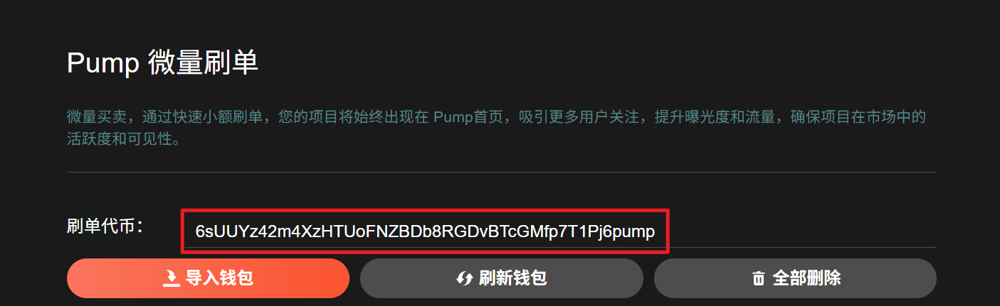
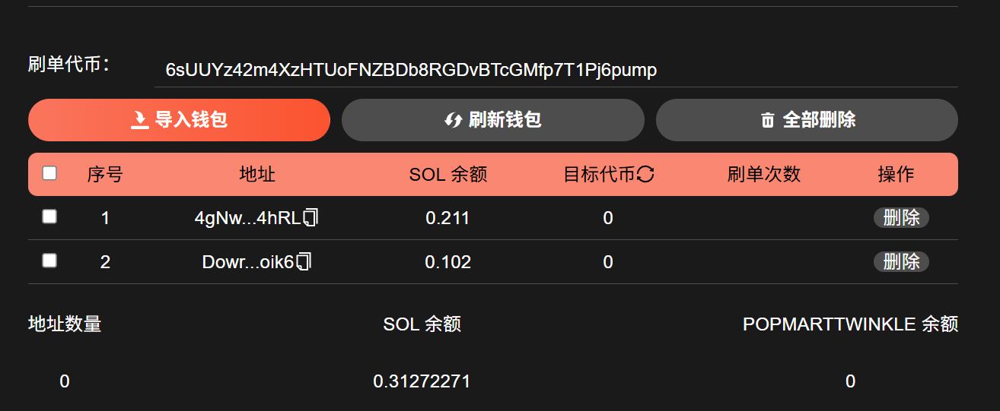
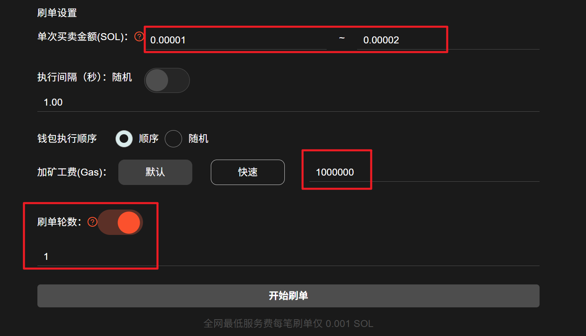
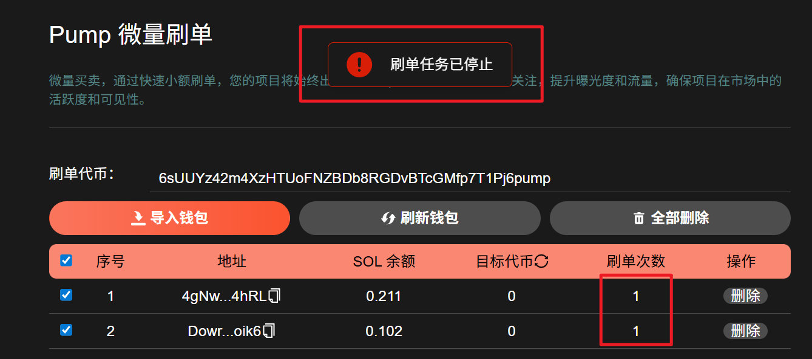
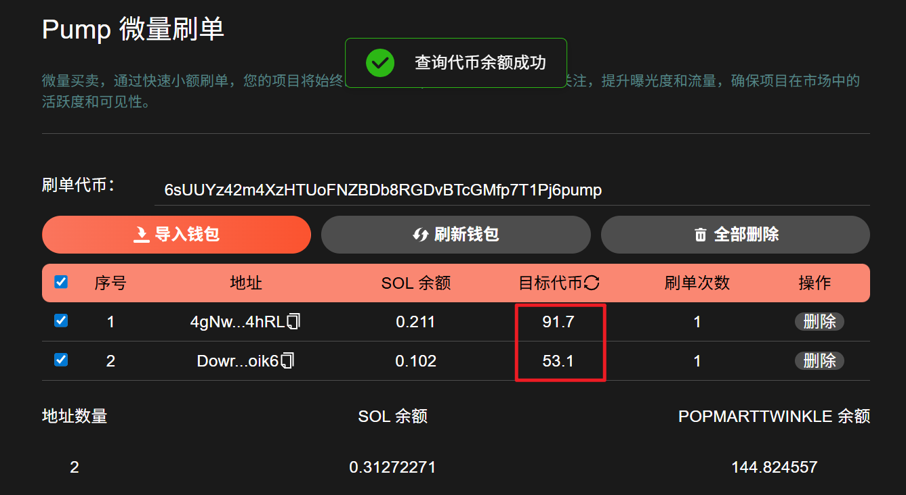

# 💰 Pump微量刷单教程

## 视频演示



## 准备事项

1. 电脑或手机
2. Solana 钱包（[幻影钱包Phantom安装教程](https://docs.gtokentool.com/solana/auxiliary-tutorial/phantom-wallet-installation)）
3. 钱包私钥
4. GAS费用

## Pump微量刷单流程

### 1. 连接幻影钱包

Pump微量刷单：[https://sol.gtokentool.com/zh-CN/pump/pumpMicroTrade](https://sol.gtokentool.com/zh-CN/pump/pumpMicroTrade)

通过上面的链接进入Pump微量刷单页面，右上角可以切换语言，连接钱包，然后连接 Main 主网。

连接好钱包，就可以在右上角看到钱包地址。

<figure><figcaption></figcaption></figure>

### 2. 输入刷单代币的地址


**注意**：输入的代币必须是在Pump下创建的代币。


<figure><figcaption></figcaption></figure>

### 3. 导入钱包

导入钱包后，可以看到钱包里的SOL余额以及目标代币的余额。

<figure><figcaption></figcaption></figure>

### 4. 刷单设置

<figure><figcaption></figcaption></figure>

**单笔买卖金额（SOL**）：Pump 主页上显示的订单最小交易金额为 0.01 SOL。交易金额越大，显示的概率越高。

**刷单轮数**：当开关关闭时，钱包将持续不间断地进行交易，只有当您手动指示它停止时才会停止。<mark style="color:purple;">当开关打开时，您可以设置特定的交易轮数，钱包一旦完成这些轮数将自动停止。</mark>

### 5. 点击“开始刷单”

勾选要交易的钱包，点击“开始刷单”。

在指定的轮数执行完毕后，会有提示信息。我们还可以实时看到已经执行的轮数。

<figure><figcaption></figcaption></figure>

执行完后，可以点击刷新目标代币，查看是否买入成功。

<figure><figcaption></figcaption></figure>

[_**GTokenTool | 创建代币、批量空投和做市机器人等Solana工具集**_](https://sol.gtokentool.com)

**安全、开源，给Solana用户带来最便利的一站式体验。**

GTokenTool社群:

Telegram：[**https://t.me/gtokentool**](https://t.me/gtokentool)

Twitter:  [**https://x.com/gtokentool**](https://x.com/gtokentool)

Gitbook：[**https://docs.gtokentool.com/**](https://docs.gtokentool.com/)

Github：[**https://github.com/Gtokentool/docs/blob/master/SUMMARY.md**](https://github.com/Gtokentool/docs/blob/master/SUMMARY.md)

YouTube：[**https://www.youtube.com/@GTokenTool**](https://www.youtube.com/@GTokenTool)\
\
\
<mark style="color:purple;background-color:orange;">**GTokenTool**</mark>_<mark style="color:purple;background-color:orange;">保留随时全权酌情因任何理由修改、变更或取消此公告的权利，无需事先通知。以上信息内容仅供参考，GTokenTool对本平台上的任何虚拟资产、产品或促销活动不做任何推荐或保证。虚拟资产的价格波动很大，投资交易虚拟资产将面临巨大风险。请谨慎投资。</mark>_
