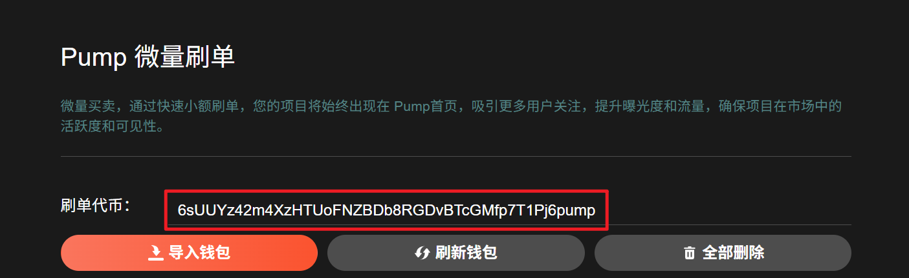
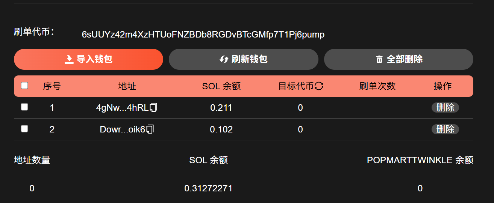
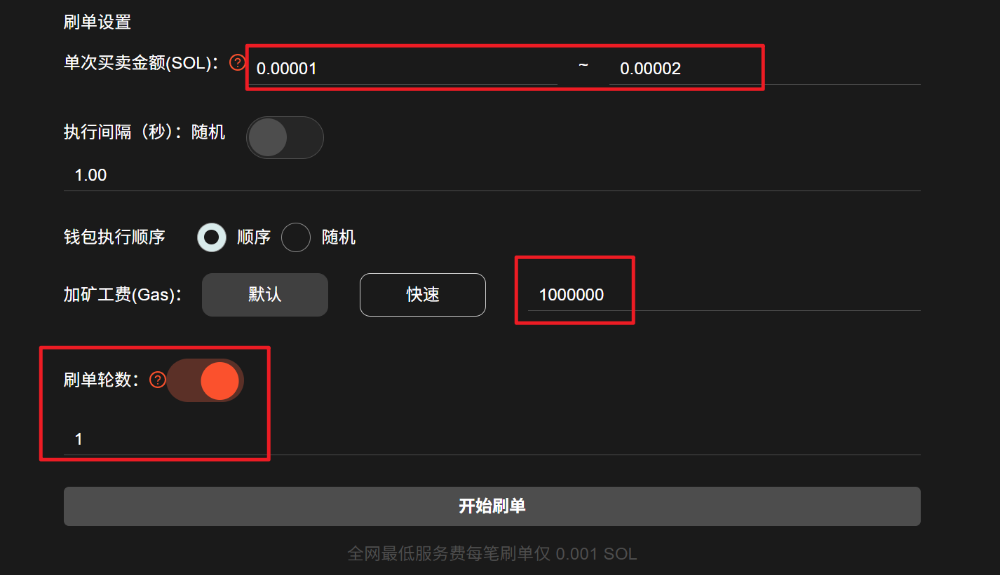
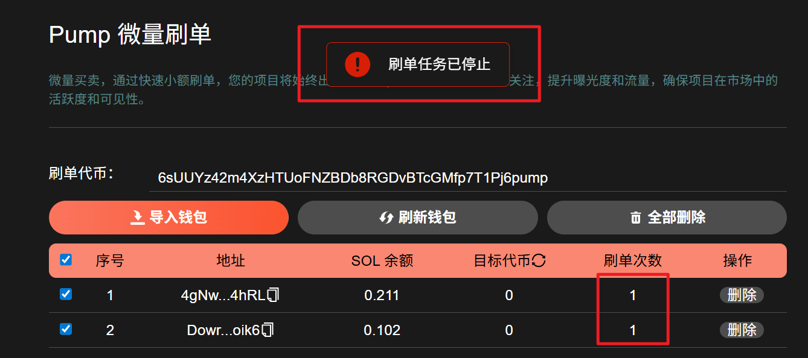
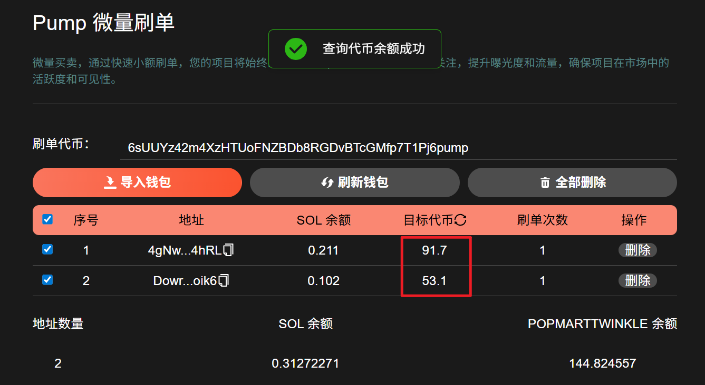

# 💰 Pump微量刷单教程

## 📌核心摘要

* **核心功能（微量刷单）**：专为 Pump.fun 平台设计的精细化交易策略，通过多地址微量买入操作，模拟真实用户交易行为，有效提升代币交易活跃度与市场热度。
* **技术架构（Jito 赋能）**：底层集成 Jito 技术，支持批量微量订单的捆绑提交，确保交易在区块内高效确认，规避网络拥堵与交易失败风险。
* **执行优势（隐蔽性与效率）**：通过分散地址与微量交易，降低被平台识别为异常交易的风险，同时实现交易量的快速累积，为代币提供持续的市场曝光与流动性支持。

## 视频演示



## 准备事项

1. 电脑或手机
2. Solana 钱包（[幻影钱包Phantom安装教程](https://docs.gtokentool.com/solana/auxiliary-tutorial/phantom-wallet-installation)）
3. 钱包私钥
4. GAS费用

## Pump微量刷单流程

### 1. 连接幻影钱包

Pump微量刷单：[https://sol.gtokentool.com/zh-CN/pump/pumpMicroTrade](https://sol.gtokentool.com/zh-CN/pump/pumpMicroTrade)

通过上面的链接进入Pump微量刷单页面，右上角可以切换语言，连接钱包，然后连接 Main 主网。

连接好钱包，就可以在右上角看到钱包地址。

<figure><figcaption>
连接钱包并选择Main网络
</figcaption></figure>

### 2. 输入刷单代币的地址


**注意**：输入的代币必须是在Pump下创建的代币。


<figure><figcaption>
输入刷单代币地址
</figcaption></figure>

### 3. 导入钱包

导入钱包后，可以看到钱包里的SOL余额以及目标代币的余额。

<figure><figcaption>
导入钱包
</figcaption></figure>

### 4. 刷单设置

**单笔买卖金额（SOL**）：Pump 主页上显示的订单最小交易金额为 0.01 SOL。交易金额越大，显示的概率越高。

**刷单轮数**：当开关关闭时，钱包将持续不间断地进行交易，只有当您手动指示它停止时才会停止。<mark style="color:purple;">当开关打开时，您可以设置特定的交易轮数，钱包一旦完成这些轮数将自动停止。</mark>

<figure><figcaption>
刷单设置
</figcaption></figure>

### 5. 点击“开始刷单”

勾选要交易的钱包，点击“开始刷单”。

在指定的轮数执行完毕后，会有提示信息。我们还可以实时看到已经执行的轮数。

<figure><figcaption>
刷单结束提醒
</figcaption></figure>

执行完后，可以点击刷新目标代币，查看是否买入成功。

<figure><figcaption>
刷新代币余额
</figcaption></figure>

## ❓常见问题 FAQ

### Q: 什么是 Pump 微量刷单？

**A:** 微量刷单是指使用极小金额的买卖交易，在不显著影响代币价格的前提下，持续保持项目在 Pump 首页曝光。

### Q: 微量刷单有什么用？

**A:** 刷单能提升项目的活跃度指标，增加项目在首页或热门列表中的可见性，吸引更多真实用户点击和关注。

### Q: 刷单金额会影响效果吗？

**A:** 一般建议使用 0.01–0.02 SOL 的小额买卖，多次频繁执行能达到较好的刷量效果，系统会读取交易频率而非金额总量。

### Q: 可以批量设置多个地址进行刷单吗？

**A:** 可以。支持批量导入多个钱包地址，系统将自动轮询执行小额买卖，提升自然度与抗检测能力。

### 🤝 连接 GTokenTool 

* **💬 Telegram社群**：[点击加入官方群组](https://t.me/gtokentool)
* **🐦 Twitter (X)**：[关注我们获取最新动态](https://x.com/gtokentool)
* **📚 官方文档**：[查看 Gitbook 文档](https://docs.gtokentool.com/)
* **💻 开源代码**：[访问 GitHub 仓库](https://github.com/Gtokentool/docs/blob/master/SUMMARY.md)
* **📺 视频教程**：[订阅 YouTube 频道](https://www.youtube.com/@GTokenTool)

> ⚠️ 风险提示与免责声明
>
> GTokenTool 保留随时全权酌情因任何理由修改、变更或取消此公告的权利，无需事先通知。
>
> 以上信息内容仅供参考，GTokenTool 对本平台上的任何虚拟资产、产品或促销活动不做任何推荐或保证。虚拟资产的价格波动很大，投资交易虚拟资产将面临巨大风险。**请谨慎投资。**
