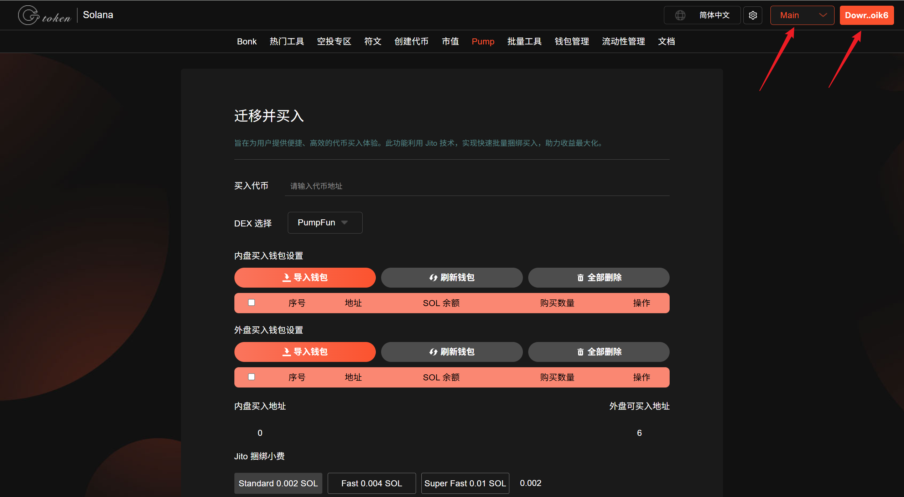
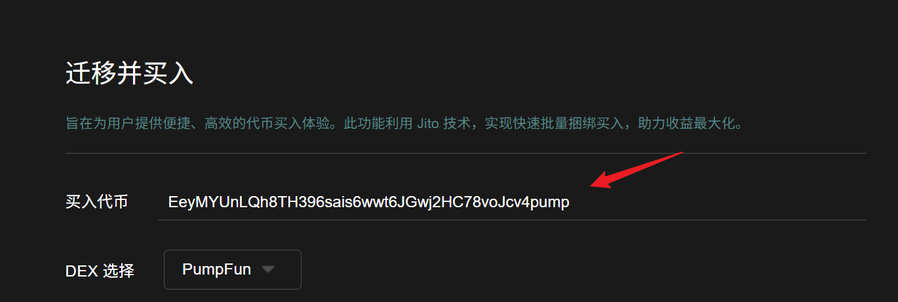
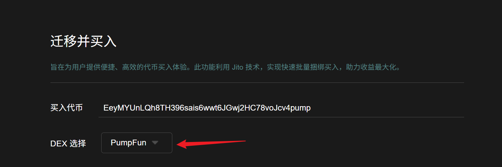
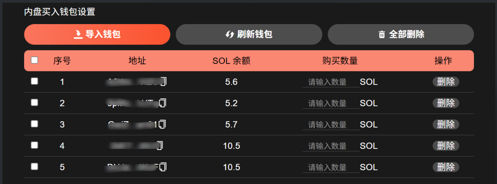
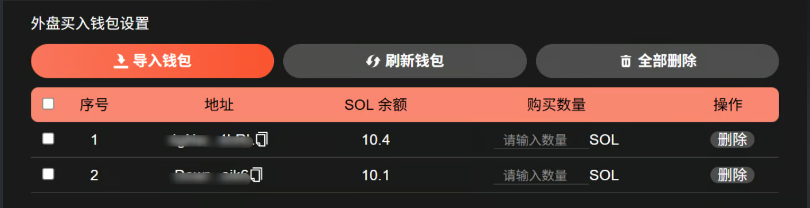
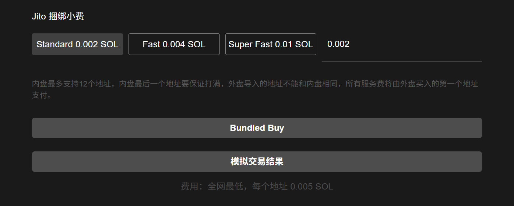
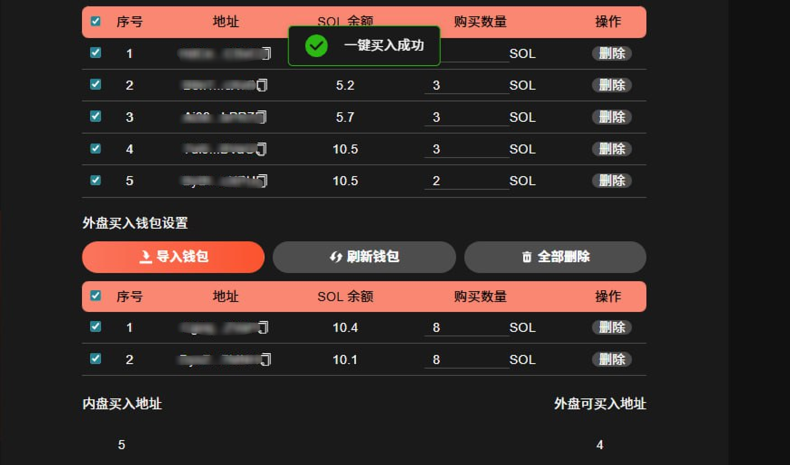

# Pump迁移并买入


**Pump迁移并买入 | 抢占底部筹码 | 防狙击手套利**

一个高性能的 Solana 交易机器人，可执行无缝的原子交易，整合了 Pump.fun 的最终购买、自动迁移触发以及 PumpSwap 的抢先购买操作。它是为那些在代币从 Pump.fun 的 bondingcurve 过渡到去中心化 AMM 池时，需要可靠、快速执行交易的交易者而设计的。可大量吸入底部筹码，防止狙击手套利。


## 准备事项

1. 一台电脑或者一部手机
2. Solana 钱包（[幻影钱包Phantom安装教程](https://docs.gtokentool.com/solana/auxiliary-tutorial/phantom-wallet-installation)）
3. 要进行交易的钱包私钥
4. 交易所需代币
5. 一些 SOL 用于支付交易 GAS

## Pump迁移并买入流程

### 1. 连接钱包

Pump迁移并买入：[https://sol.gtokentool.com/zh-CN/pump/pumpMigrationAndBuy](https://sol.gtokentool.com/zh-CN/pump/pumpMigrationAndBuy)

进入Pump迁移并买入页面，右上角支持切换成中文。选择 Main 网络并连接钱包。

<figure><figcaption></figcaption></figure>

### 2. 输入代币地址

<figure><figcaption></figcaption></figure>

### 3. 选择 DEX

选择 PumpFun，只支持 PumpFun 的池子。

<figure><figcaption></figcaption></figure>

### 4. 内盘买入钱包设置

导入内盘（Pump）买入钱包，并设置购买数量。


内盘最多支持12个地址，内盘最后一个地址要保证打满。支持输入超过所需数量，多余部分不会被扣除，只会按实际需求扣除。

每个钱包需要预留 0.007 SOL，最好预留 10%。


<figure><figcaption></figcaption></figure>

### 5. 外盘买入钱包设置

导入外盘（PumpSwap）买入钱包，并设置购买数量。


外盘导入的地址不能和内盘相同，所有服务费将由外盘买入的第一个地址支付。

每个钱包需要预留 0.007 SOL，最好预留 10%。


<figure><figcaption></figcaption></figure>

### 6. 设置Jito小费

<figure><figcaption></figcaption></figure>

### 7. 点击“Bundled Buy"

如果有需要的话，可以先进行模拟交易。模拟交易成功再进行交易。

勾选钱包，点击“`Bundled Buy`”。交易成功会弹出提示“一键买入成功”。

<figure><figcaption></figcaption></figure>

[_**GTokenTool | 创建代币、批量空投和做市机器人等Solana工具集**_](https://sol.gtokentool.com)

**安全、开源，给Solana用户带来最便利的一站式体验。**

GTokenTool社群:

Telegram：[**https://t.me/gtokentool**](https://t.me/gtokentool)

Twitter:  [**https://x.com/gtokentool**](https://x.com/gtokentool)

Gitbook：[**https://docs.gtokentool.com/**](https://docs.gtokentool.com/)

Github：[**https://github.com/Gtokentool/docs/blob/master/SUMMARY.md**](https://github.com/Gtokentool/docs/blob/master/SUMMARY.md)

YouTube：[**https://www.youtube.com/@GTokenTool**](https://www.youtube.com/@GTokenTool)\
\
\
<mark style="color:purple;background-color:orange;">**GTokenTool**</mark>_<mark style="color:purple;background-color:orange;">保留随时全权酌情因任何理由修改、变更或取消此公告的权利，无需事先通知。以上信息内容仅供参考，GTokenTool对本平台上的任何虚拟资产、产品或促销活动不做任何推荐或保证。虚拟资产的价格波动很大，投资交易虚拟资产将面临巨大风险。请谨慎投资。</mark>_
