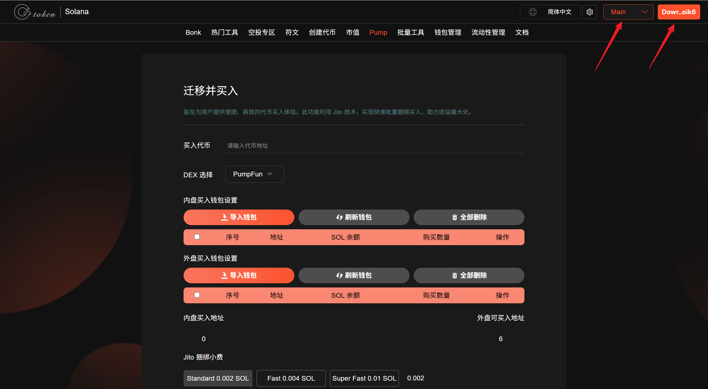
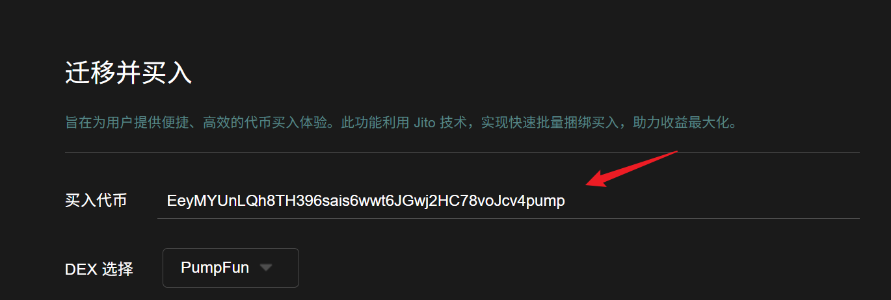
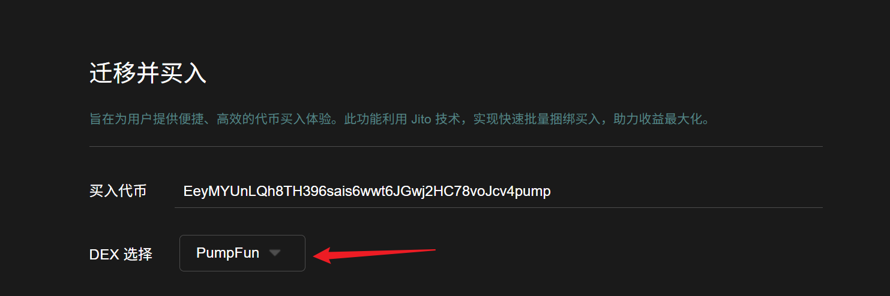
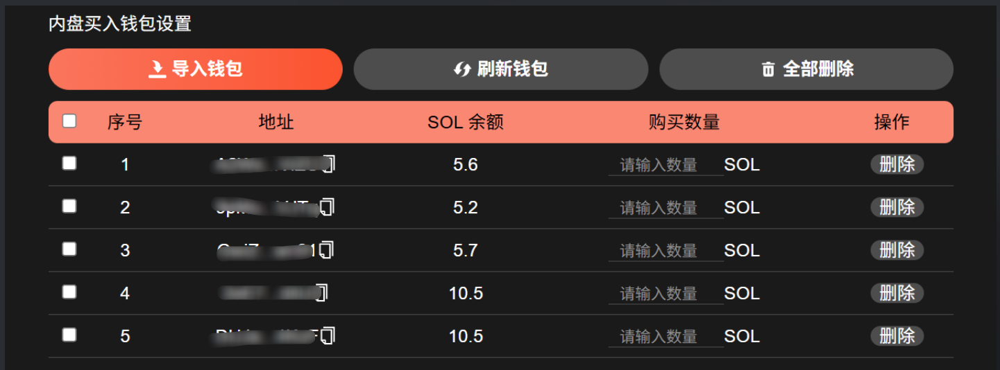
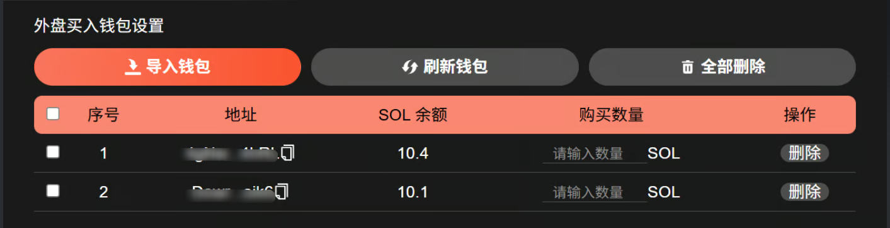
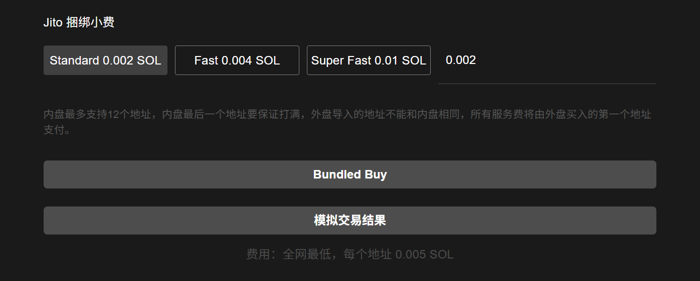
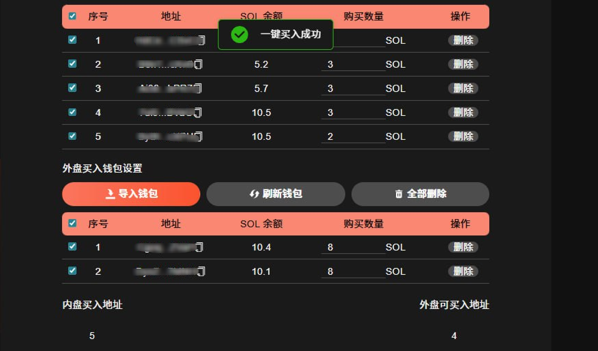

# Pump迁移并买入教程


**Pump迁移并买入 | 抢占底部筹码 | 防狙击手套利**

一个高性能的 Solana 交易机器人，可执行无缝的原子交易，整合了 Pump.fun 的最终购买、自动迁移触发以及 PumpSwap 的抢先购买操作。它是为那些在代币从 Pump.fun 的 bondingcurve 过渡到去中心化 AMM 池时，需要可靠、快速执行交易的交易者而设计的。可大量吸入底部筹码，防止狙击手套利。


## 📌核心摘要

* **平台背景（Pump.fun 迁移机制）**：专为 **Pump.fun** 代币从 Bonding Curve（联合曲线）阶段过渡到去中心化交易所（AMM/Pool）阶段设计的高级交易策略。
* **核心功能（原子交易）**：利用 Solana 链上**高性能原子交易**技术，将“完成 Pump.fun 最终购买”、“触发自动迁移”与“PumpSwap 抢先购买”三个动作无缝整合。确保在迁移发生的瞬间同步执行，无时间差风险。
* **战略价值（抢占底部筹码）**：旨在代币流动性迁移的**最关键时刻（T=0）**，帮助交易者**大量吸入底部筹码**。通过抢先执行机制，有效防止外部狙击手（Snipers）套利，确立持仓成本优势。

## 准备事项

1. 一台电脑或者一部手机
2. Solana 钱包（[幻影钱包Phantom安装教程](https://docs.gtokentool.com/solana/auxiliary-tutorial/phantom-wallet-installation)）
3. 要进行交易的钱包私钥
4. 交易所需代币
5. 一些 SOL 用于支付交易 GAS

## Pump迁移并买入流程

### 1. 连接钱包

Pump迁移并买入：[https://sol.gtokentool.com/zh-CN/pump/pumpMigrationAndBuy](https://sol.gtokentool.com/zh-CN/pump/pumpMigrationAndBuy)

进入Pump迁移并买入页面，右上角支持切换成中文。选择 Main 网络并连接钱包。

<figure><figcaption>
连接钱包并选择Main网络
</figcaption></figure>

### 2. 输入代币地址

<figure><figcaption>
输入代币地址
</figcaption></figure>

### 3. 选择 DEX

选择 PumpFun，只支持 PumpFun 的池子。

<figure><figcaption>
选择对应DEX
</figcaption></figure>

### 4. 内盘买入钱包设置

导入内盘（Pump）买入钱包，并设置购买数量。


内盘最多支持12个地址，内盘最后一个地址要保证打满。支持输入超过所需数量，多余部分不会被扣除，只会按实际需求扣除。

每个钱包需要预留 0.007 SOL，最好预留 10%。


<figure><figcaption>
导入内盘买入钱包
</figcaption></figure>

### 5. 外盘买入钱包设置

导入外盘（PumpSwap）买入钱包，并设置购买数量。


外盘导入的地址不能和内盘相同，所有服务费将由外盘买入的第一个地址支付。

每个钱包需要预留 0.007 SOL，最好预留 10%。


<figure><figcaption>
导入外盘买入钱包
</figcaption></figure>

### 6. 设置Jito小费

<figure><figcaption>
设置Jito小费
</figcaption></figure>

### 7. 点击“Bundled Buy"

如果有需要的话，可以先进行模拟交易。模拟交易成功再进行交易。

勾选钱包，点击“`Bundled Buy`”。交易成功会弹出提示“一键买入成功”。

<figure><figcaption>
一键买入成功提示
</figcaption></figure>

## ❓常见问题 FAQ

### Q: 迁移并买入是什么功能？

**A:** Pump 代币内盘迁移到外盘并继续买入，帮助用户大量吸入底部筹码，防狙击手套利，助力收益最大化。

### Q: 使用该功能能否百分之百防止科学家（Sniper）狙击？

**A:** 该功能通过在同一个区块内完成"发射"和"买入"，理论上您是该代币在 Pump 外盘的第一个买家，没有给狙击机器人留出夹单的时间窗口。代币会直接以 Raydium 的初始价格面向公众，这极大地消除了内盘被低价抢筹的风险，是目前最有效的防狙击手段之一。

### 🤝 连接 GTokenTool 

* **💬 Telegram社群**：[点击加入官方群组](https://t.me/gtokentool)
* **🐦 Twitter (X)**：[关注我们获取最新动态](https://x.com/gtokentool)
* **📚 官方文档**：[查看 Gitbook 文档](https://docs.gtokentool.com/)
* **💻 开源代码**：[访问 GitHub 仓库](https://github.com/Gtokentool/docs/blob/master/SUMMARY.md)
* **📺 视频教程**：[订阅 YouTube 频道](https://www.youtube.com/@GTokenTool)

> ⚠️ 风险提示与免责声明
>
> GTokenTool 保留随时全权酌情因任何理由修改、变更或取消此公告的权利，无需事先通知。
>
> 以上信息内容仅供参考，GTokenTool 对本平台上的任何虚拟资产、产品或促销活动不做任何推荐或保证。虚拟资产的价格波动很大，投资交易虚拟资产将面临巨大风险。**请谨慎投资。**
