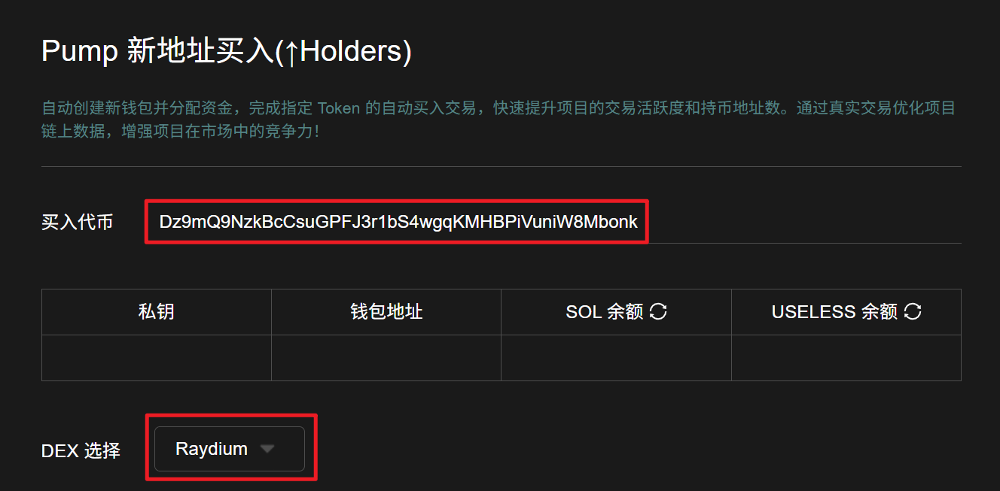
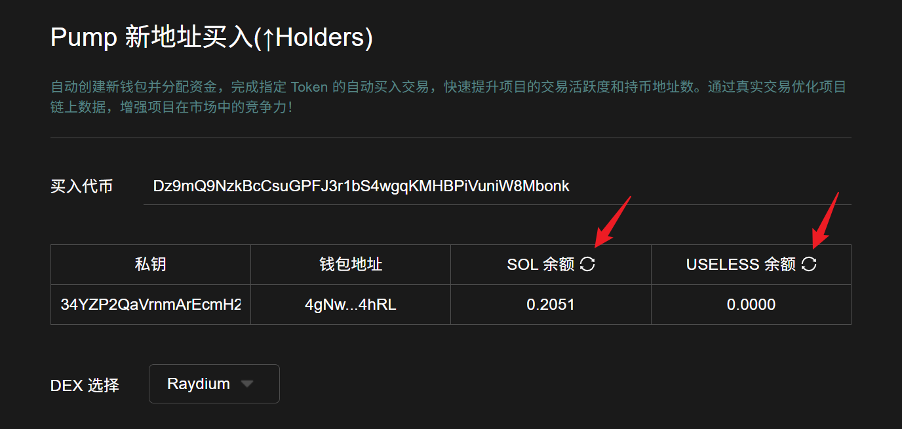
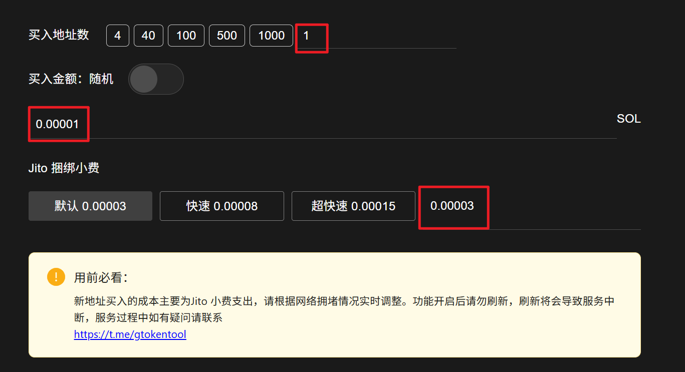
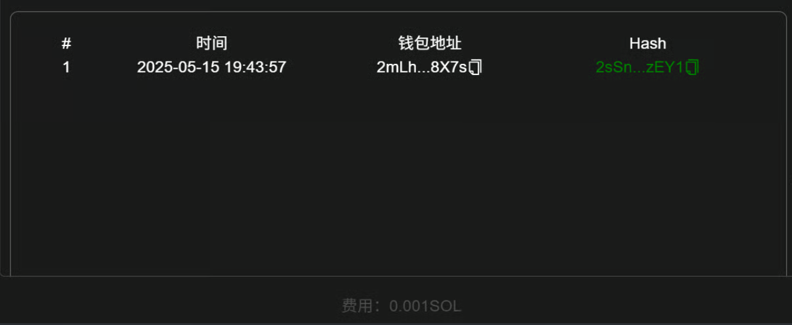

# Pump新地址买入(↑Holders)教程

## 准备事项

1. 一台电脑或者一部手机
2. Solana 钱包（[幻影钱包Phantom安装教程](https://docs.gtokentool.com/solana/auxiliary-tutorial/phantom-wallet-installation)）
3. 要进行交易的钱包私钥
4. 交易所需代币
5. 一些 SOL 用于支付交易 GAS

## Pump新地址买入(↑Holders)流程

### 1. 连接钱包

Pump新地址买入：[https://sol.gtokentool.com/zh-CN/pump/pumpHolderMaker](https://sol.gtokentool.com/zh-CN/pump/pumpHolderMaker)

进入Pump新地址买入页面，右上角支持切换成中文。选择 Main 网络并连接钱包。

<figure><figcaption></figcaption></figure>

### 2. 输入买入代币地址


**注意**：输入代币地址后，请选择正确的DEX。<mark style="color:red;">若不清楚的话，直接选择Jup。</mark>


<figure><figcaption></figcaption></figure>

### 3. 输入钱包私钥

输入钱包后，会显示钱包内SOL余额和目标代币的余额。<mark style="color:purple;">若未显示，请点击表格里的刷新按钮。</mark>


仅需导入一个地址私钥即可，其他新买入地址将会自动生成并分配资金

导入的私钥用于支付新地址买入费用、GAS 费用 和 服务费


<figure><figcaption></figcaption></figure>

### 4. 设置其他参数

**买入地址数：**&#x53EF;以选择买入代币的地址数量，也可手动输入地址数。

**买入金额（SOL）：**&#x53EF;选择固定金额或随机范围的金额。

**Jito捆绑小费：**&#x4E00;定程度上决定了你的交易速度。

* **默认：**&#x30;.00003 SOL
* **快速：**&#x30;.00008 SOL
* **极速：**&#x30;.00015 SOL
* **其他：**&#x81EA;行输入金额


**用前必看**：新地址买入的成本主要为Jito 小费支出，请根据网络拥堵情况实时调整。功能开启后请勿刷新，刷新将会导致服务中断，服务过程中如有疑问请联系\
[https://t.me/gtokentool](https://t.me/gtokentool)


<figure><figcaption></figcaption></figure>

### 5. 点击“生成钱包”

点击后会下载一个表格，里面记录了生成的钱包的地址和私钥。生成完成后，按钮会变成`生成完成`。

<mark style="color:purple;">**新生成地址下载完成后，请务必打开已下载的Excel表格，核对地址信息是否完整保存！！！**</mark>

<figure><figcaption></figcaption></figure>

### 6. 点击“开始”

开始后，下面可以看到交易信息。成功后，会显示哈希。

<figure><figcaption></figcaption></figure>

[_**GTokenTool | 创建代币、批量空投和做市机器人等Solana工具集**_](https://sol.gtokentool.com)

**安全、开源，给Solana用户带来最便利的一站式体验。**

GTokenTool社群:

Telegram：[**https://t.me/gtokentool**](https://t.me/gtokentool)

Twitter:  [**https://x.com/gtokentool**](https://x.com/gtokentool)

Gitbook：[**https://docs.gtokentool.com/**](https://docs.gtokentool.com/)

Github：[**https://github.com/Gtokentool/docs/blob/master/SUMMARY.md**](https://github.com/Gtokentool/docs/blob/master/SUMMARY.md)

YouTube：[**https://www.youtube.com/@GTokenTool**](https://www.youtube.com/@GTokenTool)\
\
\
<mark style="color:purple;background-color:orange;">**GTokenTool**</mark>_<mark style="color:purple;background-color:orange;">保留随时全权酌情因任何理由修改、变更或取消此公告的权利，无需事先通知。以上信息内容仅供参考，GTokenTool对本平台上的任何虚拟资产、产品或促销活动不做任何推荐或保证。虚拟资产的价格波动很大，投资交易虚拟资产将面临巨大风险。请谨慎投资。</mark>_
