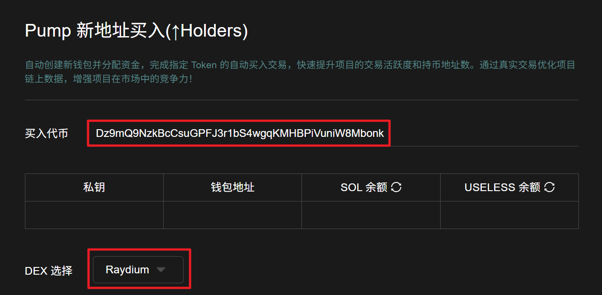
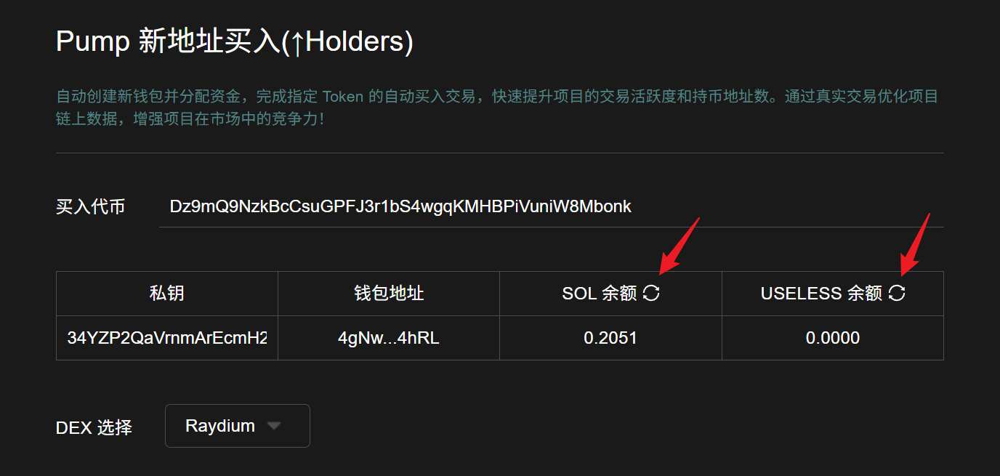
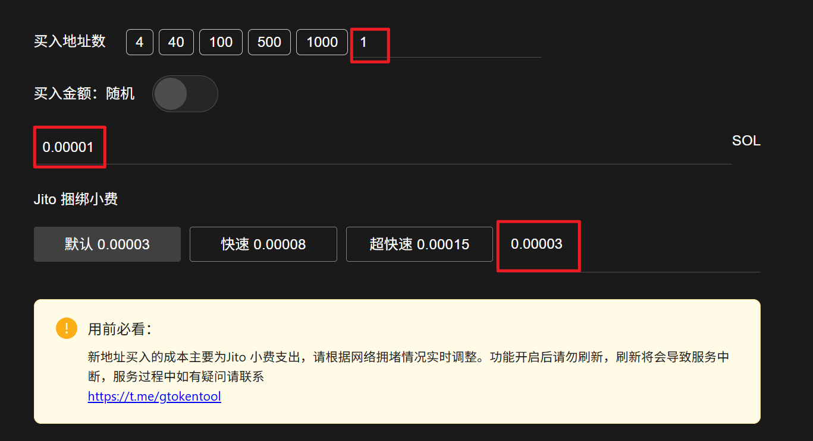
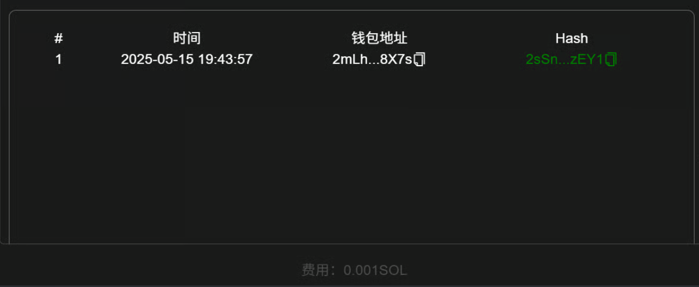

# Pump新地址买入(↑Holders)教程

## 📌核心摘要

* **平台背景（Pump.fun生态）**：专为 **Pump.fun** 平台设计的持币地址数（Holders）增长工具，针对该平台的代币发行机制，提供全自动化的链上数据优化方案。
* **核心功能（全自动刷量）**：支持**自动创建新钱包、分配资金并完成指定 Token 的买入交易**。通过批量生成真实交易，快速提升项目的**持币地址数**与**交易活跃度**，优化项目在市场榜单中的数据表现。
* **技术优势（真实交易模拟）**：利用自动化脚本模拟真实用户交易行为，确保链上数据的真实性与可靠性，有效增强项目在市场中的竞争力与可信度。

## 准备事项

1. 一台电脑或者一部手机
2. Solana 钱包（[幻影钱包Phantom安装教程](https://docs.gtokentool.com/solana/auxiliary-tutorial/phantom-wallet-installation)）
3. 要进行交易的钱包私钥
4. 交易所需代币
5. 一些 SOL 用于支付交易 GAS

## Pump新地址买入(↑Holders)流程

### 1. 连接钱包

Pump新地址买入：[https://sol.gtokentool.com/zh-CN/pump/pumpHolderMaker](https://sol.gtokentool.com/zh-CN/pump/pumpHolderMaker)

进入Pump新地址买入页面，右上角支持切换成中文。选择 Main 网络并连接钱包。

<figure><figcaption>
连接钱包并选择Main网络
</figcaption></figure>

### 2. 输入买入代币地址


**注意**：输入代币地址后，请选择正确的DEX。<mark style="color:red;">若不清楚的话，直接选择Jup。</mark>


<figure><figcaption>
输入代币地址并选择DEX
</figcaption></figure>

### 3. 输入钱包私钥

输入钱包后，会显示钱包内SOL余额和目标代币的余额。<mark style="color:purple;">若未显示，请点击表格里的刷新按钮。</mark>


仅需导入一个地址私钥即可，其他新买入地址将会自动生成并分配资金

导入的私钥用于支付新地址买入费用、GAS 费用 和 服务费


<figure><figcaption>
导入付款钱包私钥
</figcaption></figure>

### 4. 设置买入参数

**买入地址数：**&#x53EF;以选择买入代币的地址数量，也可手动输入地址数。

**买入金额（SOL）：**&#x53EF;选择固定金额或随机范围的金额。

**Jito捆绑小费：**&#x4E00;定程度上决定了你的交易速度。

* **默认：**&#x30;.00003 SOL
* **快速：**&#x30;.00008 SOL
* **极速：**&#x30;.00015 SOL
* **其他：**&#x81EA;行输入金额


**用前必看**：新地址买入的成本主要为Jito 小费支出，请根据网络拥堵情况实时调整。功能开启后请勿刷新，刷新将会导致服务中断，服务过程中如有疑问请联系\
[https://t.me/gtokentool](https://t.me/gtokentool)


<figure><figcaption>
设置买入参数
</figcaption></figure>

### 5. 点击“生成钱包”

点击后会下载一个表格，里面记录了生成的钱包的地址和私钥。生成完成后，按钮会变成`生成完成`。

<mark style="color:purple;">**新生成地址下载完成后，请务必打开已下载的Excel表格，核对地址信息是否完整保存！！！**</mark>

<figure><figcaption>
生成钱包
</figcaption></figure>

### 6. 点击“开始”

开始后，下面可以看到交易信息。成功后，会显示哈希。

<figure><figcaption>
交易日志
</figcaption></figure>

## ❓常见问题 FAQ

### Q: 新地址买入(↑Holders)是什么功能？

**A:** 自动创建新钱包并分配资金，完成指定 Token 的自动买入交易，快速提升项目的交易活跃度和持币地址数。通过真实交易优化项目链上数据，增强项目在市场中的竞争力！

### Q: 为什么提升 Holder 数量对项目有利？

**A:** 平台的权重算法中，“持币地址数量”是判断项目热度与排名的重要维度，数量越高越容易被推荐。

### Q: 这些地址会实际完成交易吗？

**A:** 会。系统将为每个地址注入少量 SOL，并发起真实链上买入操作，确保交易可被链上索引和统计。注意：**新生成地址下载完成后，请务必打开已下载的Excel表格，核对地址信息是否完整保存！！！**

### **Q:** 我可以控制买入金额和地址数量吗？

**A:** 可以。你可以设定每个地址的买入金额（例如 0.0001–0.001 SOL）和地址生成数量，系统将根据设定自动执行。

### 🤝 连接 GTokenTool 

* **💬 Telegram社群**：[点击加入官方群组](https://t.me/gtokentool)
* **🐦 Twitter (X)**：[关注我们获取最新动态](https://x.com/gtokentool)
* **📚 官方文档**：[查看 Gitbook 文档](https://docs.gtokentool.com/)
* **💻 开源代码**：[访问 GitHub 仓库](https://github.com/Gtokentool/docs/blob/master/SUMMARY.md)
* **📺 视频教程**：[订阅 YouTube 频道](https://www.youtube.com/@GTokenTool)

> ⚠️ 风险提示与免责声明
>
> GTokenTool 保留随时全权酌情因任何理由修改、变更或取消此公告的权利，无需事先通知。
>
> 以上信息内容仅供参考，GTokenTool 对本平台上的任何虚拟资产、产品或促销活动不做任何推荐或保证。虚拟资产的价格波动很大，投资交易虚拟资产将面临巨大风险。**请谨慎投资。**
