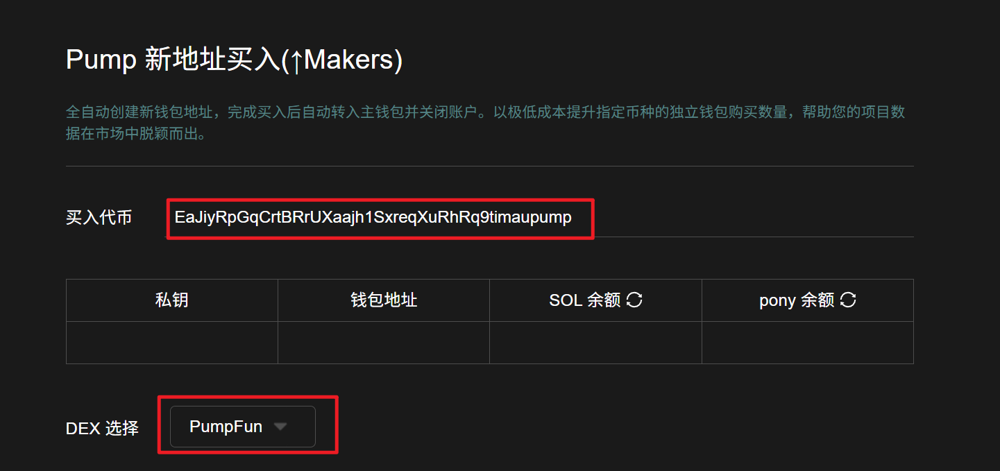
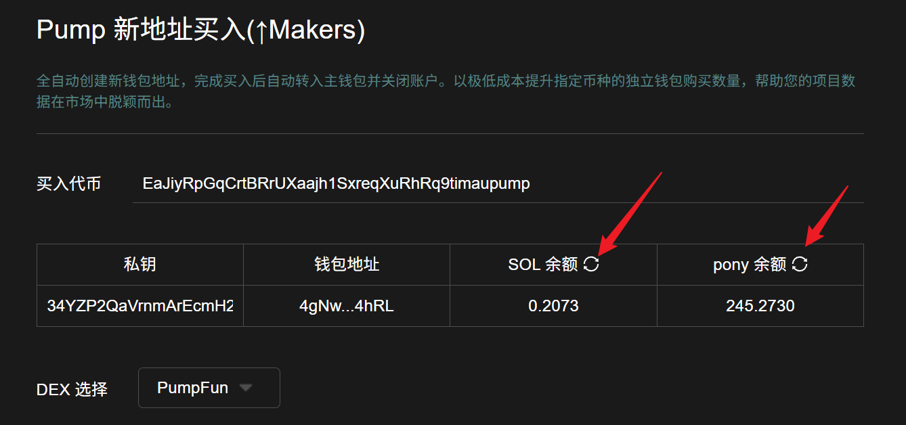
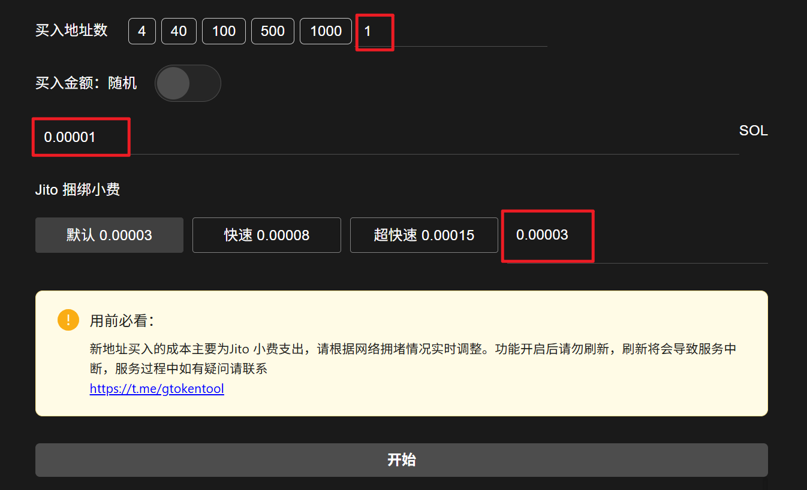

# Pump新地址买入(↑Makers)教程

**GTokenTool** 的 **Solana Pump新地址买入（↑Makers)** 工具主要用于提升代币在 Pump.fun 平台的买盘活跃度与持币地址数。该工具支持通过**海量新钱包地址**执行自动化买入，核心特点是能显著增加交易者数量（Makers），营造真实且热度十足的交易氛围。其优势在于**地址高度隔离、操作效率极高**，可有效避开平台的异常检测。它特别适用于需要进行市场冷启动、优化持币结构或提升排名热度的 **Solana 项目方与营销团队**，是快速打造爆款项目的增长利器。

## 📌核心摘要

* **核心功能（全自动刷量）**：专为 Pump.fun 平台设计的**独立买家数（Makers）增长工具**。系统全自动执行“创建新钱包 -> 买入代币 -> 归集资产 -> 关闭账户”的全流程，实现无人值守的批量操作。
* **关键指标（提升Makers）**：旨在以极低成本显著提升指定币种的**独立钱包购买数量**。通过制造大量真实的链上购买记录，优化项目在市场榜单中的数据表现，使其脱颖而出。
* **执行优势（低成本与隐蔽性）**：利用自动化脚本实现一次性钱包（Disposable Wallet）策略，买入后立即归集资金并关闭账户，既保证了资金安全，又模拟了真实散户的进场行为，有效规避平台风控。

## 准备事项

1. 一台电脑或者一部手机
2. Solana 钱包（[幻影钱包Phantom安装教程](https://docs.gtokentool.com/solana/auxiliary-tutorial/phantom-wallet-installation)）
3. 要进行交易的钱包私钥
4. 交易所需代币
5. 一些 SOL 用于支付交易 GAS

## Pump新地址买入(↑Makers)流程

### 1. 连接钱包

Pump新地址买入：[https://sol.gtokentool.com/zh-CN/pump/pumpMakerBuyers](https://sol.gtokentool.com/zh-CN/pump/pumpMakerBuyers)

进入Pump新地址买入页面，右上角支持切换成中文。选择 Main 网络并连接钱包。

<figure><figcaption>
连接钱包并选择Main网络
</figcaption></figure>

### 2. 输入买入代币地址


**注意**：输入代币地址后，请选择正确的DEX。<mark style="color:red;">若不清楚的话，直接选择Jup。</mark>


<figure><figcaption>
输入代币地址并选择对应DEX
</figcaption></figure>

### 3. 输入钱包私钥

输入钱包后，会显示钱包内SOL余额和目标代币的余额。<mark style="color:purple;">若未显示，请点击表格里的刷新按钮。</mark>


仅需导入一个地址私钥即可，其他新买入地址将会自动生成并分配资金

导入的私钥用于支付新地址买入费用、GAS 费用 和 服务费


<figure><figcaption>
导入付款钱包私钥
</figcaption></figure>

### 4. 设置买入参数

**买入地址数：**&#x53EF;以选择买入代币的地址数量，也可手动输入地址数。

**买入金额（SOL）：**&#x53EF;选择固定金额或随机范围的金额。

**Jito捆绑小费：**&#x4E00;定程度上决定了你的交易速度。

* **默认：**&#x30;.00003 SOL
* **快速：**&#x30;.00008 SOL
* **极速：**&#x30;.00015 SOL
* **其他：**&#x81EA;行输入金额


**用前必看**：新地址买入的成本主要为Jito 小费支出，请根据网络拥堵情况实时调整。功能开启后请勿刷新，刷新将会导致服务中断，服务过程中如有疑问请联系\
[https://t.me/gtokentool](https://t.me/gtokentool)


<figure><figcaption>
设置买入参数
</figcaption></figure>

### 5. 点击“开始”，开始交易

开始后，下面可以看到交易信息。成功后，会显示哈希。

<figure><figcaption>
交易日志
</figcaption></figure>

## ❓常见问题 FAQ

### Q: 新地址买入(↑Makers)是什么功能？

**A:** 全自动创建新钱包地址，完成买入后自动转入主钱包并关闭账户。以极低成本提升指定币种的独立钱包购买数量，帮助您的项目数据在市场中脱颖而出。

### Q: 为什么要用新地址而不是旧钱包？

**A:** 避免将老地址的历史标签带入新图表，防止图表出现气泡、拉高警惕性。

### Q: 可以设置多个新地址一起买入吗？

**A:** 可以。支持批量生成并配置的多个地址一起进行分散买入操作。

### Q: 我的私钥会被保存吗？

**A:** 不会。GTokenTool 所有签名操作都在浏览器本地完成，不上传、不存储私钥，确保资金安全。

### 🤝 连接 GTokenTool 

* **💬 Telegram社群**：[点击加入官方群组](https://t.me/gtokentool)
* **🐦 Twitter (X)**：[关注我们获取最新动态](https://x.com/gtokentool)
* **📚 官方文档**：[查看 Gitbook 文档](https://docs.gtokentool.com/)
* **💻 开源代码**：[访问 GitHub 仓库](https://github.com/Gtokentool/docs/blob/master/SUMMARY.md)
* **📺 视频教程**：[订阅 YouTube 频道](https://www.youtube.com/@GTokenTool)

> ⚠️ 风险提示与免责声明
>
> GTokenTool 保留随时全权酌情因任何理由修改、变更或取消此公告的权利，无需事先通知。
>
> 以上信息内容仅供参考，GTokenTool 对本平台上的任何虚拟资产、产品或促销活动不做任何推荐或保证。虚拟资产的价格波动很大，投资交易虚拟资产将面临巨大风险。**请谨慎投资。**
