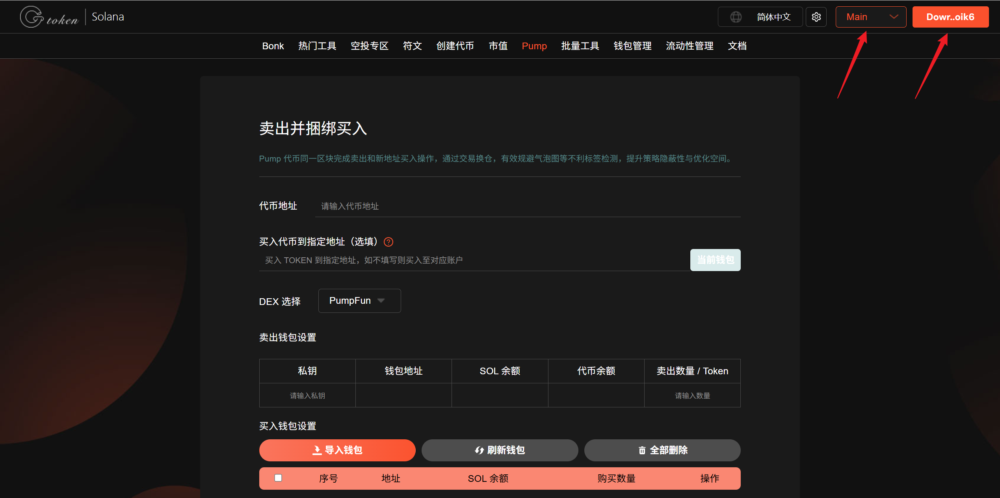
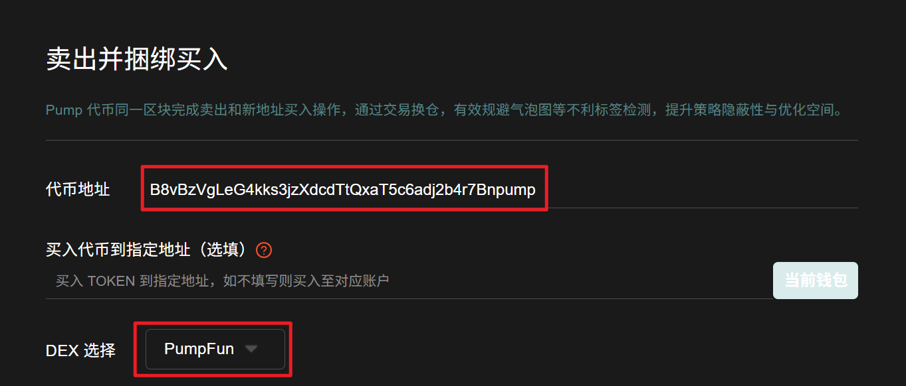
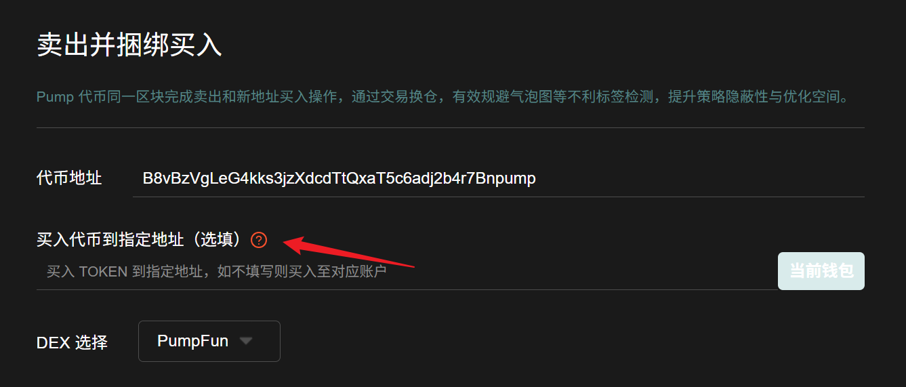
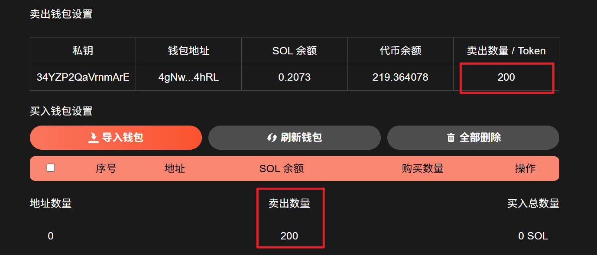
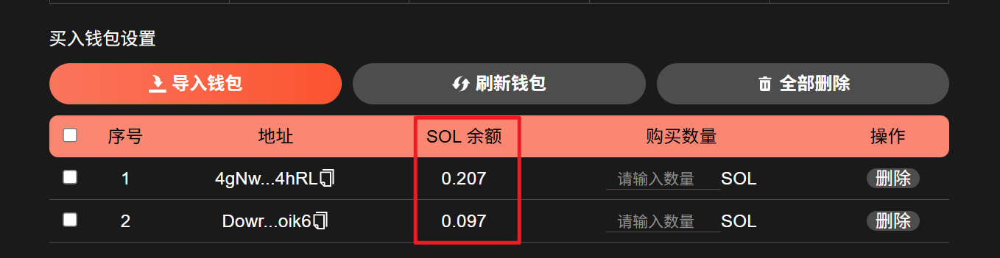
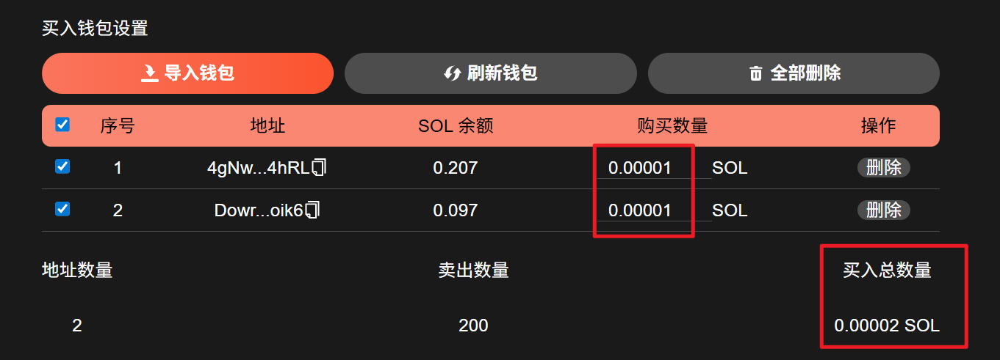
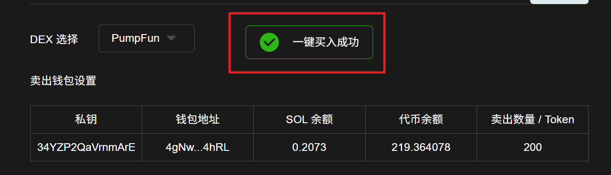

# Pump卖出并捆绑买入教程

## 准备事项

1. 一台电脑或者一部手机
2. Solana 钱包（[幻影钱包Phantom安装教程](https://docs.gtokentool.com/solana/auxiliary-tutorial/phantom-wallet-installation)）
3. 要进行交易的钱包私钥
4. 交易所需代币
5. 一些 SOL 用于支付交易 GAS

## Pump卖出并捆绑买入流程

### 1. 连接钱包

Pump卖出并捆绑买入：[https://sol.gtokentool.com/zh-CN/pump/pumpSellAndBuy](https://sol.gtokentool.com/zh-CN/pump/pumpSellAndBuy)

进入Pump卖出并捆绑买入页面，右上角支持切换成中文。选择 Main 网络并连接钱包。

<figure><figcaption></figcaption></figure>

### 2. 输入代币地址


**注意**：输入代币地址后，请选择正确的DEX。<mark style="color:red;">若不清楚的话，直接选择Jup。</mark>


<figure><figcaption></figcaption></figure>

### 3. 买入代币到指定地址（选填）

买入代币到指定地址，如不填则买入至对应账户。

<figure><figcaption></figcaption></figure>

### 4. 卖出钱包设置

输入钱包私钥后，会显示钱包内SOL余额和代币余额。之后设置卖出数量，填好后下方可看到要卖出的数量。

<figure><figcaption></figcaption></figure>

### 5. 导入需买入代币的钱包

导入钱包后，可以看到钱包内的SOL余额（<mark style="color:purple;">建议每次交易之前刷新钱包以获得最新钱包余额</mark>）。


所有费用将由卖出钱包统一支付。


<figure><figcaption></figcaption></figure>

### 6. 设置购买数量

可对每个钱包进行单独设置。全部填写好后，勾选钱包，下方可看到买入的总数量。

<figure><figcaption></figcaption></figure>

### 7. Jito捆绑小费设置

**Jito捆绑小费：**&#x4E00;定程度上决定了你的交易速度。

* **默认：**&#x30;.002 SOL
* **快速：**&#x30;.004 SOL
* **极速：**&#x30;.01 SOL
* **其他：**&#x81EA;行输入金额

<figure><figcaption></figcaption></figure>

### 8. 点击“Bundled Buy”，开始交易

交易成功后，会弹出提示交易成功。

<figure><figcaption></figcaption></figure>

[_**GTokenTool | 创建代币、批量空投和做市机器人等Solana工具集**_](https://sol.gtokentool.com)

**安全、开源，给Solana用户带来最便利的一站式体验。**

GTokenTool社群:

Telegram：[**https://t.me/gtokentool**](https://t.me/gtokentool)

Twitter:  [**https://x.com/gtokentool**](https://x.com/gtokentool)

Gitbook：[**https://docs.gtokentool.com/**](https://docs.gtokentool.com/)

Github：[**https://github.com/Gtokentool/docs/blob/master/SUMMARY.md**](https://github.com/Gtokentool/docs/blob/master/SUMMARY.md)

YouTube：[**https://www.youtube.com/@GTokenTool**](https://www.youtube.com/@GTokenTool)\
\
\
<mark style="color:purple;background-color:orange;">**GTokenTool**</mark>_<mark style="color:purple;background-color:orange;">保留随时全权酌情因任何理由修改、变更或取消此公告的权利，无需事先通知。以上信息内容仅供参考，GTokenTool对本平台上的任何虚拟资产、产品或促销活动不做任何推荐或保证。虚拟资产的价格波动很大，投资交易虚拟资产将面临巨大风险。请谨慎投资。</mark>_
