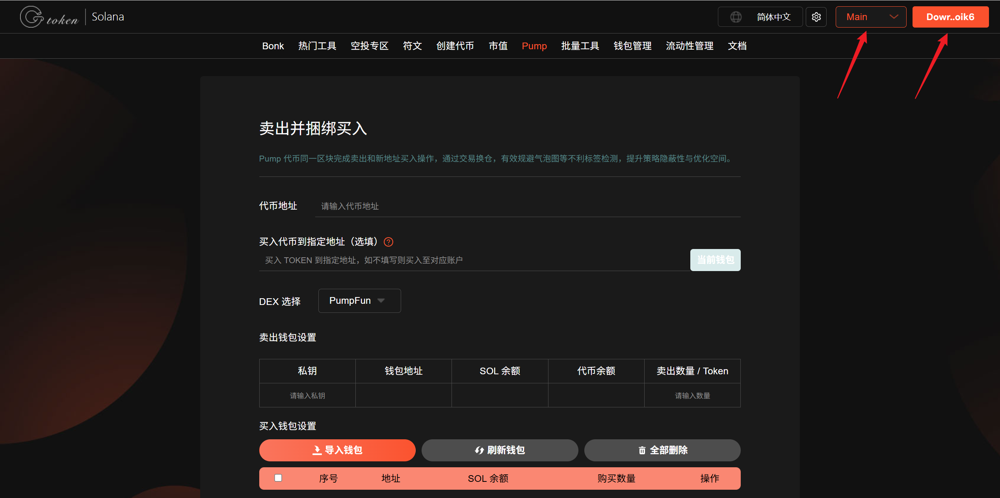
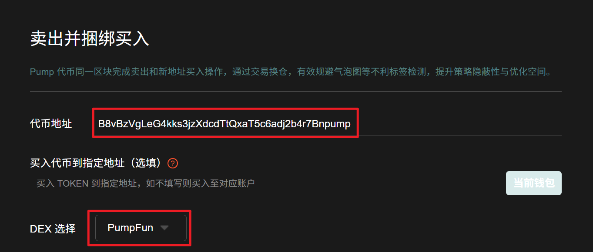
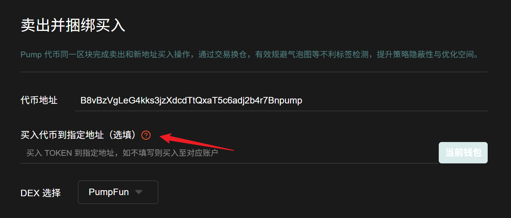
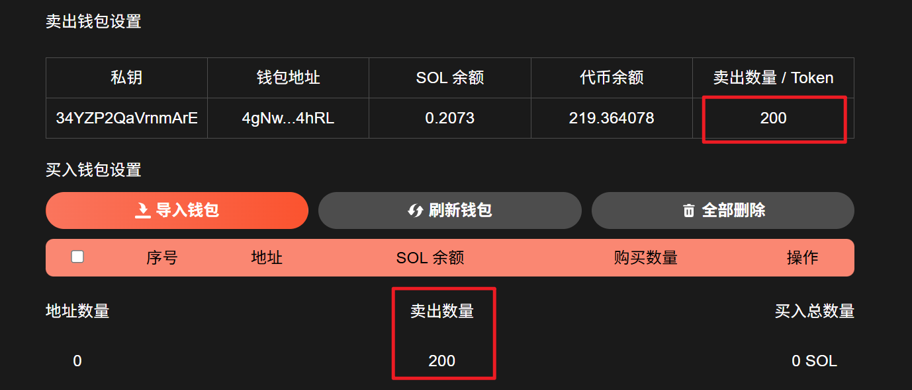
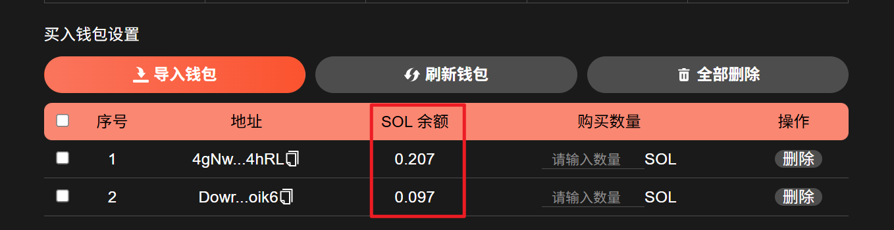
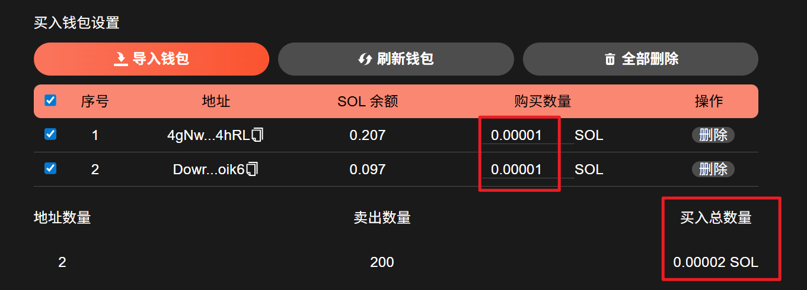
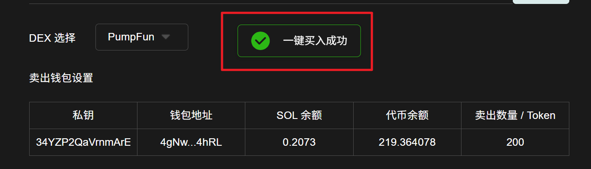

# Pump卖出并捆绑买入教程

**GTokenTool** 的 **Solana Pump卖出并捆绑买入工具** 主要用于在 Pump.fun 平台实现资产的无缝“闪兑式”换仓。该工具具备**交易原子化、同步执行**的特点，支持在卖出旧筹码的同时，利用新钱包执行捆绑买入，从而快速刷新持币结构。其优势在于**极速响应与防夹保护**，能有效避免操作间隙的价格剧烈波动，确保在换仓过程中不丢失市场先机。它特别适用于需要快速调整持仓分布、优化盘面数据的 **Solana 项目方及专业高频交易者**，是提升资金调度效率与交易隐蔽性的高级利器。

## 📌核心摘要

* **平台背景（Pump.fun生态）**：专为 **Pump.fun** 平台设计的高级交易策略工具，针对项目方或早期持有者的持仓管理需求，提供在同一区块内完成“卖出并新地址买入”的复杂操作。
* **核心功能（交易换仓）**：支持在同一区块内同步执行**卖出旧仓位**与**新地址买入**操作。通过这种“交易换仓”机制，实现筹码的转移与分散，有效打破原有的持仓关联。
* **技术优势（规避风控标签）**：旨在**规避“气泡图”等链上分析工具的不利标签检测**。通过制造复杂的交易链路，提升策略的隐蔽性，为项目方或大户提供更大的数据优化空间，降低被追踪的风险。

## 准备事项

1. 一台电脑或者一部手机
2. Solana 钱包（[幻影钱包Phantom安装教程](https://docs.gtokentool.com/solana/auxiliary-tutorial/phantom-wallet-installation)）
3. 要进行交易的钱包私钥
4. 交易所需代币
5. 一些 SOL 用于支付交易 GAS

## Pump卖出并捆绑买入流程

### 1. 连接钱包

Pump卖出并捆绑买入：[https://sol.gtokentool.com/zh-CN/pump/pumpSellAndBuy](https://sol.gtokentool.com/zh-CN/pump/pumpSellAndBuy)

进入Pump卖出并捆绑买入页面，右上角支持切换成中文。选择 Main 网络并连接钱包。

<figure><figcaption>
连接钱包并选择Main网络
</figcaption></figure>

### 2. 输入代币地址


**注意**：输入代币地址后，请选择正确的DEX。<mark style="color:red;">若不清楚的话，直接选择Jup。</mark>


<figure><figcaption>
输入代币地址并选择对应DEX
</figcaption></figure>

### 3. 买入代币到指定地址（选填）

买入代币到指定地址，如不填则买入至对应账户。

<figure><figcaption>
买入代币到指定地址
</figcaption></figure>

### 4. 卖出钱包设置

输入钱包私钥后，会显示钱包内SOL余额和代币余额。之后设置卖出数量，填好后下方可看到要卖出的数量。

<figure><figcaption>
卖出数量设置
</figcaption></figure>

### 5. 导入需买入代币的钱包

导入钱包后，可以看到钱包内的SOL余额（<mark style="color:purple;">建议每次交易之前刷新钱包以获得最新钱包余额</mark>）。


所有费用将由卖出钱包统一支付。


<figure><figcaption>
导入钱包
</figcaption></figure>

### 6. 设置购买数量

可对每个钱包进行单独设置。全部填写好后，勾选钱包，下方可看到买入的总数量。

<figure><figcaption>
设置买入金额
</figcaption></figure>

### 7. Jito捆绑小费设置

**Jito捆绑小费：**&#x4E00;定程度上决定了你的交易速度。

* **默认：**&#x30;.002 SOL
* **快速：**&#x30;.004 SOL
* **极速：**&#x30;.01 SOL
* **其他：**&#x81EA;行输入金额

<figure><figcaption>
设置Jito小费
</figcaption></figure>

### 8. 点击“Bundled Buy”，开始交易

交易成功后，会弹出提示交易成功。

<figure><figcaption>
一键买入成功提示
</figcaption></figure>

## ❓常见问题 FAQ

### Q: 卖出并捆绑买入是什么功能？

**A:** 代币同一区块完成卖出和新地址买入操作，通过交易换仓，有效规避气泡图等不利标签检测，提升策略隐蔽性与优化空间。

### Q: 为什么要用新地址买入？

**A:** 使用新地址可规避链上图谱标记，减少被监控系统识别的风险。

### Q: 这种操作是否会被判定为拉盘或刷量？

**A:** 不会，若控制好节奏和金额，链上数据表现为正常换仓行为。

### Q: 是否支持多个新地址批量买入？

**A:** 支持，可指定多个目标地址以提高分散性和隐蔽性。

### Q: 会影响价格吗？

**A:** 可能会，尤其在流动性较低时需注意滑点。

### 🤝 连接 GTokenTool 

* **💬 Telegram社群**：[点击加入官方群组](https://t.me/gtokentool)
* **🐦 Twitter (X)**：[关注我们获取最新动态](https://x.com/gtokentool)
* **📚 官方文档**：[查看 Gitbook 文档](https://docs.gtokentool.com/)
* **💻 开源代码**：[访问 GitHub 仓库](https://github.com/Gtokentool/docs/blob/master/SUMMARY.md)
* **📺 视频教程**：[订阅 YouTube 频道](https://www.youtube.com/@GTokenTool)

> ⚠️ 风险提示与免责声明
>
> GTokenTool 保留随时全权酌情因任何理由修改、变更或取消此公告的权利，无需事先通知。
>
> 以上信息内容仅供参考，GTokenTool 对本平台上的任何虚拟资产、产品或促销活动不做任何推荐或保证。虚拟资产的价格波动很大，投资交易虚拟资产将面临巨大风险。**请谨慎投资。**
