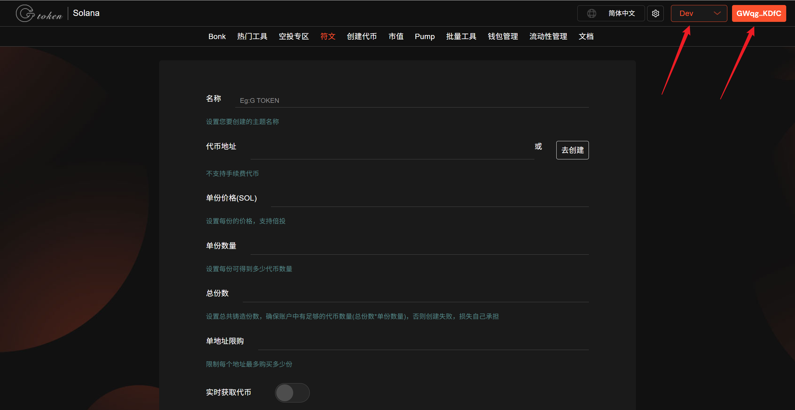
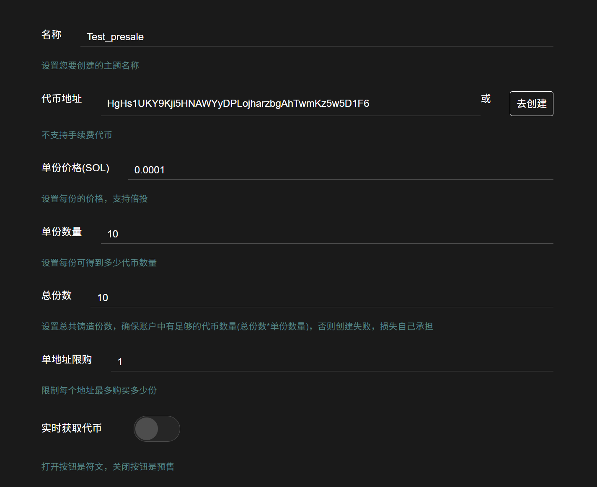
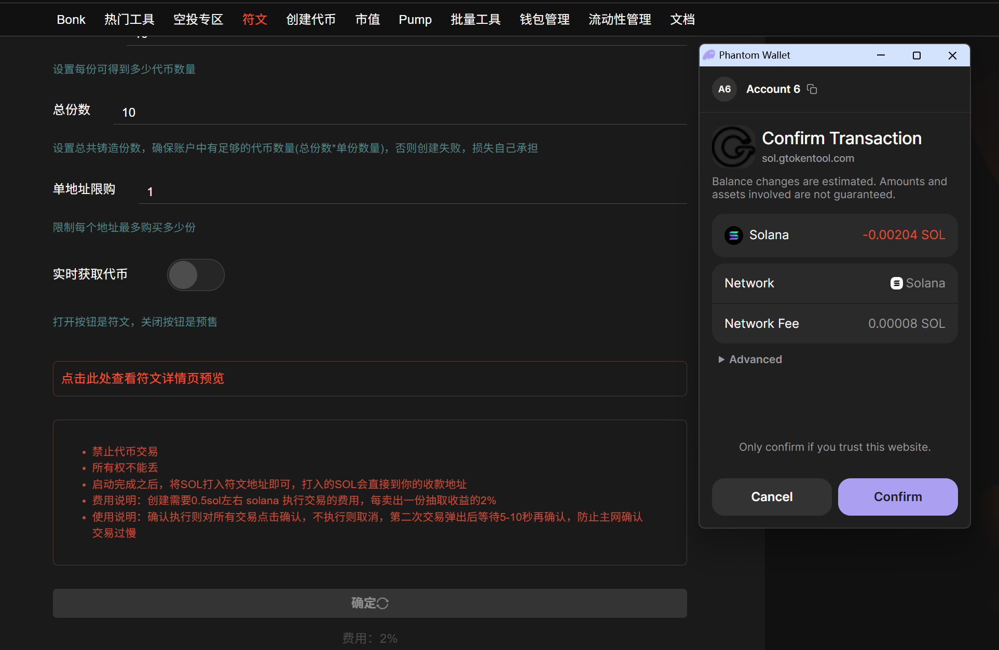
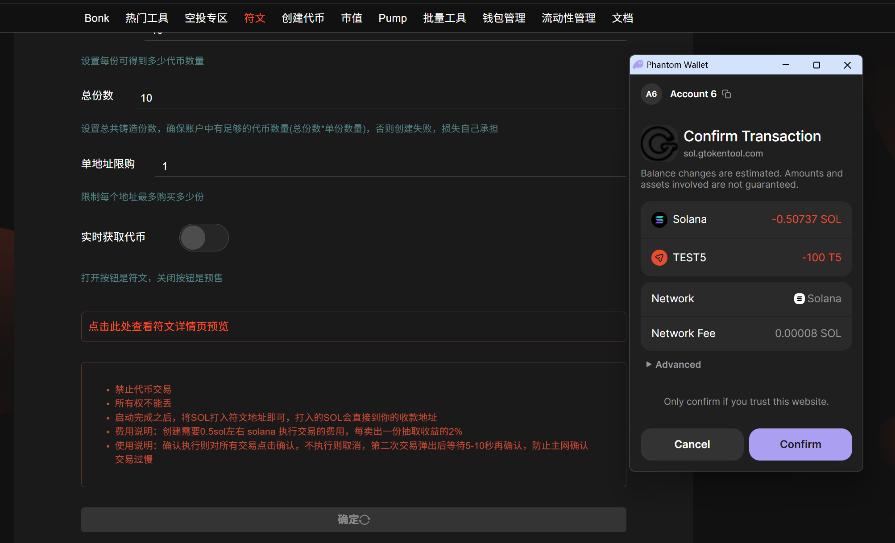
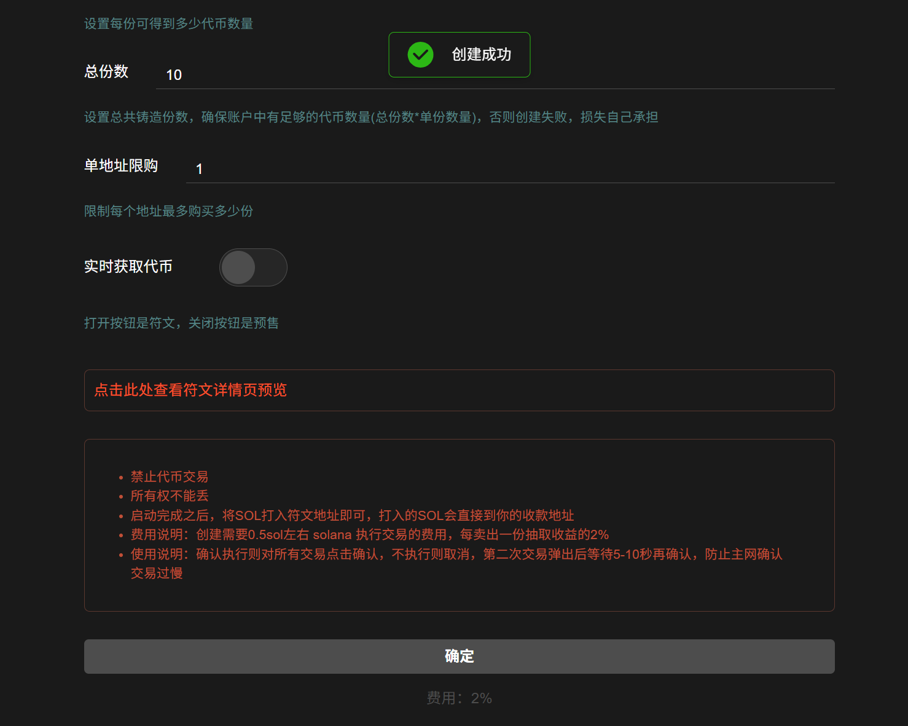
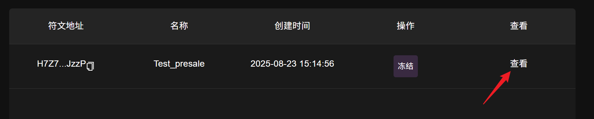
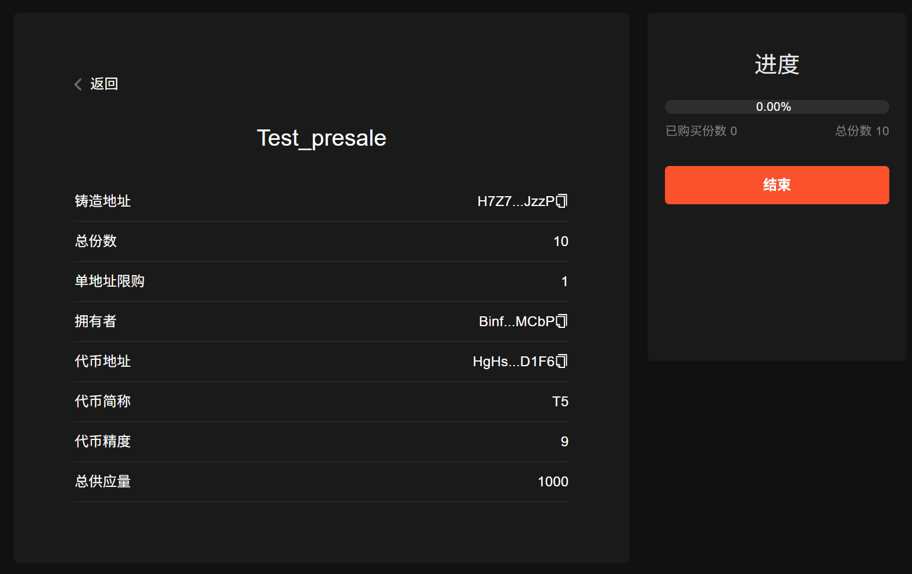

# ⏰ Solana预售创建

## 📌 核心摘要

* **功能定位**：Solana链上**代币公平发射/预售配置工具**。用于设定代币售卖规则，自动执行分发。
* **关键参数逻辑**：
  * **定价**：设定“单份价格(SOL)”和“单份数量(代币)”。
  * **总量**：设定“总份数”，需确保钱包余额 ≥ 总份数 × 单份数量。
  * **限购**：设定“单地址限购”份数，防止单一大户垄断。
  * **模式**：开关控制。**开**=现货模式（付款即到账）；**关**=预售模式（需手动/后续发放）。
* **前置条件**：需持有代币地址，且钱包内有足额代币用于分发，以及SOL支付Gas。

## 视频教程



## 创建预售具体步骤

### 1. 连接钱包

创建 SOL 预售链接：[https://sol.gtokentool.com/zh-CN/presale](https://sol.gtokentool.com/zh-CN/presale)

进入创建符文页面，点击右上角“`Connect`”连接钱包，并选择 Main 网络节点。这里使用测试网来演示。

<figure><figcaption>
连接钱包并选择网络
</figcaption></figure>

### 2. 填写具体参数

<figure><figcaption>
填写具体参数
</figcaption></figure>

**名称：**&#x8BBE;置您要创建的主题名称。

**代币地址：**&#x8F93;入您要创建预售的代币的地址，不支持手续费代币。

**单份价格（SOL）：**&#x8BBE;置每份的价格，支持倍投。

**单份数量：**&#x8BBE;置每份可得到多少代币数量。

**总份数：**&#x8BBE;置总预售份数，确保账户中有足够的代币数量（总份数\*单份数量），否则会创建失败，损失自己承担。

**单地址限购：**&#x9650;制每个地址最多购买多少份。

**实时获取代币：**&#x6253;开按钮是符文，关闭按钮是预售。

### 3. 点击“确定”，创建预售

<figure><figcaption>
第一次钱包确认
</figcaption></figure>

<figure><figcaption>
第二次钱包确认
</figcaption></figure>

创建成功后，将弹出提示“创建成功”。之后，您可以在“`管理符文`”中查看预售情况。

<figure><figcaption>
创建成功提示
</figcaption></figure>

<figure><figcaption>
符文列表
</figcaption></figure>

<figure><figcaption>
查看符文
</figcaption></figure>

## ❓常见问题 FAQ

### Q: 在哪里查看已创建的符文？

**A:** 在[管理符文](https://sol.gtokentool.com/zh-CN/presale/managementPresale)页面可以查看，注意连接对应的钱包。

### Q: 符文创建后可以修改名称、供应量吗？

**A:** 一旦上链不可修改。

### Q: 创建符文是怎么收费的？

**A:** 创建需要0.5 SOL左右 Solana 执行交易的费用，每卖出一份抽取收益的2%。

### 🤝 连接 GTokenTool 

* **💬 Telegram社群**：[点击加入官方群组](https://t.me/gtokentool)
* **🐦 Twitter (X)**：[关注我们获取最新动态](https://x.com/gtokentool)
* **📚 官方文档**：[查看 Gitbook 文档](https://docs.gtokentool.com/)
* **💻 开源代码**：[访问 GitHub 仓库](https://github.com/Gtokentool/docs/blob/master/SUMMARY.md)
* **📺 视频教程**：[订阅 YouTube 频道](https://www.youtube.com/@GTokenTool)

> ⚠️ 风险提示与免责声明
>
> GTokenTool 保留随时全权酌情因任何理由修改、变更或取消此公告的权利，无需事先通知。
>
> 以上信息内容仅供参考，GTokenTool 对本平台上的任何虚拟资产、产品或促销活动不做任何推荐或保证。虚拟资产的价格波动很大，投资交易虚拟资产将面临巨大风险。**请谨慎投资。**
