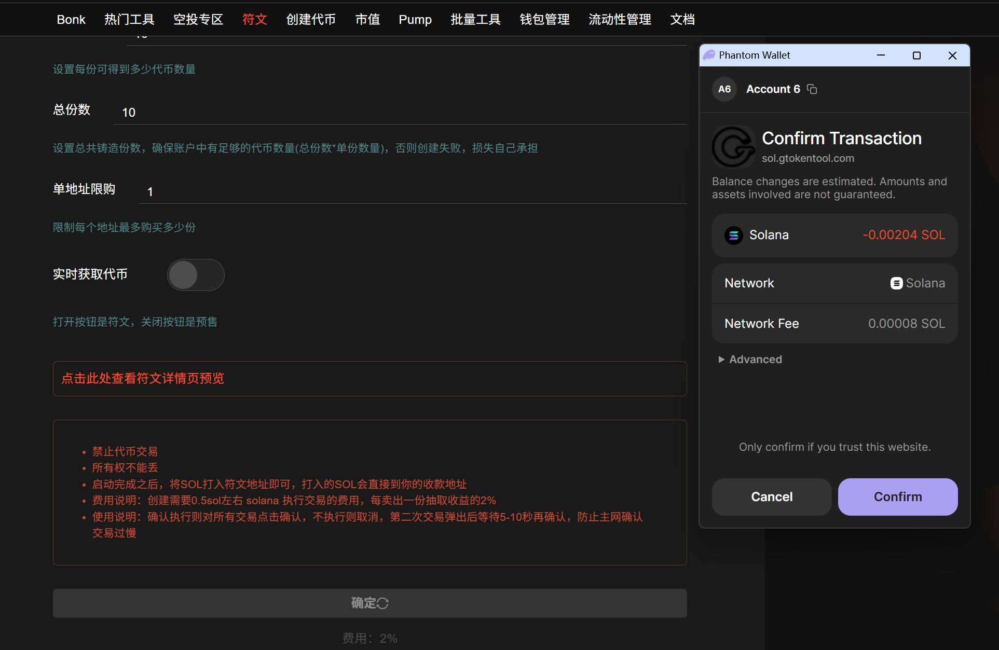

# ⏰ Solana预售创建

## 视频教程



## 创建预售具体步骤

### 1. 连接钱包

创建 SOL 预售链接：[https://sol.gtokentool.com/zh-CN/presale](https://sol.gtokentool.com/zh-CN/presale)

进入创建符文页面，点击右上角“`Connect`”连接钱包，并选择 Main 网络节点。这里使用测试网来演示。

<figure><figcaption></figcaption></figure>

### 2. 填写具体参数

<figure><figcaption></figcaption></figure>

**名称：**&#x8BBE;置您要创建的主题名称。

**代币地址：**&#x8F93;入您要创建预售的代币的地址，不支持手续费代币。

**单份价格（SOL）：**&#x8BBE;置每份的价格，支持倍投。

**单份数量：**&#x8BBE;置每份可得到多少代币数量。

**总份数：**&#x8BBE;置总预售份数，确保账户中有足够的代币数量（总份数\*单份数量），否则会创建失败，损失自己承担。

**单地址限购：**&#x9650;制每个地址最多购买多少份。

**实时获取代币：**&#x6253;开按钮是符文，关闭按钮是预售。

### 3. 点击“确定”，创建预售

<figure><figcaption></figcaption></figure>

<figure><figcaption></figcaption></figure>

创建成功后，将弹出提示“创建成功”。之后，您可以在“`管理符文`”中查看预售情况。

<figure><figcaption></figcaption></figure>

<figure><figcaption></figcaption></figure>

<figure><figcaption></figcaption></figure>

[_**GTokenTool | 创建代币、批量空投和做市机器人等Solana工具集**_](https://sol.gtokentool.com)

**安全、开源，给Solana用户带来最便利的一站式体验。**

GTokenTool社群:

Telegram：[**https://t.me/gtokentool**](https://t.me/gtokentool)

Twitter:  [**https://x.com/gtokentool**](https://x.com/gtokentool)

Gitbook：[**https://docs.gtokentool.com/**](https://docs.gtokentool.com/)

Github：[**https://github.com/Gtokentool/docs/blob/master/SUMMARY.md**](https://github.com/Gtokentool/docs/blob/master/SUMMARY.md)

YouTube：[**https://www.youtube.com/@GTokenTool**](https://www.youtube.com/@GTokenTool)\
\
\
\
<mark style="color:purple;background-color:orange;">**GTokenTool**</mark>_<mark style="color:purple;background-color:orange;">保留随时全权酌情因任何理由修改、变更或取消此公告的权利，无需事先通知。以上信息内容仅供参考，GTokenTool对本平台上的任何虚拟资产、产品或促销活动不做任何推荐或保证。虚拟资产的价格波动很大，投资交易虚拟资产将面临巨大风险。请谨慎投资。</mark>_
