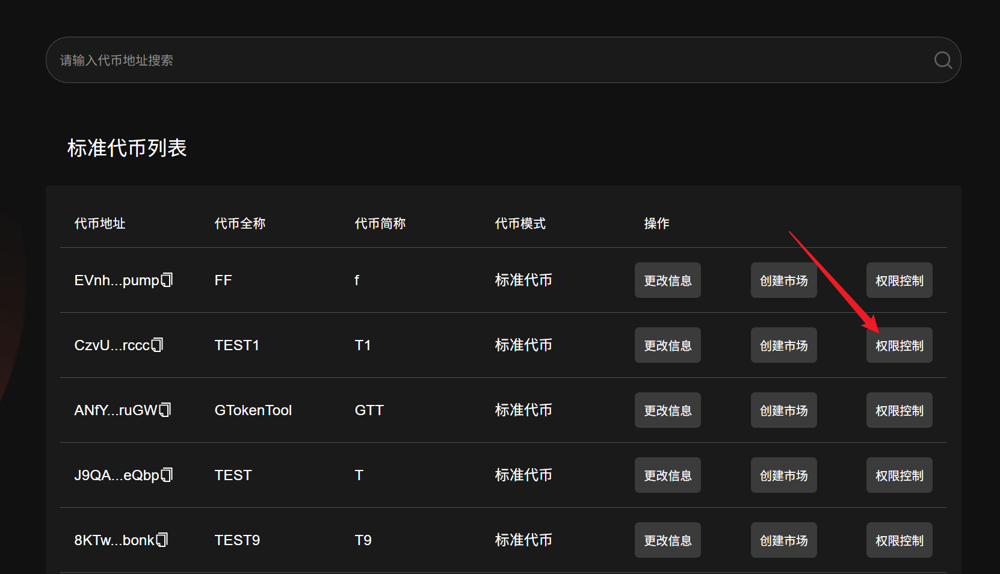
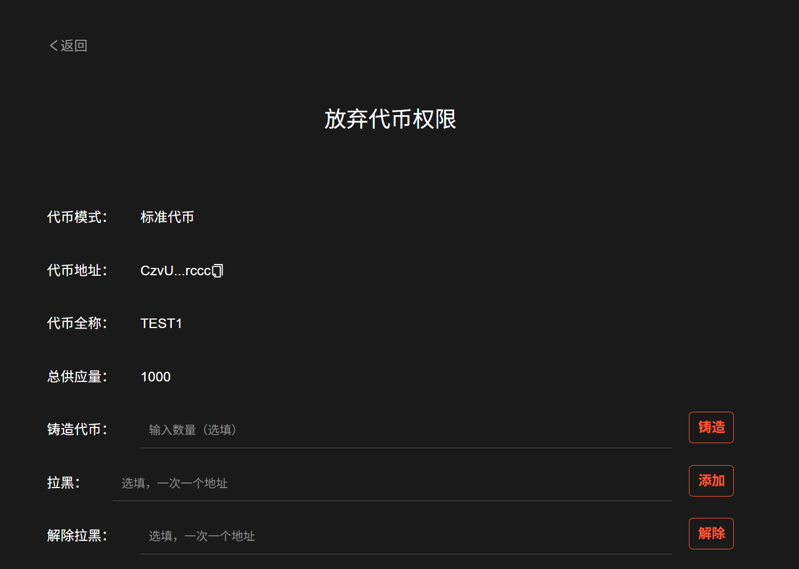
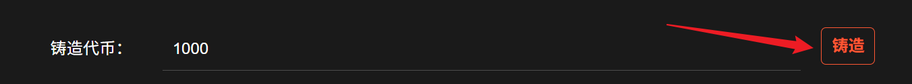
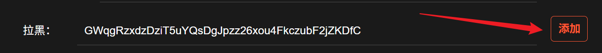
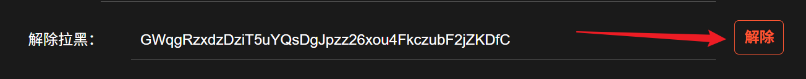
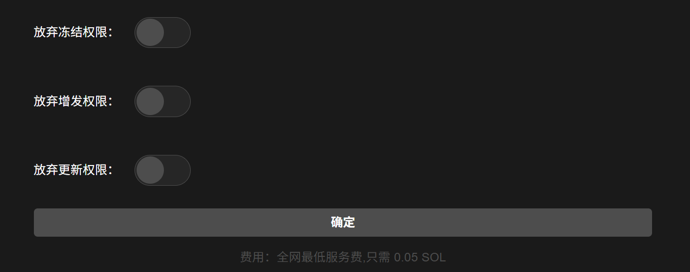
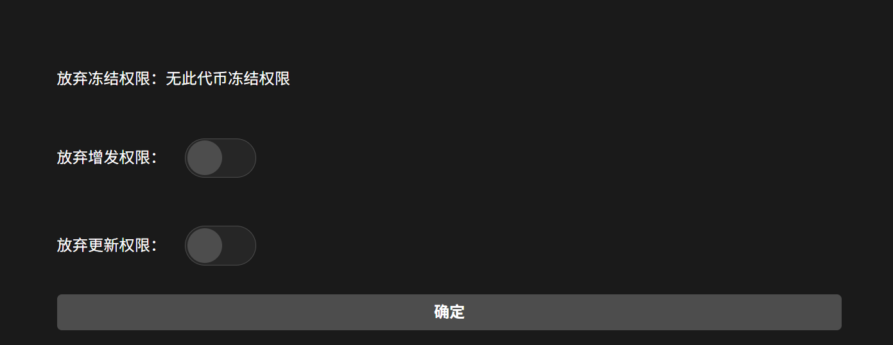
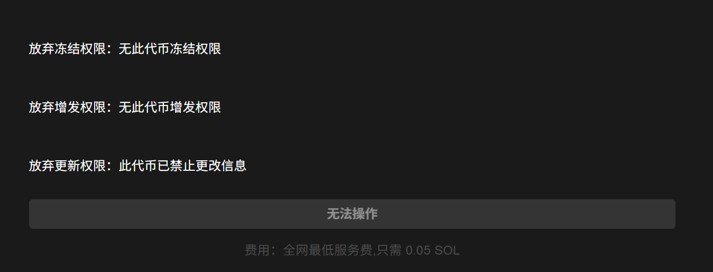
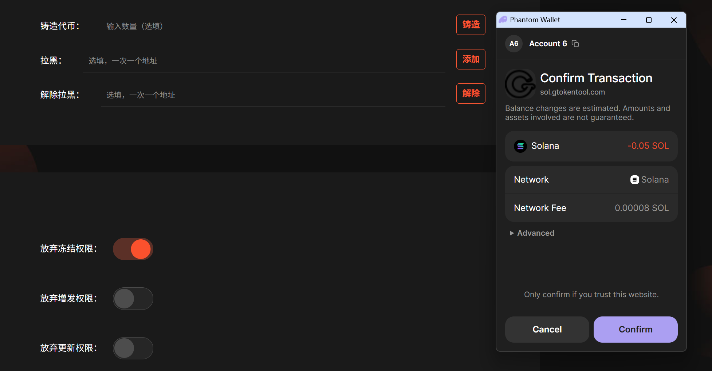

# Solana权限管理（增发、冻结、弃权）

## 视频教程



Solana的代币创建出来后，会有3个权限：增发权限、冻结权限、更新权限。

* 增发权限：可以增发、铸造代币，提高代币供给量。
* 冻结权限：可以冻结任何一个地址，使其不能转账及卖出。
* 更新权限：可以修改代币名称、logo等。


如果是在GTokenTool发行的代币，并已上传了logo，会自带这三个权限。如果是其他平台发行的代币，可能会带有2个权限或者1个权限。当然，不管你是在哪里创建发行的代币，都可以通过GTokenTool的工具放弃权限。


<mark style="background-color:green;">手续费代币，NFT放弃权限同样的操作步骤</mark>

## 权限管理操作步骤

### 1. 进入“权限控制”

进入代币列表页面：[https://sol.gtokentool.com/zh-CN/Token/management](https://sol.gtokentool.com/zh-CN/Token/management)

连接好钱包，选择 Main 网络节点，这里使用测试网演示。

<figure><figcaption></figcaption></figure>

选择你要操作的代币，点击“`权限控制`”进入权限控制页面。

<figure><figcaption></figcaption></figure>

### 2. 页面信息

**代币模式**：标准代币

**代币全称**：TEST1

**总供应量**：1000

<figure><figcaption></figcaption></figure>

**铸造代币**：当你有增发权限的时候可以铸造，填好铸造数量，点击右侧“`铸造`”按钮，弹出钱包点击确认就可以了，如果总供应量没有及时变化请刷新页面。

<figure><figcaption></figcaption></figure>

**拉黑**：可以冻结任何一个地址，使其不能转账及卖出，输入钱包地址且一次只能输入一个地址，点击右侧“`添加`”就会把该钱包地址拉入黑名单。

<figure><figcaption></figcaption></figure>

**解除拉黑**：输入之前拉黑的钱包地址且一次只能输入一个地址，点击右侧“`解除`”之前拉黑的钱包解除黑名单。

<figure><figcaption></figcaption></figure>

### 3.判断该代币是否拥有对应权限

如果代币的权限是按钮，则说明你拥有该代币对应的权限，就可以正常放弃权限。

<figure><figcaption></figcaption></figure>

如果代币的权限出现无此代币冻结/增发/修改权限，说明你当前的钱包地址无此代币的对应权限，则无法放弃此权限，只能对拥有的权限进行操作。

<figure><figcaption></figcaption></figure>

如果该代币的三个权限均显示提示无此代币权限，说明你没有此代币的如任何一个权限，也无法去对任何一个此代币的权限进行放弃操作。

<figure><figcaption></figcaption></figure>

### 4.选择需要放弃权限

点击对应的按钮，之后点击“`确定`”，就会弹出钱包页面，点击之后可完成权限放弃。

<figure><figcaption></figcaption></figure>

<figure><figcaption></figcaption></figure>


**提示**：需要对权限按钮有操作才能点击“确定”按钮，不然无法点击“确定”按钮


&#x20;

[_**GTokenTool | 创建代币、批量空投和做市机器人等Solana工具集**_](https://sol.gtokentool.com)

**安全、开源，给Solana用户带来最便利的一站式体验。**

GTokenTool社群:

Telegram：[**https://t.me/gtokentool**](https://t.me/gtokentool)

Twitter:  [**https://x.com/gtokentool**](https://x.com/gtokentool)

Gitbook：[**https://docs.gtokentool.com/**](https://docs.gtokentool.com/)

Github：[**https://github.com/Gtokentool/docs/blob/master/SUMMARY.md**](https://github.com/Gtokentool/docs/blob/master/SUMMARY.md)

YouTube：[**https://www.youtube.com/@GTokenTool**](https://www.youtube.com/@GTokenTool)\
\
\
\
<mark style="color:purple;background-color:orange;">**GTokenTool**</mark>_<mark style="color:purple;background-color:orange;">保留随时全权酌情因任何理由修改、变更或取消此公告的权利，无需事先通知。以上信息内容仅供参考，GTokenTool对本平台上的任何虚拟资产、产品或促销活动不做任何推荐或保证。虚拟资产的价格波动很大，投资交易虚拟资产将面临巨大风险。请谨慎投资。</mark>_
