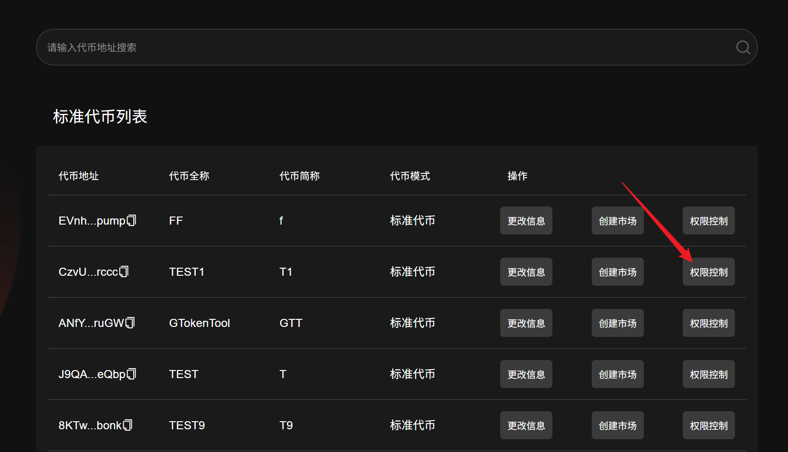
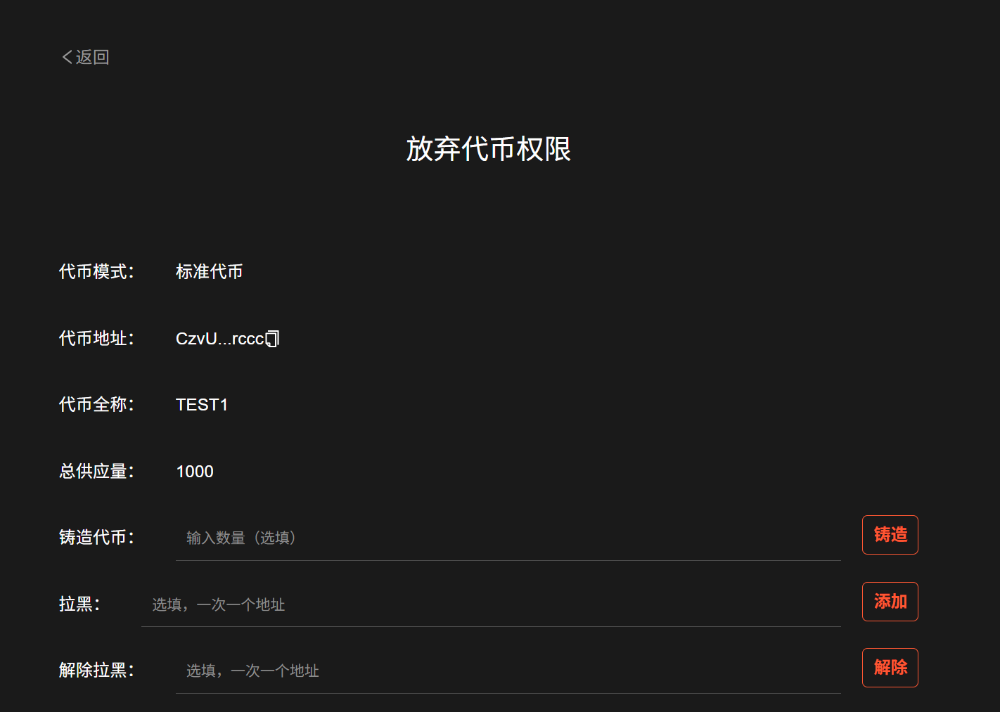
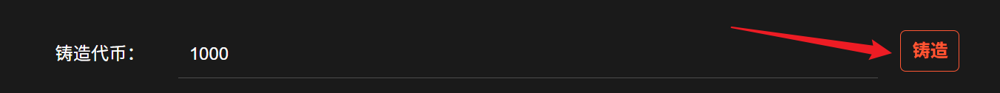
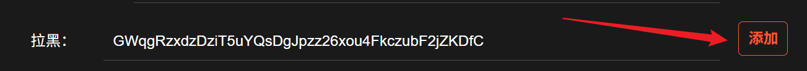
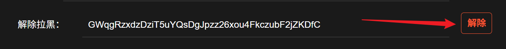
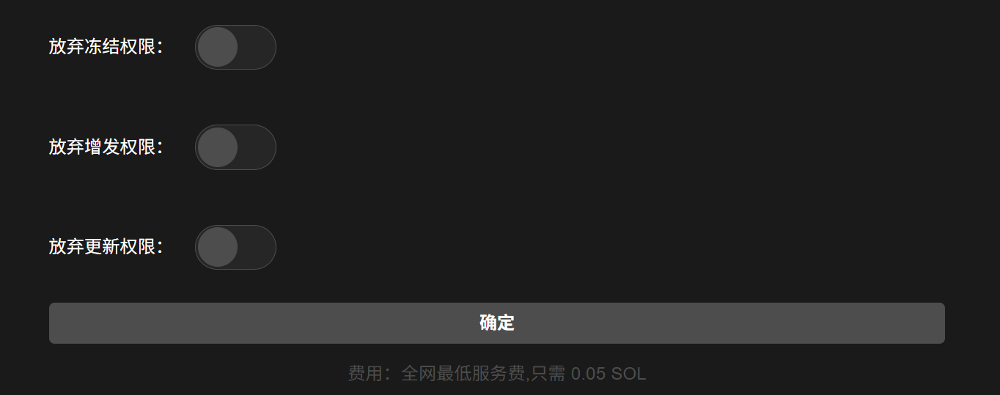
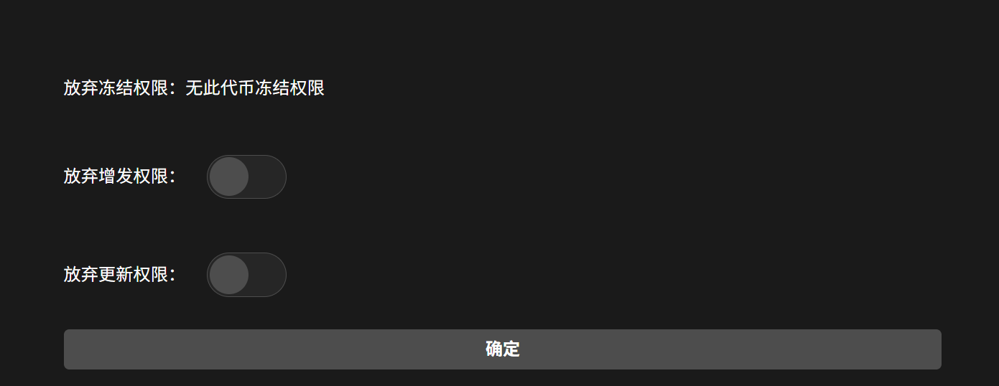
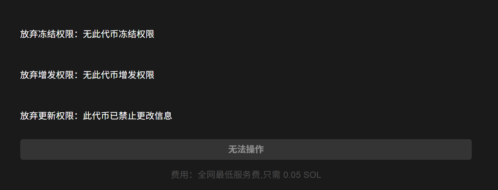
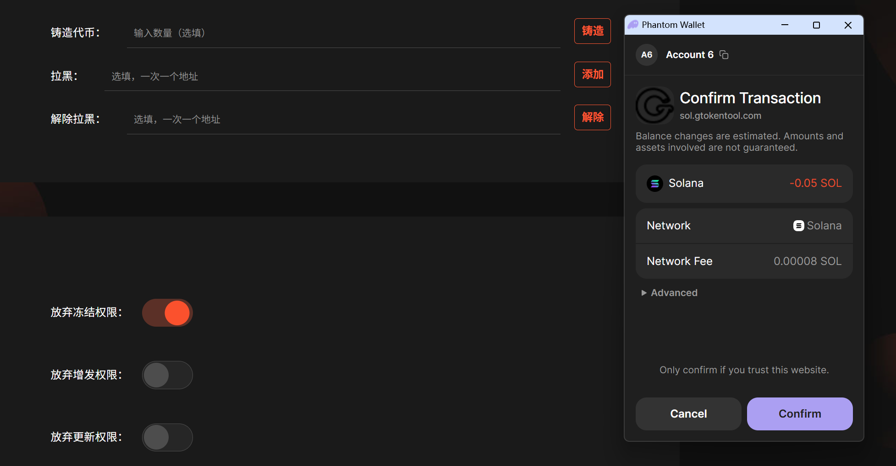
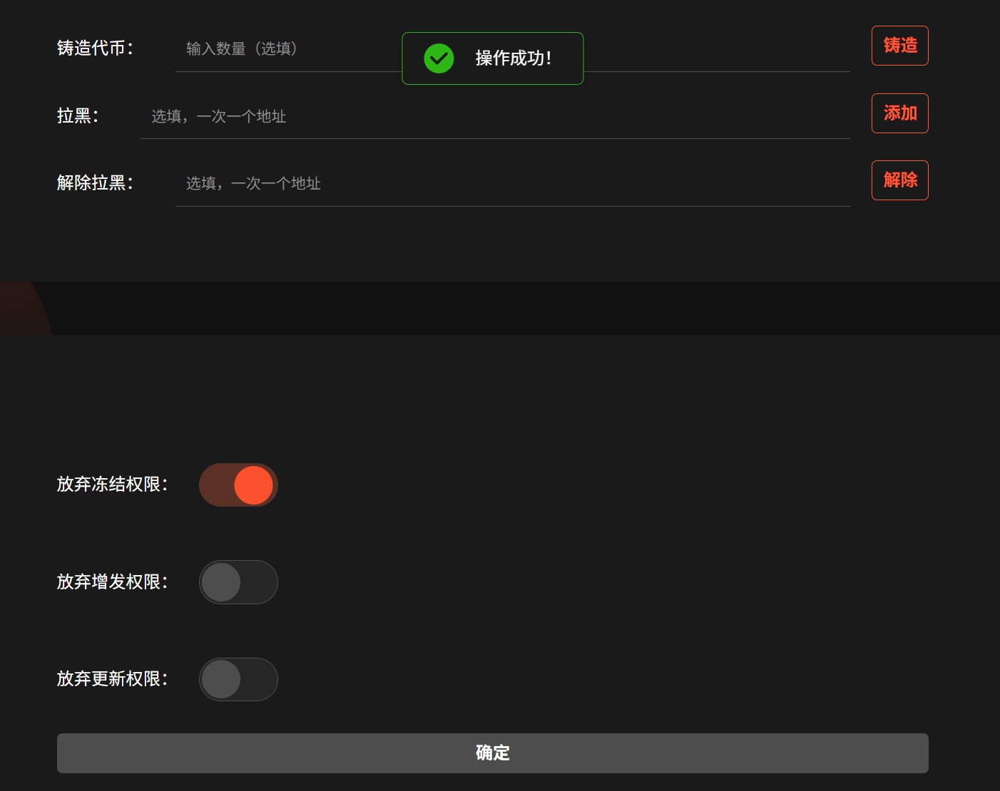

# Solana权限管理（增发、冻结、弃权）

## 📌核心摘要

* **核心功能**：\
  本教程详解 Solana 代币的三大核心权限控制：**增发**、**冻结**与**元数据修改**。重点指导项目方如何**放弃这些权限**，以实现代币合约的不可变性。
* **关键概念**：
  * **放弃增发权**：锁定总供应量，防止通货膨胀，是建立社区信任的第一步。
  * **放弃冻结权**：确保用户资产安全，防止项目方随意冻结账户。
  * **放弃修改权**：锁定代币信息（如名称、图标），证明项目方无法“ rug pull ”（撤资跑路）。
* **核心价值**：\
  指导用户通&#x8FC7;**“弃权”**&#x64CD;作，向市场证明代币的**公平性**与**安全性**。这是 Solana 项目上线交易所或建立社区共识前的标准合规步骤。


如果是在GTokenTool发行的代币，并已上传了logo，会自带这三个权限。如果是其他平台发行的代币，可能会带有2个权限或者1个权限。当然，不管你是在哪里创建发行的代币，都可以通过GTokenTool的工具放弃权限。


## 视频教程



## 权限管理操作步骤

### 1. 进入“权限控制”

进入代币列表页面：[https://sol.gtokentool.com/zh-CN/Token/management](https://sol.gtokentool.com/zh-CN/Token/management)

连接好钱包，选择 Main 网络节点，这里使用测试网演示。

<figure><figcaption>
连接钱包并选择网络
</figcaption></figure>

选择你要操作的代币，点击“`权限控制`”进入权限控制页面。

<figure><figcaption>
选择代币进行权限控制
</figcaption></figure>

### 2. 页面信息

**代币模式**：标准代币

**代币全称**：TEST1

**总供应量**：1000

<figure><figcaption>
代币信息
</figcaption></figure>

**铸造代币**：当你有增发权限的时候可以铸造，填好铸造数量，点击右侧“`铸造`”按钮，弹出钱包点击确认就可以了，如果总供应量没有及时变化请刷新页面。

<figure><figcaption>
铸造代币
</figcaption></figure>

**拉黑**：可以冻结任何一个地址，使其不能转账及卖出，输入钱包地址且一次只能输入一个地址，点击右侧“`添加`”就会把该钱包地址拉入黑名单。

<figure><figcaption>
拉黑地址
</figcaption></figure>

**解除拉黑**：输入之前拉黑的钱包地址且一次只能输入一个地址，点击右侧“`解除`”之前拉黑的钱包解除黑名单。

<figure><figcaption>
解除拉黑
</figcaption></figure>

### 3.判断该代币是否拥有对应权限

如果代币的权限是按钮，则说明你拥有该代币对应的权限，就可以正常放弃权限。

<figure><figcaption>
权限未放弃效果
</figcaption></figure>

如果代币的权限出现无此代币冻结/增发/修改权限，说明你当前的钱包地址无此代币的对应权限，则无法放弃此权限，只能对拥有的权限进行操作。

<figure><figcaption>
放弃部分权限效果
</figcaption></figure>

如果该代币的三个权限均显示提示无此代币权限，说明你没有此代币的如任何一个权限，也无法去对任何一个此代币的权限进行放弃操作。

<figure><figcaption>
权限全部放弃效果
</figcaption></figure>

### 4.选择需要放弃权限

点击对应的按钮，之后点击“`确定`”，就会弹出钱包页面，点击之后可完成权限放弃。

<figure><figcaption>
钱包确认
</figcaption></figure>

<figure><figcaption>
操作成功提示
</figcaption></figure>


**提示**：需要对权限按钮有操作才能点击“确定”按钮，不然无法点击“确定”按钮。


## &#x20;❓常见问题 FAQ

### Q: 放弃代币权限后还能恢复吗？

**A:** 不能，一旦放弃权限，该操作永久生效，无法撤销。

### Q: 为什么要放弃权限？

**A:** 放弃权限可以提升项目透明度，增强社区信任，吸引更多投资者。

### Q: 放弃那些权限最重要？

**A:** 通常是 Mint（增发）和 Freeze（冻结）权限，确保代币供应和账户操作安全。

### Q: 放弃权限是否会影响代币交易？

**A:** 不会，代币正常交易和转账不会受到影响。

### 🤝 连接 GTokenTool 

* **💬 Telegram社群**：[点击加入官方群组](https://t.me/gtokentool)
* **🐦 Twitter (X)**：[关注我们获取最新动态](https://x.com/gtokentool)
* **📚 官方文档**：[查看 Gitbook 文档](https://docs.gtokentool.com/)
* **💻 开源代码**：[访问 GitHub 仓库](https://github.com/Gtokentool/docs/blob/master/SUMMARY.md)
* **📺 视频教程**：[订阅 YouTube 频道](https://www.youtube.com/@GTokenTool)

> ⚠️ 风险提示与免责声明
>
> GTokenTool 保留随时全权酌情因任何理由修改、变更或取消此公告的权利，无需事先通知。
>
> 以上信息内容仅供参考，GTokenTool 对本平台上的任何虚拟资产、产品或促销活动不做任何推荐或保证。虚拟资产的价格波动很大，投资交易虚拟资产将面临巨大风险。**请谨慎投资。**
