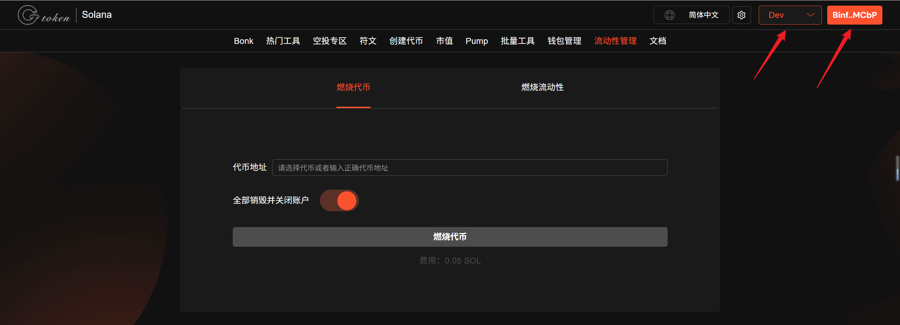
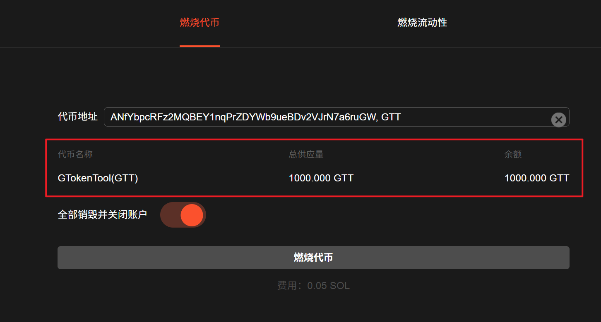
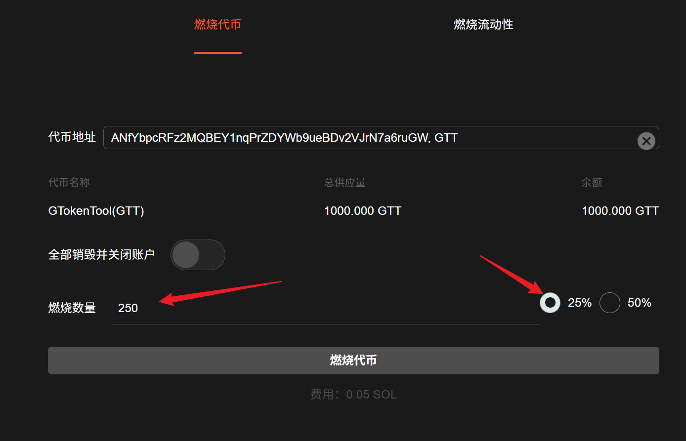
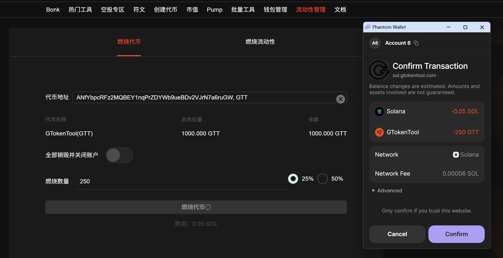
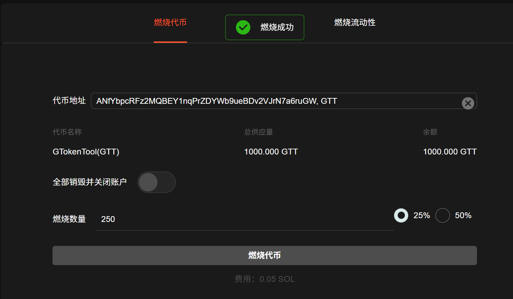

# Solana代币燃烧教程

Solana代币燃烧（Token Burn）是指通过特定机制或交易销毁一部分Solana（SOL）代币，从而减少流通中的代币总量，目的是减少供应量以提高代币的稀缺性，可能进而提升其价值。

## 准备事项

1. Solana 钱包（[幻影钱包Phantom安装教程](https://docs.gtokentool.com/solana/auxiliary-tutorial/phantom-wallet-installation)）
2. 钱包最少准备 0.03 SOL
3. 要冻结的代币合约和要冻结的账户地址信息

## Solana代币燃烧教程

### 1. 连接钱包

进入[GTokenTool](https://www.gtokentool.com)代币燃烧页面，右上角连接钱包，选择Phantom钱包，并选择 Main 网络节点，这里使用测试网演示。

Solana代币燃烧：[https://sol.gtokentool.com/zh-CN/liquidityManagement/burnToken](https://sol.gtokentool.com/zh-CN/liquidityManagement/burnToken)

<figure><figcaption></figcaption></figure>

### 2. 选择要燃烧的代币

选择代币后，可以查看到代币的相关信息。

<figure><figcaption></figcaption></figure>

### 3. 输入想要燃烧的代币数量

关闭`全部销毁并关闭账户`的开关，可以设置想要燃烧的比例或数量。

<figure><figcaption></figcaption></figure>

### 4. 提交完成代币燃烧

点击“`燃烧代币`”，执行操作。

<figure><figcaption></figcaption></figure>

<figure><figcaption></figcaption></figure>


在进行代币燃烧之前，请确保您完全理解燃烧的目的和对项目经济模型的潜在影响。燃烧代币是不可逆的操作，一旦执行，被燃烧的代币将永久从流通中移除。在提交燃烧操作前，务必仔细检查将要燃烧的代币数量。错误的数量可能导致意外的经济损失。


## Solana代币燃烧问答

### 1. 关闭账户是什么意思？

答：你每收到一个新的代币，Solana系统会自动在你的地址里开设一个代币存储账户。所谓“关闭账户”，就是把代币全部销毁，账户也关掉的意思。关闭账户并不影响你自己的钱包，因此不用担心。

### 2. NFT可以销毁吗？

答：在Orca加池子获得是NFT，这个暂时是不支持销毁/烧池的。目前可以销毁的是Ryadium和Meteora的LP。

### 3. 烧池后还能撤回流动性吗？

答：烧池后，永久无法撤出流动性。

[_**GTokenTool | 创建代币、批量空投和做市机器人等Solana工具集**_](https://sol.gtokentool.com)

**安全、开源，给Solana用户带来最便利的一站式体验。**

GTokenTool社群:

Telegram：[**https://t.me/gtokentool**](https://t.me/gtokentool)

Twitter:  [**https://x.com/gtokentool**](https://x.com/gtokentool)

Gitbook：[**https://docs.gtokentool.com/**](https://docs.gtokentool.com/)

Github：[**https://github.com/Gtokentool/docs/blob/master/SUMMARY.md**](https://github.com/Gtokentool/docs/blob/master/SUMMARY.md)

YouTube：[**https://www.youtube.com/@GTokenTool**](https://www.youtube.com/@GTokenTool)\
\
\
\
<mark style="color:purple;background-color:orange;">**GTokenTool**</mark>_<mark style="color:purple;background-color:orange;">保留随时全权酌情因任何理由修改、变更或取消此公告的权利，无需事先通知。以上信息内容仅供参考，GTokenTool对本平台上的任何虚拟资产、产品或促销活动不做任何推荐或保证。虚拟资产的价格波动很大，投资交易虚拟资产将面临巨大风险。请谨慎投资。</mark>_
