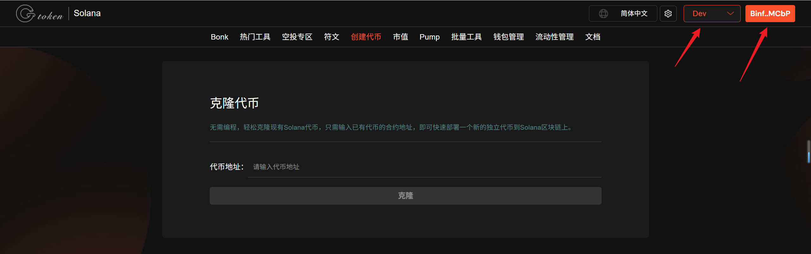
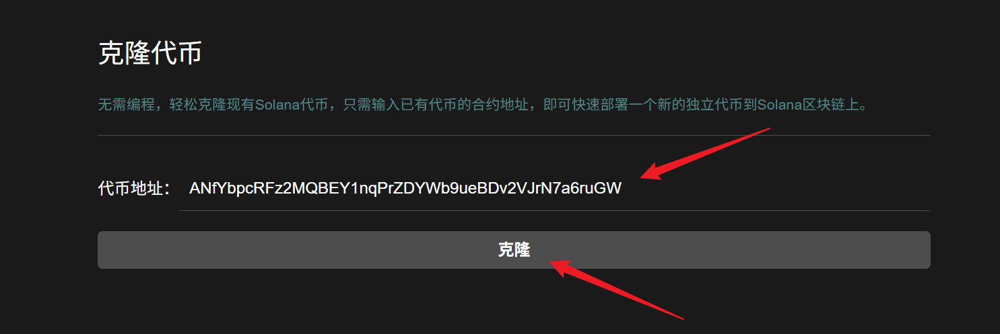
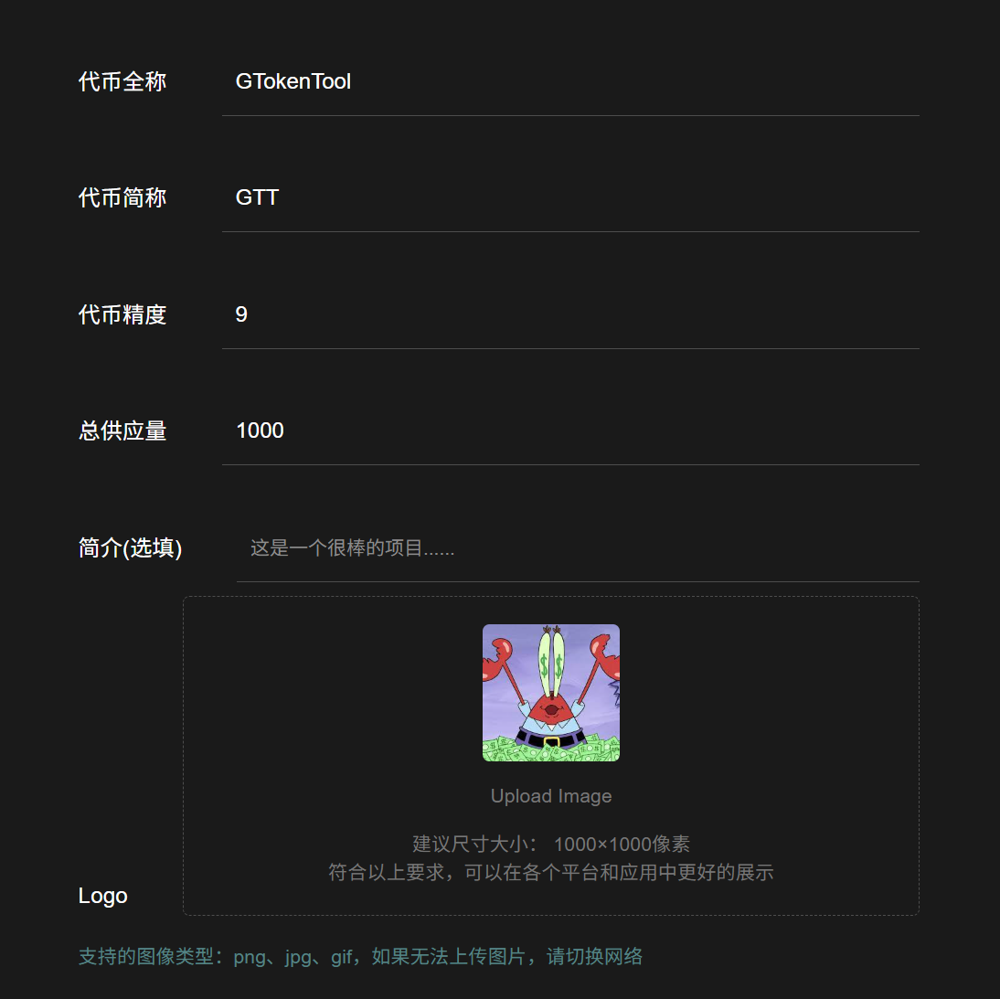
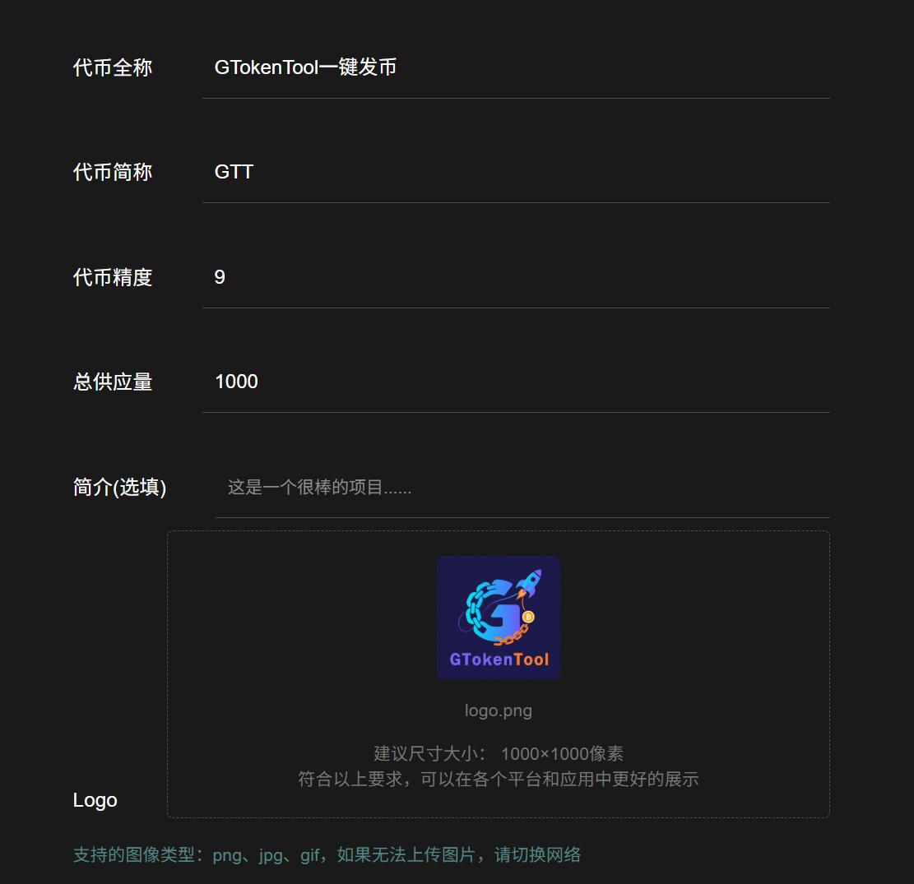
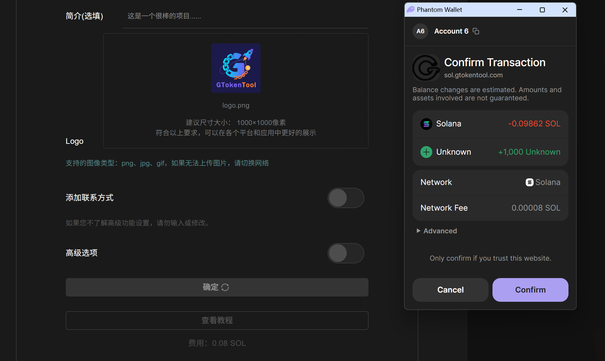
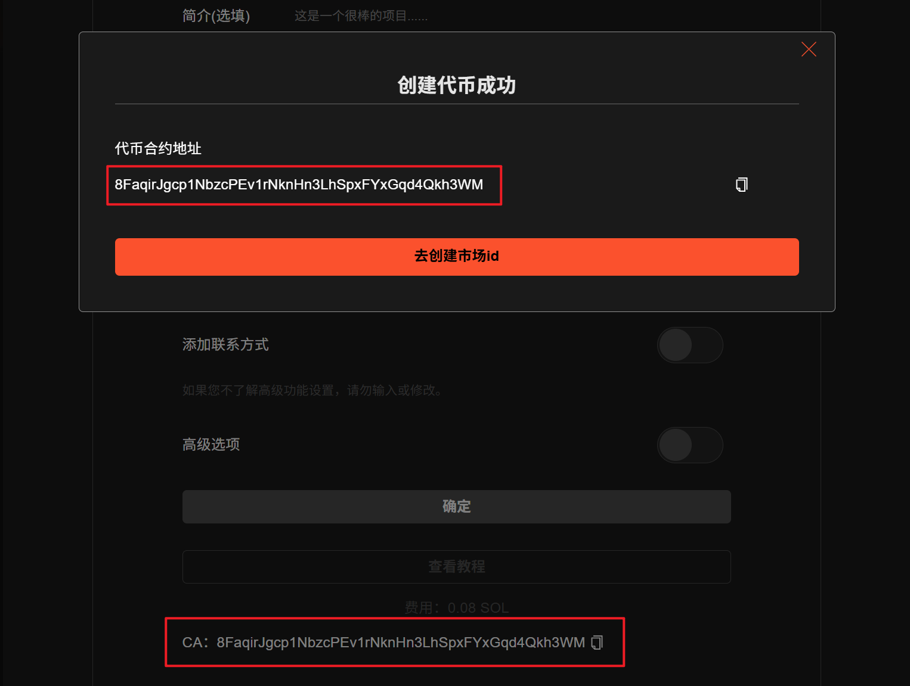
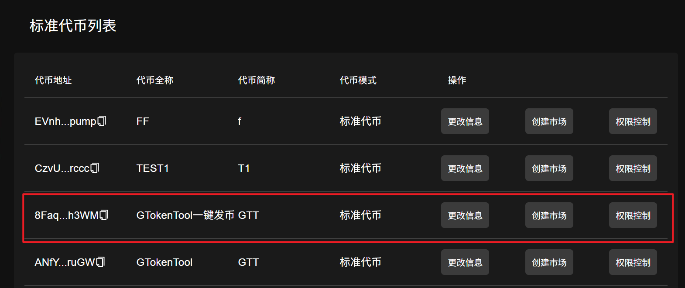
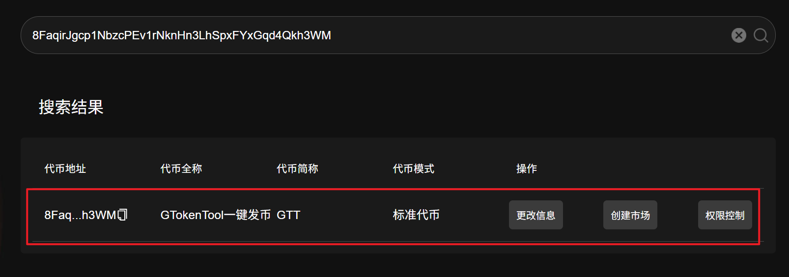

# 👣 Solana代币一键克隆教程


<mark style="color:blue;">**不用编程，轻松克隆现有的Solana代币，只需输入已有代币的合约地址，即可快速部署一个新的独立代币到Solana区块链上，简单、方便。**</mark>

<mark style="color:blue;">**创建代币过程受本地网络环境影响较大。如果持续失败，请尝试切换到更稳定的网络或开启VPN全局模式后再进行操作。**</mark>


## 视频演示



## 准备事项

1. 电脑或手机
2. Solana 钱包（[幻影钱包Phantom安装教程](https://docs.gtokentool.com/solana/auxiliary-tutorial/phantom-wallet-installation)）
3. 钱包最少准备 0.15 SOL
4. 克隆代币合约地址

## Solana代币一键克隆流程

### 1、连接接钱包

Solana代币一键克隆：[https://sol.gtokentool.com/zh-CN/Token/cloneToken](https://sol.gtokentool.com/zh-CN/Token/cloneToken)

进入GTokenTool代币克隆页面，右上角可切换语言，选择 Main 网络节点并连接钱包。这里用测试网演示。

<figure><figcaption></figcaption></figure>

### 2、输入克隆代币合约地址

<figure><figcaption></figcaption></figure>

通过第三行行情平台或者链上查看代币合约地址。

AVE（[https://ave.ai](https://ave.ai)）：

<figure><figcaption></figcaption></figure>

Dexscreener（[https://dexscreener.com](https://dexscreener.com)）：

<figure><figcaption></figcaption></figure>

GMGN（[https://gmgn.ai](https://gmgn.ai)）

<figure><figcaption></figcaption></figure>

PUMP（[https://pump.fun](https://pump.fun)）

<figure><figcaption></figcaption></figure>

### 3、查看克隆代币相关信息

<figure><figcaption></figcaption></figure>

### 4、修改克隆信息和权限配置

<figure><figcaption></figcaption></figure>

### 5、提交完成克隆代币

弹出钱包后，点击“`Confirm`"。之后会有弹窗显示生成的代币地址。

<figure><figcaption></figcaption></figure>

<figure><figcaption></figcaption></figure>

创建成功后可以在管理代币页面看到这个代币信息，也可在管理代币页面直接通过代币地址搜索。

<figure><figcaption></figcaption></figure>

<figure><figcaption></figcaption></figure>

[_**GTokenTool | 创建代币、批量空投和做市机器人等Solana工具集**_](https://sol.gtokentool.com/)

**安全、开源，给Solana用户带来最便利的一站式体验。**

GTokenTool社群:

Telegram：[**https://t.me/gtokentool**](https://t.me/gtokentool)

Twitter: [**https://x.com/gtokentool**](https://x.com/gtokentool)

Gitbook：[**https://docs.gtokentool.com/**](https://docs.gtokentool.com/)

Github：[**https://github.com/Gtokentool/docs/blob/master/SUMMARY.md**](https://github.com/Gtokentool/docs/blob/master/SUMMARY.md)

YouTube：[**https://www.youtube.com/@GTokenTool**](https://www.youtube.com/@GTokenTool)&#x20;

<mark style="color:purple;background-color:orange;">**GTokenTool**</mark>_<mark style="color:purple;background-color:orange;">保留随时全权酌情因任何理由修改、变更或取消此公告的权利，无需事先通知。以上信息内容仅供参考，GTokenTool对本平台上的任何虚拟资产、产品或促销活动不做任何推荐或保证。虚拟资产的价格波动很大，投资交易虚拟资产将面临巨大风险。请谨慎投资。</mark>_
