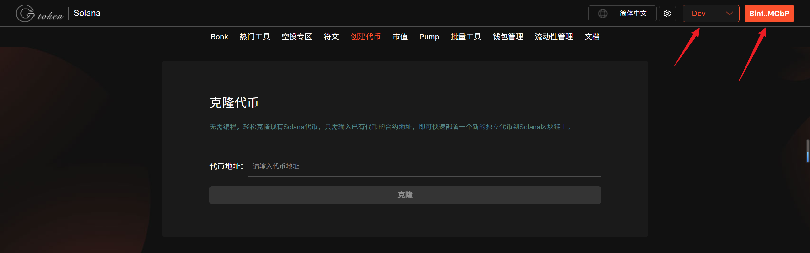
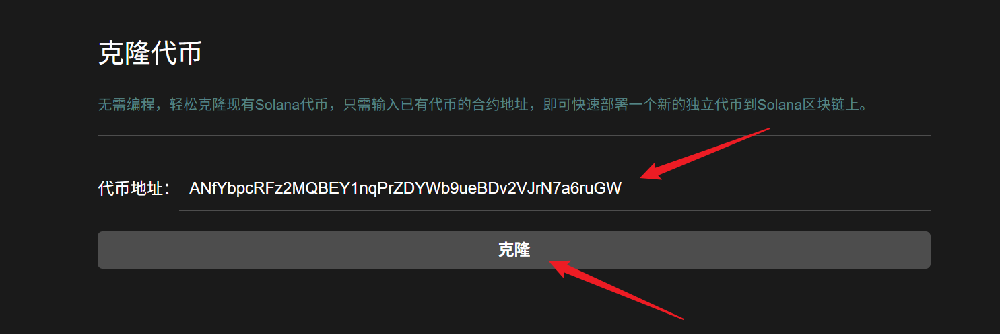
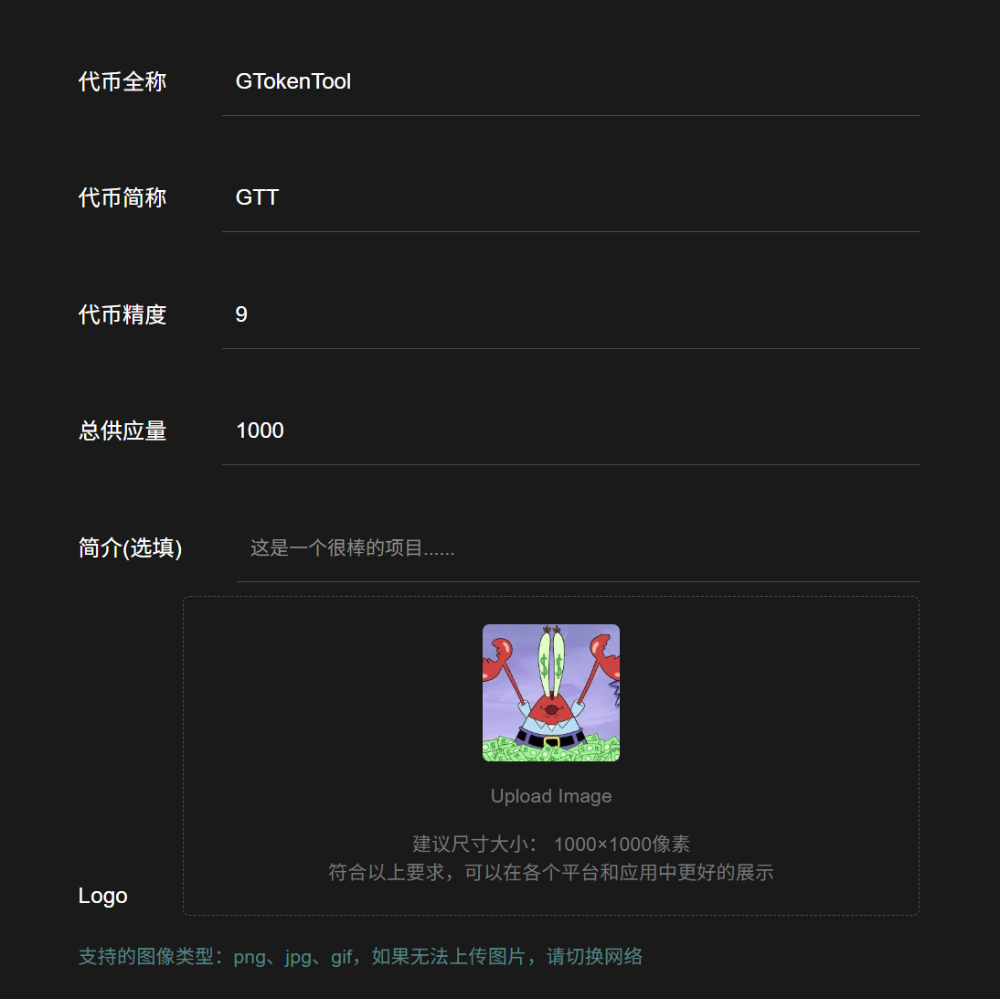
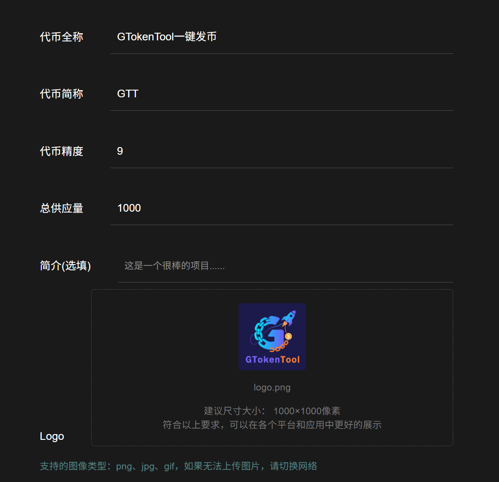
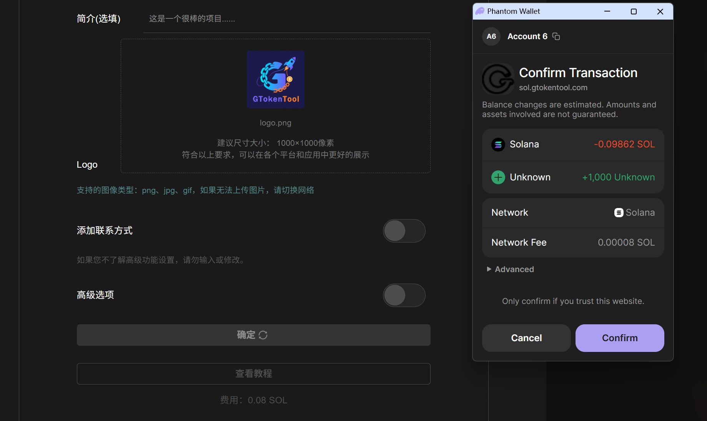
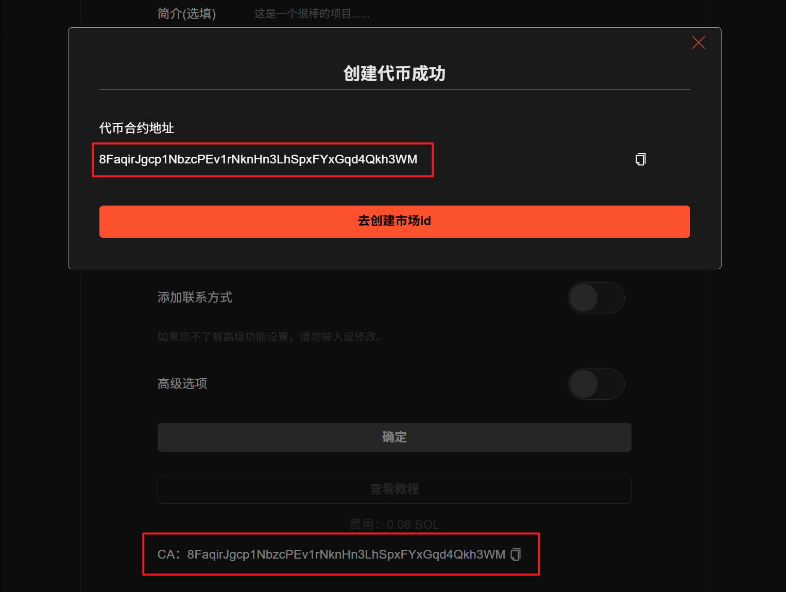
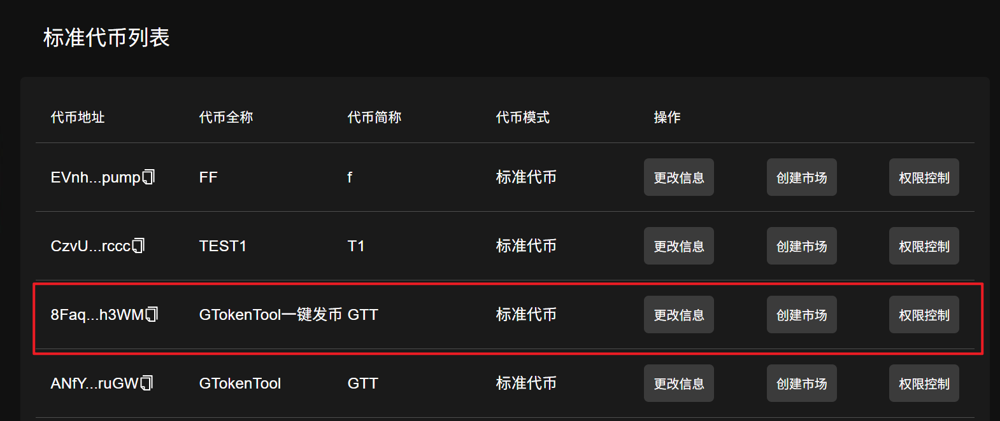
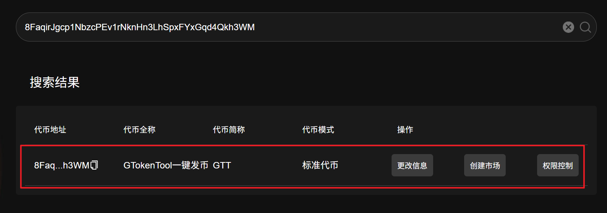

# 👣 Solana代币克隆教程

## 📌核心摘要

* **功能定位**：Solana 代币快速复制与部署工具。它通过读取现有代币的合约参数，实现“一键克隆”，在无需编写代码的情况下，快速生成一个全新的、独立的代币合约。
* **核心价值（效率与便捷）**：
  * **零门槛操作**：用户无需掌握 Rust 或 Solidity 等编程语言，仅需输入目标代币的合约地址，即可完成复制。
  * **快速迭代**：极大地缩短了代币开发和测试的周期，适合项目方进行快速原型设计或社区实验。
  * **参数继承**：能够完整复制源代币的名称、符号、小数位数等核心参数，确保新代币与原代币在功能上的一致性。
* **操作前置条件**：
  * **网络环境**：需确保本地网络连接稳定。如遇操作失败，建议切换至更稳定的网络或开启 VPN 全局模式。
  * **目标合约**：需准备一个有效的 Solana 代币合约地址作为克隆源。
  * **资金准备**：操作钱包内需有足够的 SOL 用于支付新代币的创建费用和 Gas 费。

## 视频演示



## 准备事项

1. 电脑或手机
2. Solana 钱包（[幻影钱包Phantom安装教程](https://docs.gtokentool.com/solana/auxiliary-tutorial/phantom-wallet-installation)）
3. 钱包最少准备 0.15 SOL
4. 克隆代币合约地址

## Solana代币一键克隆流程

### 1、连接接钱包

Solana代币一键克隆：[https://sol.gtokentool.com/zh-CN/Token/cloneToken](https://sol.gtokentool.com/zh-CN/Token/cloneToken)

进入GTokenTool代币克隆页面，右上角可切换语言，选择 Main 网络节点并连接钱包。这里用测试网演示。

<figure><figcaption>
连接钱包并选择网络
</figcaption></figure>

### 2、输入克隆代币合约地址

<figure><figcaption>
输入代币地址
</figcaption></figure>

通过第三行行情平台或者链上查看代币合约地址。

AVE（[https://ave.ai](https://ave.ai)）：

<figure><figcaption>
AVE页面
</figcaption></figure>

Dexscreener（[https://dexscreener.com](https://dexscreener.com)）：

<figure><figcaption>
Dexscreener页面
</figcaption></figure>

GMGN（[https://gmgn.ai](https://gmgn.ai)）

<figure><figcaption>
GMGN页面
</figcaption></figure>

PUMP（[https://pump.fun](https://pump.fun)）

<figure><figcaption>
PUMP页面
</figcaption></figure>

### 3、查看克隆代币相关信息

<figure><figcaption>
查看代币信息
</figcaption></figure>

### 4、修改克隆信息和权限配置

<figure><figcaption>
修改代币信息
</figcaption></figure>

### 5、提交完成克隆代币

弹出钱包后，点击“`Confirm`"。之后会有弹窗显示生成的代币地址。

<figure><figcaption>
钱包确认
</figcaption></figure>

<figure><figcaption>
代币合约地址显示
</figcaption></figure>

创建成功后可以在管理代币页面看到这个代币信息，也可在管理代币页面直接通过代币地址搜索。

<figure><figcaption>
代币列表
</figcaption></figure>

<figure><figcaption>
查询代币结果
</figcaption></figure>

## ❓常见问题 FAQ

### Q: 克隆出来的代币合约地址 (CA) 会一样吗？

**A:** 不一样。 在 Solana 区块链上，每个代币的合约地址（Mint Address）都是基于特定密钥对生成的，具有唯一性。即使元数据完全相同，克隆出的新代币也会拥有一个全新的、独一无二的合约地址。这意味着它是一个完全独立的项目，与原代币在链上没有任何资产关联。

### Q: 克隆代币需要多少费用？

**A:** 收费标准与普通代币创建一致。GTokenTool 收取 0.05 SOL 的平台服务费，用于维护工具的运行。此外，您还需要支付少量的 Solana 网络费和账户租金，这些是支付给 Solana 链上验证者的固定成本。

### Q: 可以克隆 Token-2022的代币吗？

**A:** 克隆工具主要针对SPL 代币的元数据复制，Token-2022 代币当然也可以。

### 🤝 连接 GTokenTool 

* **💬 Telegram社群**：[点击加入官方群组](https://t.me/gtokentool)
* **🐦 Twitter (X)**：[关注我们获取最新动态](https://x.com/gtokentool)
* **📚 官方文档**：[查看 Gitbook 文档](https://docs.gtokentool.com/)
* **💻 开源代码**：[访问 GitHub 仓库](https://github.com/Gtokentool/docs/blob/master/SUMMARY.md)
* **📺 视频教程**：[订阅 YouTube 频道](https://www.youtube.com/@GTokenTool)

> ⚠️ 风险提示与免责声明
>
> GTokenTool 保留随时全权酌情因任何理由修改、变更或取消此公告的权利，无需事先通知。
>
> 以上信息内容仅供参考，GTokenTool 对本平台上的任何虚拟资产、产品或促销活动不做任何推荐或保证。虚拟资产的价格波动很大，投资交易虚拟资产将面临巨大风险。**请谨慎投资。**
