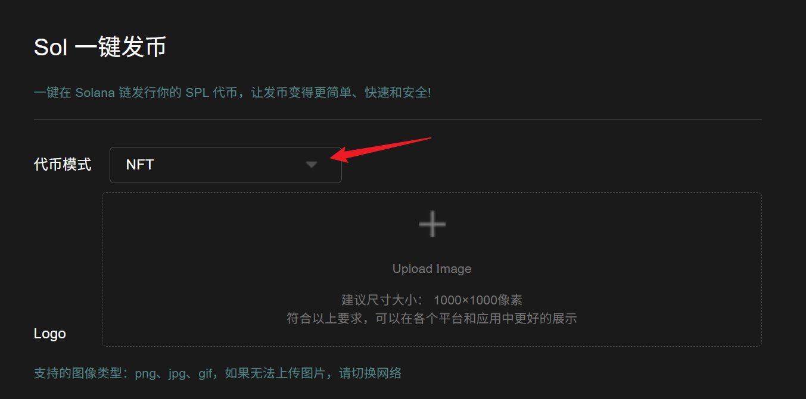
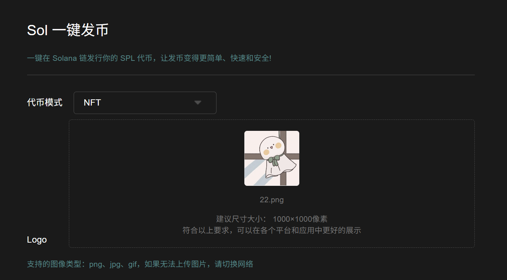
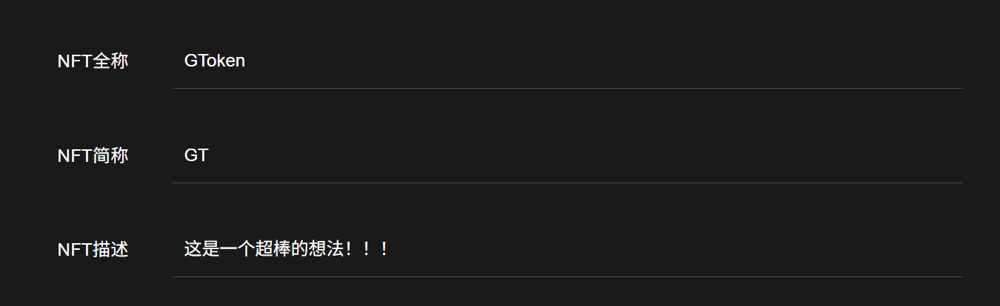
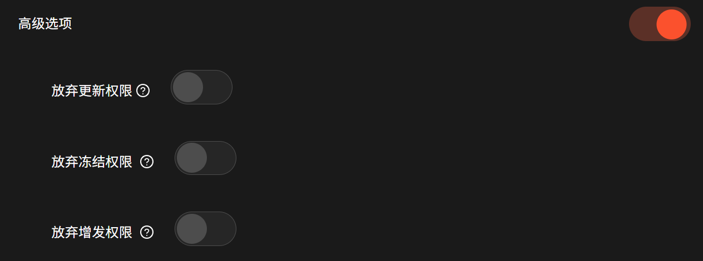
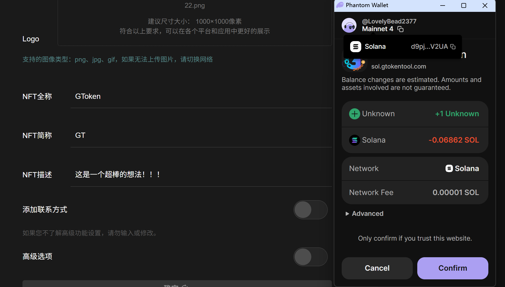
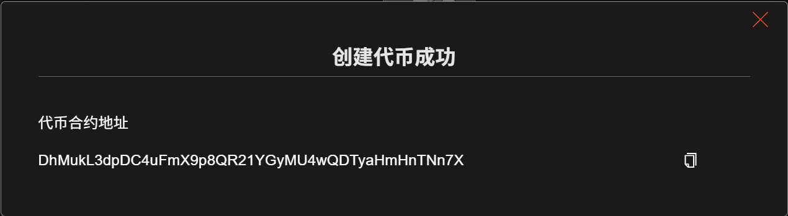
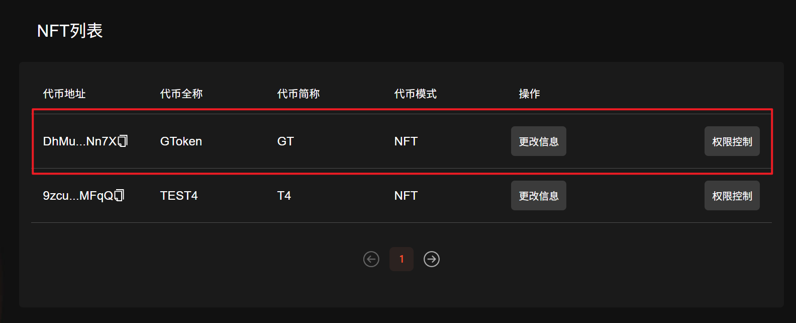
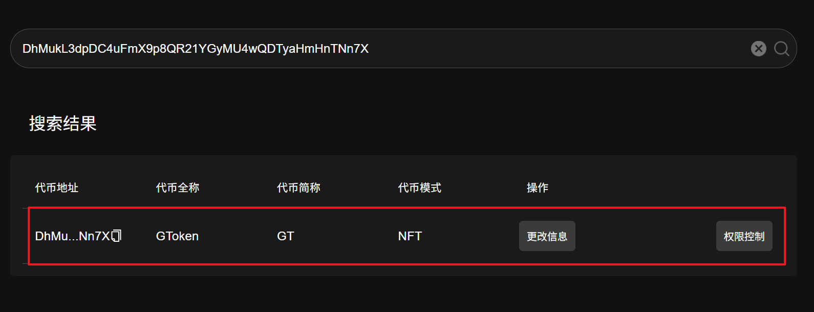
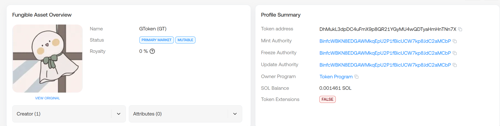

# Solana NFT创建教程

## 📌 核心摘要

* **功能定位**：**Solana 链上 NFT（非同质化代币）快速铸造教程**。作为工具集的另一大核心功能，它允许用户将图片、视频等数字资产上链，生成独一无二的 NFT。
* **核心卖点**：
  * **零代码门槛**：无需了解 Metaplex 协议或编写代码，通过可视化界面即可完成复杂的铸造流程。
  * **资产确权**：帮助用户轻松拥有链上数字藏品，支持自定义元数据。
* **适用场景**：
  * 数字艺术家发布作品。
  * 项目方创建 NFT 门票或会员卡。
  * 普通用户尝试铸造属于自己的链上纪念品。

## 视频教程



## Solana创建NFT准备事项

1.Solana 钱包（[幻影钱包Phantom安装教程](https://docs.gtokentool.com/solana/auxiliary-tutorial/phantom-wallet-installation)）

2.钱包内最少准备0.07个SOL

3.准备好翻墙软件（VPN/加速器），保证网络通畅

4.发币Logo和相关信息

5.手机Solana发币也使用Phantom钱包或欧易web3钱包，不要用TP钱包，TP不能传logo

## 创建NFT流程

### 1. 连接幻影钱包

打开发币链接地址：[https://sol.gtokentool.com/zh-CN/Token/createToken](https://sol.gtokentool.com/zh-CN/Token/createToken)

点击连接钱包，并选择 Main 网络节点，这里使用测试网演示。

<figure><figcaption>
连接钱包并选择网络
</figcaption></figure>

### 2. 选择代币模式

点击下拉框，选择NFT模式。

<figure><figcaption>
选择NFT模式
</figcaption></figure>

### 3. 上传logo

<figure><figcaption>
上传Logo
</figcaption></figure>

### 4. 填写NFT信息

<figure><figcaption>
填写NFT信息
</figcaption></figure>

**NFT全称：**&#x6700;大不能超过32个字符。

**NFT简称：**&#x6700;大不能超过10个字符。

**NFT描述：**&#x586B;写你的NFT描述。

### 5. 填写选填部分

<figure><figcaption>
添加联系方式
</figcaption></figure>

**官网：**&#x5B98;网链接地址。

**电报：**&#x7535;报（Telegram）链接地址。

**推特：**&#x63A8;特（Twitter）链接地址。

**Discord:** Discord链接地址。

### 6. 设置高级选项

<figure><figcaption>
权限设置
</figcaption></figure>

代币更新权限、冻结权限、增发权限设置。

* **放弃更新权限：**“放弃更新权限”意味着您将无法修改令牌元数据。
* **放弃冻结权限：**&#x5982;果您放弃冻结权限，则意味着您将无法冻结持有者钱包中的代币。
* **放弃增发权限：**“放弃增发权限”对于让投资者感到更加安全和作为代币的成功是必要的。如果您放弃铸币权，则意味着您将无法铸造更多代币供应。

### 7.点击"Confirm"，创建代币

确认信息之后，点击"`Confirm`"按钮，之后会跳出钱包提示，点击"`Confirm`"支付费用，即可完成创建。

<figure><figcaption>
钱包确认
</figcaption></figure>

### 8. 查看NFT信息

成功后，这里会显示代币合约地址。你可以复制代币地址。

<figure><figcaption>
代币合约地址显示
</figcaption></figure>

创建成功后可以前往`管理代币`，在NFT列表下可以找到刚才创建的代币，可以进行进一步的Solana发币管理。或者直接在上方的搜索框内输入代币地址进行查找。

<figure><figcaption>
代币列表
</figcaption></figure>

<figure><figcaption>
代币查询结果
</figcaption></figure>

或者前往SOL区块链浏览器（[https://solscan.io](https://solscan.io)）去查看代币信息。

<figure><figcaption>
区块链浏览器代币信息显示
</figcaption></figure>

## ❓常见问题 FAQ

### Q: Solana上发币需要合约开源吗？

**A:** 不需要。Solana上的代币是通过官方发布好的合约创建出来的账户，所有的SPL代币用的都是一个合约。

### Q: 为什么发币之后钱包显示未知代币/不显示logo?

**A:** Phantom钱包有时候信息有延迟，需要一段时间才能显示logo和代币名称等信息。可以在Solana浏览器上搜索代币信息进行查看。

### Q: 上传logo需要收费吗？

**A:** 不需要，平台采用的是IPFS存储方案，免费上传。

### 🤝 连接 GTokenTool 

* **💬 Telegram社群**：[点击加入官方群组](https://t.me/gtokentool)
* **🐦 Twitter (X)**：[关注我们获取最新动态](https://x.com/gtokentool)
* **📚 官方文档**：[查看 Gitbook 文档](https://docs.gtokentool.com/)
* **💻 开源代码**：[访问 GitHub 仓库](https://github.com/Gtokentool/docs/blob/master/SUMMARY.md)
* **📺 视频教程**：[订阅 YouTube 频道](https://www.youtube.com/@GTokenTool)

> ⚠️ 风险提示与免责声明
>
> GTokenTool 保留随时全权酌情因任何理由修改、变更或取消此公告的权利，无需事先通知。
>
> 以上信息内容仅供参考，GTokenTool 对本平台上的任何虚拟资产、产品或促销活动不做任何推荐或保证。虚拟资产的价格波动很大，投资交易虚拟资产将面临巨大风险。**请谨慎投资。**
