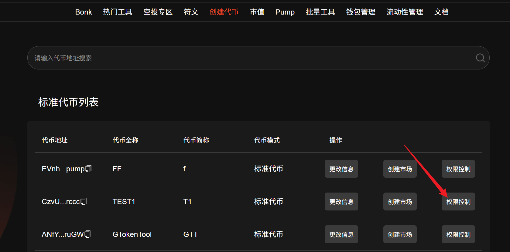
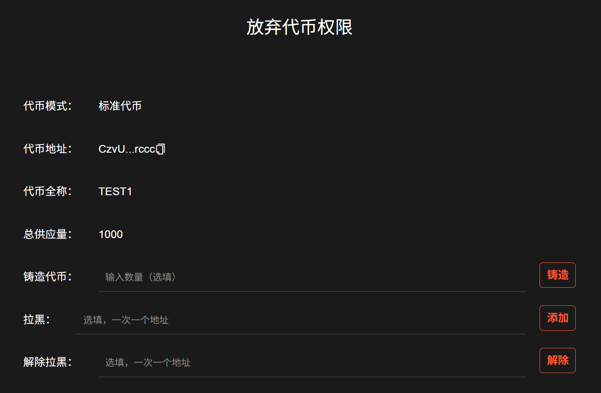
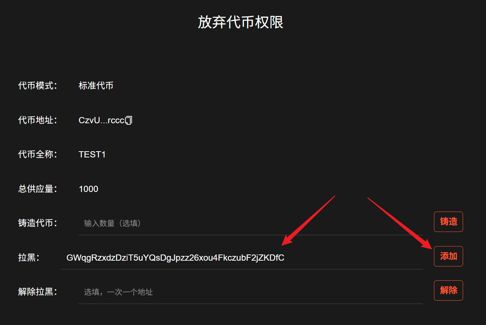
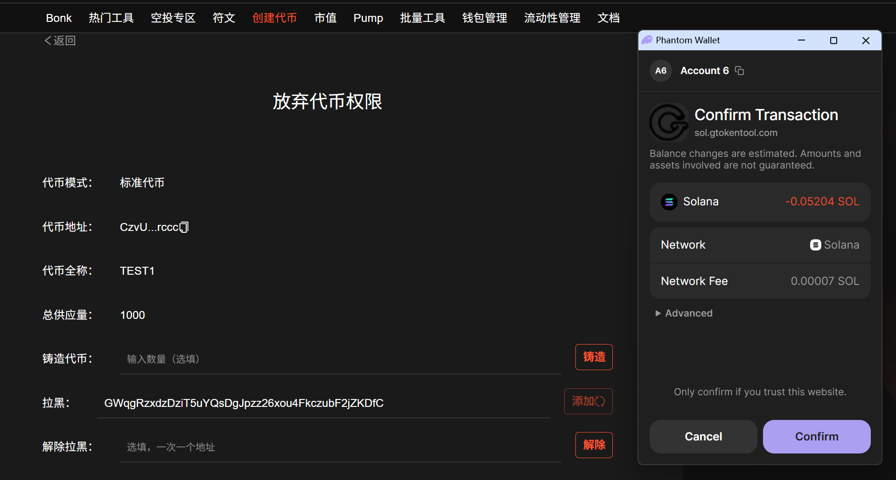
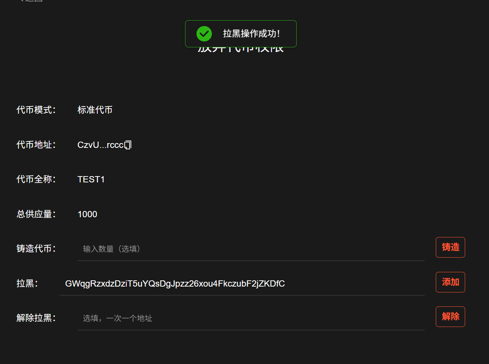
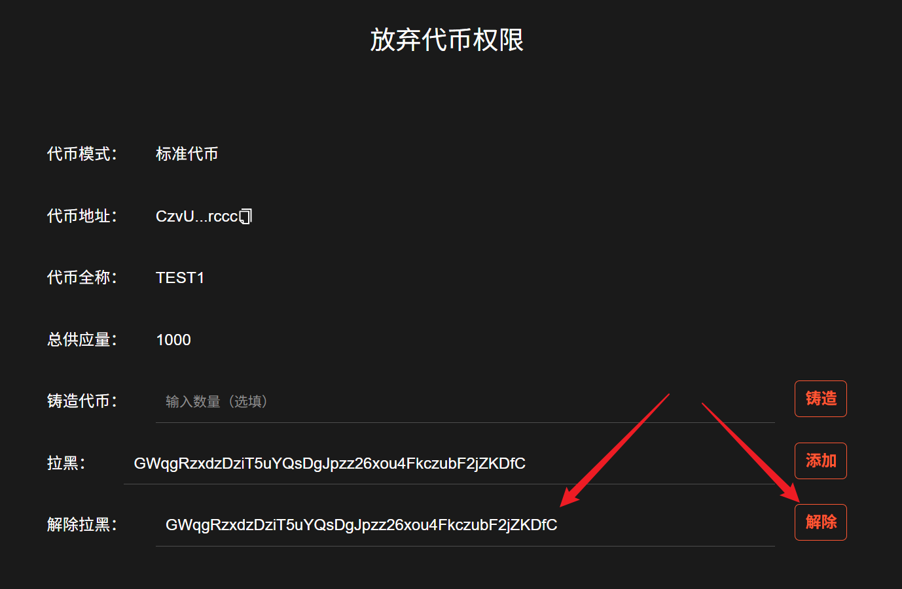
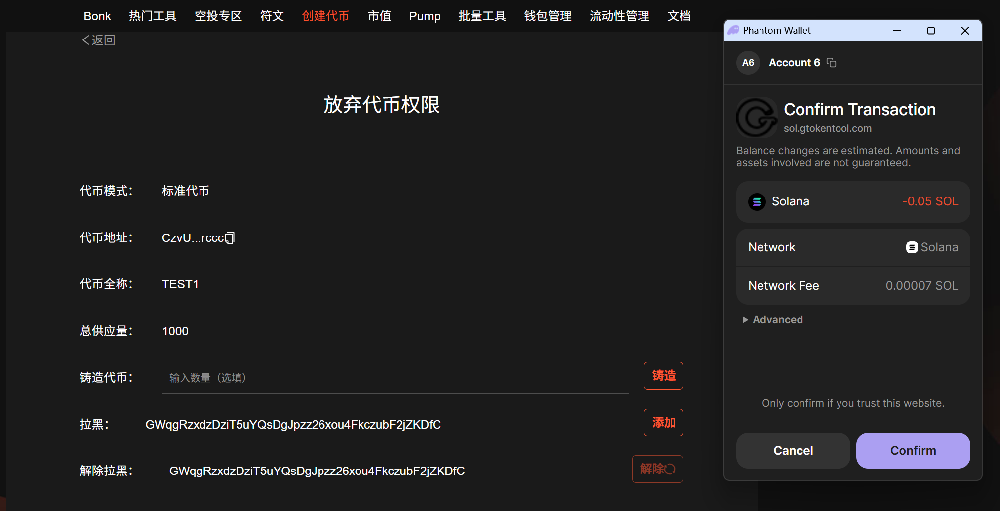
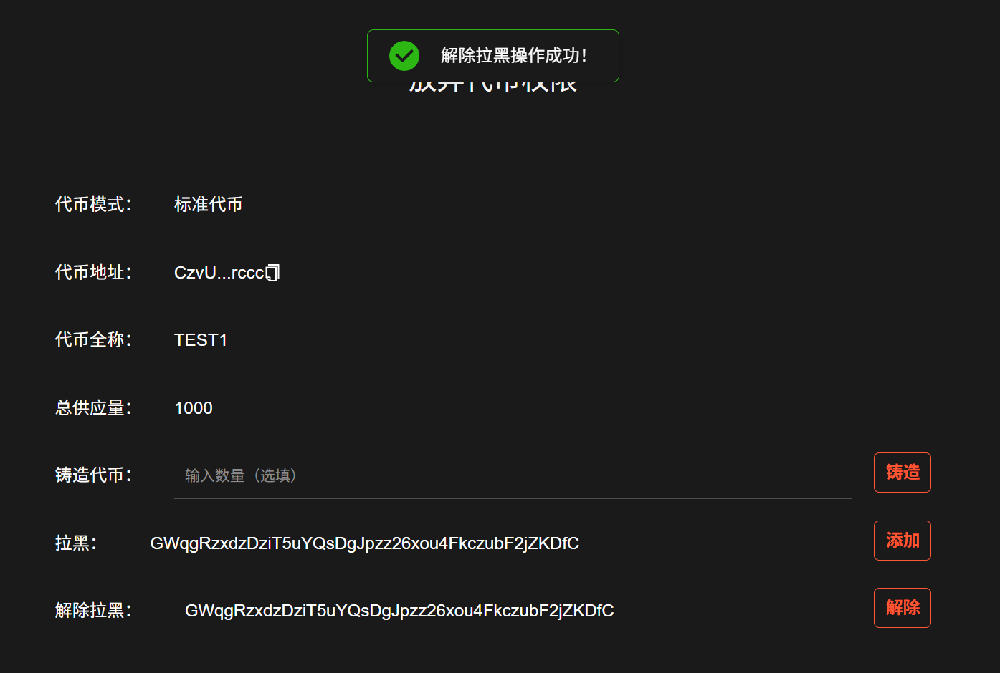

# Solana拉黑（冻结）钱包地址教程

## 权限管理操作步骤

### 1. 进入“权限控制”

进入代币列表页面：[https://sol.gtokentool.com/zh-CN/Token/management](https://sol.gtokentool.com/zh-CN/Token/management)

连接好钱包，选择 Main 网络节点，这里使用测试网演示。

<figure><figcaption></figcaption></figure>

选择你要操作的代币，点击“`权限控制`”进入权限控制页面。

<figure><figcaption></figcaption></figure>

### 2. 查看页面信息

**代币模式**：标准代币

**代币全称**：TEST1

**总供应量**：1000

确认是否有拉黑的权限。

<figure><figcaption></figcaption></figure>

### 3. 进行拉黑操作

**拉黑**：可以冻结任何一个地址，使其不能转账及卖出，输入钱包地址且一次只能输入一个地址，点击右侧“`添加`”就会把该钱包地址拉入黑名单。

<figure><figcaption></figcaption></figure>

点击“`添加`”后，会弹出钱包交易。

<figure><figcaption></figcaption></figure>

交易成功会弹出提示“拉黑操作成功！”。

<figure><figcaption></figcaption></figure>

### 4. 解除拉黑操作

**解除拉黑**：输入之前拉黑的钱包地址且一次只能输入一个地址，点击右侧“`解除`”之前拉黑的钱包解除黑名单。

<figure><figcaption></figcaption></figure>

点击“`解除`”后，会弹出钱包交易。

<figure><figcaption></figcaption></figure>

交易成功会弹出提示“解除拉黑操作成功！”。

<figure><figcaption></figcaption></figure>

[_**GTokenTool | 创建代币、批量空投和做市机器人等Solana工具集**_](https://sol.gtokentool.com)

**安全、开源，给Solana用户带来最便利的一站式体验。**

GTokenTool社群:

Telegram：[**https://t.me/gtokentool**](https://t.me/gtokentool)

Twitter:  [**https://x.com/gtokentool**](https://x.com/gtokentool)

Gitbook：[**https://docs.gtokentool.com/**](https://docs.gtokentool.com/)

Github：[**https://github.com/Gtokentool/docs/blob/master/SUMMARY.md**](https://github.com/Gtokentool/docs/blob/master/SUMMARY.md)

YouTube：[**https://www.youtube.com/@GTokenTool**](https://www.youtube.com/@GTokenTool)\
\
\
\
<mark style="color:purple;background-color:orange;">**GTokenTool**</mark>_<mark style="color:purple;background-color:orange;">保留随时全权酌情因任何理由修改、变更或取消此公告的权利，无需事先通知。以上信息内容仅供参考，GTokenTool对本平台上的任何虚拟资产、产品或促销活动不做任何推荐或保证。虚拟资产的价格波动很大，投资交易虚拟资产将面临巨大风险。请谨慎投资。</mark>_
