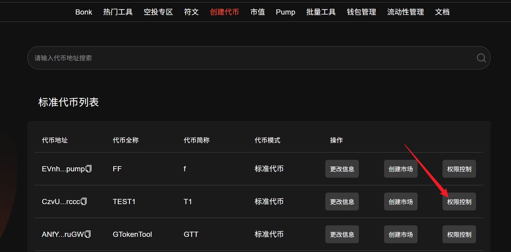
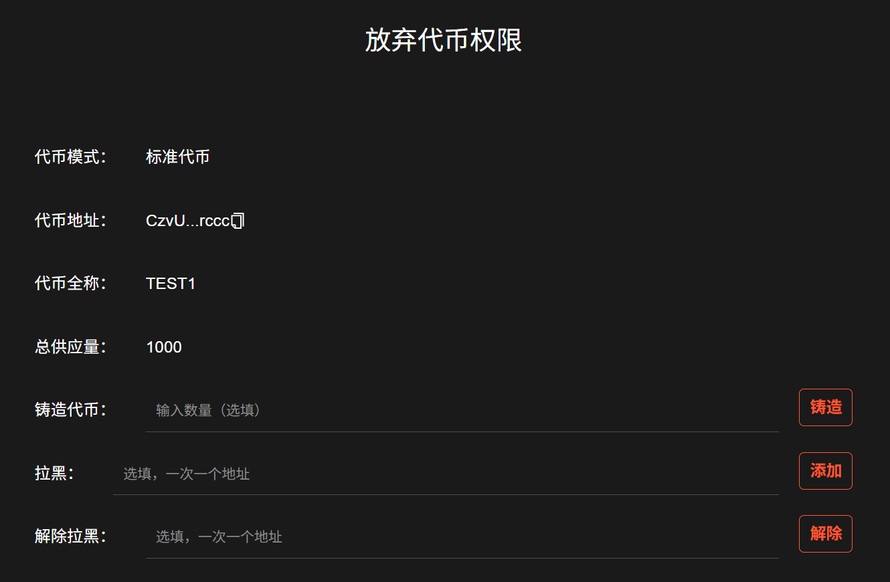
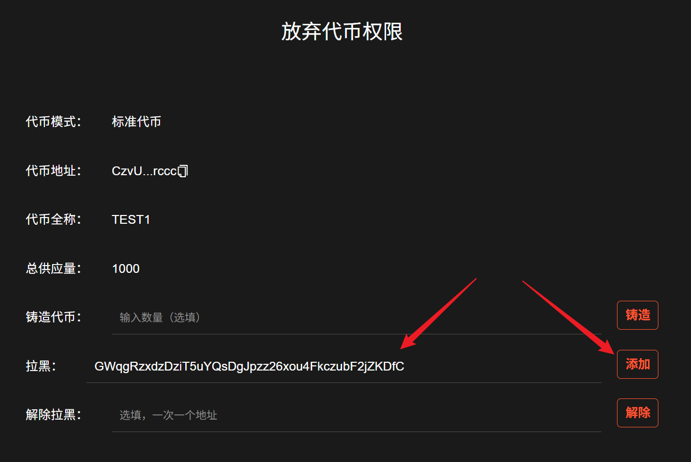
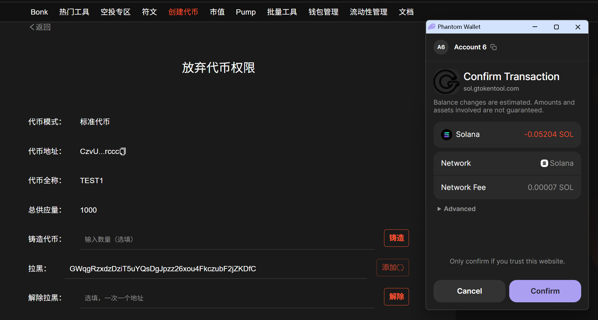
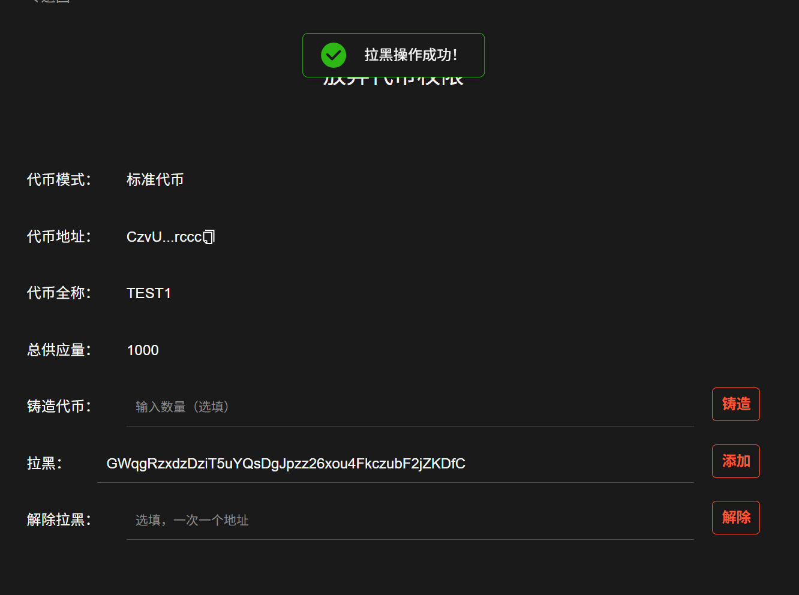
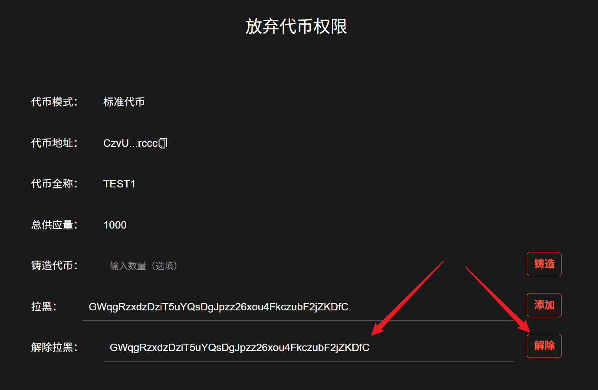
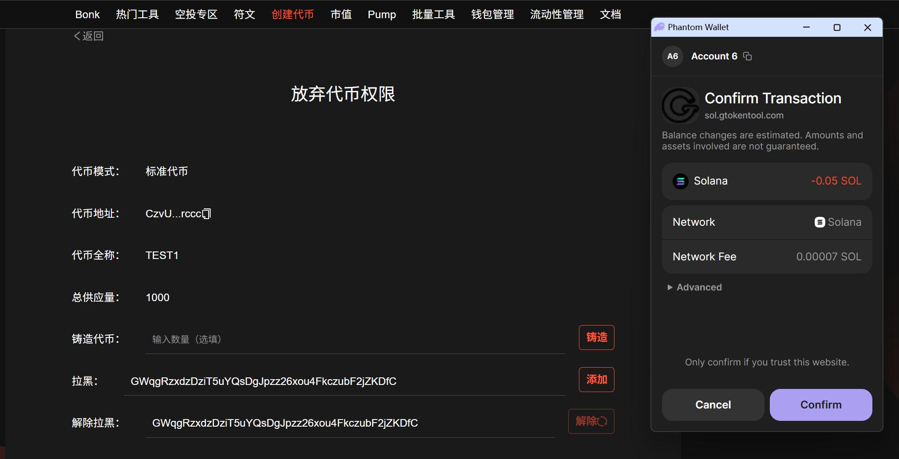
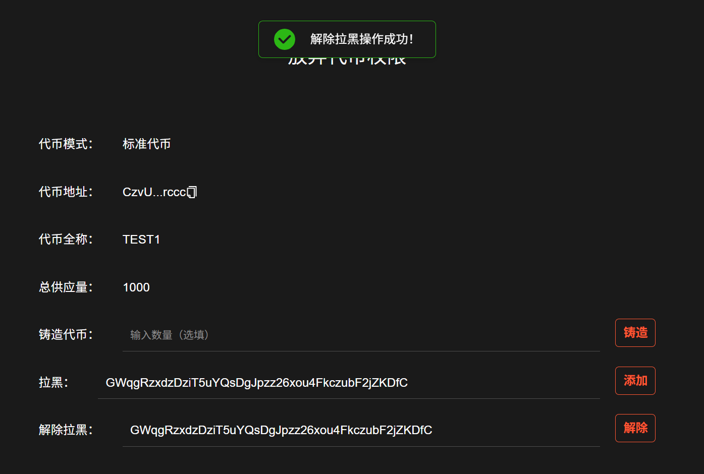

# Solana拉黑（冻结）钱包地址教程

## 📌核心摘要

* **功能定位**：Solana 代币**定向风控与合规工具**。它允许项目方利用“冻结权限”，强制锁定特定用户的代币账户，使其无法进行转账或交易，从而实现链上“拉黑”效果。
* **核心价值（精准打击）**：
  * **资产保全**：当发生黑客攻击或盗币事件时，可迅速冻结被盗资产，阻断黑客的洗钱路径，防止资产被转移。
  * **合规制裁**：用于制裁恶意用户、机器人或受制裁实体，阻止其继续持有或交易项目代币，维护社区生态健康。
  * **市场维护**：防止特定大户（巨鲸）砸盘或进行恶意操纵，保护代币价格稳定。
* **操作前置条件**：
  * **关键权限**：创建代币时必须**保留“冻结权限”**。若权限已放弃，则无法执行此操作。
  * **目标锁定**：需获取目标用户的**代币账户地址**（而非钱包主地址），这是执行冻结的直接对象。
  * **资金准备**：操作钱包内需有足够的 SOL 用于支付链上交易 Gas 费。

## 权限管理操作步骤

### 1. 进入“权限控制”

进入代币列表页面：[https://sol.gtokentool.com/zh-CN/Token/management](https://sol.gtokentool.com/zh-CN/Token/management)

连接好钱包，选择 Main 网络节点，这里使用测试网演示。

<figure><figcaption>
连接钱包并选择网络
</figcaption></figure>

选择你要操作的代币，点击“`权限控制`”进入权限控制页面。

<figure><figcaption>
选择代币进行权限控制
</figcaption></figure>

### 2. 查看页面信息

**代币模式**：标准代币

**代币全称**：TEST1

**总供应量**：1000

确认是否有拉黑的权限。

<figure><figcaption>
代币信息
</figcaption></figure>

### 3. 进行拉黑操作

**拉黑**：可以冻结任何一个地址，使其不能转账及卖出，输入钱包地址且一次只能输入一个地址，点击右侧“`添加`”就会把该钱包地址拉入黑名单。

<figure><figcaption>
拉黑地址
</figcaption></figure>

点击“`添加`”后，会弹出钱包交易。

<figure><figcaption>
钱包确认
</figcaption></figure>

交易成功会弹出提示“拉黑操作成功！”。

<figure><figcaption>
拉黑成功提示
</figcaption></figure>

### 4. 解除拉黑操作

**解除拉黑**：输入之前拉黑的钱包地址且一次只能输入一个地址，点击右侧“`解除`”之前拉黑的钱包解除黑名单。

<figure><figcaption>
解除拉黑
</figcaption></figure>

点击“`解除`”后，会弹出钱包交易。

<figure><figcaption>
钱包确认
</figcaption></figure>

交易成功会弹出提示“解除拉黑操作成功！”。

<figure><figcaption>
解除拉黑成功提示
</figcaption></figure>

## ❓常见问题 FAQ

### Q: 什么是拉黑（冻结）功能？

**A:** 冻结账户是指暂时限制某个钱包地址对代币的转账和交易权限。

### Q: 谁有权限冻结账户？

**A:** 只有持有代币 Freeze 权限的账户才能执行冻结操作。

### Q: 被冻结的账户还能接收代币吗？

**A:** 可以，冻结只限制转出和交易，不影响接收。

### Q: 冻结账户后如何解冻？

**A:** 持有 Freeze 权限的账户可以随时在这个功能页面发起解冻操作。

### Q: 冻结账户会影响代币的正常流通吗？

**A:** 只影响被冻结的账户，不会影响整体代币流通。

### 🤝 连接 GTokenTool 

* **💬 Telegram社群**：[点击加入官方群组](https://t.me/gtokentool)
* **🐦 Twitter (X)**：[关注我们获取最新动态](https://x.com/gtokentool)
* **📚 官方文档**：[查看 Gitbook 文档](https://docs.gtokentool.com/)
* **💻 开源代码**：[访问 GitHub 仓库](https://github.com/Gtokentool/docs/blob/master/SUMMARY.md)
* **📺 视频教程**：[订阅 YouTube 频道](https://www.youtube.com/@GTokenTool)

> ⚠️ 风险提示与免责声明
>
> GTokenTool 保留随时全权酌情因任何理由修改、变更或取消此公告的权利，无需事先通知。
>
> 以上信息内容仅供参考，GTokenTool 对本平台上的任何虚拟资产、产品或促销活动不做任何推荐或保证。虚拟资产的价格波动很大，投资交易虚拟资产将面临巨大风险。**请谨慎投资。**
