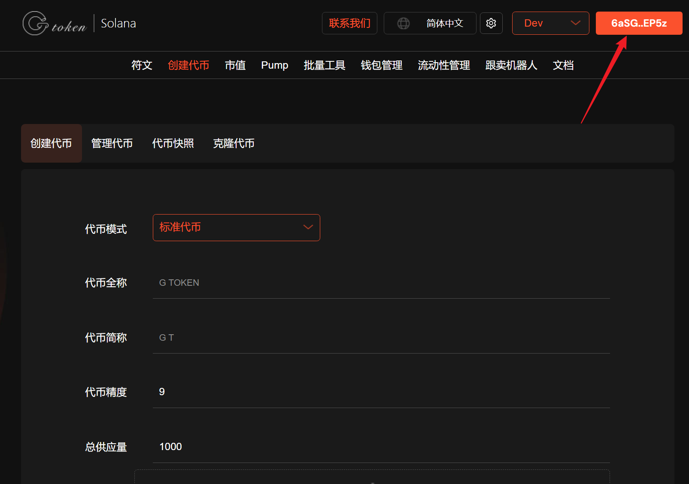
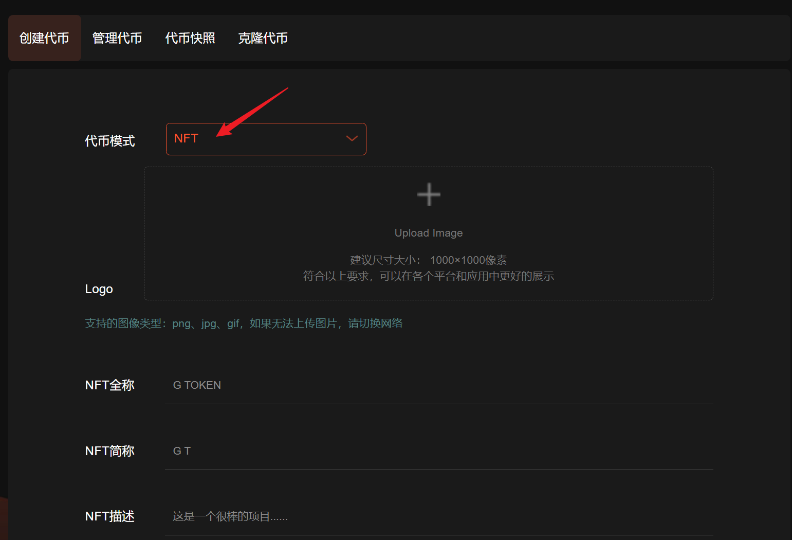

# 如何在Solana上创建NFT

## Solana创建NFT准备事项

1.Solana 钱包（[幻影钱包Phantom安装教程](https://docs.gtokentool.com/solana/auxiliary-tutorial/phantom-wallet-installation)）

2.钱包内最少准备0.11个SOL

3.准备好翻墙软件（VPN/加速器），保证网络通畅

4.发币Logo和相关信息

5.手机Solana发币也使用Phantom钱包或欧易web3钱包，不要用TP钱包，TP不能传logo

### 1. 连接幻影钱包

打开发币链接地址：[https://sol.gtokentool.com/zh-CN/Token/createToken](https://sol.gtokentool.com/zh-CN/Token/createToken)点击连接钱包，并选择 Main 网络节点，这里使用测试网演示。

<figure><figcaption></figcaption></figure>

点击"连接钱包"后会弹出钱包选择页面，点击幻影钱包（Phantom），即可连接钱包钱包里面需要有0.11SOL用作支付。

<figure><figcaption></figcaption></figure>

连接后可以看到右上角显示的钱包地址。

<figure><figcaption></figcaption></figure>

### 2. 选择代币模式

点击下拉框，选择NFT模式。

<figure><figcaption></figcaption></figure>

### 3. 上传logo

<figure><figcaption></figcaption></figure>

### 4. 填写NFT信息

<figure><figcaption></figcaption></figure>

**NFT全称：**&#x6700;大不能超过32个字符。

**NFT简称：**&#x6700;大不能超过10个字符。

**NFT描述：**&#x586B;写你的NFT描述。

### 5. 填写选填部分

<figure><figcaption></figcaption></figure>

**官网：**&#x5B98;网链接地址。

**电报：**&#x7535;报（Telegram）链接地址。

**推特：**&#x63A8;特（Twitter）链接地址。

**Discord:** Discord链接地址。

**标签：**&#x6700;多添加5个标签，通过输入后点击"添加"按钮来进行添加标签，觉得不合适的标签也可以删除。

### 6. 设置高级选项

<figure><figcaption></figcaption></figure>

**放弃更新权：**“放弃更新权”意味着您将无法修改令牌元数据。

**放弃冻结权：**&#x5982;果您放弃冻结权限，则意味着您将无法冻结持有者钱包中的代币。

### 7. 点击“确定”

成功后，这里会显示代币合约地址。你可以复制代币地址。

<figure><figcaption></figcaption></figure>

[_**GTokenTool | 创建代币、批量空投和做市机器人等Solana工具集**_](https://sol.gtokentool.com)

**安全、开源，给Solana用户带来最便利的一站式体验。**

GTokenTool社群:

Telegram：[**https://t.me/gtokentool**](https://t.me/gtokentool)

Twitter:  [**https://x.com/gtokentool**](https://x.com/gtokentool)

Gitbook：[**https://docs.gtokentool.com/**](https://docs.gtokentool.com/)

Github：[**https://github.com/Gtokentool/docs/blob/master/SUMMARY.md**](https://github.com/Gtokentool/docs/blob/master/SUMMARY.md)

YouTube：[**https://www.youtube.com/@GTokenTool**](https://www.youtube.com/@GTokenTool)\
\
\
\
&#xNAN;_<mark style="background-color:yellow;">GTokenTool</mark><mark style="color:purple;background-color:yellow;">保留随时全权酌情因任何理由修改、变更或取消此公告的权利，无需事先通知。以上信息内容仅供参考，GTokenTool对本平台上的任何虚拟资产、产品或促销活动不做任何推荐或保证。虚拟资产的价格波动很大，投资交易虚拟资产将面临巨大风险。请谨慎投资。</mark>_
