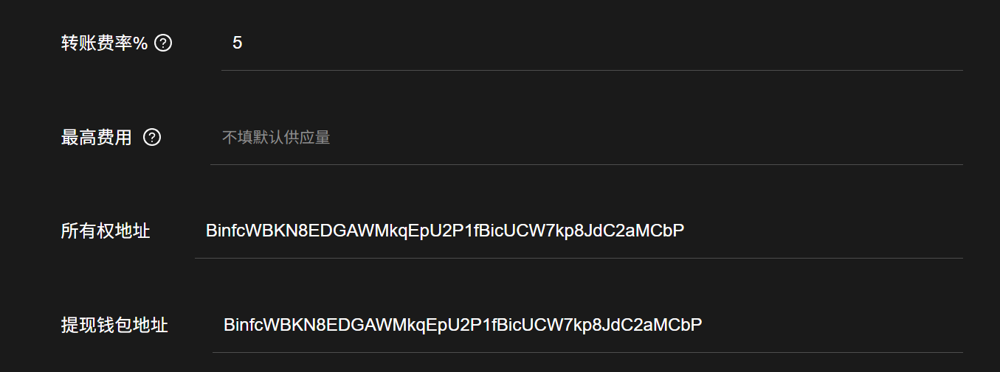

# Solana SPL Token 2022手续费代币创建教程

Token2022代币说明文档：[https://spl.solana.com/token-2022](https://spl.solana.com/token-2022)

## 视频演示



## 准备事项

1.准备设备，一台电脑或手机

2.Solana 钱包（[幻影钱包Phantom安装教程](https://docs.gtokentool.com/solana/auxiliary-tutorial/phantom-wallet-installation)）

3.钱包内最少准备0.13个SOL

4.准备好翻墙软件（VPN/加速器），保证网络通畅

## 操作步骤

### 1.连接幻影钱包Phantom

打开发币链接地址：[https://sol.gtokentool.com/zh-CN/Token/createToken](https://sol.gtokentool.com/zh-CN/Token/createToken)

点击连接钱包，并选择 Main 网络节点，这里使用测试网演示。

<figure><figcaption></figcaption></figure>

### 2.填写代币相关信息并上传LOGO文件

完成钱包连接之后，先选择代币模式，接下来就是填写代币信息，具体如下：

<figure><figcaption></figcaption></figure>

**代币名称：**&#x4EE3;币的名称信息（如GTOKENTOOL），支持英文、中文以及中英文混合，最多32个字符。

**代币简称：**&#x4EE3;币的简称信息（如GTOKEN），支持英文、中文以及中英文混合，最多10个字符。

**代币精度：**&#x4EE3;币的精度位数，默认为9，精度与你能填写的最大总供应量有关。

**总供应量：**&#x4EE3;币的总供应量，当精度为9时，总供应量不能超过100亿；当精度为8时，总供应量不能超过1000亿，以此类推。

<figure><figcaption></figcaption></figure>

**简介（选填）：**&#x586B;写你的代币简介。

**Logo：**&#x4EE3;币头像，可在钱包中显示logo代币图片（上传图片大小最大不超过2M）。

<figure><figcaption></figcaption></figure>

**转账费率：**&#x6BCF;次交易或转账所需的手续费率，单位为百分比。

**最高费用：**&#x5355;笔转账或交易时的最大手续费用上限（不填默认为供应量）。

**所有权地址：**&#x63A7;制此代币的所有权限，默认为当前连接的钱包地址。

**提现钱包地址：**&#x4EE3;币所产生的手续费，有权限进行提现的地址，默认为当前连接的钱包地址。

### 3.添加联系方式（选填）

如果你想添加联系方式等，可以点击打开“`添加联系方式`”按钮，选择需要填写的内容进行填写。

<figure><figcaption></figcaption></figure>

**官网：**&#x5B98;网链接地址。

**电报：**&#x7535;报（Telegram）链接地址。

**推特：**&#x63A8;特（Twitter）链接地址。

**Discord:** Discord链接地址。

### 4. 高级设置填写

**提示：如果您不了解高级功能设置，请勿输入或修改。**

<figure><figcaption></figcaption></figure>

**权限委托**：将您的代币权限委托给另一个地址，该地址将能够燃烧或转移任意数量的代币。

**计息利率%(0.00 - 100)**：为您的代币设定利率，模仿债券等现实世界的资产，并随时获得利息。需要先设置交易费率。

**不可转账（灵魂绑定代币）**：默认关闭，使代币不可转让给其他地址，通常适用于独特成就等类型项目。

### 5. 高级选项设置

如果您想要自定义代币合约，可以使用靓号合约功能创建代币。

<figure><figcaption></figcaption></figure>

代币更新权限、冻结权限、增发权限设置。

* **放弃更新权限：**“放弃更新权限”意味着您将无法修改令牌元数据。
* **放弃冻结权限：**&#x5982;果您放弃冻结权限，则意味着您将无法冻结持有者钱包中的代币。
* **放弃增发权限：**“放弃增发权限”对于让投资者感到更加安全和作为代币的成功是必要的。如果您放弃铸币权，则意味着您将无法铸造更多代币供应。

<figure><figcaption></figcaption></figure>

### 6.点击"确定"，创建代币

确认信息之后，点击"`确定`"按钮，之后会跳出钱包提示，点击去"`Confirm`"支付费用，即可完成创建。

<figure><figcaption></figcaption></figure>

### 5.查看代币

创建成功后会弹出一个提示框提示创建成功，并展示你的代币地址。

<figure><figcaption></figcaption></figure>

创建成功后可以前往`管理代币`，在手续费代币列表下可以找到刚才创建的代币，可以进行进一步的Solana发币管理。或者直接在上方的搜索框内输入代币地址进行查找。

<figure><figcaption></figcaption></figure>

<figure><figcaption></figcaption></figure>

或者前往SOL区块链浏览器（[https://solscan.io](https://solscan.io)）去查看代币信息。

<figure><figcaption></figcaption></figure>

如有不明白或者不清楚的地方，请加入官方电报群：[https://t.me/gtokentool](https://t.me/gtokentool)

## 常见问题

### 1.Solana上发币需要合约开源吗？

答：不需要。Solana上的代币是通过官方发布好的合约创建出来的账户，所有的SPL代币用的都是一个合约。

### 2.为什么发币之后钱包显示未知代币/不显示logo?

答：Phantom钱包有时候信息有延迟，需要一段时间才能显示logo和代币名称等信息。可以在Solana浏览器上搜索代币信息进行查看。

### 3.上传logo需要收费吗？

答：不需要，平台采用的是IPFS存储方案，免费上传。

[_**GTokenTool | 创建代币、批量空投和做市机器人等Solana工具集**_](https://sol.gtokentool.com)

**安全、开源，给Solana用户带来最便利的一站式体验。**

GTokenTool社群:

Telegram：[**https://t.me/gtokentool**](https://t.me/gtokentool)

Twitter:  [**https://x.com/gtokentool**](https://x.com/gtokentool)

Gitbook：[**https://docs.gtokentool.com/**](https://docs.gtokentool.com/)

Github：[**https://github.com/Gtokentool/docs/blob/master/SUMMARY.md**](https://github.com/Gtokentool/docs/blob/master/SUMMARY.md)

YouTube：[**https://www.youtube.com/@GTokenTool**](https://www.youtube.com/@GTokenTool)\
\
\
\
<mark style="color:purple;background-color:orange;">**GTokenTool**</mark>_<mark style="color:purple;background-color:orange;">保留随时全权酌情因任何理由修改、变更或取消此公告的权利，无需事先通知。以上信息内容仅供参考，GTokenTool对本平台上的任何虚拟资产、产品或促销活动不做任何推荐或保证。虚拟资产的价格波动很大，投资交易虚拟资产将面临巨大风险。请谨慎投资。</mark>_
