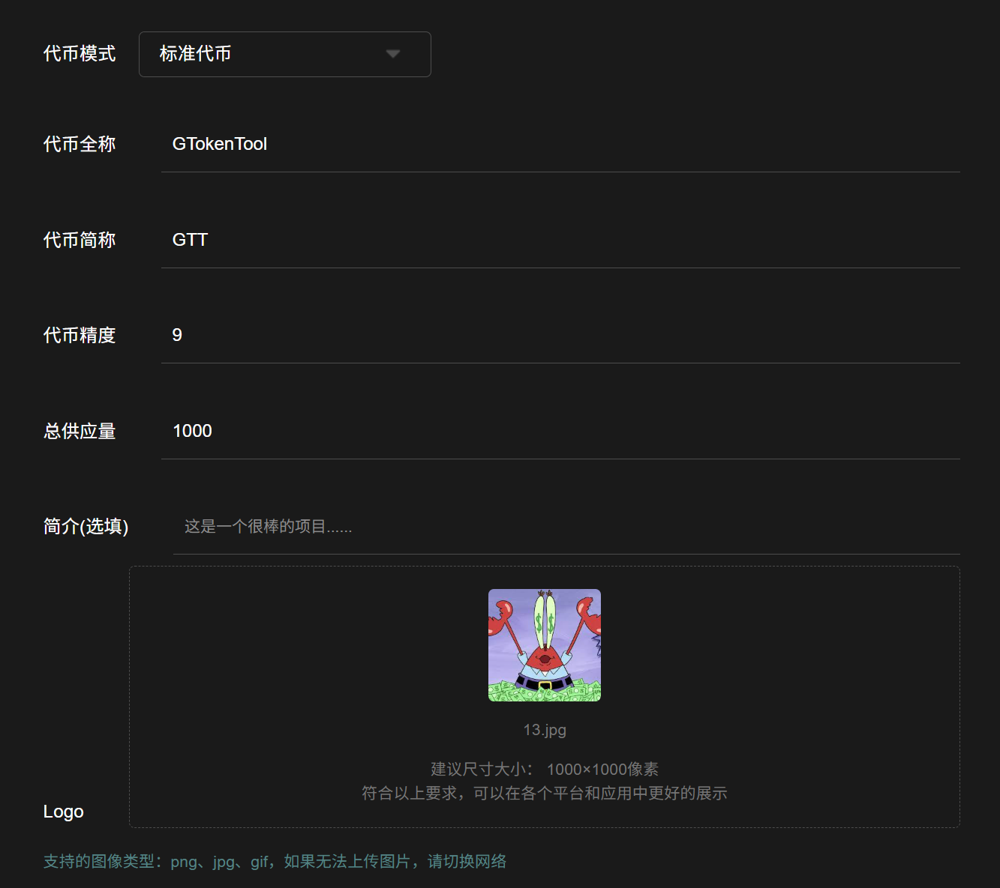
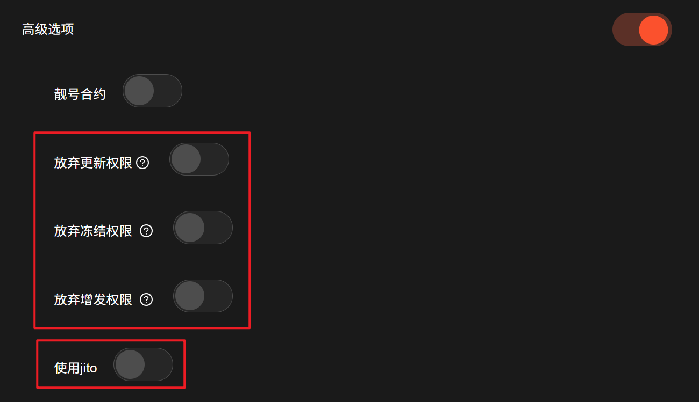
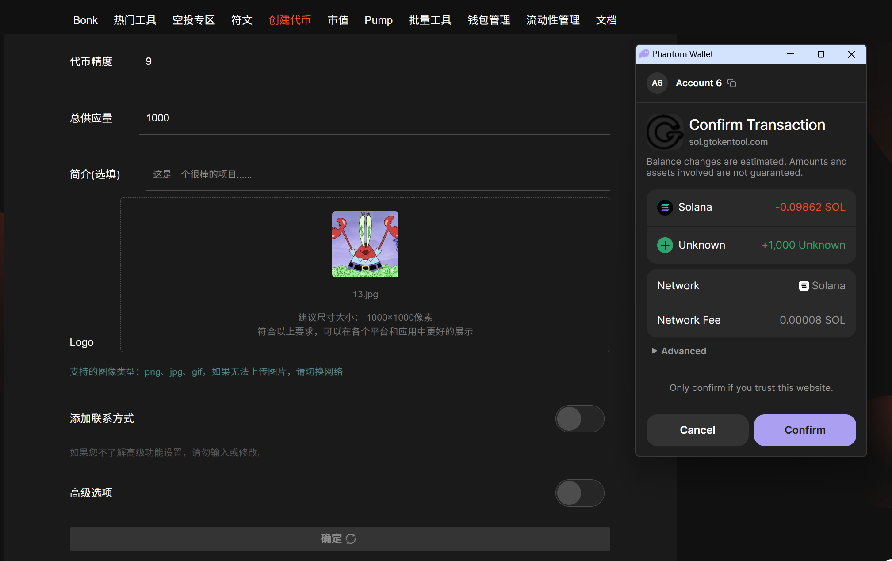
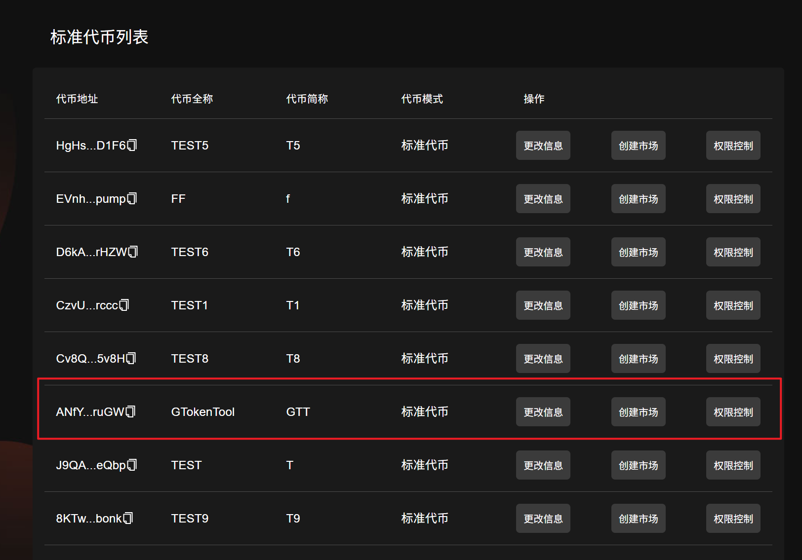
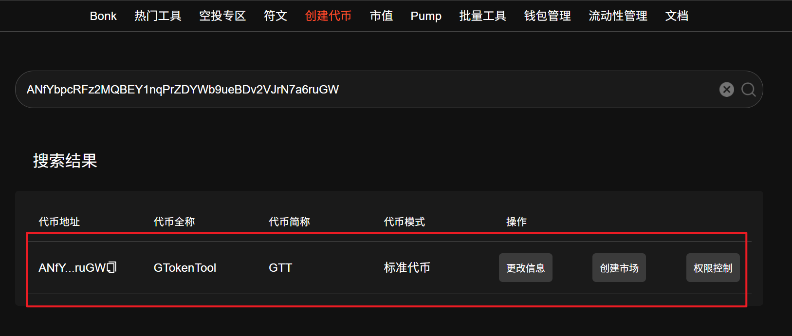
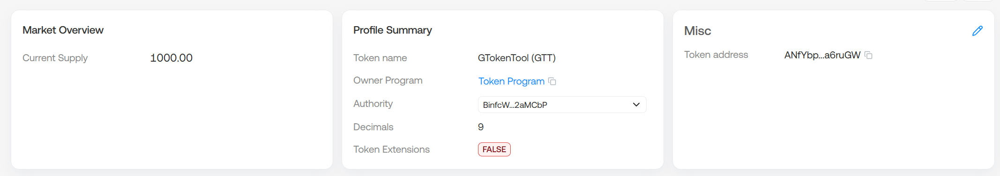

# 🪙 Solana一键发币教程（可生成靓号）

[_<mark style="color:orange;">GTokenTool-Solana工具集</mark>_](https://sol.gtokentool.com)

Solana 链上近期热度持续高升，很多用户都想尝试在 Solana 链上发行属于自己的代币，但是发币需要了解相关代码逻辑，门槛较高。[GTokenTool](https://www.gtokentool.com)实现了可视化的操作页面，支持用户在 Solana上轻松创建和管理代币。本文将详细介绍如何在 GTokenTool 上1分钟创建您的专属SOL发币流程。

## Solana发币视频演示



## 如何使用 Solana 代币创建工具 

1. 连接您的 Solana 钱包
2. 输入代币全称和简称
3. 上传代币的Logo图片（建议正方形＞200 像素）
4. 设置代币精度（小数位数）和总发行量
5. 填写代币描述
6. 代币元数据修改权限、冻结权限、铸币权限设置
7. 创建代币，签名交易并等待代币创建完成

## Solana发币准备事项

1.Solana 钱包（[幻影钱包Phantom安装教程](https://docs.gtokentool.com/solana/auxiliary-tutorial/phantom-wallet-installation)）

2.钱包内最少准备0.13个SOL

3.准备好翻墙软件（VPN/加速器），保证网络通畅

4.发币Logo和相关信息

5.手机Solana发币也使用Phantom钱包或欧易web3钱包，不要用TP钱包，TP不能传logo

## Solana发币教程步骤

### 1.连接幻影钱包Phantom

打开Solana发币链接地址：[https://sol.gtokentool.com/zh-CN/Token/createToken](https://sol.gtokentool.com/zh-CN/Token/createToken)

点击连接钱包，并选择 Main 网络节点，这里使用测试网演示。

<figure><figcaption></figcaption></figure>

### 2.填写Solana发币相关信息并上传LOGO文件

完成钱包连接之后，先选择发币模式，接下来就是填写Solana发币信息，具体如下：

<figure><figcaption></figcaption></figure>

**代币全称：**&#x53D1;币的名称信息（如GTokenTool），支持英文、中文以及中英文混合，最多32个字符。

**代币简称：**&#x53D1;币的简称信息（如GTT），支持英文、中文以及中英文混合，最多10个字符。

**代币精度：**&#x4EE3;币精度定义了代币可以分割到多小的单位。 SPL代币的最大精度是9，常见的精度设置是6（实用代币）和9（高精度应用），0精度通常用于NFT。可参考以下数值设置：

<figure><figcaption></figcaption></figure>

**总供应量：**&#x53D1;币的总供应量，当精度为9时，总供应量不能超过100亿；当精度为8时，总供应量不能超过1000亿，以此类推。

**简介（选填）：**&#x586B;写你的代币简介。

**Logo：**&#x53;olana发币的头像，可在钱包中显示logo代币图片（上传图片大小最大不超过2M）。

### 3.添加联系方式（选填）

如果你想添加联系方式等，可以点击打开“`添加联系方式`”按钮，选择需要填写的内容进行填写。

<figure><figcaption></figcaption></figure>

**官网：**&#x5B98;网链接地址。

**电报：**&#x7535;报（Telegram）链接地址。

**推特：**&#x63A8;特（Twitter）链接地址。

**Discord:** Discord链接地址。

### 4.高级选项设置（选填）

如果您想要自定义代币合约，可以使用靓号合约功能创建代币。

<figure><figcaption></figcaption></figure>

代币更新权限、冻结权限、增发权限设置。

* **放弃更新权限：**“放弃更新权限”意味着您将无法修改令牌元数据。
* **放弃冻结权限：**&#x5982;果您放弃冻结权限，则意味着您将无法冻结持有者钱包中的代币。
* **放弃增发权限：**“放弃增发权限”对于让投资者感到更加安全和作为代币的成功是必要的。如果您放弃铸币权，则意味着您将无法铸造更多代币供应。

**使用jito：**&#x5F53;网络节点卡顿的时候，可以使用jito，可以大大提高发币的成功率。

<figure><figcaption></figcaption></figure>

### 5.点击"Confirm"，创建Solana发币

确认信息之后，点击"`Confirm`"按钮，之后会跳出钱包提示，点击"`Confirm`"支付费用，即可完成创建。

<figure><figcaption></figcaption></figure>

### 6.查看Solana发币的信息

创建成功后会弹出一个提示框提示创建成功，并展示你的发币的地址。

<figure><figcaption></figcaption></figure>

创建成功后可以前往`管理代币`，在标准代币列表下可以找到刚才创建的代币，可以进行进一步的Solana发币管理。或者直接在上方的搜索框内输入代币地址进行查找。

<figure><figcaption></figcaption></figure>

<figure><figcaption></figcaption></figure>

或者前往SOL区块链浏览器（[https://solscan.io](https://solscan.io)）去查看发币信息。

<figure><figcaption></figcaption></figure>

此时，Solana发币的流程就算是基本创建完成了，大家可以根据需求去做池子，然后就能交易了。

* Raydium加池教程：[https://docs.gtokentool.com/solana/auxiliary-tutorial/raydium-v2-add-liquidity-remove-liquidity](https://docs.gtokentool.com/solana/auxiliary-tutorial/raydium-v2-add-liquidity-remove-liquidity)
* Orca加池教程：[https://docs.gtokentool.com/solana/auxiliary-tutorial/ocra-add-liquidity-remove-liquidity](https://docs.gtokentool.com/solana/auxiliary-tutorial/ocra-add-liquidity-remove-liquidity)
* Meteora加池教程：[https://docs.gtokentool.com/solana/auxiliary-tutorial/meteora-swap-add-liquidity-remove-liquidity](https://docs.gtokentool.com/solana/auxiliary-tutorial/meteora-swap-add-liquidity-remove-liquidity)

推荐产品：

[<mark style="color:orange;">**创建 OpenBook 市场 ID**</mark>](https://sol.gtokentool.com/zh-CN/liquidityManagement/createMarket)　　[<mark style="color:orange;">**创建流动性池**</mark>](https://sol.gtokentool.com/zh-CN/liquidityManagement/CreatePool)　　[<mark style="color:orange;">**批量转账**</mark>](https://sol.gtokentool.com/zh-CN/batchTool)

## Solana发币常见问题

### 1.Solana发币需要合约开源吗？

答：不需要。Solana上的代币是通过官方发布好的合约创建出来的账户，所有的SPL代币用的都是一个合约。

### 2.为什么发币之后钱包显示未知代币/不显示logo?

答：Phantom钱包有时候信息有延迟，需要一段时间才能显示logo和代币名称等信息。可以在Solana浏览器上搜索代币信息进行查看。

### 3.什么情况下丢弃权限？

答：如果需要在 Raydium 添加的代币需要放弃冻结和铸币权限，元数据修改权限可以自行选择丢弃，丢弃之后将不能修改元数据信息。

### 4.上传logo需要收费吗？

答：不需要，平台采用的是IPFS存储方案，免费上传。

### 5.如果你发现代币Logo不见了,可能是由于代币不符合要求

要让用户看到Logo必须在coingecko或Birdeye.so上列出令牌。

Phantom钱包会优先考虑效率和资源管理,因此并非所有代币都会显示其logo,尤其是如果代币是新代币，或TVL较低或资本化较低的话。

### 6.代币符号是什么？

代币符号是代币的简短标识，通常由几个大写字母组成，例如 SOL 或 USDC。

### 7.代币精度是什么，怎么填写？

代币精度定义了代币可以分割到多小的单位。SPL代币的最大精度是9，常见的精度设置是6（实用代币）和9（高精度应用），0精度通常用于NFT。

### 8.为什么要放弃元数据修改权？

放弃元数据修改权意味着一旦设置，代币的基本属性（如名称、符号、图像等）将无法更改。这通常用于增强项目的透明度和信任，显示项目方对代币和其未来计划的承诺。

### 9.什么是放弃冻结权？

放弃冻结权表明创建者无法随意冻结或解冻代币，增强了代币网络的去中心化特性和用户对代币的信任。

### 10.什么是放弃铸币权？

放弃铸币权意味着一旦代币发行完成，将无法增发新的代币。这通常用于限制供应量，防止通货膨胀，确保代币的稀缺性和价值。

### 11.如何保证我创建的代币的安全？

GTokenTool 提供的代币创建工具遵循 Solana 网络的标准安全实践。确保您的私钥安全，避免共享给不可信的第三方，是保护您代币安全的关键。

### 12.在 GTokenTool 上创建代币需要多长时间？

创建过程本身通常很快，只需要几分钟。一旦您提交了所有必需的信息并支付了相关费用，代币几乎可以立即在 Solana 网络上生效。

### 13.可以增发 Solana SPL 代币吗？

可以，但需要您在创建代币时保留增发权限。如果您选择放弃这一权限，那么将无法对该代币进行后续增发。

### 14.Gas 费不足?

创建代币和账户需少量0.13 SOL，确保钱包余额充足。

### 15.代币无法转账?

接收方需先创建关联的 Token Account（通过 spl-token create-account）。

### 16.权限管理失误?

错误地销毁 mint authority 可能导致无法增发代币，需提前规划。

### 17.元数据问题?

若需添加代币图标或信息（如 CoinMarketCap 展示），需通过 Metaplex 上传元数据。

[_**GTokenTool | 创建代币、批量空投和做市机器人等Solana工具集**_](https://sol.gtokentool.com)

**安全、开源，给Solana用户带来最便利的一站式体验。**

GTokenTool社群:

Telegram：[**https://t.me/gtokentool**](https://t.me/gtokentool)

Twitter:  [**https://x.com/gtokentool**](https://x.com/gtokentool)

Gitbook：[**https://docs.gtokentool.com/**](https://docs.gtokentool.com/)

Github：[**https://github.com/Gtokentool/docs/blob/master/SUMMARY.md**](https://github.com/Gtokentool/docs/blob/master/SUMMARY.md)

YouTube：[**https://www.youtube.com/@GTokenTool**](https://www.youtube.com/@GTokenTool)\
\
\
\
<mark style="color:purple;background-color:orange;">**GTokenTool**</mark>_<mark style="color:purple;background-color:orange;">保留随时全权酌情因任何理由修改、变更或取消此公告的权利，无需事先通知。以上信息内容仅供参考，GTokenTool对本平台上的任何虚拟资产、产品或促销活动不做任何推荐或保证。虚拟资产的价格波动很大，投资交易虚拟资产将面临巨大风险。请谨慎投资。</mark>_
