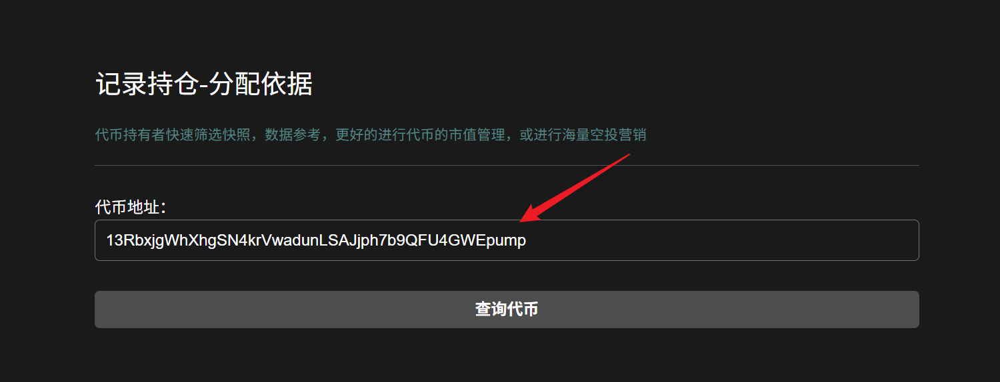
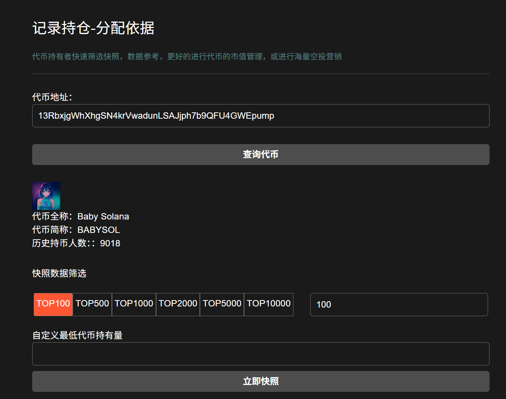
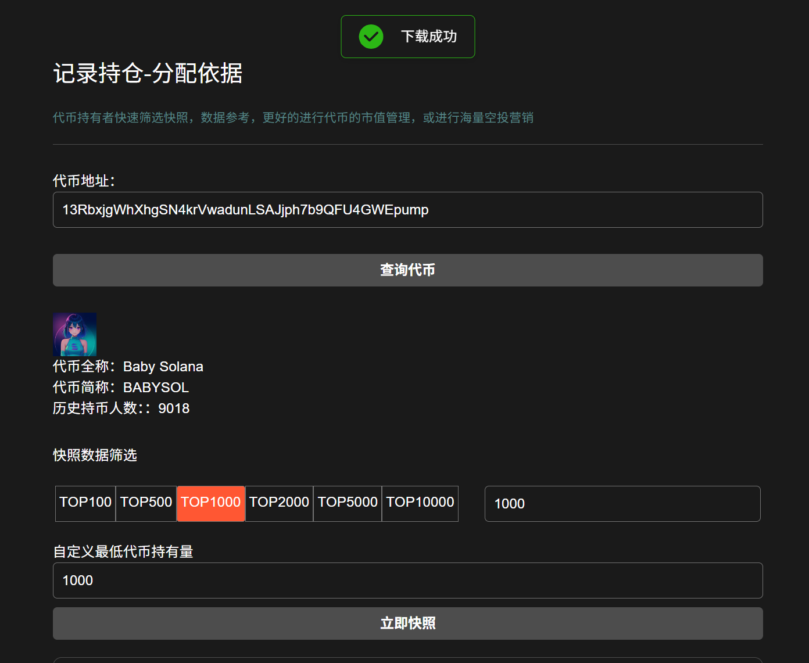

# Solana代币快照教程

代币快照是区块链网络上所有账户在特定时间点的代币持有情况的快照。这个过程通常发生在区块链上的某个特定区块高度，记录了在那个时间点所有账户的代币持有情况。快照的主要目的是确保在特定时间点代币分配和空投的公平性和透明度。

## 视频演示



## 代币快照流程

### 1. 连接主网

进入[代币快照](https://sol.gtokentool.com/zh-CN/Token/Snapshot)页面，并选择 Main 网络节点。此功能无需连接钱包。

<figure><figcaption></figcaption></figure>

### 2. 输入代币地址

<figure><figcaption></figcaption></figure>

### 3. 点击“查询代币”

<figure><figcaption></figcaption></figure>

### 4. 进行数据筛选，点击“立即快照”

设置快照数据筛选，可筛选数据条数和最低代币持有量。设置好后，点击“立即快照”。

快照完成后，用户可以在页面上查看快照结果，并下载快照数据（如 Excel 文件）以供后续使用。

<figure><figcaption></figcaption></figure>

[_**GTokenTool | 创建代币、批量空投和做市机器人等Solana工具集**_](https://sol.gtokentool.com)

**安全、开源，给Solana用户带来最便利的一站式体验。**

GTokenTool社群:

Telegram：[**https://t.me/gtokentool**](https://t.me/gtokentool)

Twitter:  [**https://x.com/gtokentool**](https://x.com/gtokentool)

Gitbook：[**https://docs.gtokentool.com/**](https://docs.gtokentool.com/)

Github：[**https://github.com/Gtokentool/docs/blob/master/SUMMARY.md**](https://github.com/Gtokentool/docs/blob/master/SUMMARY.md)

YouTube：[**https://www.youtube.com/@GTokenTool**](https://www.youtube.com/@GTokenTool)\
\
\
\
&#xNAN;_<mark style="color:purple;background-color:orange;">GTokenTool保留随时全权酌情因任何理由修改、变更或取消此公告的权利，无需事先通知。以上信息内容仅供参考，GTokenTool对本平台上的任何虚拟资产、产品或促销活动不做任何推荐或保证。虚拟资产的价格波动很大，投资交易虚拟资产将面临巨大风险。请谨慎投资。</mark>_
