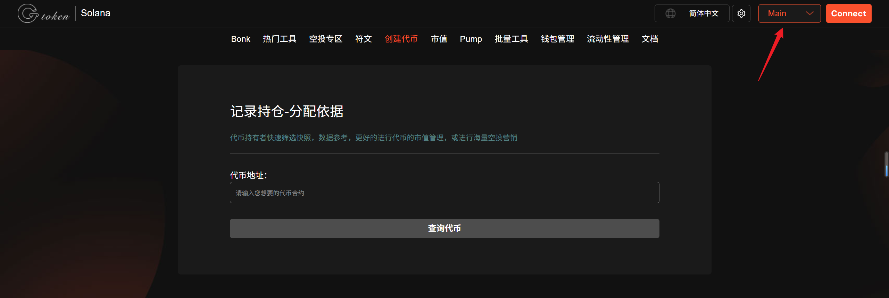
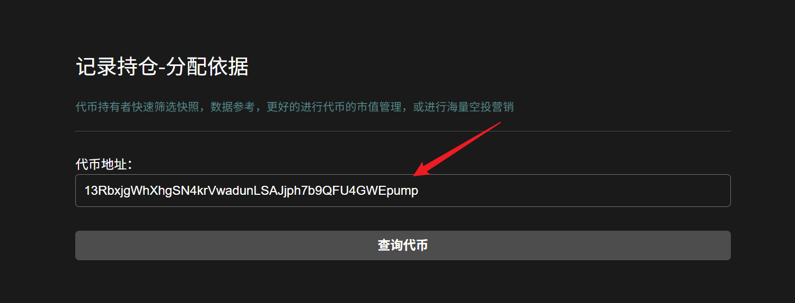
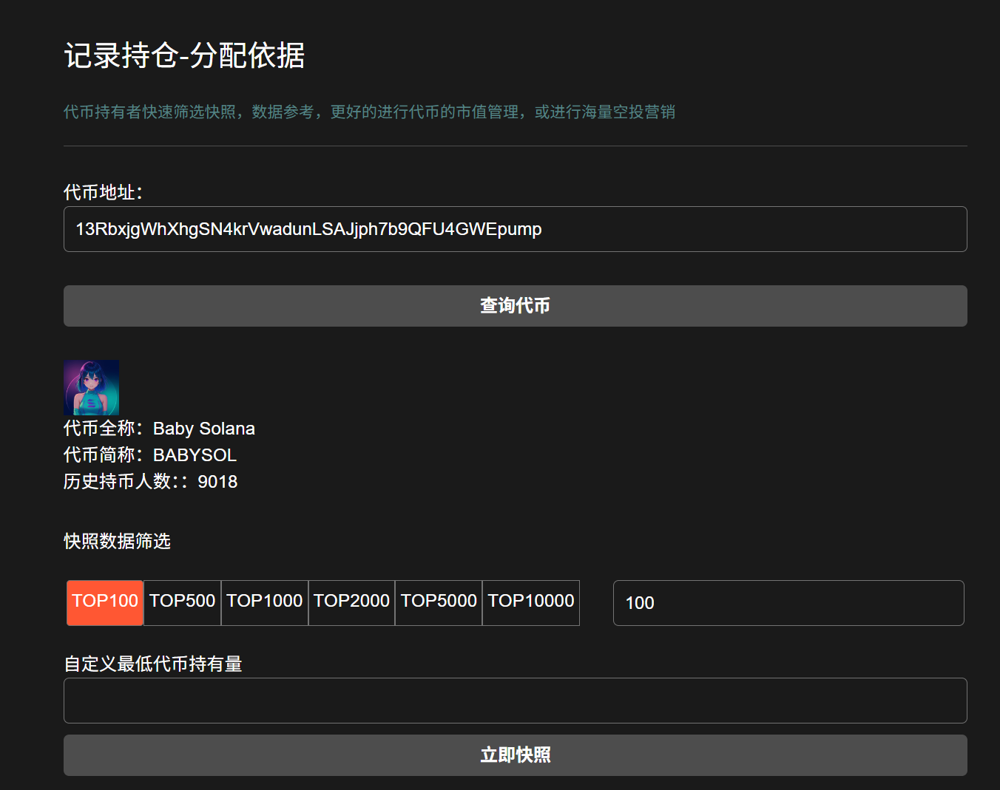
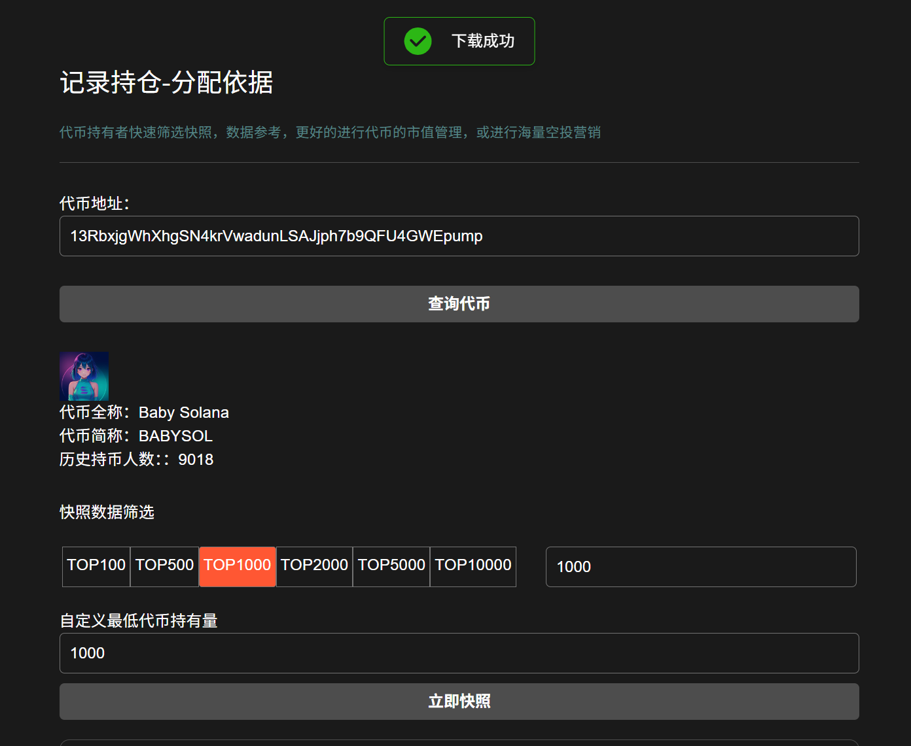

# Solana代币快照教程

**GTokenTool** 的 **Solana代币快照工具** 主要用于精准提取特定时间点链上代币的持仓分布数据。该工具具备**数据采集实时、支持多维度筛选**等特点，能够一键导出完整的持币地址列表。相比同类平台，其优势在于**读取速度极快且支持大批量数据处理**，确保快照结果的零偏差与高透明度。它特别适用于需要进行空投分发、治理投票统计或分析链上筹码分布的 **Solana 项目方、社区管理员及数据分析师**，是精准掌握持有人数据的核心辅助工具。

## 📌核心摘要

* **功能定位**：Solana 链上数据提取与持有者分析工具。它通过记录特定区块高度下所有账户的代币持有情况，生成一份完整的“代币快照”，为项目方提供精准的数据支持。
* **核心价值（数据驱动决策）**：
  * **公平空投**：作为空投分发的唯一依据，确保代币能精准、公平地分配给符合条件的持有者，杜绝作弊和争议。
  * **社区治理**：用于确定投票权、会员资格或奖励分配，是去中心化自治组织（DAO）治理的基础数据来源。
  * **市场洞察**：帮助项目方分析持币集中度、识别大户（巨鲸）和活跃用户，为市场策略和社区运营提供数据支持。
* **操作前置条件**：
  * **代币信息**：需明确要快照的代币的合约地址（Mint Address）。

## 视频演示



## 代币快照流程

### 1. 连接主网

进入[代币快照](https://sol.gtokentool.com/zh-CN/Token/Snapshot)页面，并选择 Main 网络节点。此功能无需连接钱包。

<figure><figcaption>
选择Main网络
</figcaption></figure>

### 2. 输入代币地址

<figure><figcaption>
输入代币地址
</figcaption></figure>

### 3. 点击“查询代币”

<figure><figcaption>
查询代币信息
</figcaption></figure>

### 4. 进行数据筛选，点击“立即快照”

设置快照数据筛选，可筛选数据条数和最低代币持有量。设置好后，点击“立即快照”。

快照完成后，用户可以在页面上查看快照结果，并下载快照数据（如 Excel 文件）以供后续使用。

<figure><figcaption>
下载快照信息
</figcaption></figure>

## ❓常见问题 FAQ

### Q: 快照工具支持哪些类型的代币？

**A:** 支持所有符合 SPL 标准的代币，包括标准代币、Token2022 和持币分红代币 类型。

### Q: 快照可以筛选那些地址？

A: 可筛选 Top 100–10000 的持币地址，或设定最低持仓数量，自定义筛选精准用户。

### Q: 快照结果能导出吗？

**A:** 可以导出为 xlsx 文件，方便进行空投分发或市场分析。

### Q: 快照的数据准确吗？

**A:** 代币快照的数据是基于某一个区块高度或者时间的，过了这个时间，数据可能就会有变化。

### Q: GTokenTool 的代币快照工具需要收费吗？

**A:** 不收费，该工具是免费使用的。

### 🤝 连接 GTokenTool 

* **💬 Telegram社群**：[点击加入官方群组](https://t.me/gtokentool)
* **🐦 Twitter (X)**：[关注我们获取最新动态](https://x.com/gtokentool)
* **📚 官方文档**：[查看 Gitbook 文档](https://docs.gtokentool.com/)
* **💻 开源代码**：[访问 GitHub 仓库](https://github.com/Gtokentool/docs/blob/master/SUMMARY.md)
* **📺 视频教程**：[订阅 YouTube 频道](https://www.youtube.com/@GTokenTool)

> ⚠️ 风险提示与免责声明
>
> GTokenTool 保留随时全权酌情因任何理由修改、变更或取消此公告的权利，无需事先通知。
>
> 以上信息内容仅供参考，GTokenTool 对本平台上的任何虚拟资产、产品或促销活动不做任何推荐或保证。虚拟资产的价格波动很大，投资交易虚拟资产将面临巨大风险。**请谨慎投资。**
