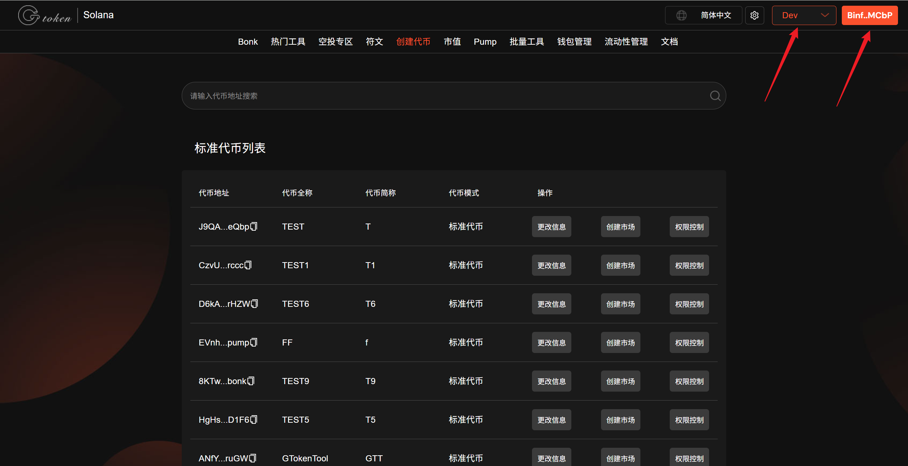
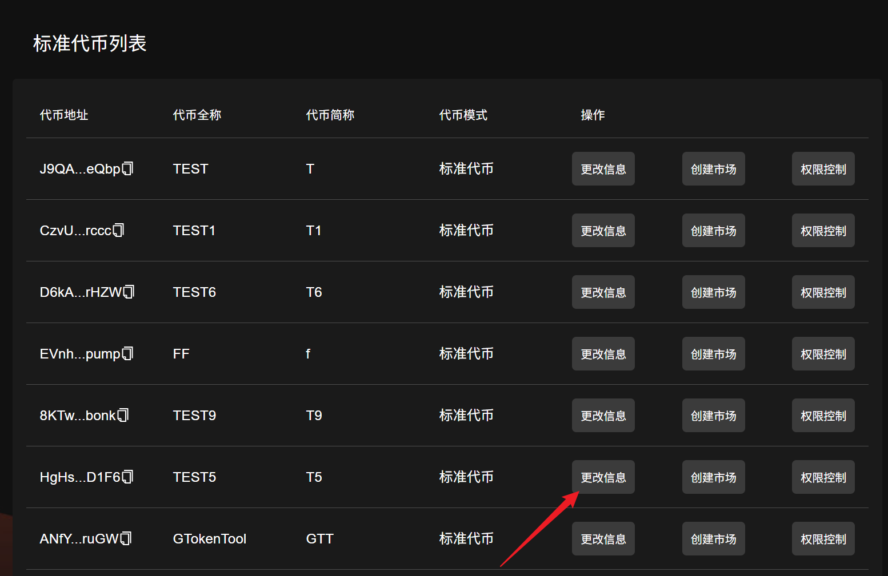
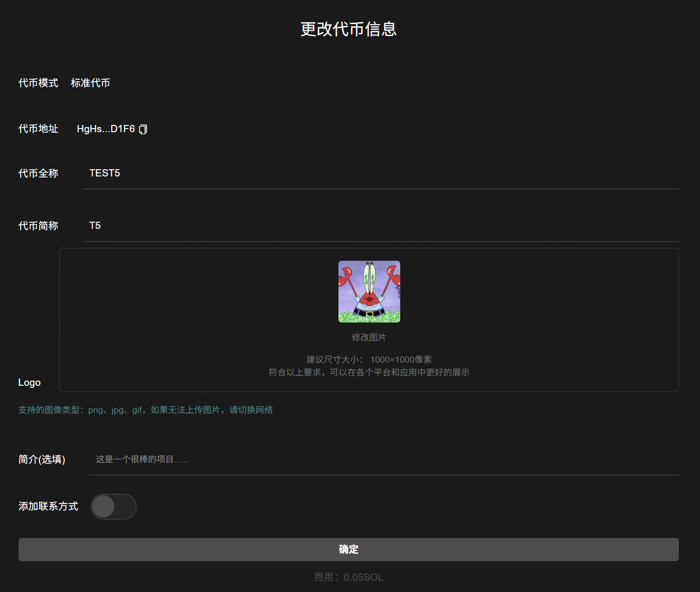
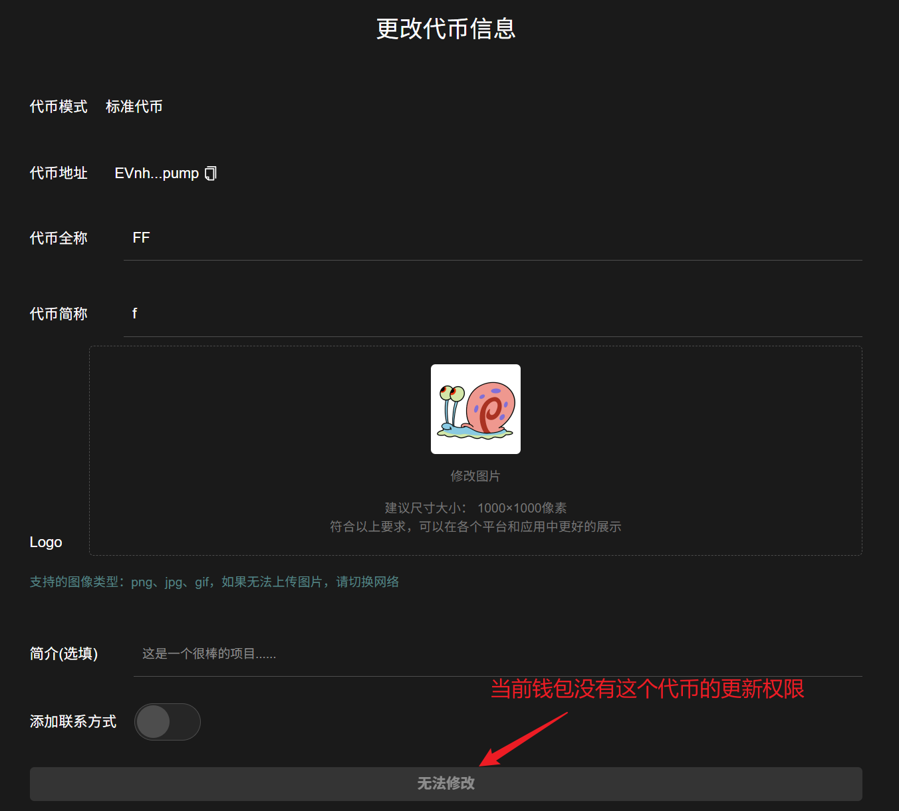
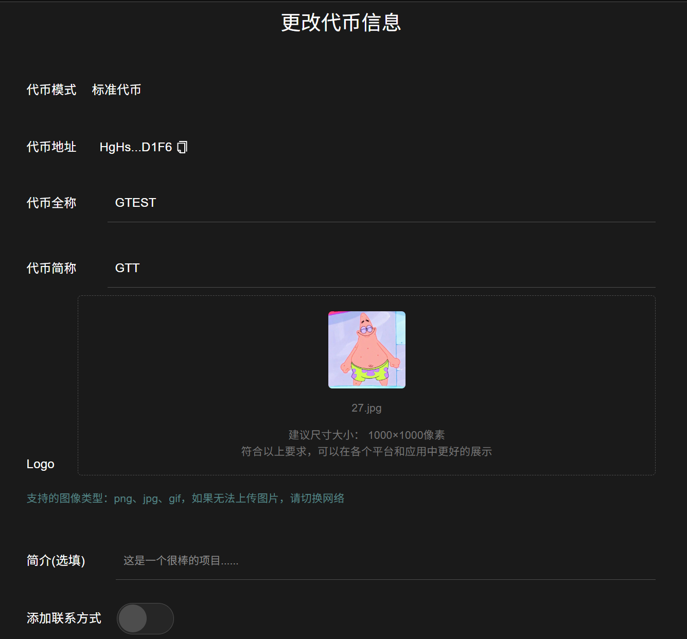
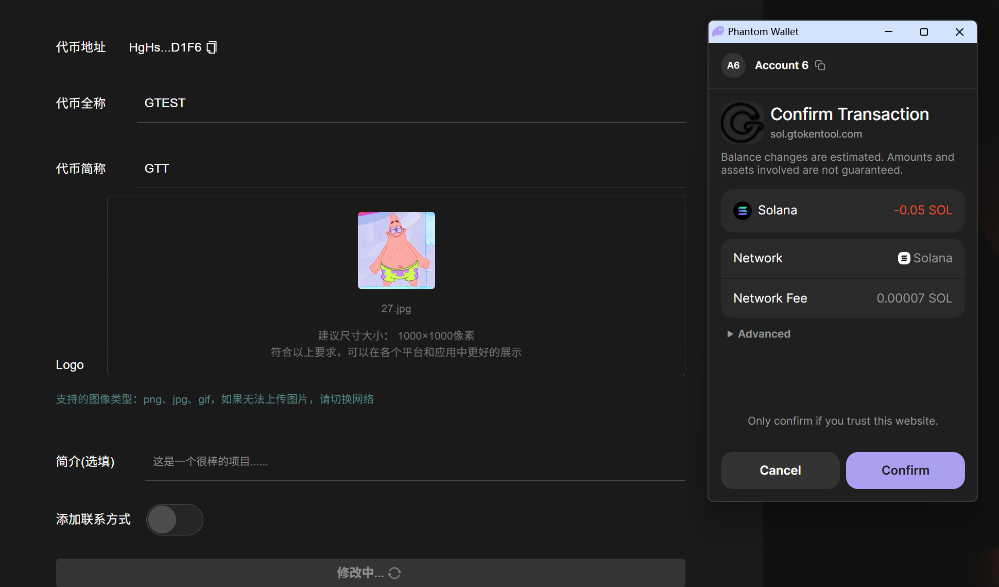
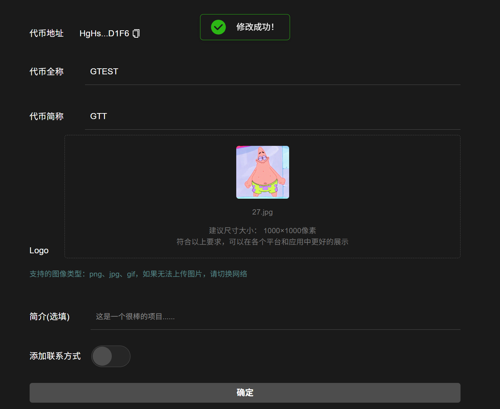
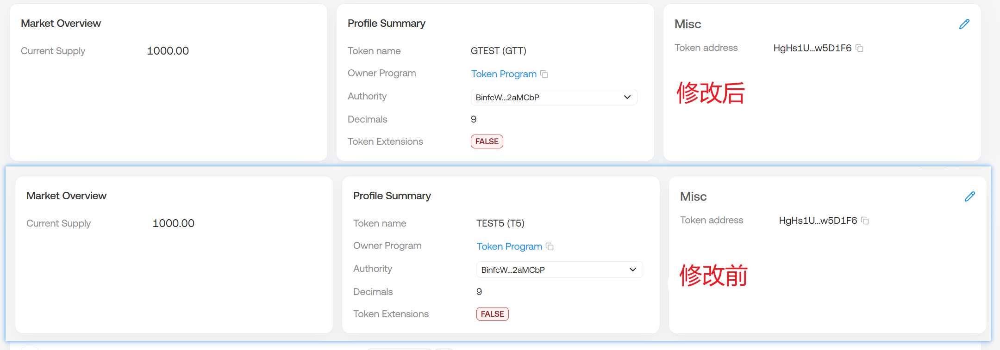
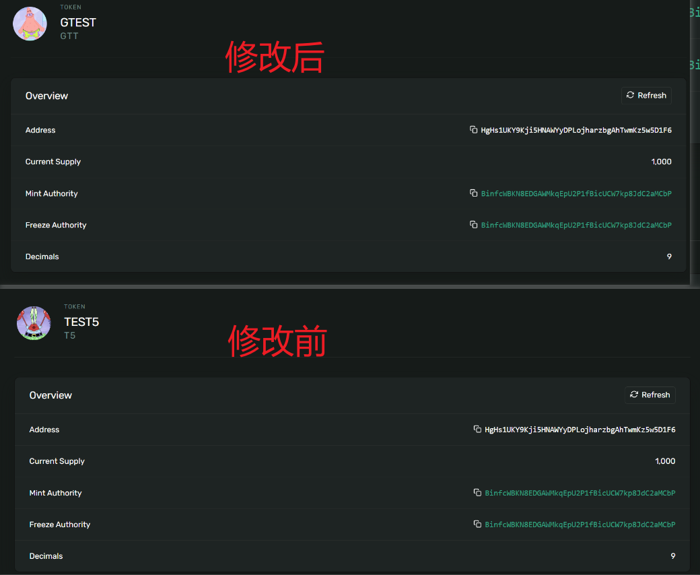

# Solana更改代币信息教程

## 📌 核心摘要

* **功能定位**：Solana 代币元数据后期维护指南。旨在指导用户如何修正或更新已发行代币的链上展示信息。
* **关键限制**：操作前提是创建代币时**未放弃更新权限**（Update Authority）。若权限已放弃，则信息不可更改。
* **可修改内容**：支持更新代币名称、图标、官方网址、社交媒体链接及项目描述等视觉与文本信息。
* **应用场景**：适用于项目品牌升级、Logo 迭代或修正创建时填写的笔误。

## 视频教程



## 更改代币信息操作步骤

### 1.进入管理代币页面，并且连接好钱包

管理代币页面：[https://sol.gtokentool.com/zh-CN/Token/management](https://sol.gtokentool.com/zh-CN/Token/management)

进入管理代币页面，连接钱包并选择 Main 网络节点，这里使用测试网演示。

<figure><figcaption>
连接钱包并选择网络
</figcaption></figure>

选择要更改信息的代币，点击“`更改信息`”。

<figure><figcaption>
选择代币去更改信息
</figcaption></figure>

### 2.判断是否有更新权限

如果该代币未放弃代币权限，则可以更改该代币信息。如果该代币已经放弃了更改权限或更改权限不是你的钱包地址，则你不能更改该代币的信息。

<figure><figcaption>
判断是否有更改权限
</figcaption></figure>

没有更新权限的情况：下方会显示无法修改。

<figure><figcaption>
没有更新权限的效果
</figcaption></figure>

### 3.更新代币资料

在确认拥有代币更新权限后，按照要求填写更新后的全称、简称等。

具体如下：

**代币名称：**&#x4EE3;币的名称信息（如GTEST），支持英文、中文以及中英文混合，最多32个字符。

**代币简称：**&#x4EE3;币的简称信息（如GTT），支持英文、中文以及中英文混合，最多10个字符。

**Logo：**&#x4EE3;币头像，可在钱包中显示logo代币图片（上传图片大小最大不超过2M）。

<mark style="background-color:blue;">选填信息：</mark>

**简介(选填）：**&#x586B;写你的代币简介。

**官网：**&#x5B98;网链接地址。

**电报：**&#x7535;报（Telegram）链接地址。

**推特：**&#x63A8;特（Twitter）链接地址。

**Discord:** Discord链接地址。

例如可以按照以下方式填写：

<figure><figcaption>
更新代币信息
</figcaption></figure>

### 4.点击“确定”，更改代币信息

弹出钱包后，点击“`Confirm`"。

<figure><figcaption>
钱包确认
</figcaption></figure>

<figure><figcaption>
修改成功提示
</figcaption></figure>


**注意：**&#x4E00;般来说，扣费成功了就说明信息修改成功了，如果你的钱包扣费了但提示修改失败，不要重复点击，先去Solana浏览器搜一下合约地址看看是否修改了信息。


### 5.查看修改的代币是否修改成功

我们可以在钱包中查看代币信息，也可以通过[Solana浏览器](https://solscan.io/)来查看。

<figure><figcaption>
链上信息对比
</figcaption></figure>

<figure><figcaption>
链上信息对比
</figcaption></figure>


**注意事项：**&#x7406;论上只要不放弃更新权限，就可以无限次修改信息，但是为了项目的长久运行，建议大家谨慎操作。


## ❓常见问题 FAQ

### Q: 可以通过 GTokenTool 更新那些代币信息？

**A:** 支持包括代币全称、代币简称、Logo、简介及相关链接等元数据的调整。

### Q: 更新代币信息需要消耗多少手续费？

**A:** 更新代币信息仅需0.05 SOL。

### Q: 更新代币信息是否立即生效？

**A:** 是的，链上数据会即时同步更新，钱包内数据需等待钱包数据采集更新。

### 🤝 连接 GTokenTool 

* **💬 Telegram社群**：[点击加入官方群组](https://t.me/gtokentool)
* **🐦 Twitter (X)**：[关注我们获取最新动态](https://x.com/gtokentool)
* **📚 官方文档**：[查看 Gitbook 文档](https://docs.gtokentool.com/)
* **💻 开源代码**：[访问 GitHub 仓库](https://github.com/Gtokentool/docs/blob/master/SUMMARY.md)
* **📺 视频教程**：[订阅 YouTube 频道](https://www.youtube.com/@GTokenTool)

> ⚠️ 风险提示与免责声明
>
> GTokenTool 保留随时全权酌情因任何理由修改、变更或取消此公告的权利，无需事先通知。
>
> 以上信息内容仅供参考，GTokenTool 对本平台上的任何虚拟资产、产品或促销活动不做任何推荐或保证。虚拟资产的价格波动很大，投资交易虚拟资产将面临巨大风险。**请谨慎投资。**
