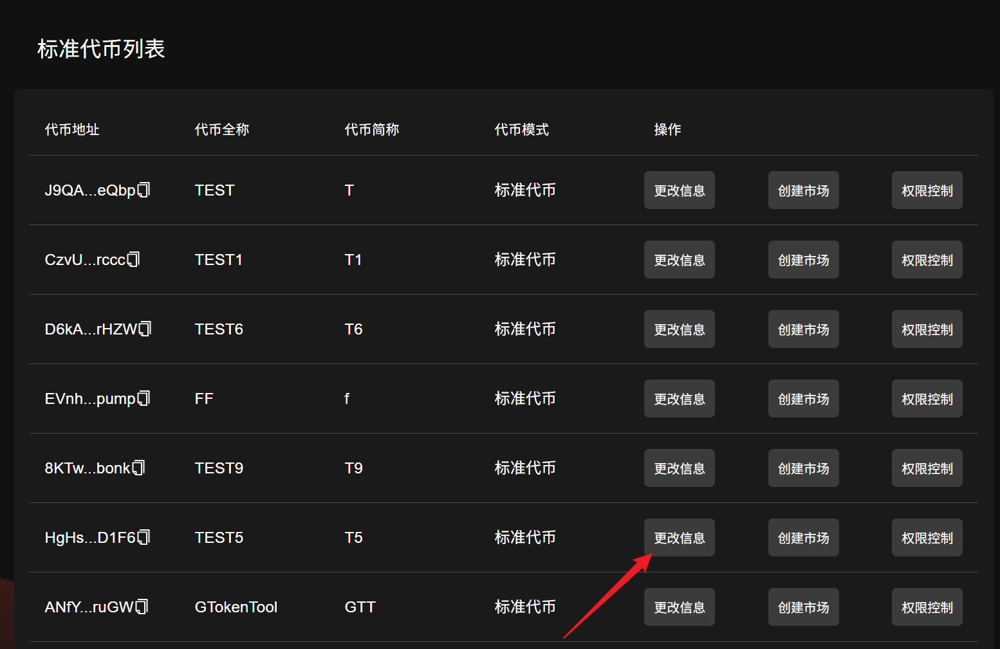

# Solana更改代币信息

## 视频教程



和以太坊、币安链不同，Sol发币之后，依然可以修改代币名称、头像、推特链接、网址等元数据信息。如果你想更换代币logo，或者增加/删除一些链接，就可以通过该工具完成。

**Token-2022更改代币信息同样的操作步骤**

## 更改代币信息操作步骤

### 1.进入管理代币页面，并且连接好钱包

管理代币页面：[https://sol.gtokentool.com/zh-CN/Token/management](https://sol.gtokentool.com/zh-CN/Token/management)

进入管理代币页面，连接钱包并选择 Main 网络节点，这里使用测试网演示。

<figure><figcaption></figcaption></figure>

选择要更改信息的代币，点击“`更改信息`”。

<figure><figcaption></figcaption></figure>

### 2.判断是否有更新权限

如果该代币未放弃代币权限，则可以更改该代币信息。如果该代币已经放弃了更改权限或更改权限不是你的钱包地址，则你不能更改该代币的信息。

<figure><figcaption></figcaption></figure>

没有更新权限的情况：下方会显示无法修改。

<figure><figcaption></figcaption></figure>

### 3.更新代币资料

在确认拥有代币更新权限后，按照要求填写更新后的全称、简称等。

具体如下：

**代币名称：**&#x4EE3;币的名称信息（如GTEST），支持英文、中文以及中英文混合，最多32个字符。

**代币简称：**&#x4EE3;币的简称信息（如GTT），支持英文、中文以及中英文混合，最多10个字符。

**Logo：**&#x4EE3;币头像，可在钱包中显示logo代币图片（上传图片大小最大不超过2M）。

<mark style="background-color:blue;">选填信息：</mark>

**简介(选填）：**&#x586B;写你的代币简介。

**官网：**&#x5B98;网链接地址。

**电报：**&#x7535;报（Telegram）链接地址。

**推特：**&#x63A8;特（Twitter）链接地址。

**Discord:** Discord链接地址。

例如可以按照以下方式填写：

<figure><figcaption></figcaption></figure>

### 4.点击“确定”，更改代币信息

弹出钱包后，点击“`Confirm`"。

<figure><figcaption></figcaption></figure>

<figure><figcaption></figcaption></figure>


**注意：**&#x4E00;般来说，扣费成功了就说明信息修改成功了，如果你的钱包扣费了但提示修改失败，不要重复点击，先去Solana浏览器搜一下合约地址看看是否修改了信息。


### 5.查看修改的代币是否修改成功

我们可以在钱包中查看代币信息，也可以通过[Solana浏览器](https://solscan.io/)来查看。

<figure><figcaption></figcaption></figure>

<figure><figcaption></figcaption></figure>


**注意事项：**&#x7406;论上只要不放弃更新权限，就可以无限次修改信息，但是为了项目的长久运行，建议大家谨慎操作。


[_**GTokenTool | 创建代币、批量空投和做市机器人等Solana工具集**_](https://sol.gtokentool.com)

**安全、开源，给Solana用户带来最便利的一站式体验。**

GTokenTool社群:

Telegram：[**https://t.me/gtokentool**](https://t.me/gtokentool)

Twitter:  [**https://x.com/gtokentool**](https://x.com/gtokentool)

Gitbook：[**https://docs.gtokentool.com/**](https://docs.gtokentool.com/)

Github：[**https://github.com/Gtokentool/docs/blob/master/SUMMARY.md**](https://github.com/Gtokentool/docs/blob/master/SUMMARY.md)

YouTube：[**https://www.youtube.com/@GTokenTool**](https://www.youtube.com/@GTokenTool)\
\
\
\
<mark style="color:purple;background-color:orange;">**GTokenTool**</mark>_<mark style="color:purple;background-color:orange;">保留随时全权酌情因任何理由修改、变更或取消此公告的权利，无需事先通知。以上信息内容仅供参考，GTokenTool对本平台上的任何虚拟资产、产品或促销活动不做任何推荐或保证。虚拟资产的价格波动很大，投资交易虚拟资产将面临巨大风险。请谨慎投资。</mark>_
