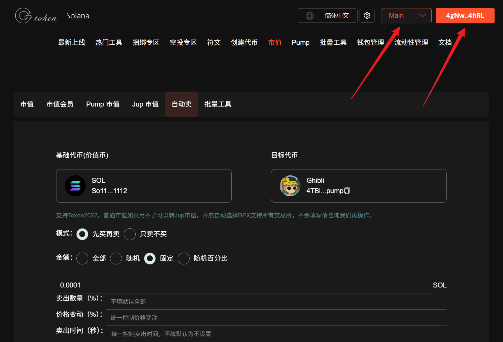
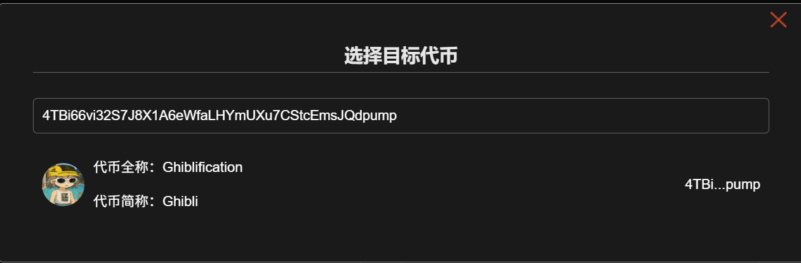
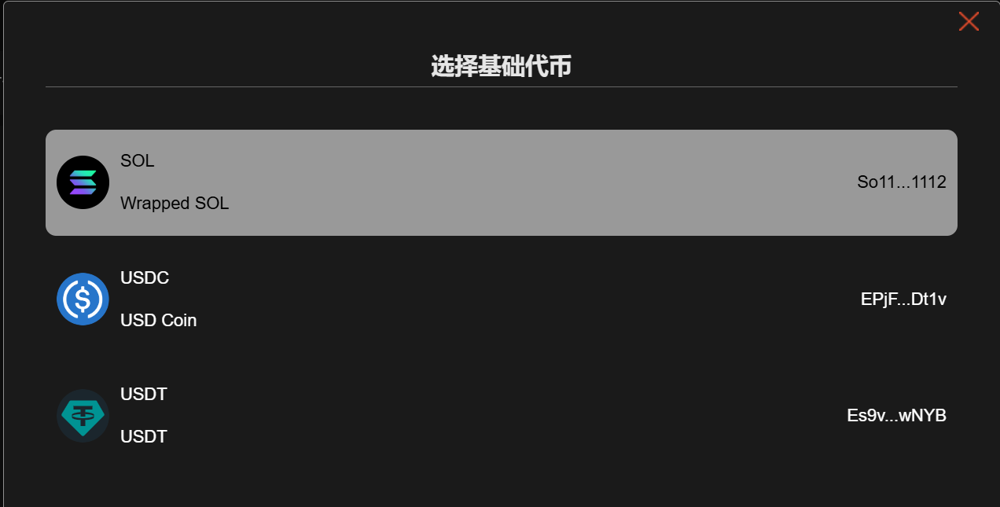
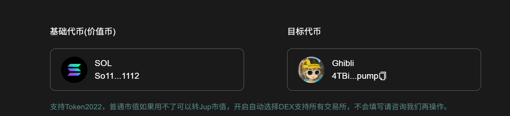
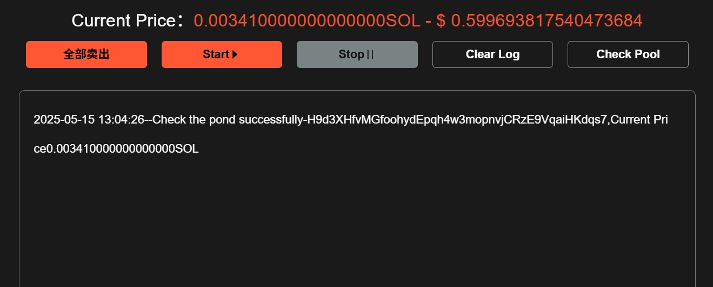
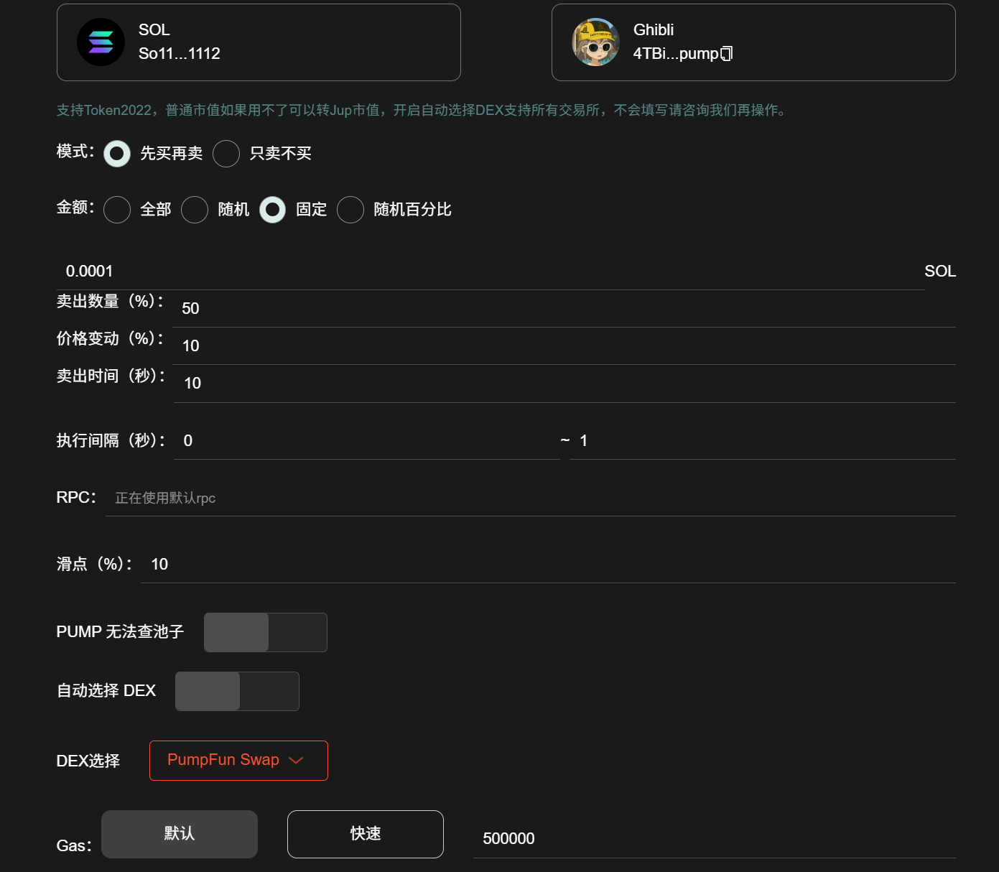
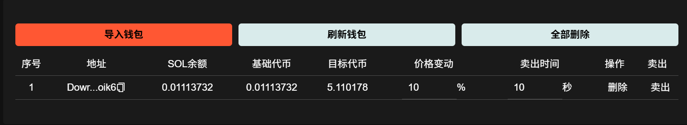
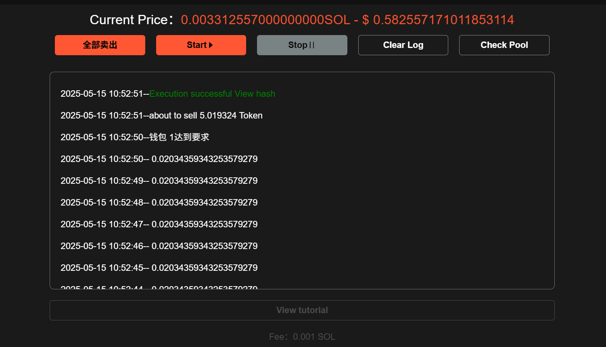

# 📤 Solana自动卖教程

## 准备事项

1. 一台电脑或者一部手机
2. Solana 钱包（[幻影钱包Phantom安装教程](https://docs.gtokentool.com/solana/auxiliary-tutorial/phantom-wallet-installation)）
3. 要进行批量交易的钱包私钥
4. 批量交易所需代币
5. 一些 SOL 用于支付交易 GAS

## 注意事项

1. 机器人为`单路由`模式：即，SOL的池子，只能用SOL交易。
2. 机器人支持所有池子类型。
3. 刚开盘项目价格不稳定，往往需要`提高滑点`才能交易成功。
4. 交易失败的大部分原因都是这几种：余额不够（查看参数是否填写错误）、交易过期（节点速度慢）、没有按照流程操作（比如没查池子就开始交易）、矿工费较低（可以增加矿工费）。
5. 你的私钥不会存储在平台上，所有操作都是基于前端执行的，请放心使用。如果你比较担心，可以使用新的钱包操作。

## Solana自动卖操作流程

### 1. 连接钱包

进入Solana自动卖页面：[https://sol.gtokentool.com/zh-CN/market/AutoSell](https://sol.gtokentool.com/zh-CN/market/AutoSell)，右上角点击连接钱包并选择 Main 网络。

<figure><figcaption></figcaption></figure>

### 2. 输入要进行批量交易的币种

通过输入代币合约来对代币进行搜索,并选择目标代币。

<figure><figcaption></figcaption></figure>

之后选择对应的基础代币。

<figure><figcaption></figcaption></figure>

<figure><figcaption></figcaption></figure>

### 3. 查看交易池id

选择完代币之后滑动到屏幕最下方的日志，查看当前的交易池id，以及当前价格。点击`清空日志`则可以将日志信息清除，清除日志后若想再次确认交易池id，可点击`查池子`按钮。

<figure><figcaption></figcaption></figure>

### 4. 设置相关配置参数

**交易模式：**&#x5148;买再卖；只卖不买。

**金额：**&#x6709;四种方式可以选择。

* 全部：一次性买入所有代币，无视价格与滑点。
* 随机：根据设置的金额范围，随机买入代币。
* 固定：按照固定数额的 SOL 买入。
* 随机百分比：根据设置的百分比范围，随机买入代币。

**卖出数量（%）：**&#x5356;出金额的百分比。

**价格变动（%）：**&#x8BBE;置卖出时的价格。<mark style="color:purple;">先买再卖</mark>：若价格变动百分比是2%，在价格为100的时候买的，那么它就会在价格为102的时候卖出。<mark style="color:purple;">只卖不买</mark>：若价格变动百分比是2%，当前价格为100，卖出时的价格就是102，所有钱包会在102的时候卖出。<mark style="color:purple;">若在设置的卖出时间内未达到这个价格，会以到达卖出时间时的价格卖出。</mark>

**卖出时间：**&#x6BCF;次买入后执行卖出操作的间隔时间，以秒为单位。

**执行间隔：**&#x6BCF;个钱包之间的执行间隔时间，以秒为单位。

**滑点：**&#x6BCF;笔交易所能接受的最大磨损成本。刚上线的代币，滑点要高一点。

**RPC：**&#x9ED8;认的节点是公共的，交易速度较慢，需要提高交易速度的可输入自己的rpc节点。

**PUMP无法查池子**：PUMP无法查池子时开启这个选项。

**自动选择DEX**：清楚DEX时，可以自己手动选择DEX。不清楚DEX时，可以开启这个选项。<mark style="color:purple;">若手动选择DEX交易不成功，请切换到自动选择DEX再次交易。</mark>

**Gas：**&#x4E00;定程度上决定了你的交易速度，矿工费给的越多，原则上交易速度相对越快。

* 默认：额外支出500000 gas，大概是0.000175 SOL左右。
* 快速：额外支出1000000 gas，大概是0.00035 SOL左右。
* 其他：可以自己输入自定义gas费。


如果我们的节点不符合您所需线程的要求，请购买专用节点。

如果您点击“停止”但线程未停止，请多点击几次以停止它。如果您选择全部卖出，它将自动停止。


<figure><figcaption></figcaption></figure>

### 5. 导入批量钱包，设置参数

导入批量钱包，查询钱包余额，点击`刷新钱包`可刷新钱包的余额，点击`删除`操作按钮可删除钱包,点击卖出可操作单个钱包卖出。填写`价格变动`和`卖出时间`。<mark style="color:purple;">若上面有设置也可不设置，此时所有钱包统一为上面设置的参数，也可以单独设置每个钱包的参数。</mark>

<figure><figcaption></figcaption></figure>

### 6. 开始批量交易

可实时查看交易日志。

<figure><figcaption></figcaption></figure>

[_**GTokenTool | 创建代币、批量空投和做市机器人等Solana工具集**_](https://sol.gtokentool.com)

**安全、开源，给Solana用户带来最便利的一站式体验。**

GTokenTool社群:

Telegram：[**https://t.me/gtokentool**](https://t.me/gtokentool)

Twitter:  [**https://x.com/gtokentool**](https://x.com/gtokentool)

Gitbook：[**https://docs.gtokentool.com/**](https://docs.gtokentool.com/)

Github：[**https://github.com/Gtokentool/docs/blob/master/SUMMARY.md**](https://github.com/Gtokentool/docs/blob/master/SUMMARY.md)

YouTube：[**https://www.youtube.com/@GTokenTool**](https://www.youtube.com/@GTokenTool)\
\
\
\
<mark style="color:purple;background-color:orange;">**GTokenTool**</mark>_<mark style="color:purple;background-color:orange;">保留随时全权酌情因任何理由修改、变更或取消此公告的权利，无需事先通知。以上信息内容仅供参考，GTokenTool对本平台上的任何虚拟资产、产品或促销活动不做任何推荐或保证。虚拟资产的价格波动很大，投资交易虚拟资产将面临巨大风险。请谨慎投资。</mark>_
