# ⚡ 市值多线程快速砸盘教程

## 准备事项

1. 一台电脑或者一部手机
2. Solana 钱包（[幻影钱包Phantom安装教程](https://docs.gtokentool.com/solana/auxiliary-tutorial/phantom-wallet-installation)）
3. 要进行批量交易的钱包私钥
4. 批量交易所需代币
5. 一些 SOL 用于支付交易 GAS

## 注意事项 

1. 机器人为`单路由`模式：即，SOL的池子，只能用SOL交易。USDC的池子，只能用USDC交易。
2. 机器人支持所有池子类型。
3. 刚开盘项目价格不稳定，往往需要`提高滑点`才能交易成功。
4. 交易失败的大部分原因都是这几种：余额不够（查看参数是否填写错误）、交易过期（节点速度慢）、没有按照流程操作（比如没查池子就开始交易）、矿工费较低（可以增加矿工费）。
5. 你的私钥不会存储在平台上，所有操作都是基于前端执行的，请放心使用。如果你比较担心，可以使用新的钱包操作。

## 市值多线程快速砸盘流程

### 1. 连接钱包

进入Raydium市值管理页面：[https://sol.gtokentool.com/zh-CN/market/marketManagement](https://sol.gtokentool.com/zh-CN/market/marketManagement)，右上角点击连接钱包并选择 Main 网络。

<figure>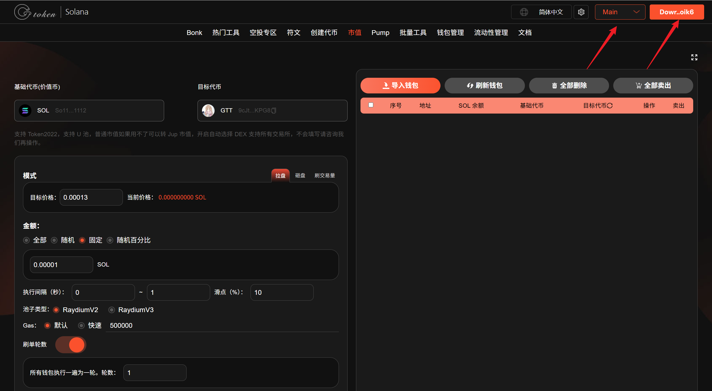<figcaption></figcaption></figure>

### 2. 输入要进行批量交易的币种

通过输入代币合约来对代币进行搜索,并选择目标代币。

<figure>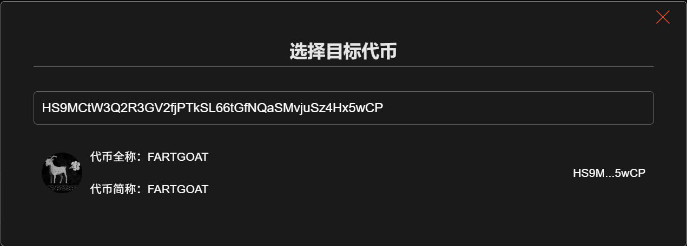<figcaption></figcaption></figure>

之后选择对应的基础代币。

<figure>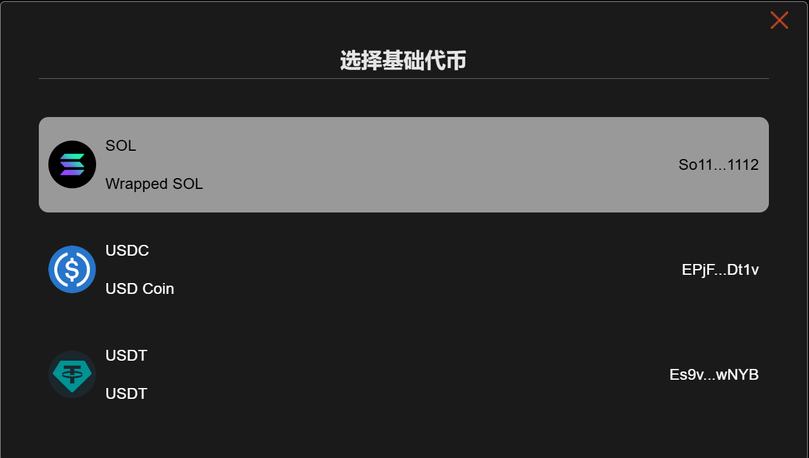<figcaption></figcaption></figure>

<figure>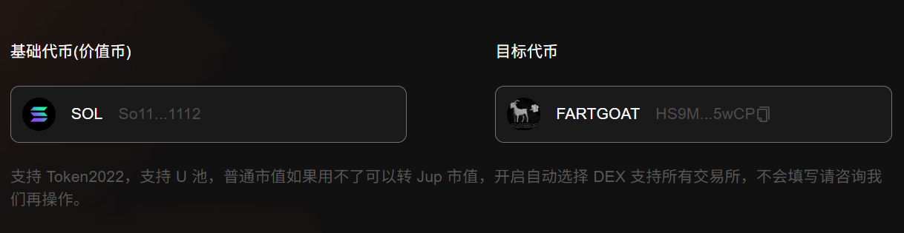<figcaption></figcaption></figure>

### 3. 查看交易池id

选择完代币之后滑动到屏幕最下方的日志，查看当前的交易池id，以及当前价格。点击`清空日志`则可以将日志信息清除，清除日志后若想再次确认交易池id，可点击`查池子`按钮。

<figure>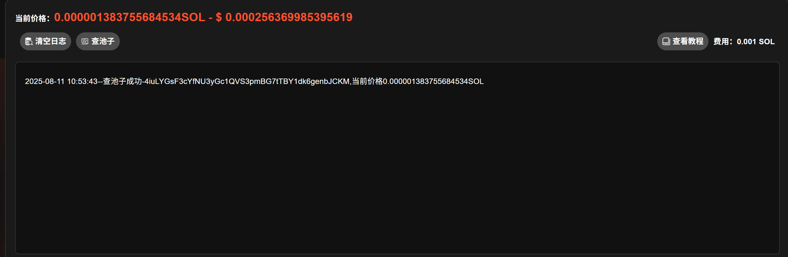<figcaption></figcaption></figure>

### 4. 导入批量钱包

导入批量钱包，查询钱包余额，点击`刷新钱包`可刷新钱包的余额。点击`全部删除`可删除全部钱包。勾选钱包后，点击`全部卖出`可直接卖出所选钱包内的全部目标代币。点击`删除`操作按钮可单独删除钱包。点击`卖出`即可卖出对应钱包内的全部目标代币。点击目标代币旁边的刷新图标可刷新钱包内目标代币余额。

<figure>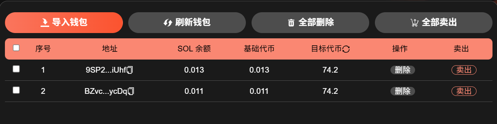<figcaption></figcaption></figure>

### 5. 设置快速砸盘相关配置参数

**交易模式：**&#x9009;择砸盘，砸盘→卖出代币。

**目标价格：**&#x7838;盘模式下，<mark style="color:purple;">目标价格要低于当前代币价格</mark>。

**金额：**&#x5728;砸盘模式下，这里的金额就是你要出售的代币数量。

* 全部：一次性卖出所有代币，无视价格与滑点。
* 随机：根据设置的金额范围，随机卖出代币。
* 固定：按照固定数量的代币进行卖出。

**执行间隔：**&#x6BCF;次买入或者卖出之间的执行间隔时间，以秒为单位。

**滑点：**&#x6BCF;笔交易所能接受的最大磨损成本。刚上线的代币，滑点要高一点。

**池子类型：**&#x9009;择对应的池子类型（Raydium V2 或 Raydium V3)。

**矿工费（gas）：**&#x4E00;定程度上决定了你的交易速度，矿工费给的越多，原则上交易速度相对越快。

* 默认：额外支出500000 gas，大概是0.000175 SOL左右。
* 快速：额外支出1000000 gas，大概是0.00035 SOL左右。
* 其他：可以自己输入自定义gas费。

**刷单轮数：**&#x8BBE;置交易次数。<mark style="color:purple;">若设置了这个，则到指定次数会自动停止交易，无需手动停止。</mark>所有钱包执行一遍为一轮。

**多线程：**&#x5F00;启多线程后，钱包之间存在竞争关系，新钱包交易失败是正常的，刷一轮后就好了。


如果我们的节点不符合你所需线程的要求，请购买私人节点。

如果点击停止线程未停下，则多点几次停止，选择全部砸盘会自动停止。


**第一种多线程快速砸盘方式参数展示：**

<figure>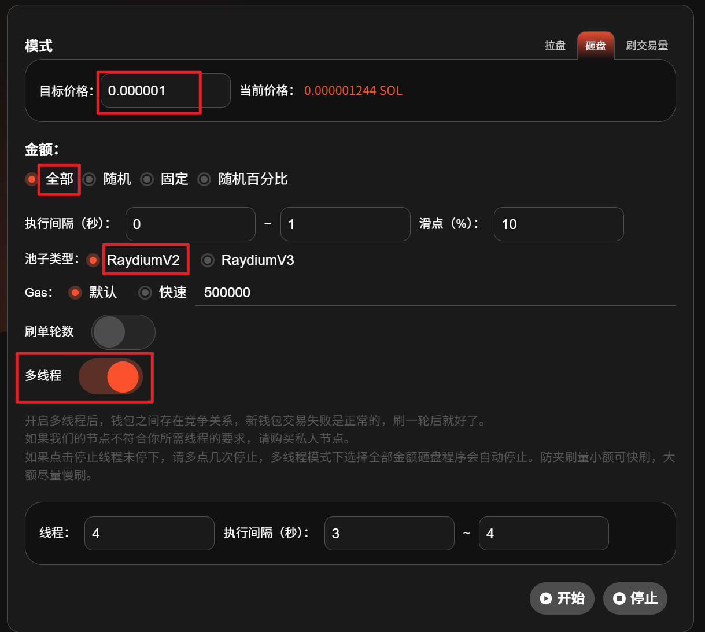<figcaption></figcaption></figure>

<mark style="background-color:blue;">参数设置：</mark>

* 模式：砸盘
* 金额：全部
* 目标价格：设置小于当前价格(0.000001)
* 执行间隔：0\~1 秒
* 滑点：10%
* 池子类型：RaydiumV2
* Gas：默认
* 刷单轮数：不开启
* 多线程：开启

勾选钱包，点击`开始`，执行交易。

<figure>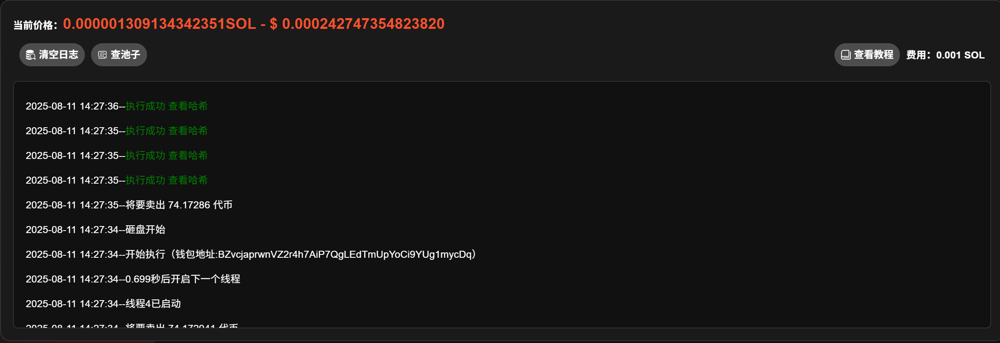<figcaption></figcaption></figure>

开启多线程后，钱包之间存在竞争关系，新钱包交易失败是正常的，刷一轮后就好了。交易停止后，我们可以点击目标代币旁边的刷新小图标查看是否全部砸盘成功，也可以点击日志里的`查看哈希`复制哈希地址去[区块链浏览器](https://solscan.io/)看交易情况。

<figure>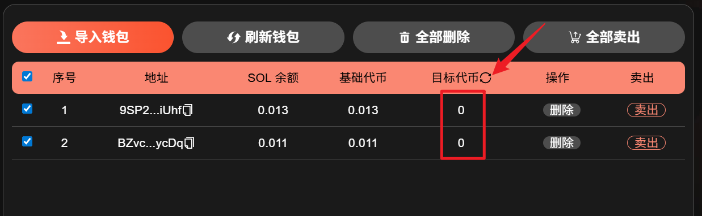<figcaption></figcaption></figure>

**第二种多线程快速砸盘方式参数展示：**

<figure>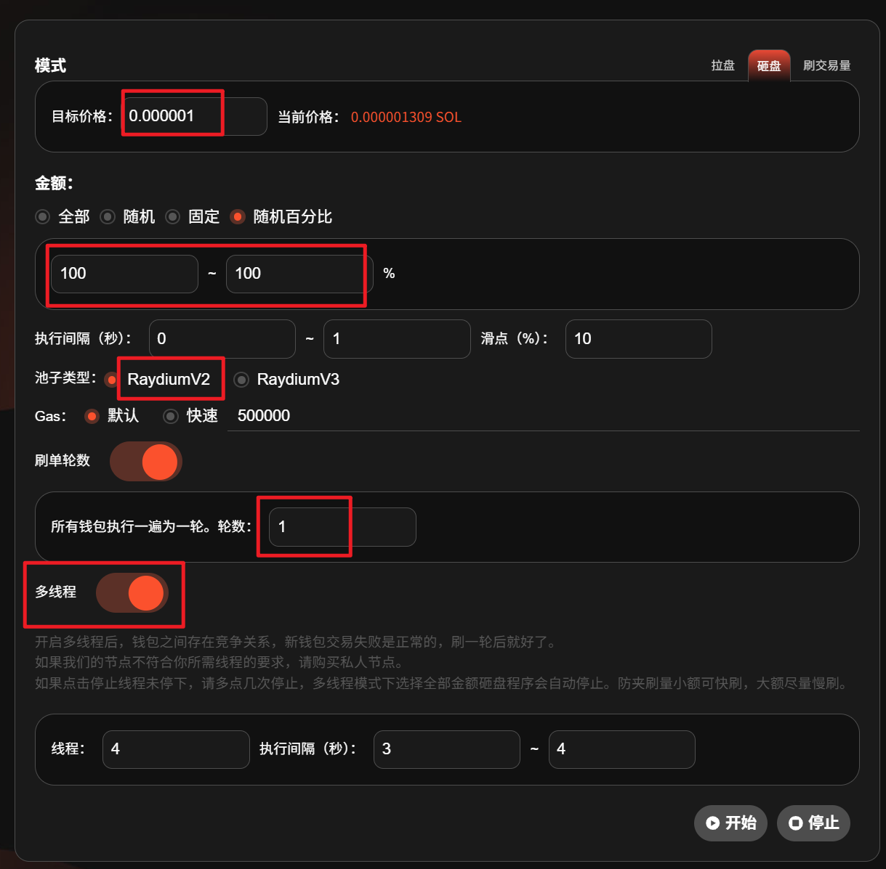<figcaption></figcaption></figure>

<mark style="background-color:blue;">参数设置：</mark>

* 模式：砸盘
* 金额：随机百分比（100%\~100%）
* 目标价格：设置小于当前价格(0.000001)
* 执行间隔：0\~1 秒
* 滑点：10%
* 池子类型：RaydiumV2
* Gas：默认
* 刷单轮数：1
* 多线程：开启

勾选钱包，点击`开始`，执行交易。

<figure>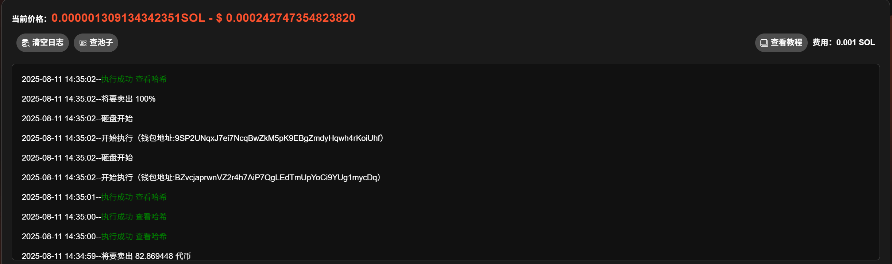<figcaption></figcaption></figure>

开启多线程后，钱包之间存在竞争关系，新钱包交易失败是正常的，刷一轮后就好了。交易停止后，我们可以点击目标代币旁边的刷新小图标查看是否全部砸盘成功，也可以点击日志里的`查看哈希`复制哈希地址去[区块链浏览器](https://solscan.io/)看交易情况。

<figure><figcaption></figcaption></figure>

**第三种多线程快速砸盘方式参数展示：**

<figure>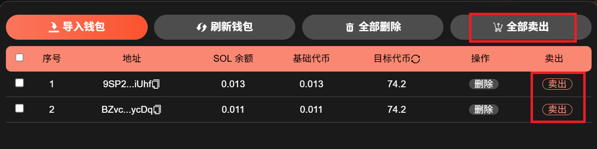<figcaption></figcaption></figure>

这种方式<mark style="background-color:blue;">最简便</mark>，导入钱包后，不需要设置上面的参数。直接点击导入钱包区域内的`卖出`按钮，即可全部卖出<mark style="background-color:blue;">对应钱包</mark>内的目标代币，或者勾选钱包后直接点击的`全部卖出`按钮，即可全部卖出<mark style="background-color:blue;">所有勾选的钱包</mark>内的目标代币。

<figure>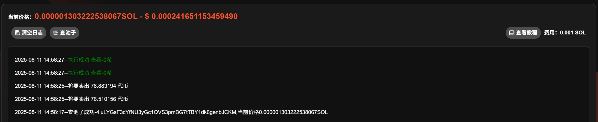<figcaption></figcaption></figure>

交易停止后，我们可以点击目标代币旁边的刷新小图标查看是否全部砸盘成功，也可以点击日志里的`查看哈希`复制哈希地址去[区块链浏览器](https://solscan.io/)看交易情况。

<figure><figcaption></figcaption></figure>


<mark style="color:blue;">**Solana市值机器人增加jup市值管理功能，jup是聚合交易所，支持所有swap的市值管理，包括最新的pump amm swap。**</mark>

<mark style="color:red;">**jup市值机器人：**</mark>[<mark style="color:red;">**https://sol.gtokentool.com/zh-CN/market/jupMarket**</mark>](https://sol.gtokentool.com/zh-CN/market/jupMarket)


## 常见问答

### 1. 为什么查不到我的池子？

目前机器人不支持Token2022的代币，该类型的代币可能无法查到池子。

### 2. 导入多个地址进行防夹刷量，次数是单地址次数还是总次数？

次数是所有地址的总次数。每个地址买+卖一笔，即为一次。所有钱包轮循进行刷量，直到总次数达到设定值。

### 3. 这个机器人能冲土狗吗？

市值管理机器人是为了项目方控盘用的，不是用来开盘冲土狗的。尽管可以用它来进行交易，但是并不会像市面上的PEPE BOT一样可以快速买入卖出，暂时没有这个功能。

### 4. 最多可以导入多少钱包？

为了确保操作的稳定性和流畅性，一次性导入的钱包数量最好低于100个。

### 5. 平台会拿到你的私钥吗？

绝对不可能，你的私钥不会存储在平台上，所有操作都是基于前端执行的，请放心使用。如果你比较担心，可以使用新的钱包操作。

[_**GTokenTool | 创建代币、批量空投和做市机器人等Solana工具集**_](https://sol.gtokentool.com)

**安全、开源，给Solana用户带来最便利的一站式体验。**

GTokenTool社群:

Telegram：[**https://t.me/gtokentool**](https://t.me/gtokentool)

Twitter:  [**https://x.com/gtokentool**](https://x.com/gtokentool)

Gitbook：[**https://docs.gtokentool.com/**](https://docs.gtokentool.com/)

Github：[**https://github.com/Gtokentool/docs/blob/master/SUMMARY.md**](https://github.com/Gtokentool/docs/blob/master/SUMMARY.md)

YouTube：[**https://www.youtube.com/@GTokenTool**](https://www.youtube.com/@GTokenTool)\
\
\
\
<mark style="color:purple;background-color:orange;">**GTokenTool**</mark>_<mark style="color:purple;background-color:orange;">保留随时全权酌情因任何理由修改、变更或取消此公告的权利，无需事先通知。以上信息内容仅供参考，GTokenTool对本平台上的任何虚拟资产、产品或促销活动不做任何推荐或保证。虚拟资产的价格波动很大，投资交易虚拟资产将面临巨大风险。请谨慎投资。</mark>_
