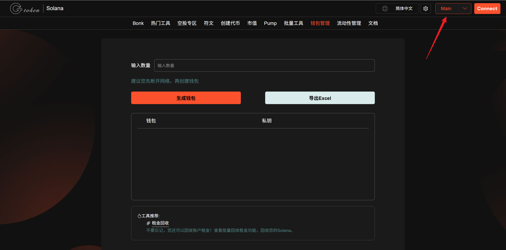
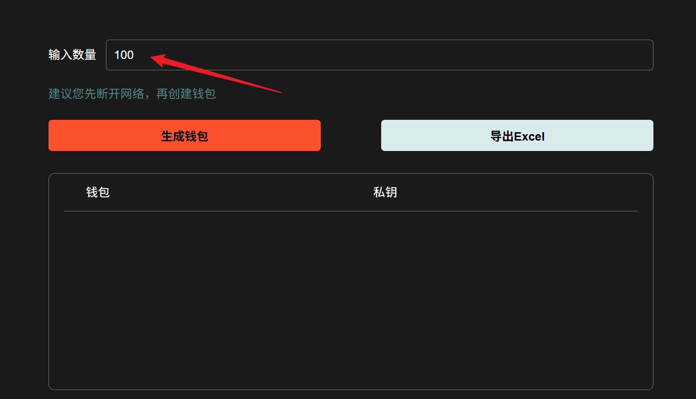
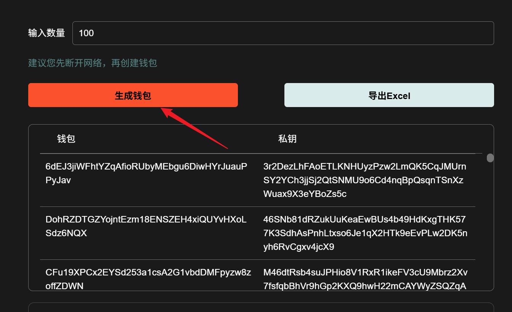
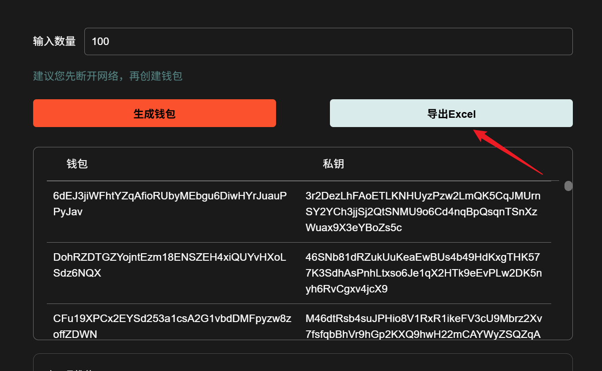

# Solana批量创建钱包地址

**GTokenTool** 的 **Solana 批量创建钱包** 工具主要用于快速生成大量独立地址，支持一键批量产出与导出。该工具具备**极速生成、私钥安全隔离**等特点。优势在于**操作简便且安全性高**，能瞬间构建地址矩阵，大幅提升管理效率。特别适用于需要大规模分发、自动化交互及隐私建仓的 **Solana 开发者与运营团队**。

## 📌核心摘要

* **功能定位：**&#x53;olana 链上地址矩阵生成引擎。通过高强度的随机算法，实现大规模钱包地址的**瞬时去中心化创建。**
* **技术特性：**
  * **高并发生成：**&#x652F;持一键批量产出，解决手动创建低效痛点。
  * **隔离式存储：**&#x79C1;钥逻辑独立隔离，确保底层数据生成的安全性。
  * **结构化导出：**&#x63D0;供标准化的数据导出格式，无缝衔接各类自动化脚本。
* **应用价值：**&#x5927;幅降低地址矩阵的构建成本，为隐私建仓、大规模空投及链上自动化交互提供核心资产基座。
* **目标受众：**&#x91CF;化交易团队、项目冷启动运营者及需要执行多地址策略的专业开发者。

## Solana批量创建钱包地址视频演示



手动批量生成多个Solana钱包是非常耗费时间的，尤其是备份助记词和输入助记词的过程。批量生成SOL钱包工具只需输入你想要生成的钱包数量，即可轻松获得钱包地址、私钥等信息，并且这一过程是本地实现，因此保证了敏感信息的安全性。

## 注意事项

1. 批量生成钱包地址属于公益性质，不收取费用。
2. 生成的钱包仅仅作为临时钱包使用，用完即丢，不要存入核心资产就行。

## Solana批量生成钱包地址具体操作

### 1. 进入页面，选择网络节点

Solana批量创建钱包地址：

[https://sol.gtokentool.com/zh-CN/walletManagement/batchCreateWallet](https://sol.gtokentool.com/zh-CN/walletManagement/batchCreateWallet)

首先我们进入到批量创建钱包的界面，选择 Main 网络节点（无需连接钱包）。

<figure><figcaption>
选择Main网络
</figcaption></figure>

### 2. 输入要创建的钱包数量

<figure><figcaption>
输入钱包数量
</figcaption></figure>

### 3. 点击“生成钱包”

<figure><figcaption>
点击“生成钱包”
</figcaption></figure>

### 4. 点击“导出 Excel”

生成之后会出现钱包地址和私钥，如果你需要保存到本地这可以点击“`导出Excel`”，即可保存本地。

<figure><figcaption>
导出Excel
</figcaption></figure>

## ❓常见问题 FAQ

### Q: 创建的钱包是否带有私钥？如何导出？

**A:** 是的。每个钱包都会自动生成对应私钥，可在操作完成后导出为 xlsx 文件，用于备份或后续操作。

### Q: 这些钱包安全吗？是否会上传私钥？

**A:** 安全。所有钱包生成与私钥处理均在本地浏览器执行，平台不会上传、保存或访问用户的任何私钥信息。

### 🤝 连接 GTokenTool 

* **💬 Telegram社群**：[点击加入官方群组](https://t.me/gtokentool)
* **🐦 Twitter (X)**：[关注我们获取最新动态](https://x.com/gtokentool)
* **📚 官方文档**：[查看 Gitbook 文档](https://docs.gtokentool.com/)
* **💻 开源代码**：[访问 GitHub 仓库](https://github.com/Gtokentool/docs/blob/master/SUMMARY.md)
* **📺 视频教程**：[订阅 YouTube 频道](https://www.youtube.com/@GTokenTool)

> ⚠️ 风险提示与免责声明
>
> GTokenTool 保留随时全权酌情因任何理由修改、变更或取消此公告的权利，无需事先通知。
>
> 以上信息内容仅供参考，GTokenTool 对本平台上的任何虚拟资产、产品或促销活动不做任何推荐或保证。虚拟资产的价格波动很大，投资交易虚拟资产将面临巨大风险。**请谨慎投资。**
