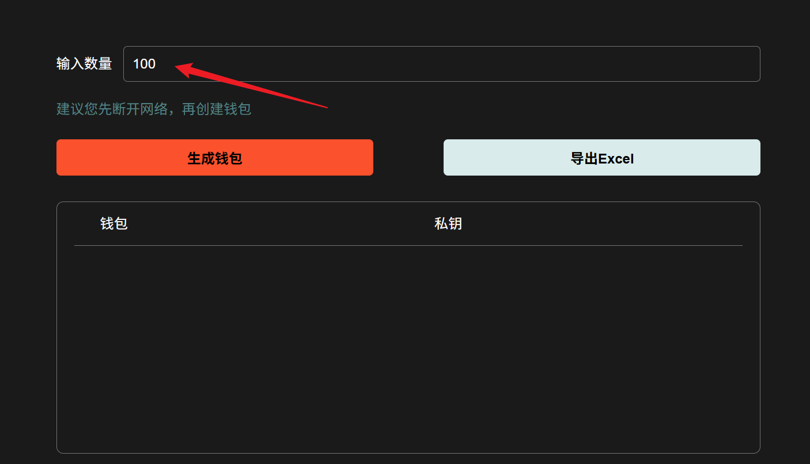

# Solana批量创建钱包地址

## Solana批量创建钱包地址视频演示



手动批量生成多个Solana钱包是非常耗费时间的，尤其是备份助记词和输入助记词的过程。批量生成SOL钱包工具只需输入你想要生成的钱包数量，即可轻松获得钱包地址、私钥等信息，并且这一过程是本地实现，因此保证了敏感信息的安全性。

## 注意事项

1. 批量生成钱包地址属于公益性质，不收取费用。
2. 生成的钱包仅仅作为临时钱包使用，用完即丢，不要存入核心资产就行。

## Solana批量生成钱包地址具体操作

### 1. 进入页面，选择网络节点

Solana批量创建钱包地址：

[https://sol.gtokentool.com/zh-CN/walletManagement/batchCreateWallet](https://sol.gtokentool.com/zh-CN/walletManagement/batchCreateWallet)

首先我们进入到批量创建钱包的界面，选择 Main 网络节点（无需连接钱包）。

<figure><figcaption></figcaption></figure>

### 2. 输入要创建的钱包数量

<figure><figcaption></figcaption></figure>

### 3. 点击“生成钱包”

<figure><figcaption></figcaption></figure>

### 4. 点击“导出 Excel”

生成之后会出现钱包地址和私钥，如果你需要保存到本地这可以点击“`导出Excel`”，即可保存本地。

<figure><figcaption></figcaption></figure>

[_**GTokenTool | 创建代币、批量空投和做市机器人等Solana工具集**_](https://sol.gtokentool.com)

**安全、开源，给Solana用户带来最便利的一站式体验。**

GTokenTool社群:

Telegram：[**https://t.me/gtokentool**](https://t.me/gtokentool)

Twitter:  [**https://x.com/gtokentool**](https://x.com/gtokentool)

Gitbook：[**https://docs.gtokentool.com/**](https://docs.gtokentool.com/)

Github：[**https://github.com/Gtokentool/docs/blob/master/SUMMARY.md**](https://github.com/Gtokentool/docs/blob/master/SUMMARY.md)

YouTube：[**https://www.youtube.com/@GTokenTool**](https://www.youtube.com/@GTokenTool)\
\
\
\
<mark style="color:purple;background-color:orange;">**GTokenTool**</mark>_<mark style="color:purple;background-color:orange;">保留随时全权酌情因任何理由修改、变更或取消此公告的权利，无需事先通知。以上信息内容仅供参考，GTokenTool对本平台上的任何虚拟资产、产品或促销活动不做任何推荐或保证。虚拟资产的价格波动很大，投资交易虚拟资产将面临巨大风险。请谨慎投资。</mark>_
