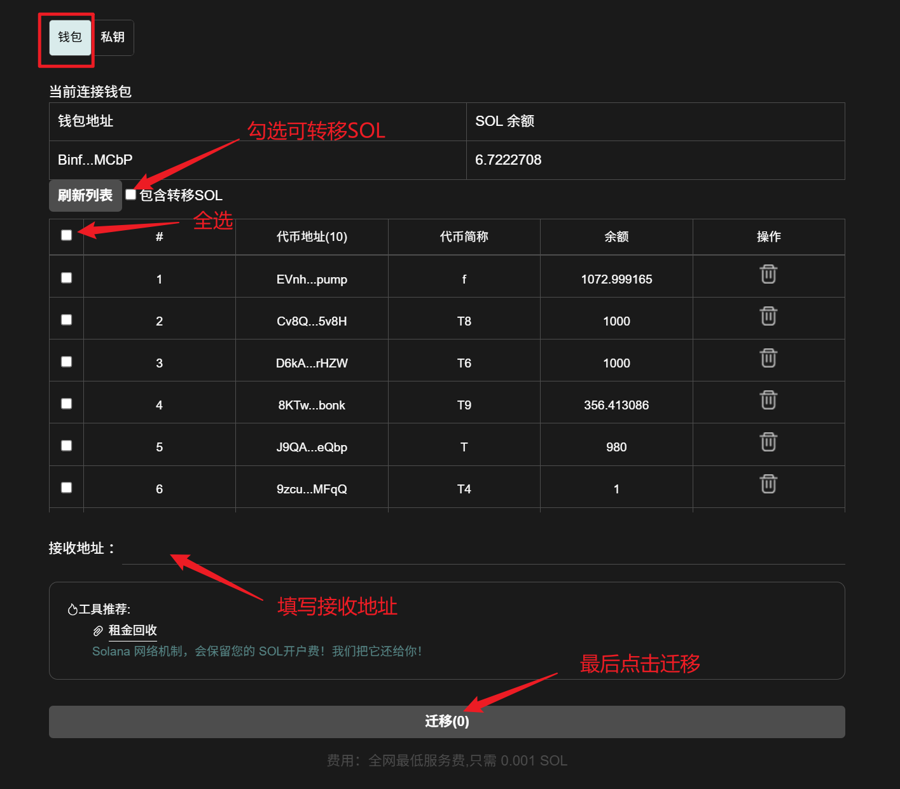
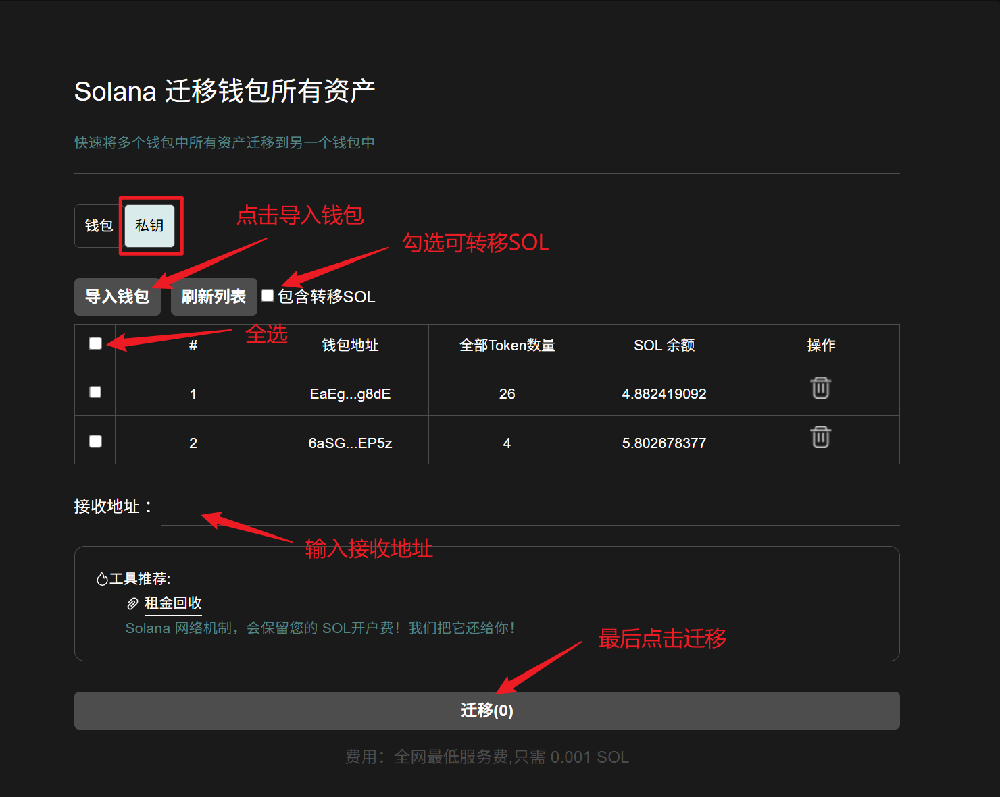

# Solana迁移资产教程

## 📌 核心摘要

* **功能定位：**&#x53;olana 生态一站式资产调度与钱包归集引擎。支持将原钱包中的所有 SOL、SPL 代币及 NFT 完整、快速地迁移至新目标地址。
* **技术特性：**
  * **全资产一键覆盖：**&#x81EA;动识别钱包内全品类资产，无需逐一操作，实现资产流转的“零遗漏”。
  * **原子化交互指令：**&#x901A;过优化的链上打包技术，大幅缩减迁移步骤与 GAS 消耗，确保迁移过程极速上链。
  * **路径安全隔离：**&#x4E25;谨的签名确认流程，保障资产在不同钱包地址间迁移的安全性与私密性。
* **应用价值：**&#x6781;大地简化了用户更换钱包、资金归集或安全避险时的操作成本，是执行钱包更替与资产重组的高效管理工具。
* **目标受众：**&#x9700;要进行钱包升级的个人用户、需归集零散资金的资管团队，以及执行安全风险隔离的专业投资者。

## Solana迁移资产流程

迁移资产链接：[https://sol.gtokentool.com/zh-CN/walletManagement/migrateAssets](https://sol.gtokentool.com/zh-CN/walletManagement/migrateAssets)

进入迁移资产页面，选择 Main 网络节点，并连接钱包。

### 1. 迁移当前连接钱包资产

<figure><figcaption>
迁移当前连接钱包资产
</figcaption></figure>

### 2. 导入钱包迁移资产

<figure><figcaption>
导入钱包迁移资产
</figcaption></figure>

## ❓常见问题 FAQ

### Q: Solana 资产迁移是什么？

**A:** 将当前钱包内的 SOL、SPL 代币、NFT等资产，批量转移到新钱包 / 目标地址。

### Q: 迁移会影响我代币本身吗？比如权限、持币权益？

**A:** 不会。仅做资产地址划转，代币合约、持币分红、空投权益、LP 仓位、权限配置**完全不变**；只要不销毁 / 不卖币，持币权益正常保留。

### 🤝 连接 GTokenTool 

* **💬 Telegram社群**：[点击加入官方群组](https://t.me/gtokentool)
* **🐦 Twitter (X)**：[关注我们获取最新动态](https://x.com/gtokentool)
* **📚 官方文档**：[查看 Gitbook 文档](https://docs.gtokentool.com/)
* **💻 开源代码**：[访问 GitHub 仓库](https://github.com/Gtokentool/docs/blob/master/SUMMARY.md)
* **📺 视频教程**：[订阅 YouTube 频道](https://www.youtube.com/@GTokenTool)

> ⚠️ 风险提示与免责声明
>
> GTokenTool 保留随时全权酌情因任何理由修改、变更或取消此公告的权利，无需事先通知。
>
> 以上信息内容仅供参考，GTokenTool 对本平台上的任何虚拟资产、产品或促销活动不做任何推荐或保证。虚拟资产的价格波动很大，投资交易虚拟资产将面临巨大风险。**请谨慎投资。**
