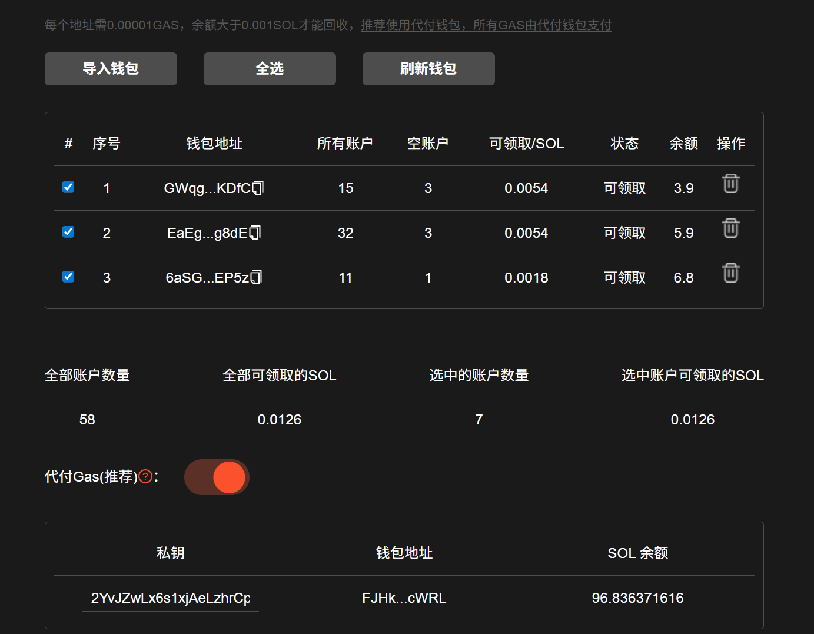

# 🗑️ Solana批量租金回收教程


<mark style="color:green;">批量回收账户租金 | solana关闭账户</mark>&#x20;

<mark style="color:blue;">在 Solana 网络，每个代币和 NFT 都有独立的账户，这些账户需存入一定数量的 SOL 作为租金才能正常使用。通过简单步骤，销毁不需要的 NFT 或代币，快速回收账户租金。</mark>

<mark style="color:green;">全网最低</mark> <mark style="color:green;"></mark><mark style="color:green;">**GAS费用**</mark><mark style="color:green;">，服务费仅</mark> <mark style="color:green;"></mark><mark style="color:green;">**5%**</mark><mark style="color:green;">， 分享赚钱还可获得</mark><mark style="color:green;">**30%**</mark><mark style="color:green;">服务费。</mark>


## 视频演示



## 准备事项

1. 一台电脑或者一部手机
2. Solana 钱包（[幻影钱包Phantom安装教程](https://docs.gtokentool.com/solana/auxiliary-tutorial/phantom-wallet-installation)）
3. 接收过代币的钱包
4. 需要回收租金的钱包地址私钥
5. 一些 SOL 用于支付链上 GAS费用

## Solana批量租金回收流程

### 1. 连接钱包

Solana批量租金回收：[https://sol.gtokentool.com/zh-CN/walletManagement/batchRentRecovery](https://sol.gtokentool.com/zh-CN/walletManagement/batchRentRecovery)

进入 GTokenTool 批量租金回收页面，在右上角选择 Main 网络并连接钱包，这里使用测试网演示。

<figure><figcaption></figcaption></figure>

### 2. 导入需要回收的钱包


**特别说明：**

* 私钥仅在本地计算并签名交易，但Web3仍存在很多不确定因素；
* GTokenTool诚挚建议您在使用涉及私钥的功能后，及时更换钱包；
* 切勿因嫌麻烦而忽视安全问题，以免造成不必要的损失。


<mark style="color:purple;">导入钱包后，可以查看钱包地址、所有账户数量、空账户数量、预估可回收领取的 SOL 数量以及领取状态。</mark>

<figure><figcaption></figcaption></figure>

### 3. 开启代付Gas（推荐）

导入钱包私钥，可以看到钱包地址和余额。请确保钱包内余额充足。

<figure><figcaption></figcaption></figure>

### 4. 选择要回收的钱包

空账户都是余额为0，没有任何用处的，请放心领取。关闭不会对钱包使用有任何的影响。

选中钱包后，可以看到选中账户可领取的SOL。

<figure><figcaption></figcaption></figure>

### 5. 回收SOL到指定钱包地址

<mark style="color:purple;">回收 SOL 到指定钱包地址仅需支付 1 次 GAS，回收时会自动修改为用户指定的地址接收租金，降低成本，无需浪费 GAS 二次归集。</mark>

如果不填写则默认回收租金 SOL 至对应钱包。

<figure><figcaption></figcaption></figure>

### 6. 确认回收等待批量回收租金完成

<mark style="color:purple;">回收前需要确保待回收账户中有一些 SOL 用于支付链上 GAS，如无 GAS 将会回收失败。</mark>如果使用代付Gas，则无需考虑，只需确保代付钱包余额充足。

<figure><figcaption></figcaption></figure>


**提醒：**

1. 保护私钥：GTokenTool只在本地计算并用于签署交易，绝不收集或上传您的私钥或敏感信息。
2. 如果回收所有账户，所有代币都将被销毁，无法撤销。请确保代币已经没有价值!
3. 回收的SOL是通过关闭存储该代币的帐户来实现的，无论帐户持有1个还是100000个代币，回收金额都是相同的。
4. 预估可收回金额可能与实际回收的金额有所差异，请以交易执行后的实际结果为准。
5. 每个地址需0.00001 GAS，余额大于0.001 SOL才能回收，<mark style="color:red;">推荐使用代付钱包，所有GAS由代付钱包支付。</mark>
6. 接收地址，推荐地址余额必须大于0.001 SOL，否则会回收失败。


[_**GTokenTool | 创建代币、批量空投和做市机器人等Solana工具集**_](https://sol.gtokentool.com)

**安全、开源，给Solana用户带来最便利的一站式体验。**

GTokenTool社群:

Telegram：[**https://t.me/gtokentool**](https://t.me/gtokentool)

Twitter:  [**https://x.com/gtokentool**](https://x.com/gtokentool)

Gitbook：[**https://docs.gtokentool.com/**](https://docs.gtokentool.com/)

Github：[**https://github.com/Gtokentool/docs/blob/master/SUMMARY.md**](https://github.com/Gtokentool/docs/blob/master/SUMMARY.md)

YouTube：[**https://www.youtube.com/@GTokenTool**](https://www.youtube.com/@GTokenTool)\
\
\
\
<mark style="color:purple;background-color:orange;">**GTokenTool**</mark>_<mark style="color:purple;background-color:orange;">保留随时全权酌情因任何理由修改、变更或取消此公告的权利，无需事先通知。以上信息内容仅供参考，GTokenTool对本平台上的任何虚拟资产、产品或促销活动不做任何推荐或保证。虚拟资产的价格波动很大，投资交易虚拟资产将面临巨大风险。请谨慎投资。</mark>_
