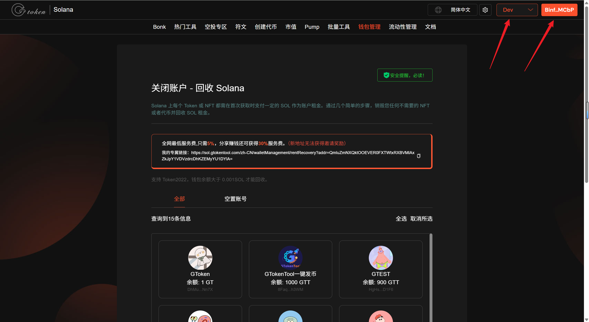
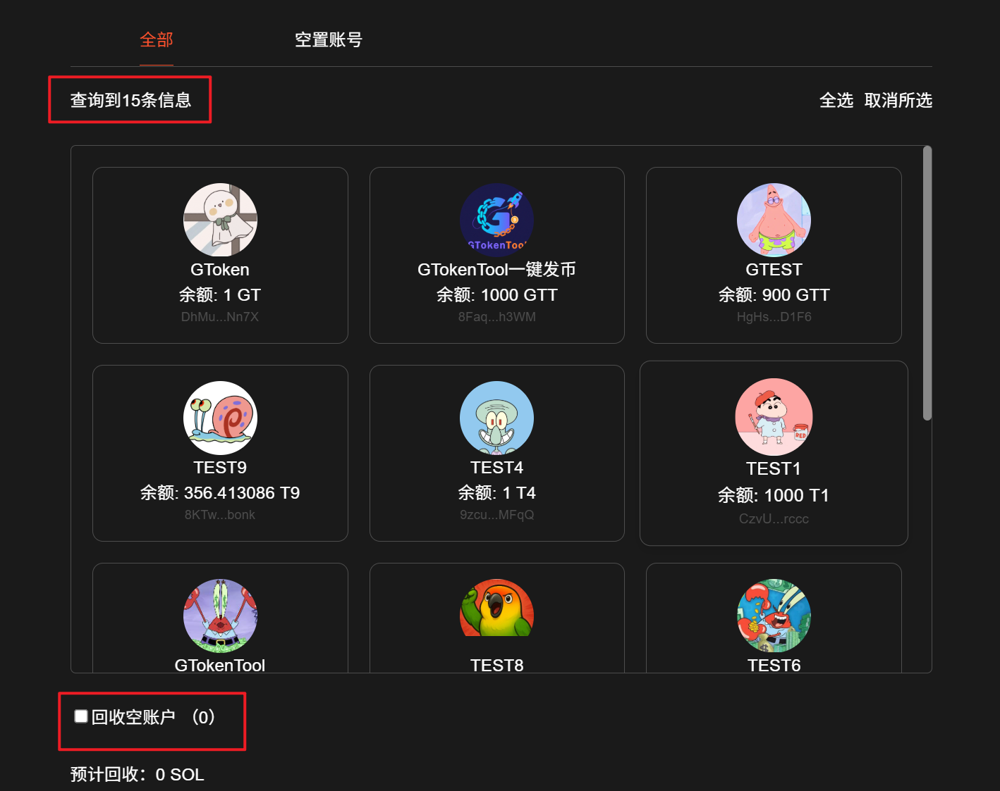
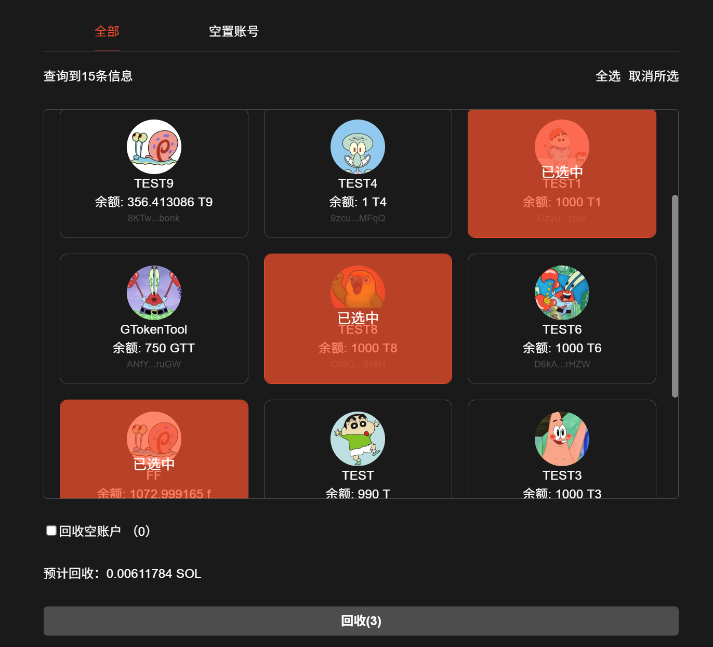
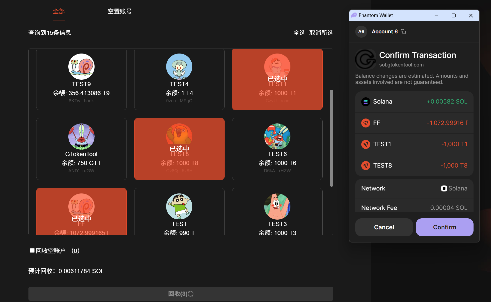
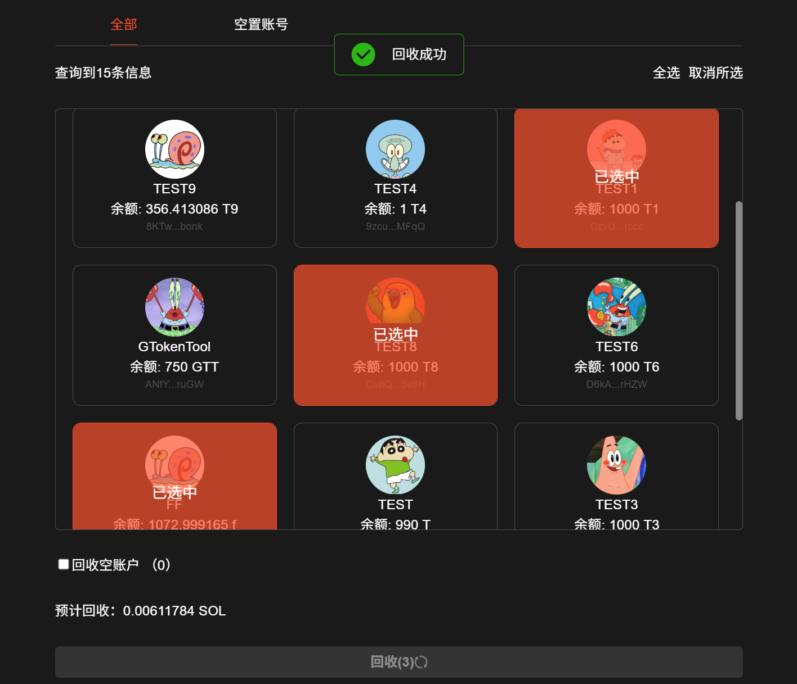

# ♻️ Solana租金回收教程

在 Solana 网络，每个代币和 NFT 都有独立的账户，这些账户需存入一定数量的 SOL 作为租金才能正常使用。通过简单步骤，销毁不需要的 NFT 或代币，快速回收账户租金。

> <mark style="color:$success;">solana 租金回收</mark><mark style="color:$success;">全网最低</mark> <mark style="color:$success;"></mark><mark style="color:$success;">**GAS费用**</mark><mark style="color:$success;">，服务费仅</mark> <mark style="color:$success;"></mark><mark style="color:$success;">**5%**</mark><mark style="color:$success;">， 分享赚钱还可获得</mark><mark style="color:$success;">**30%**</mark><mark style="color:$success;">服务费。</mark>

### Solana租金回收视频教程



### 📌 核心摘要

* **功能定位：**&#x53;olana 链上闲置资产清算与租金回收引擎。通过销毁（Burn）或关闭（Close）无用的代币账户及 NFT，释放并回收被锁定的 SOL 租金。
* **技术特性：**
  * **全量扫描识别：**&#x667A;能检索钱包内零余额账户及僵尸 NFT，精准计算可回收的 SOL 总额。
  * **极简交互流程：**&#x6253;破链上复杂指令壁垒，支持一键批量关闭账户，资金瞬时退回主钱包。
  * **经济模型优势：**&#x5168;网极低 GAS 成本，仅收取 5% 极低服务费，并配套 30% 返佣奖励机制。
* **应用价值：**&#x5B9E;现链上资产的“断舍离”，将无价值的垃圾资产转化为流动性代币，是**提升钱包资金利用率**与清理冗余数据的核心工具。
* **目标受众：**&#x62E5;有大量空置代币账户的项目方、资深 NFT 收藏家以及希望优化钱包资产结构的 Solana 活跃用户。

### 如何使用 Solana 关闭账户，回收租金工具

1. 连接钱包
2. 等待账户查询信息
3. 选择要关闭并租金回收的账户
4. 复核要燃烧并关闭的代币或 NFT 账户
5. 确认关闭等待租金回收完成

### 准备事项

1. 一台电脑或者一部手机
2. Solana 钱包（[幻影钱包Phantom安装教程](https://docs.gtokentool.com/solana/auxiliary-tutorial/phantom-wallet-installation)）
3. 历史接收过代币的钱包
4. 一些 SOL 用于支付链上 GAS

### Solana租金回收流程

#### 1. 连接钱包

Solana 租金回收：[https://sol.gtokentool.com/zh-CN/walletManagement/rentRecovery](https://sol.gtokentool.com/zh-CN/walletManagement/rentRecovery)

进入 GTokenTool 租金回收页面，在右上角选择 Main 网络并连接钱包，这里使用测试网演示。

<figure><figcaption>
连接钱包并选择网络
</figcaption></figure>

#### 2. 等待账户查询信息

<figure><figcaption>
查询账户信息
</figcaption></figure>

#### 3. 选择要关闭并租金回收的账户

**常见类型为空置账户和普通代币账户。**

**空置账户：**&#x90FD;是余额为0，没有任何用处的，请放心领取。关闭不会对钱包使用有任何的影响。

**普通代币：**&#x6709;代币的账户会燃烧后回收租金，燃烧过程不可逆，所以一定要确认要关闭的代币账户是否还有价值。

<figure><figcaption>
选择要关闭的账户
</figcaption></figure>

#### 4. 复核要燃烧并关闭的代币或 NFT 账户

燃烧过程不可逆，再次复核要燃烧并关闭的代币和 NFT 账户。

#### 5. 确认关闭等待租金回收完成

如果需要关闭的账户较多，需要统计账户相关信息，还请耐心等待。

<figure><figcaption>
钱包确认
</figcaption></figure>

租金回收成功后，会有提示显示“回收成功”。

<figure><figcaption>
回收成功提示
</figcaption></figure>


1. 在此页面上标记的任何代币都将被销毁，无法撤销。请确保您选择了正确的子账户!
2. 回收的SOL是通过关闭存储该代币的帐户来实现的，无论帐户持有1个还是100000个代币，回收金额都是相同的。
3. 预估可收回金额可能与实际回收的金额有所差异，请以交易执行后的实际结果为准。


## ❓常见问题 FAQ

### Q: Solana 账户租金是什么？

**A:** 在 Solana 网络，每个代币和 NFT 都有独立的账户，这些账户需存入一定数量的 SOL 作为租金才能正常使用。

### Q; 如何回收租金？

**A:** 如需关闭 Solana 账户，请先清空账户内所有剩余的代币或 NFT。关闭后，用作租金的 SOL 将退还给你。

### 🤝 连接 GTokenTool 

* **💬 Telegram社群**：[点击加入官方群组](https://t.me/gtokentool)
* **🐦 Twitter (X)**：[关注我们获取最新动态](https://x.com/gtokentool)
* **📚 官方文档**：[查看 Gitbook 文档](https://docs.gtokentool.com/)
* **💻 开源代码**：[访问 GitHub 仓库](https://github.com/Gtokentool/docs/blob/master/SUMMARY.md)
* **📺 视频教程**：[订阅 YouTube 频道](https://www.youtube.com/@GTokenTool)

> ⚠️ 风险提示与免责声明
>
> GTokenTool 保留随时全权酌情因任何理由修改、变更或取消此公告的权利，无需事先通知。
>
> 以上信息内容仅供参考，GTokenTool 对本平台上的任何虚拟资产、产品或促销活动不做任何推荐或保证。虚拟资产的价格波动很大，投资交易虚拟资产将面临巨大风险。**请谨慎投资。**
