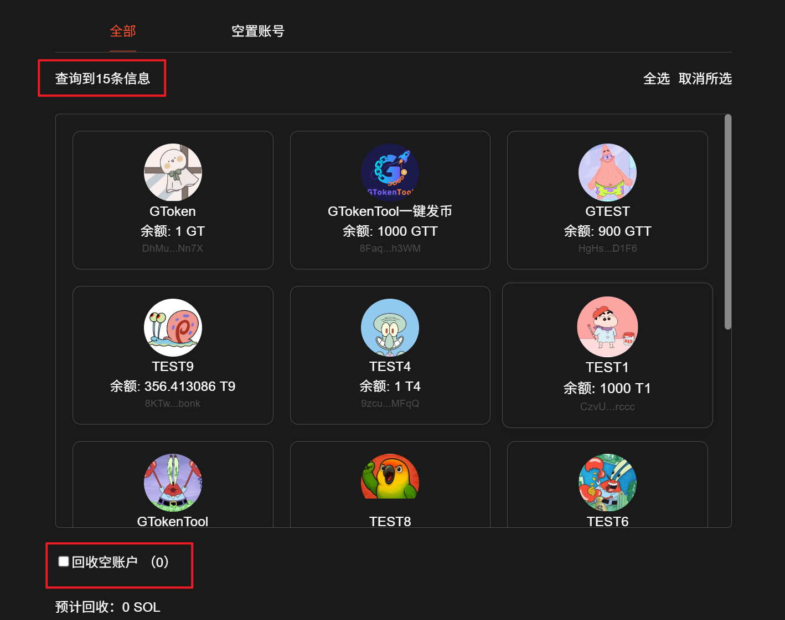

# ♻️ Solana租金回收教程

<mark style="color:green;">全网最低</mark> <mark style="color:green;"></mark><mark style="color:green;">**GAS费用**</mark><mark style="color:green;">，服务费仅</mark> <mark style="color:green;"></mark><mark style="color:green;">**5%**</mark><mark style="color:green;">， 分享赚钱还可获得</mark><mark style="color:green;">**30%**</mark><mark style="color:green;">服务费。</mark>

## 如何使用 Solana 关闭账户，回收租金工具

1. 链接钱包
2. 等待账户查询信息
3. 选择要关闭并租金回收的账户
4. 复核要燃烧并关闭的代币或 NFT 账户
5. 确认关闭等待租金回收完成

## 准备事项

1. 一台电脑或者一部手机
2. Solana 钱包（[幻影钱包Phantom安装教程](https://docs.gtokentool.com/solana/auxiliary-tutorial/phantom-wallet-installation)）
3. 历史接收过代币的钱包
4. 一些 SOL 用于支付链上 GAS

## Solana租金回收流程

### 1. 连接钱包

Solana租金回收：[https://sol.gtokentool.com/zh-CN/walletManagement/rentRecovery](https://sol.gtokentool.com/zh-CN/walletManagement/rentRecovery)

进入 GTokenTool 租金回收页面，在右上角选择 Main 网络并连接钱包，这里使用测试网演示。

<figure><figcaption></figcaption></figure>

### 2. 等待账户查询信息

<figure><figcaption></figcaption></figure>

### 3. 选择要关闭并租金回收的账户

**常见类型为空置账户和普通代币账户。**

**空置账户：**&#x90FD;是余额为0，没有任何用处的，请放心领取。关闭不会对钱包使用有任何的影响。

**普通代币：**&#x6709;代币的账户会燃烧后回收租金，燃烧过程不可逆，所以一定要确认要关闭的代币账户是否还有价值。

<figure><figcaption></figcaption></figure>

### 4. 复核要燃烧并关闭的代币或 NFT 账户

燃烧过程不可逆，再次复核要燃烧并关闭的代币和 NFT 账户。

### 5. 确认关闭等待租金回收完成

如果需要关闭的账户较多，需要统计账户相关信息，还请耐心等待。

<figure><figcaption></figcaption></figure>

回收成功后，会有提示显示“回收成功”。

<figure><figcaption></figcaption></figure>


1. 在此页面上标记的任何代币都将被销毁，无法撤销。请确保您选择了正确的子账户!
2. 回收的SOL是通过关闭存储该代币的帐户来实现的，无论帐户持有1个还是100000个代币，回收金额都是相同的。
3. 预估可收回金额可能与实际回收的金额有所差异，请以交易执行后的实际结果为准。


## 常见问题

### 1. Solana 账户租金是什么？

答：在 Solana 网络，每个代币和 NFT 都有独立的账户，这些账户需存入一定数量的 SOL 作为租金才能正常使用。

### 2. 如何回收账户租金？

答：如需关闭 Solana 账户，请先清空账户内所有剩余的代币或 NFT。关闭后，用作租金的 SOL 将退还给你。

[_**GTokenTool | 创建代币、批量空投和做市机器人等Solana工具集**_](https://sol.gtokentool.com)

**安全、开源，给Solana用户带来最便利的一站式体验。**

GTokenTool社群:

Telegram：[**https://t.me/gtokentool**](https://t.me/gtokentool)

Twitter:  [**https://x.com/gtokentool**](https://x.com/gtokentool)

Gitbook：[**https://docs.gtokentool.com/**](https://docs.gtokentool.com/)

Github：[**https://github.com/Gtokentool/docs/blob/master/SUMMARY.md**](https://github.com/Gtokentool/docs/blob/master/SUMMARY.md)

YouTube：[**https://www.youtube.com/@GTokenTool**](https://www.youtube.com/@GTokenTool)\
\
\
<mark style="color:purple;background-color:orange;">**GTokenTool**</mark>_<mark style="color:purple;background-color:orange;">保留随时全权酌情因任何理由修改、变更或取消此公告的权利，无需事先通知。以上信息内容仅供参考，GTokenTool对本平台上的任何虚拟资产、产品或促销活动不做任何推荐或保证。虚拟资产的价格波动很大，投资交易虚拟资产将面临巨大风险。请谨慎投资。</mark>_
