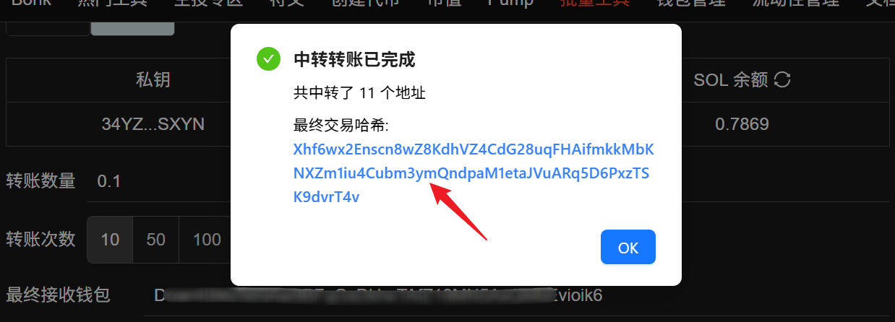

# SOL中转转账教程


**Solana中转转账 | 隐藏转账痕迹 | 提高账户隐私和安全性**

中转转账功能，旨在为用户提供一种更加隐蔽和安全的转账方式。通过多次中转，用户可以有效隐藏转账路径，从而提高资金转移的隐私性和安全性。

[立即体验>>>](https://sol.gtokentool.com/zh-CN/batchTool/relayTransfer)


## 准备事项 

1. 一台电脑或者一部手机
2. Solana 钱包（[幻影钱包Phantom安装教程](https://docs.gtokentool.com/solana/auxiliary-tutorial/phantom-wallet-installation)）
3. 要转出和接收SOL的钱包
4. 确保转出地址有足够的SOL

## SOL中转转账具体步骤

### 1. 连接钱包

SOL中转转账：[https://sol.gtokentool.com/zh-CN/walletManagement/relayTransfer](https://sol.gtokentool.com/zh-CN/walletManagement/relayTransfer)

进入SOL中转转账页面，右上角支持切换成中文。选择 Main 网络并连接钱包。

<figure><figcaption></figcaption></figure>

### 2. 选择钱包操作或者私钥操作

**钱包操作：**&#x4F7F;用当前连接的钱包进行转出操作。

**私钥操作：**&#x5BFC;入要转出的钱包地址私钥，使用导入的钱包进行转出操作。

<figure><figcaption></figcaption></figure>

<figure><figcaption></figcaption></figure>

### 3. 设置转账数量

转出的 SOL 数量，最终到账的金额需要扣除转账 GAS 和服务费。

每中转 100 个地址服务费仅需 0.01 SOL。

<figure><figcaption></figcaption></figure>

### 4. 设置转账次数

支持快捷设置和自定义地址数量设置。转出金额后会经过每个中转地址，到最终接收的地址中。

设置好转账数量和转账次数后，可以看到下面的预估到账金额。若金额小于0.001，转账不会成功。<mark style="color:purple;">SOL 最小转账金额为 0.001 SOL，需要确保最终到账的金额大于 0.001 SOL才可成功。</mark>

<figure><figcaption></figcaption></figure>

### 5. 设置最终接收地址

<mark style="color:purple;">避免钓鱼，不要从最近转账记录中复制钱包地址。</mark>

<figure><figcaption></figcaption></figure>

### 6. Jito小费设置

<figure><figcaption></figcaption></figure>

### 7. 生成中转地址并下载保存

点击“`生成地址`”，会根据设置的中转地址数生成，生成完成后钱包列表里会记录生成的地址和私钥。若没有下载地址文件，可以再次点击的“`下载`”，再次下载钱包地址文件。

然后点击第二步“`下载地址`”，<mark style="color:purple;">为避免中转转账造成资产损失，务必检查中转转账所需地址文件已经保存。最好打开文件检查数据是否保存完整！！！</mark>

<figure><figcaption></figcaption></figure>

### 8. 点击“立即转账”

点击“`立即转账`”后，会弹出提示：<mark style="color:purple;">即将开始中转转账，请再次检查中转所需地址已下载，请务必打开已下载的Excel表格，核对地址信息是否完整保存！！！</mark>请确认好后再点击“`继续转账`”。

<figure><figcaption></figcaption></figure>

开始交易后，可以实时看到转账的进度。

<figure><figcaption></figcaption></figure>

转账完成会显示最后一次转账的哈希，可以点击哈希值去查看交易。

<figure><figcaption></figcaption></figure>

[_**GTokenTool | 创建代币、批量空投和做市机器人等Solana工具集**_](https://sol.gtokentool.com)

**安全、开源，给Solana用户带来最便利的一站式体验。**

GTokenTool社群:

Telegram：[**https://t.me/gtokentool**](https://t.me/gtokentool)

Twitter:  [**https://x.com/gtokentool**](https://x.com/gtokentool)

Gitbook：[**https://docs.gtokentool.com/**](https://docs.gtokentool.com/)

Github：[**https://github.com/Gtokentool/docs/blob/master/SUMMARY.md**](https://github.com/Gtokentool/docs/blob/master/SUMMARY.md)

YouTube：[**https://www.youtube.com/@GTokenTool**](https://www.youtube.com/@GTokenTool)\
\
\
<mark style="color:purple;background-color:orange;">**GTokenTool**</mark>_<mark style="color:purple;background-color:orange;">保留随时全权酌情因任何理由修改、变更或取消此公告的权利，无需事先通知。以上信息内容仅供参考，GTokenTool对本平台上的任何虚拟资产、产品或促销活动不做任何推荐或保证。虚拟资产的价格波动很大，投资交易虚拟资产将面临巨大风险。请谨慎投资。</mark>_
