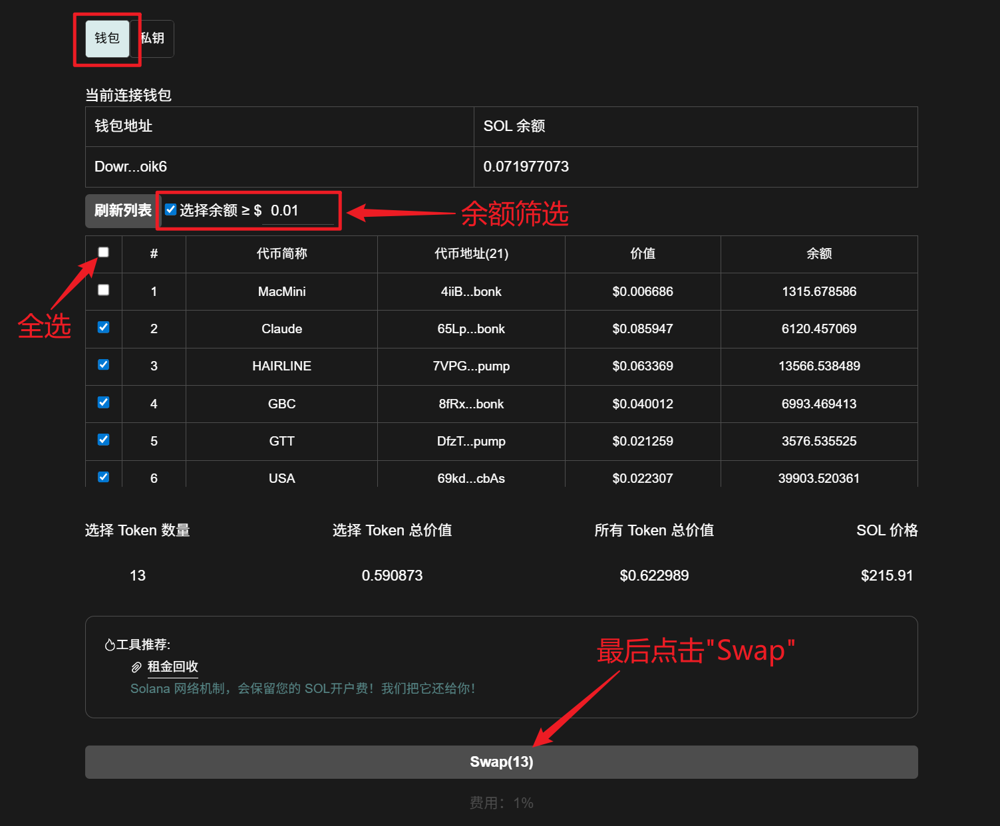
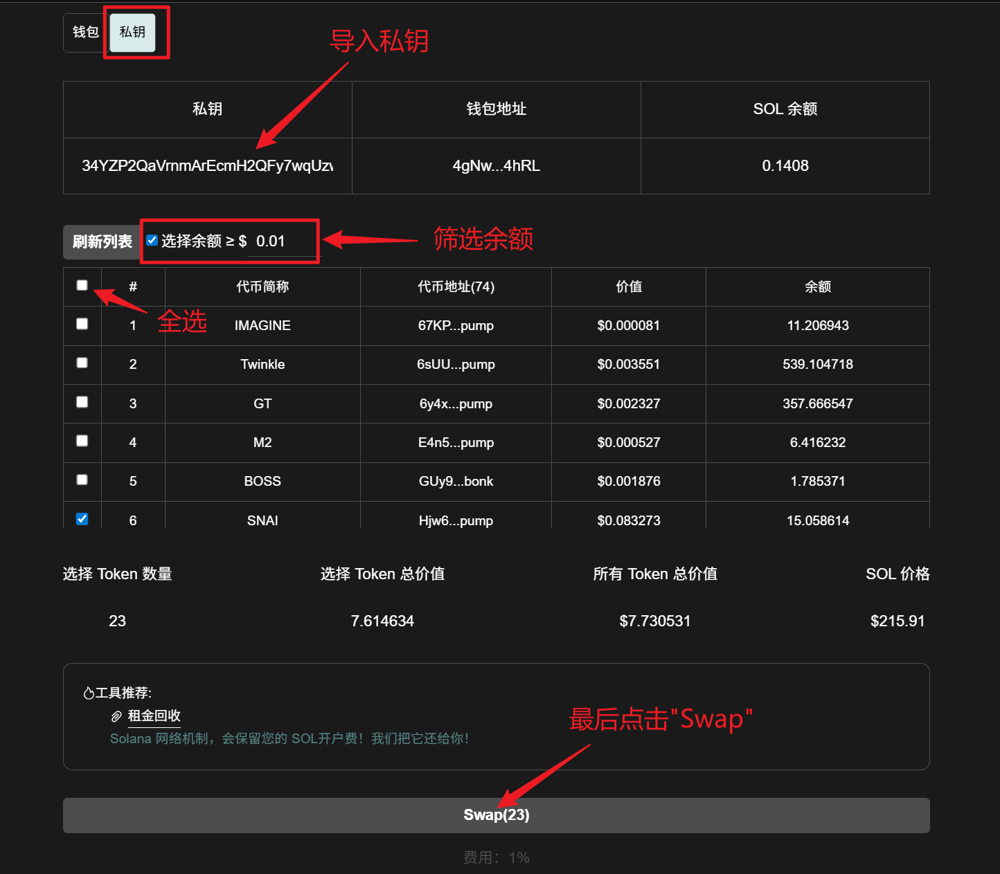

# Solana一键清仓教程

一键清仓链接：[https://sol.gtokentool.com/zh-CN/walletManagement/swapWalletAllToken](https://sol.gtokentool.com/zh-CN/walletManagement/swapWalletAllToken)

进入一键清仓页面，选择 Main 网络节点，并连接钱包。

### 1. 卖出当前连接钱包资产

<figure><figcaption></figcaption></figure>

### 2. 卖出导入钱包资产

<figure><figcaption></figcaption></figure>

## 常见问题 FAQ

### Q: **一键清仓会卖出钱包中的所有代币吗？**

**A:** 系统会检测钱包中的代币列表，您可以选择需要清仓的 Token，确认后才会执行卖出操作。

### Q: **为什么清仓前需要保留一定数量的 SOL？**

**A:** 每笔交易都需要支付 Gas 费用，同时还需要支付平台服务费，因此钱包中需要保留一定的 SOL 才能完成清仓交易。

### Q: **如果没有检测到代币怎么办？**

**A:** 可以点击`刷新列表`按钮重新扫描钱包资产。如果仍未检测到，可能是该代币暂未被系统识别或没有可交易流动性。

### Q: **清仓过程中如果交易失败会扣费吗？**

**A:** 如果交易未成功执行，平台不会收取服务费，但链上交易产生的 Gas 费用仍可能产生。

[_**GTokenTool | 创建代币、批量空投和做市机器人等Solana工具集**_](https://sol.gtokentool.com)

**安全、开源，给Solana用户带来最便利的一站式体验。**

GTokenTool社群:

Telegram：[**https://t.me/gtokentool**](https://t.me/gtokentool)

Twitter:  [**https://x.com/gtokentool**](https://x.com/gtokentool)

Gitbook：[**https://docs.gtokentool.com/**](https://docs.gtokentool.com/)

Github：[**https://github.com/Gtokentool/docs/blob/master/SUMMARY.md**](https://github.com/Gtokentool/docs/blob/master/SUMMARY.md)

YouTube：[**https://www.youtube.com/@GTokenTool**](https://www.youtube.com/@GTokenTool)\
\
\
<mark style="color:purple;background-color:orange;">**GTokenTool**</mark>_<mark style="color:purple;background-color:orange;">保留随时全权酌情因任何理由修改、变更或取消此公告的权利，无需事先通知。以上信息内容仅供参考，GTokenTool对本平台上的任何虚拟资产、产品或促销活动不做任何推荐或保证。虚拟资产的价格波动很大，投资交易虚拟资产将面临巨大风险。请谨慎投资。</mark>_
