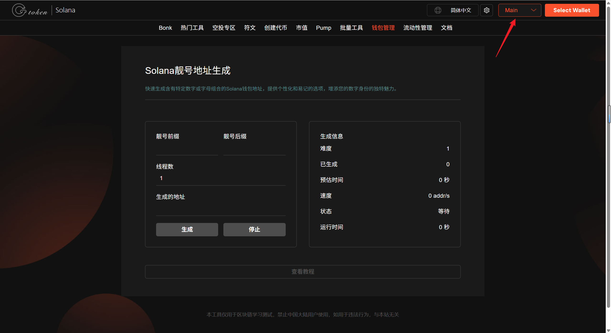
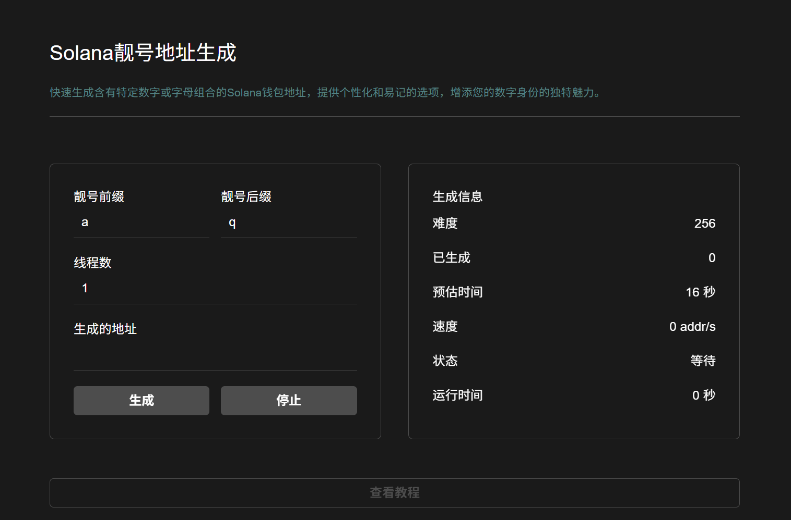
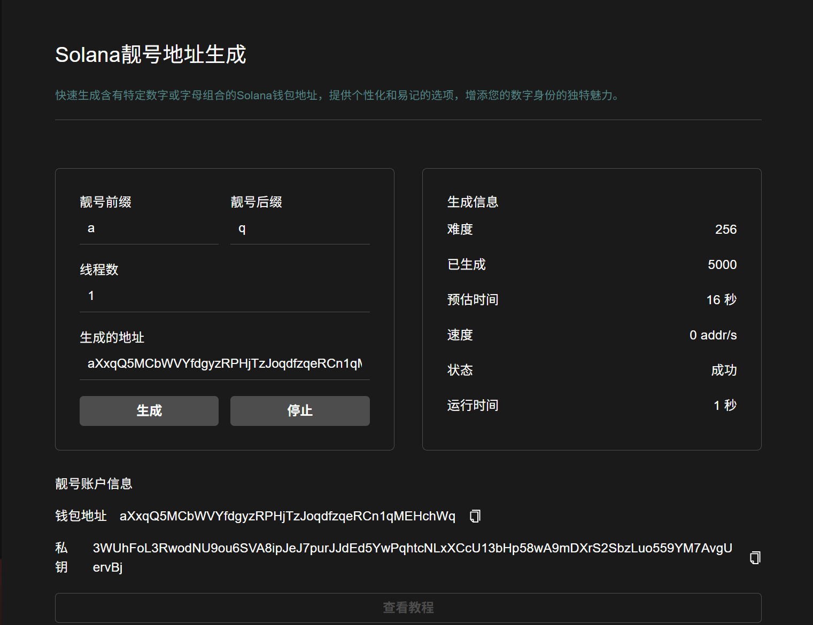

# 🔥 Solana靓号钱包生成教程

## 📌 核心摘要

* **功能定位：**&#x53;olana 链上个性化地址定制引擎。支持用户通过自定义字符匹配，生成具备特定前缀或后缀的靓号钱包地址（Vanity Address）。
* **技术特性：**
  * **深度定制化：**&#x652F;持区分大小写及多种字符组合，满足从项目品牌化到个人身份标识的全场景定制需求。
  * **算力优化算法：**&#x91C7;用高性能碰撞算法，大幅缩短复杂靓号的生成耗时，提升计算效率。
  * **私密与安全：**&#x751F;成过程完全基于本地/前端逻辑，确保私钥不经过网络传输，从源头保障资产安全。
* **应用价值：**&#x663E;著提升品牌辨识度与链上可信度，是项目方官方地址、大额资产存放或社交展示的首选品牌名片。
* **目标受众：**&#x6CE8;重品牌建设的项目团队、追求个性化标识的资深玩家及需要高辨识度收款地址的机构用户。


为避免混淆，Solana合约地址不可使用数字"0"，字母大写"O"，字母大写"I"，和字母小写"l"


## 视频演示



## 如何使用 Solana 靓号钱包生成工具

1. 打开 GTokenTool 靓号地址生成页面
2. 输入您想要自定义的靓号前缀和后缀
3. 开始生成靓号，等待输出靓号信息
4. 保存已生成的私钥，导入其他钱包

## 准备事项

1. 一台电脑或者一部手机
2. Solana 钱包（[幻影钱包Phantom安装教程](https://docs.gtokentool.com/solana/huan-ying-qian-bao-phantom-an-zhuang-jiao-cheng)）

## 具体步骤

### 1. 进入页面，选择网络节点

Solana靓号地址生成：[https://sol.gtokentool.com/zh-CN/walletManagement/LiangHao](https://sol.gtokentool.com/zh-CN/walletManagement/LiangHao)

进入GTokenTool创建靓号代币页面，在右上角选择 Main 网络 (无需连接钱包）。

<figure><figcaption>
选择Main网络
</figcaption></figure>

### 2. 输入您想要自定义的靓号前缀和后缀


建议自定义 5 位字符以内靓号，避免耗时过久。


<figure><figcaption>
输入前缀和后缀
</figcaption></figure>

### 3. 开始生成靓号

等待输出靓号信息，<mark style="color:purple;">保存私钥</mark>。

<figure><figcaption>
生成靓号
</figcaption></figure>


**安全提醒：**

采用最新256位32字节随机种子进行随机生成私钥, 并通过keccak-256生成公钥根据用户设置匹配对应格式地址。无需担心被破解！


### 🤝 连接 GTokenTool 

* **💬 Telegram社群**：[点击加入官方群组](https://t.me/gtokentool)
* **🐦 Twitter (X)**：[关注我们获取最新动态](https://x.com/gtokentool)
* **📚 官方文档**：[查看 Gitbook 文档](https://docs.gtokentool.com/)
* **💻 开源代码**：[访问 GitHub 仓库](https://github.com/Gtokentool/docs/blob/master/SUMMARY.md)
* **📺 视频教程**：[订阅 YouTube 频道](https://www.youtube.com/@GTokenTool)

> ⚠️ 风险提示与免责声明
>
> GTokenTool 保留随时全权酌情因任何理由修改、变更或取消此公告的权利，无需事先通知。
>
> 以上信息内容仅供参考，GTokenTool 对本平台上的任何虚拟资产、产品或促销活动不做任何推荐或保证。虚拟资产的价格波动很大，投资交易虚拟资产将面临巨大风险。**请谨慎投资。**
