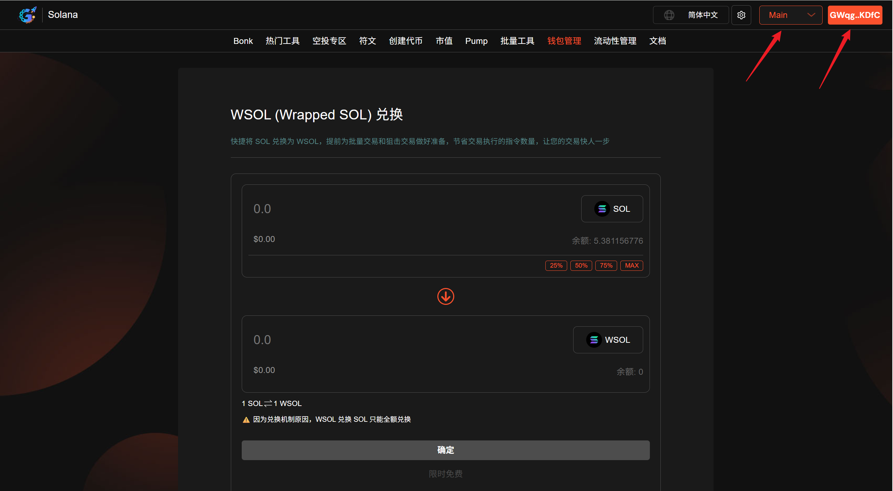
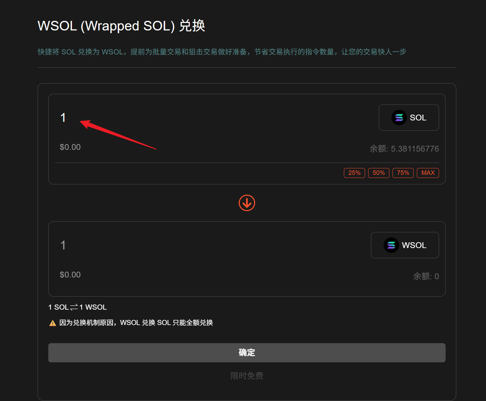
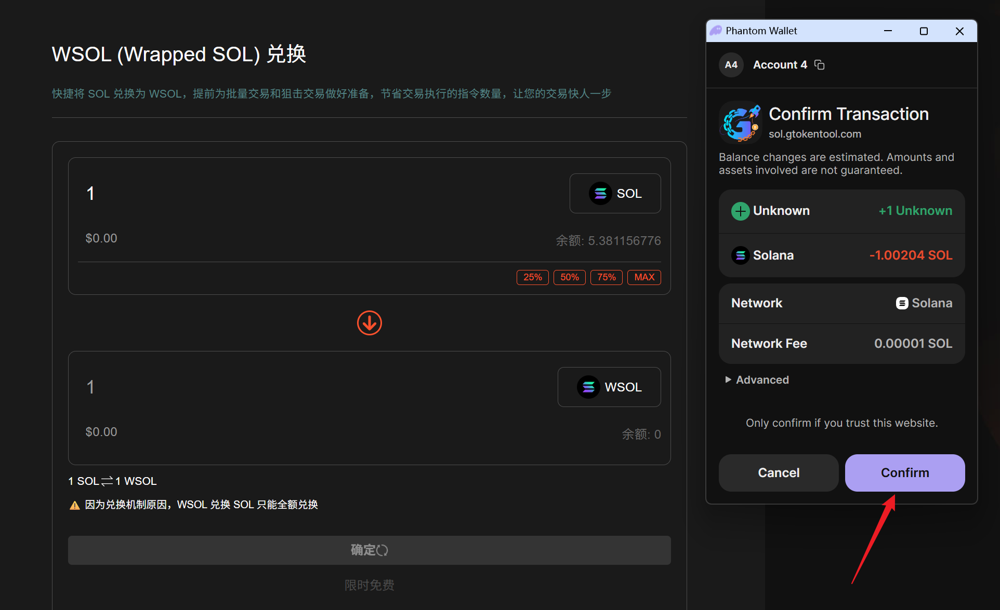
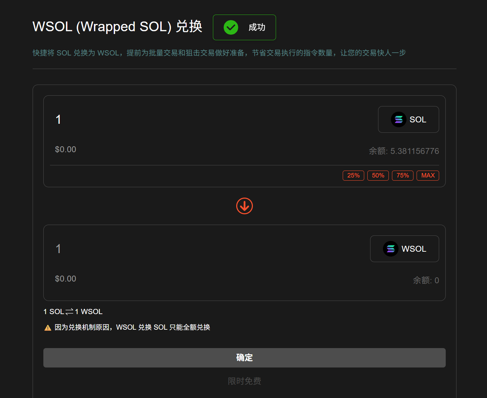
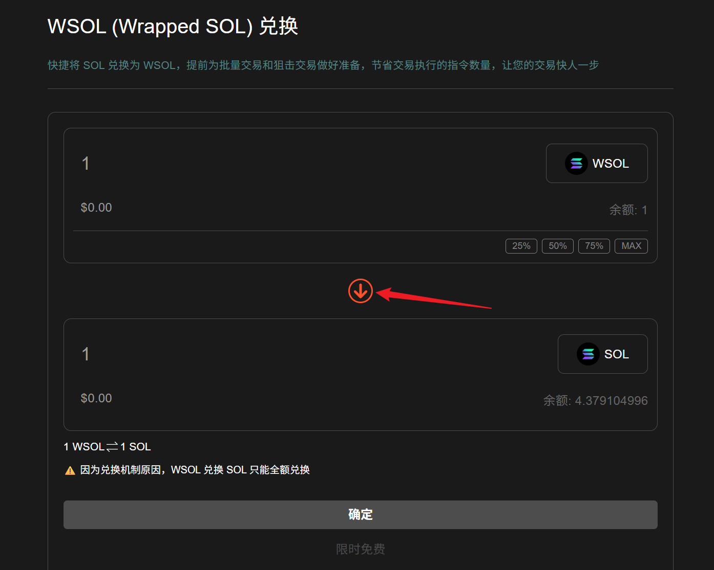
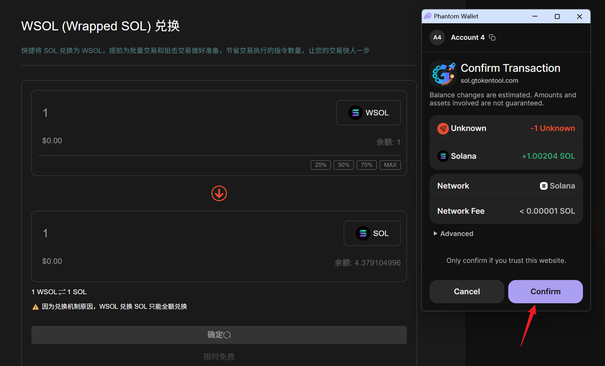
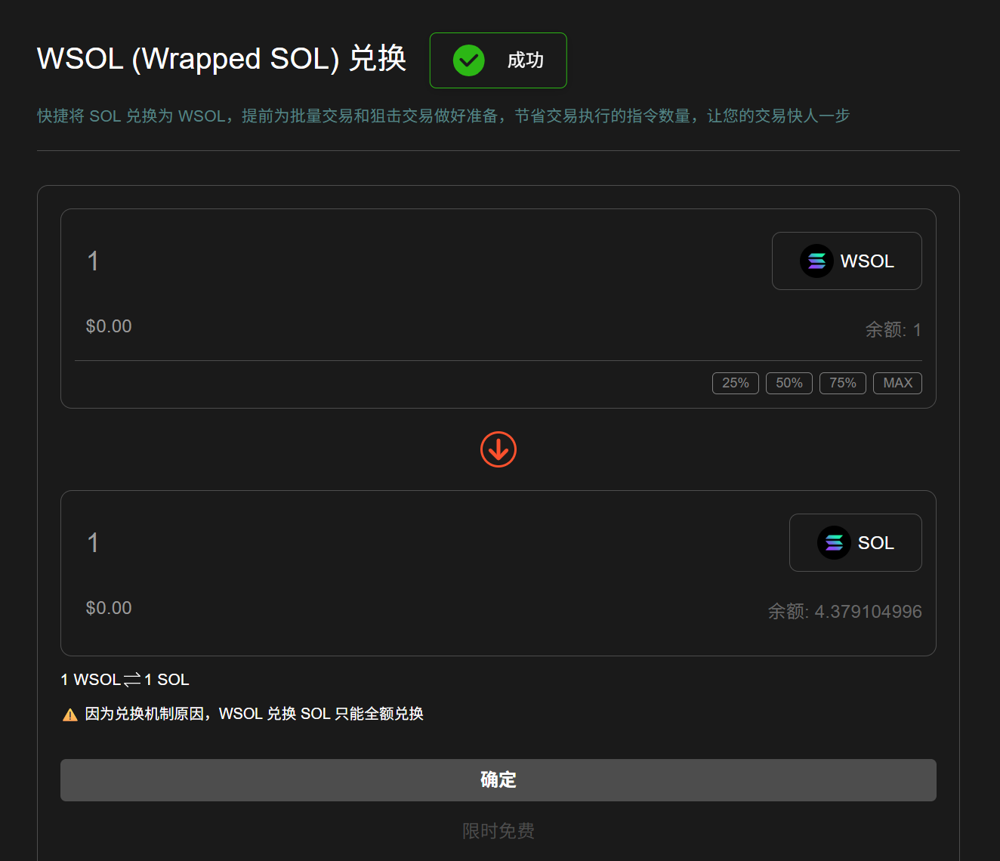

# WSOL兑换教程

**GTokenTool** 的 **Solana WSOL兑换** 工具主要用于实现原生 SOL 与 SPL 格式 WSOL 之间的双向快速转换。该工具支持**一键封装（Wrap）与解封（Unwrap）**，具备操作秒级响应、兑换比例 1:1 且手续费极低的特点。其优势在于能打破原生代币与 DeFi 协议间的兼容障碍，确保持仓在交易池与借贷协议中灵活流转。它特别适用于需要进行链上狙击、参与流动性挖矿或执行复杂智能合约交互的 **Solana 交易员及 DeFi 深度参与者**。

## 📌 核心摘要

* **功能定位：**&#x53;olana 生态原生资产与标准协议的**流动性桥接引擎**。实现原生 SOL 与 SPL 格式 Wrapped SOL (WSOL) 的无缝双向转换。
* **技术特性：**
  * **原子化封装/解封：**&#x652F;持一键执行 Wrap 与 Unwrap 操作，确保兑换过程的瞬时性与高成功率。
  * **等值资产交互：**&#x4E25;格遵守 1:1 兑换逻辑，无滑点损失，且具备极低的链上交互手续费。
  * **全协议兼容性：**&#x751F;成的 WSOL 完全符合 SPL 标准，可直接参与链上交易池、借贷协议及复杂的智能合约。
* **应用价值：**&#x6253;破了原生资产与 DeFi 生态间的交互壁垒，是提升资金利用率、参与链上高频交易与流动性管理的**必备基础工具**。
* **目标受众：**&#x9700;参与 DeFi 协议交互、流动性挖矿、链上自动化狙击的专业交易员及量化开发者。

## 准备事项 

1. 一台电脑或者一部手机
2. Solana 钱包（[幻影钱包Phantom安装教程](https://docs.gtokentool.com/solana/auxiliary-tutorial/phantom-wallet-installation)）
3. 要兑换WSOL的钱包
4. 确保钱包地址有足够的SOL

## WSOL兑换具体步骤

### 1. 连接钱包

WSOL兑换：[https://sol.gtokentool.com/zh-CN/walletManagement/WSOL](https://sol.gtokentool.com/zh-CN/walletManagement/WSOL)

进入WSOL兑换页面，右上角支持切换成中文。选择 Main 网络并连接钱包。

<figure><figcaption>
连接钱包并选择Main网络
</figcaption></figure>

### 2. 填写要兑换的数量

可以直接输入或者选择百分比。

<figure><figcaption>
填写兑换数量
</figcaption></figure>

### 3. 点击“确定”

点击“`确定`”，等待一会会弹出钱包。弹出钱包后，点击“`Confirm`”。

<figure><figcaption>
钱包确认
</figcaption></figure>

兑换成功会有成功提示。

<figure><figcaption>
兑换成功提示
</figcaption></figure>

### 4. WSOL 兑换 SOL

点击中间的切换按钮，切换到 WSOL 兑换 SOL。


因为兑换机制原因，WSOL 兑换 SOL 只能全额兑换。


<figure><figcaption>
WSOL 兑换 SOL
</figcaption></figure>

点击“`确定`”，弹出钱包后点击“`Confirm`”。

<figure><figcaption>
钱包确认
</figcaption></figure>

兑换成功后会弹出成功提示。

<figure><figcaption>
兑换成功提示
</figcaption></figure>

### 🤝 连接 GTokenTool 

* **💬 Telegram社群**：[点击加入官方群组](https://t.me/gtokentool)
* **🐦 Twitter (X)**：[关注我们获取最新动态](https://x.com/gtokentool)
* **📚 官方文档**：[查看 Gitbook 文档](https://docs.gtokentool.com/)
* **💻 开源代码**：[访问 GitHub 仓库](https://github.com/Gtokentool/docs/blob/master/SUMMARY.md)
* **📺 视频教程**：[订阅 YouTube 频道](https://www.youtube.com/@GTokenTool)

> ⚠️ 风险提示与免责声明
>
> GTokenTool 保留随时全权酌情因任何理由修改、变更或取消此公告的权利，无需事先通知。
>
> 以上信息内容仅供参考，GTokenTool 对本平台上的任何虚拟资产、产品或促销活动不做任何推荐或保证。虚拟资产的价格波动很大，投资交易虚拟资产将面临巨大风险。**请谨慎投资。**
