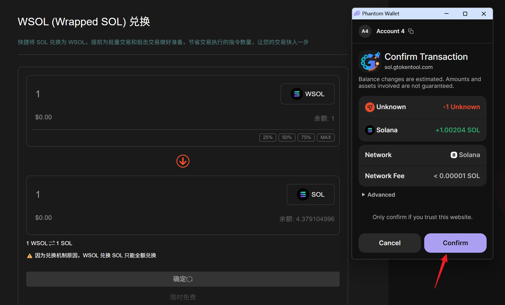

# WSOL兑换教程

## 准备事项 

1. 一台电脑或者一部手机
2. Solana 钱包（[幻影钱包Phantom安装教程](https://docs.gtokentool.com/solana/auxiliary-tutorial/phantom-wallet-installation)）
3. 要兑换WSOL的钱包
4. 确保钱包地址有足够的SOL

## WSOL兑换具体步骤

### 1. 连接钱包

WSOL兑换：[https://sol.gtokentool.com/zh-CN/walletManagement/WSOL](https://sol.gtokentool.com/zh-CN/walletManagement/WSOL)

进入WSOL兑换页面，右上角支持切换成中文。选择 Main 网络并连接钱包。

<figure><figcaption></figcaption></figure>

### 2. 填写要兑换的数量

可以手动输入或者选择百分比。

<figure><figcaption></figcaption></figure>

### 3. 点击“确定”

点击“确定”，等待一会会弹出钱包。弹出钱包后，点击“Confirm”。

<figure><figcaption></figcaption></figure>

兑换成功会弹出成功提示。

<figure><figcaption></figcaption></figure>

### 4. WSOL兑换SOL

点击中间的交换图标，可将模式切换为 WSOL兑换 SOL。


因为兑换机制原因，WSOL 兑换 SOL 只能全额兑换。


<figure><figcaption></figcaption></figure>

然后点击“确定”，弹出钱包后点击“Confirm”。

<figure><figcaption></figcaption></figure>

兑换成功会弹出成功提示。

<figure><figcaption></figcaption></figure>

[_**GTokenTool | 创建代币、批量空投和做市机器人等Solana工具集**_](https://sol.gtokentool.com)

**安全、开源，给Solana用户带来最便利的一站式体验。**

GTokenTool社群:

Telegram：[**https://t.me/gtokentool**](https://t.me/gtokentool)

Twitter:  [**https://x.com/gtokentool**](https://x.com/gtokentool)

Gitbook：[**https://docs.gtokentool.com/**](https://docs.gtokentool.com/)

Github：[**https://github.com/Gtokentool/docs/blob/master/SUMMARY.md**](https://github.com/Gtokentool/docs/blob/master/SUMMARY.md)

YouTube：[**https://www.youtube.com/@GTokenTool**](https://www.youtube.com/@GTokenTool)\
\
\
<mark style="color:purple;background-color:orange;">**GTokenTool**</mark>_<mark style="color:purple;background-color:orange;">保留随时全权酌情因任何理由修改、变更或取消此公告的权利，无需事先通知。以上信息内容仅供参考，GTokenTool对本平台上的任何虚拟资产、产品或促销活动不做任何推荐或保证。虚拟资产的价格波动很大，投资交易虚拟资产将面临巨大风险。请谨慎投资。</mark>_
