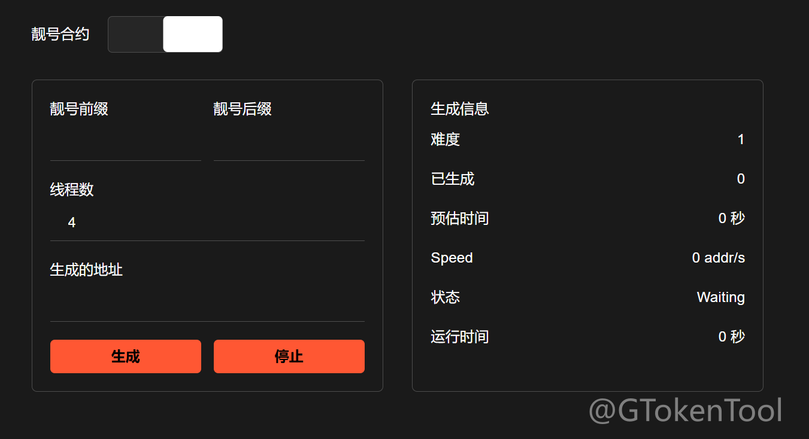
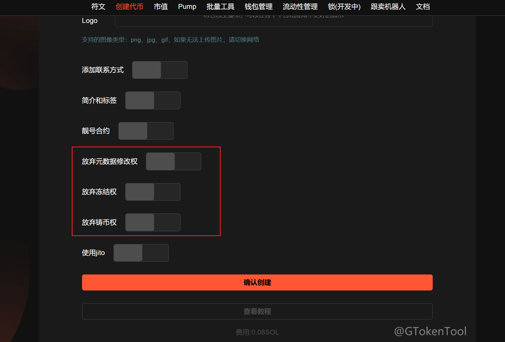

# svmBNB一键创建代币教程

## 什么是 svmBNB Chain？

svmBNB Chain 将 SVM 作为其执行层，将 BNB Chain 作为其结算层。利用 BNB Chain——一个领先的全球区块链，拥有丰富的生态系统、大量的 TVL（约 60 亿美元）和庞大的用户群——svmBNB Chain 将把 SVM 的高性能功能带给更广泛的受众。

## 如何使用 svmBNB 代币创建工具 

1. 连接您的 TP钱包
2. 输入代币全称和简称
3. 上传代币的Logo图片（建议正方形＞200 像素）
4. 设置代币精度（小数位数）和总发行量
5. 填写代币描述
6. 代币元数据修改权限、冻结权限、铸币权限设置
7. 创建代币，签名交易并等待代币创建完成

## Solana发币准备事项

1.安装好TP钱包插件，安装教程（[https://docs.gtokentool.com/soon-svmbnb/svmbnb-shi-pei-qian-bao-an-zhuang-yu-shi-yong](https://docs.gtokentool.com/soon-svmbnb/svmbnb-shi-pei-qian-bao-an-zhuang-yu-shi-yong)）

2.钱包内最少准备0.1个svmbnb

3.准备好翻墙软件（VPN/加速器），保证网络通畅

4.发币Logo和相关信息

## svmBNB发币教程步骤

### 1.打开gtokentool官网



### 2.选择正确的网络并连接到有余额的钱包地址，连接钱包时选择tp钱包连接

<figure><figcaption></figcaption></figure>

<figure><figcaption></figcaption></figure>

连接成功后，应当显示为类似下图，按钮将变为当前连接的地址。

<figure><figcaption></figcaption></figure>

确保你的钱包连接到的网络也是svmBNB。

<figure><figcaption></figcaption></figure>

### 2.填写svmBNB发币相关信息并上传LOGO文件

完成钱包连接之后，先选择发币模式，接下来就是填写Solana发币信息，具体如下：

**代币全称：**&#x53D1;币的名称信息（如GTokenTool），支持英文、中文以及中英文混合，最多32个字符。

**代币简称：**&#x53D1;币的简称信息（如GT），支持英文、中文以及中英文混合，最多10个字符。

**代币精度：**&#x4EE3;币精度定义了代币可以分割到多小的单位。 SPL代币的最大精度是9，常见的精度设置是6（实用代币）和9（高精度应用），0精度通常用于NFT。可参考以下数值设置：

<figure><figcaption></figcaption></figure>

**总供应量：**&#x53D1;币的总供应量，当精度为9时，总供应量不能超过100亿；当精度为8时，总供应量不能超过1000亿，以此类推。

**Logo：**&#x73;vmBNB发币的头像，可在钱包中显示logo代币图片（上传图片大小最大不超过2M）。

### 3.添加选填内容

如果你想添加联系方式等，可以点击选填内容按钮，展开选填内容模块。

<figure><figcaption></figcaption></figure>

<figure><figcaption></figcaption></figure>

**官网：**&#x5B98;网链接地址。

**电报：**&#x7535;报（Telegram）链接地址。

**推特：**&#x63A8;特（Twitter）链接地址。

**Discord:** Discord链接地址。

**简介：**&#x586B;写你的代币简介。

**标签：**&#x6700;多添加5个标签，通过输入后点击"添加"按钮来进行添加标签，觉得不合适的标签也可以删除。

### 4.设置靓号（非必须）

如果您想要自定义代币合约，创建靓号代币。

<figure><figcaption></figcaption></figure>

### 5.权限设置（非必须）

代币元数据修改权限、冻结权限、铸币权限设置。

* **元数据更改权：**“放弃所有权”意味着您将无法修改令牌元数据。
* **冻结权：**&#x5982;果您放弃冻结权限，则意味着您将无法冻结持有者钱包中的代币。
* **铸币权：**“放弃铸币权”对于让投资者感到更加安全和作为代币的成功是必要的。如果您放弃铸币权，则意味着您将无法铸造更多代币供应。

<figure><figcaption></figcaption></figure>

### 6.点击确认创建

在等待图片上传后弹出钱包确认，点击确认。

<figure><figcaption></figcaption></figure>

创建完成后可以查看代币地址，点击复制。

<figure><figcaption></figcaption></figure>

## 常见问题解答

### Q: SVMBNB 上创建代币与普通 BSC 代币有何不同？

A: SVMBNB 使用 Solana 虚拟机技术，开发语言和合约结构可能与传统 BSC 代币不同，需要适应 SVM 环境。

### Q: 创建代币需要多少成本？

A: 成本主要包括 gas 费和可能的审计费用，具体取决于网络拥堵程度和合约复杂度。

### Q: 如何确保代币安全？

A: 建议进行专业审计、使用已验证的代码库、实现权限控制和紧急停止功能。

### Q: 代币创建后如何添加流动性？

A: 需要在支持的 DEX 上创建交易对并注入初始流动性，注意防范"rug pull"风险。

### Q: 为什么我的代币交易失败？

A: 可能原因包括: 代币未添加流动性、交易滑点设置过低、代币功能限制或合约存在缺陷。

如有不明白或者不清楚的地方，请加入官方电报群：[**https://t.me/gtokentool**](https://t.me/gtokentool)
