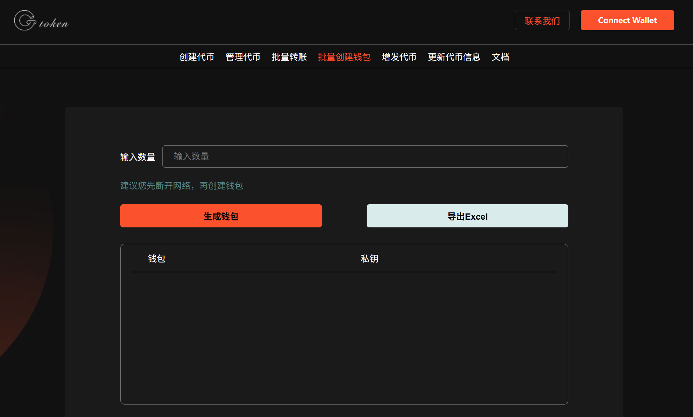
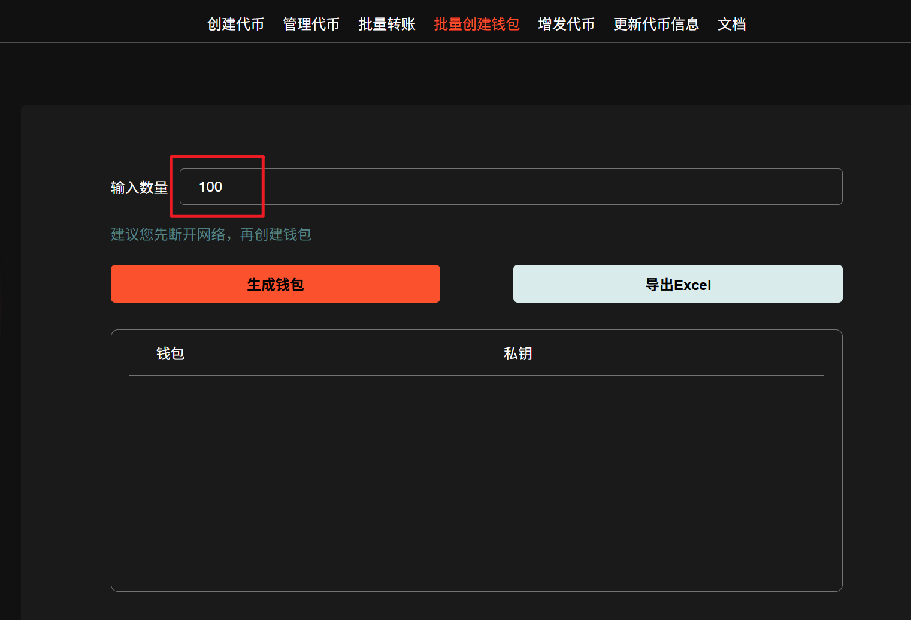
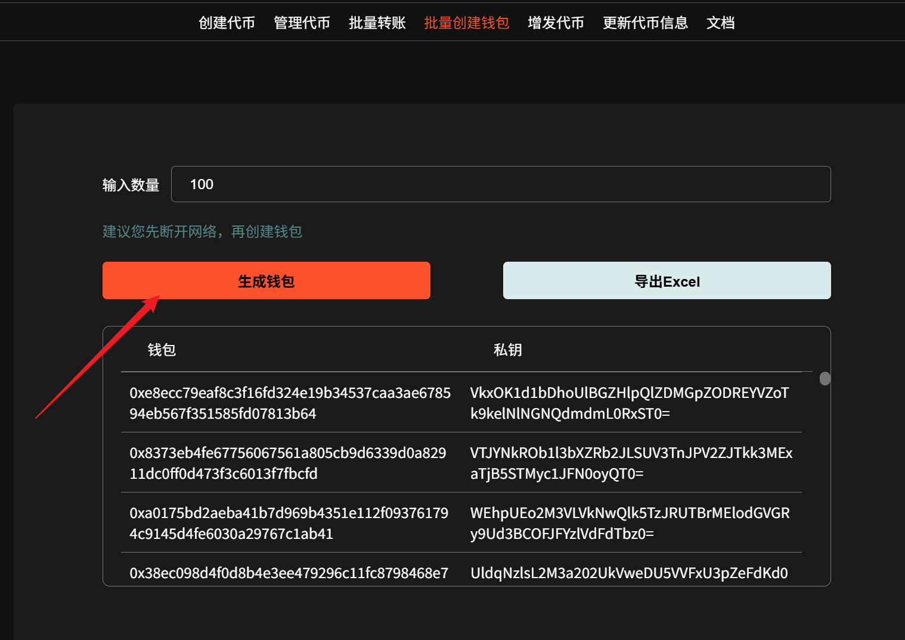
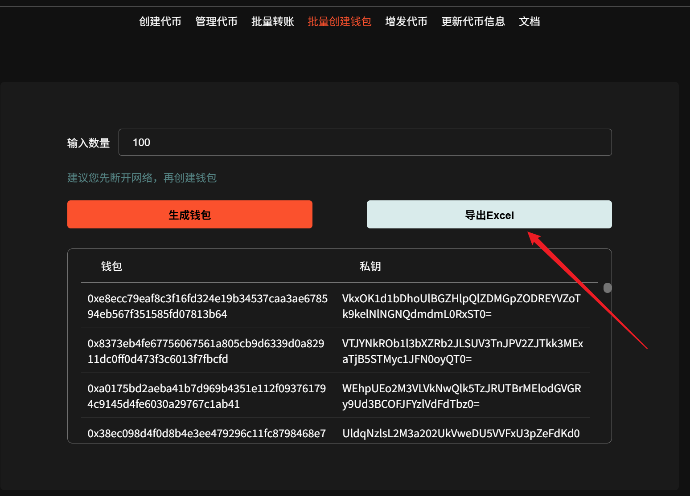

# Sui链批量创建钱包教程

手动批量生成多个 Sui 链钱包是非常耗费时间的，尤其是备份助记词和输入助记词的过程。批量生成 Sui 链钱包工具只需输入你想要生成的钱包数量，即可轻松获得钱包地址、私钥等信息，并且这一过程是本地实现，因此保证了敏感信息的安全性。

## 注意事项

1. 批量生成钱包地址属于公益性质，不收取费用。
2. 生成的钱包仅仅作为临时钱包使用，用完即丢，不要存入核心资产就行。

## Sui链批量创建钱包流程

Sui 链官网链接：[https://sui.gtokentool.com](https://sui.gtokentool.com/)

首先我们进入到`批量创建钱包`的界面。

<figure><figcaption>
进入批量创建钱包页面
</figcaption></figure>

然后输入要创建的钱包数量。

<figure><figcaption>
输入创建数量
</figcaption></figure>

之后点击“`生成钱包`”。

<figure><figcaption>
生成钱包
</figcaption></figure>

生成之后会出现钱包地址和私钥，如果你需要保存到本地这可以点击“`导出Excel`”，即可保存本地。

<figure><figcaption>
导出Excel文件
</figcaption></figure>

### 🤝 连接 GTokenTool 

* **💬 Telegram社群**：[点击加入官方群组](https://t.me/gtokentool)
* **🐦 Twitter (X)**：[关注我们获取最新动态](https://x.com/gtokentool)
* **📚 官方文档**：[查看 Gitbook 文档](https://docs.gtokentool.com/)
* **💻 开源代码**：[访问 GitHub 仓库](https://github.com/Gtokentool/docs/blob/master/SUMMARY.md)
* **📺 视频教程**：[订阅 YouTube 频道](https://www.youtube.com/@GTokenTool)

> ⚠️ 风险提示与免责声明
>
> GTokenTool 保留随时全权酌情因任何理由修改、变更或取消此公告的权利，无需事先通知。
>
> 以上信息内容仅供参考，GTokenTool 对本平台上的任何虚拟资产、产品或促销活动不做任何推荐或保证。虚拟资产的价格波动很大，投资交易虚拟资产将面临巨大风险。**请谨慎投资。**
