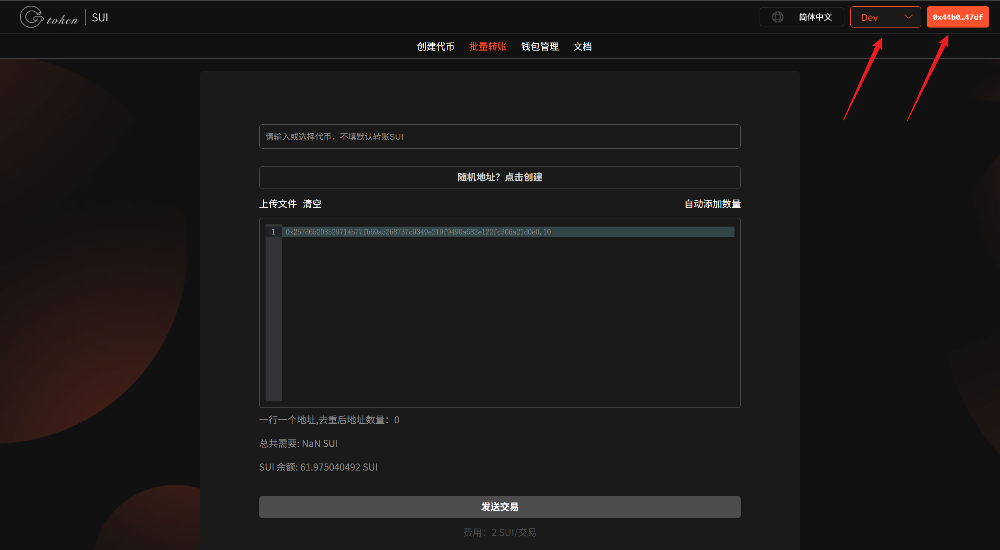
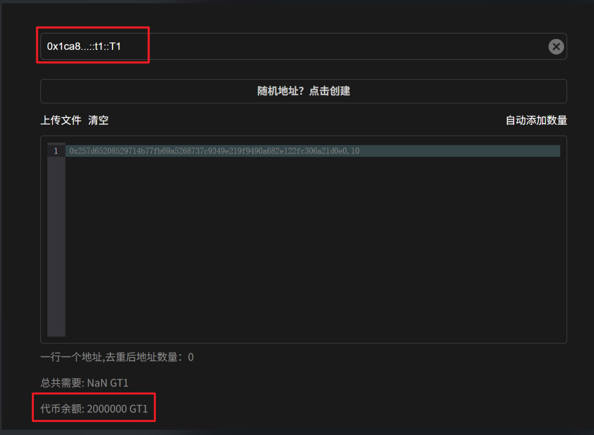
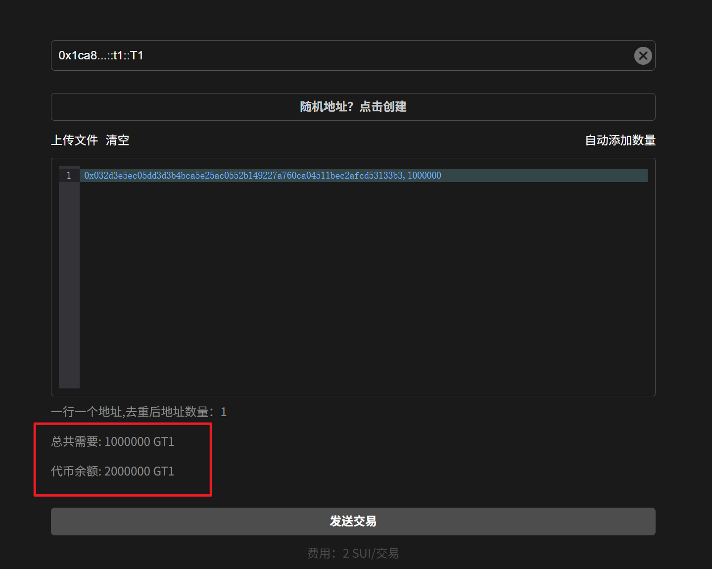
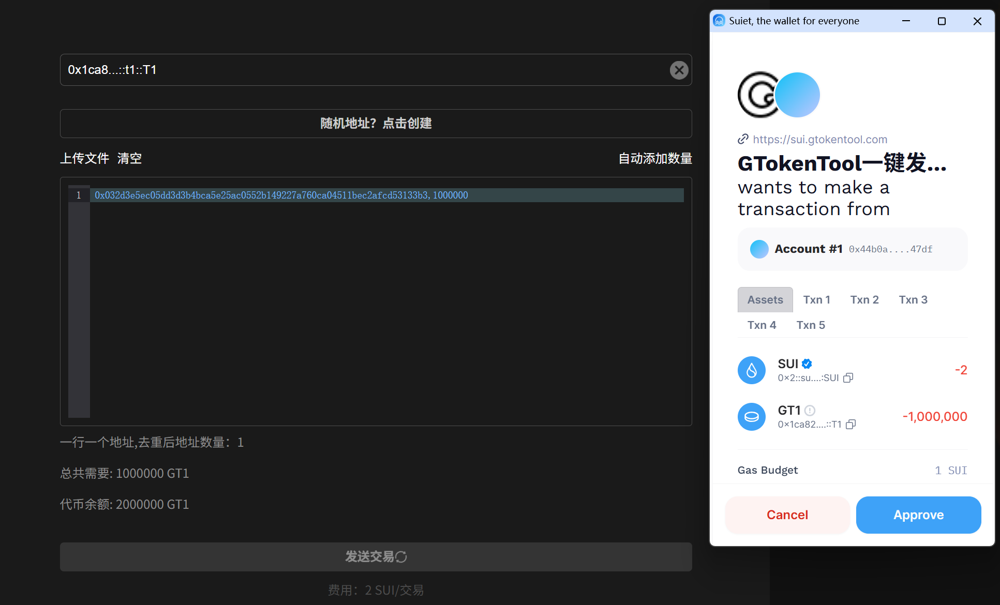
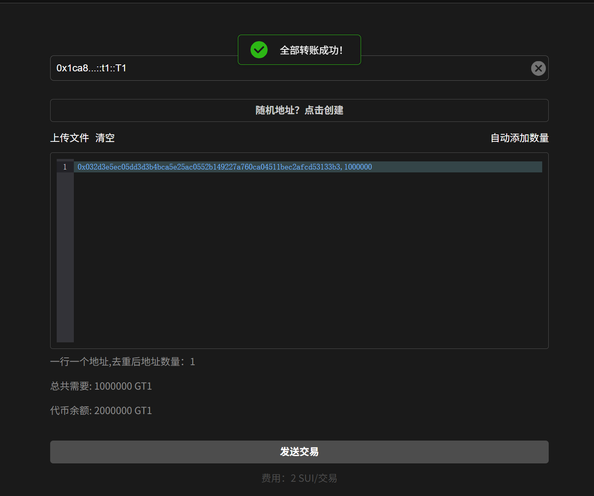

# Sui链批量转账教程

## 准备事项

1. 安装好Suiet钱包或者SuiWallet插件：[Suiet钱包安装](suiet-qian-bao-an-zhuang-jiao-cheng.md)、[Suiwallet钱包安装](sui-wallet-qian-bao-an-zhuang-shi-yong-jiao-cheng.md)
2. 如果没有安装这两个钱包，欧易Web3钱包也是支持的
3. 钱包内准备充足的SUI，如果数量不够，会导致发币失败
4. 手机发币建议使用欧易Web3钱包，不要用TP钱包，TP不能传logo

## 批量转账流程

### 1. 连接钱包

批量转账：[https://sui.gtokentool.com/zh-CN/batchTool/batchTransfer/Token](https://sui.gtokentool.com/zh-CN/batchTool/batchTransfer/Token)

进入批量转账页面，右上角选择 Main 网络并连接钱包，建议使用 Suiet 钱包。这里使用测试网演示。

<figure><figcaption></figcaption></figure>

### 2. 选择代币

选择代币后，下方可以看到代币余额。

<figure><figcaption></figcaption></figure>

### 3. 输入地址和数量

输入地址和数量后，下面会显示总共需要的代币。

<figure><figcaption></figcaption></figure>

### 4. 点击“发送交易”

<figure><figcaption></figcaption></figure>

弹出钱包后，点击“Approve”。交易成功后会弹出提示。

<figure><figcaption></figcaption></figure>

GTokenTool社群:

Telegram：[**https://t.me/gtokentool**](https://t.me/gtokentool)

Twitter:  [**https://x.com/gtokentool**](https://x.com/gtokentool)

Gitbook：[**https://docs.gtokentool.com/**](https://docs.gtokentool.com/)

Github：[**https://github.com/Gtokentool/docs/blob/master/SUMMARY.md**](https://github.com/Gtokentool/docs/blob/master/SUMMARY.md)

YouTube：[**https://www.youtube.com/@GTokenTool**](https://www.youtube.com/@GTokenTool)\
\
\
&#xNAN;_<mark style="color:purple;background-color:orange;">GTokenTool保留随时全权酌情因任何理由修改、变更或取消此公告的权利，无需事先通知。以上信息内容仅供参考，GTokenTool对本平台上的任何虚拟资产、产品或促销活动不做任何推荐或保证。虚拟资产的价格波动很大，投资交易虚拟资产将面临巨大风险。请谨慎投资。</mark>_
