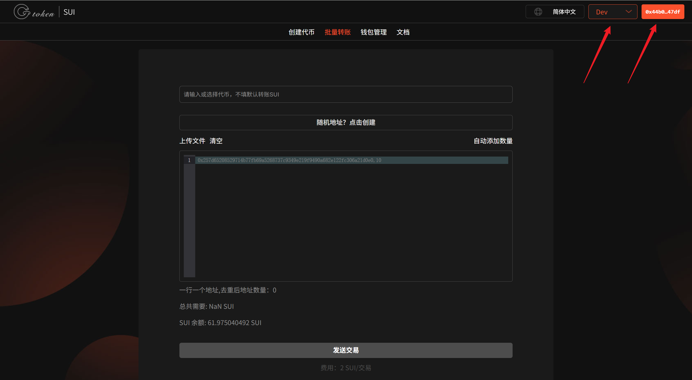
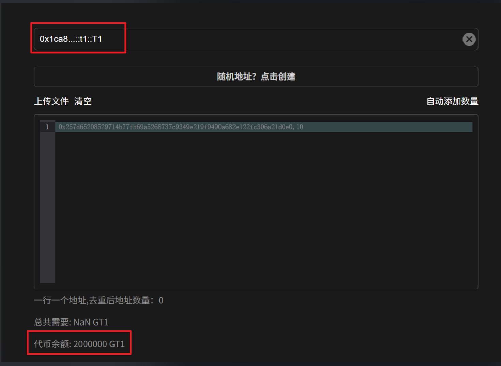
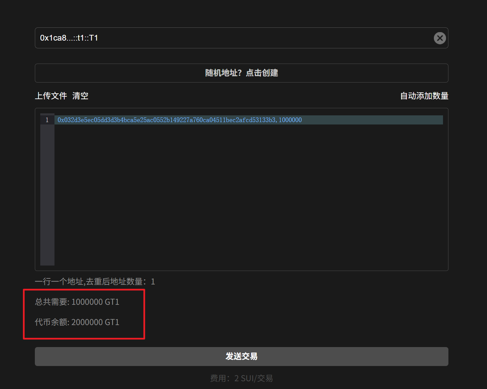
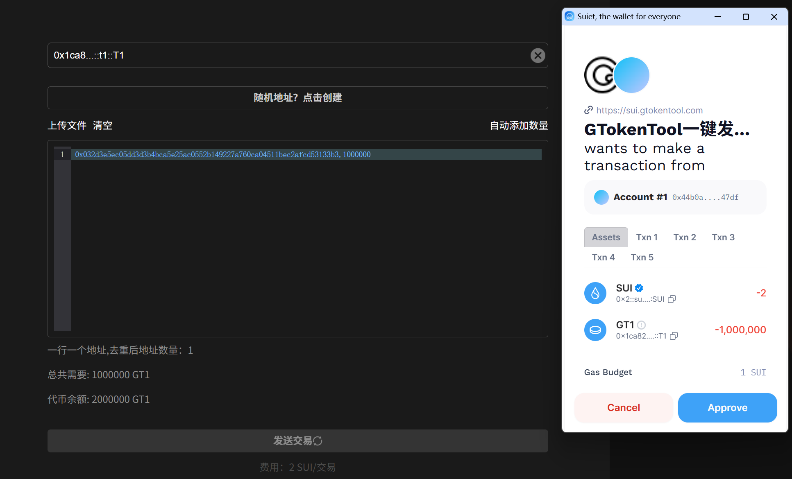
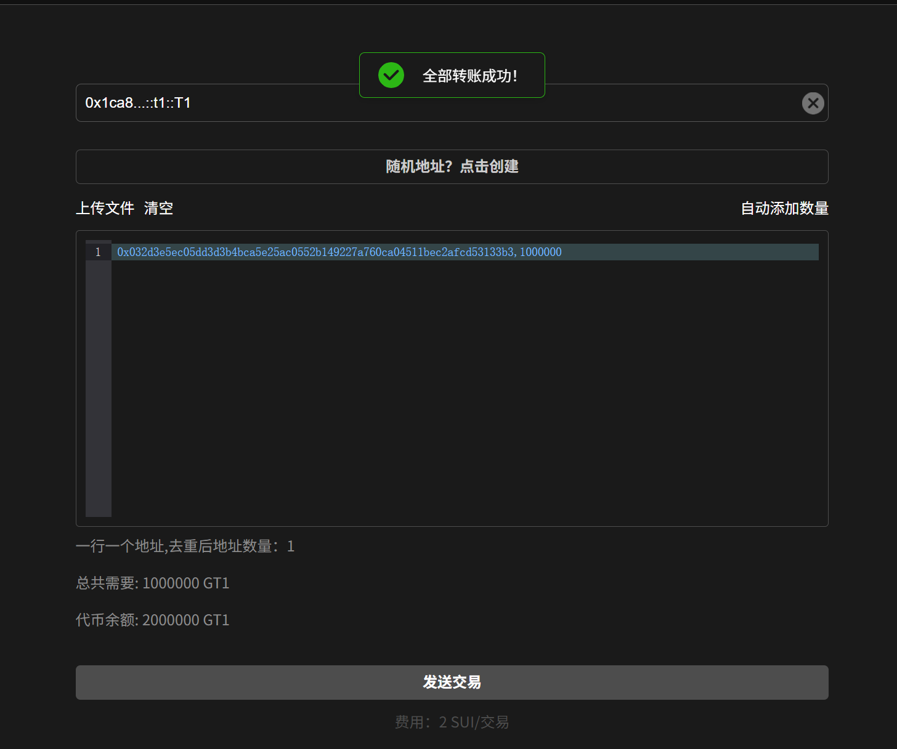

# Sui链批量转账教程

## 准备事项

1. 安装好Suiet钱包或者SuiWallet插件：[Suiet钱包安装](suiet-qian-bao-an-zhuang-jiao-cheng.md)、[Suiwallet钱包安装](sui-wallet-qian-bao-an-zhuang-shi-yong-jiao-cheng.md)
2. 如果没有安装这两个钱包，欧易Web3钱包也是支持的
3. 钱包内准备充足的SUI，如果数量不够，会导致交易失败
4. 手机发币建议使用欧易Web3钱包，不要用TP钱包，TP不能传logo

## Sui链批量转账流程

### 1. 连接钱包

批量转账：[https://sui.gtokentool.com/zh-CN/batchTool/batchTransfer/Token](https://sui.gtokentool.com/zh-CN/batchTool/batchTransfer/Token)

进入批量转账页面，右上角选择 Main 网络并连接钱包，建议使用 Suiet 钱包。这里使用测试网演示。

<figure><figcaption>
连接钱包并选择网络
</figcaption></figure>

### 2. 选择代币

选择代币后，下方可以看到代币余额（<mark style="color:purple;">不填默认转账SUI）</mark>。

<figure><figcaption>
选择代币
</figcaption></figure>

### 3. 输入接收地址和数量

输入接收地址和数量后，下面会显示总共需要的代币。

<figure><figcaption>
输入接收地址和数量
</figcaption></figure>

### 4. 点击“发送交易”

确认无误后，点击“`发送交易`”。

<figure><figcaption>
钱包确认交易
</figcaption></figure>

弹出钱包后，点击“`Approve`”。交易成功后会弹出提示。

<figure><figcaption>
交易成功
</figcaption></figure>

### 🤝 连接 GTokenTool 

* **💬 Telegram社群**：[点击加入官方群组](https://t.me/gtokentool)
* **🐦 Twitter (X)**：[关注我们获取最新动态](https://x.com/gtokentool)
* **📚 官方文档**：[查看 Gitbook 文档](https://docs.gtokentool.com/)
* **💻 开源代码**：[访问 GitHub 仓库](https://github.com/Gtokentool/docs/blob/master/SUMMARY.md)
* **📺 视频教程**：[订阅 YouTube 频道](https://www.youtube.com/@GTokenTool)

> ⚠️ 风险提示与免责声明
>
> GTokenTool 保留随时全权酌情因任何理由修改、变更或取消此公告的权利，无需事先通知。
>
> 以上信息内容仅供参考，GTokenTool 对本平台上的任何虚拟资产、产品或促销活动不做任何推荐或保证。虚拟资产的价格波动很大，投资交易虚拟资产将面临巨大风险。**请谨慎投资。**
