# Sui链拉黑&解除拉黑教程

## 准备事项

1. 安装好Suiet钱包或者SuiWallet插件：[Suiet钱包安装](suiet-qian-bao-an-zhuang-jiao-cheng.md)、[Suiwallet钱包安装](sui-wallet-qian-bao-an-zhuang-shi-yong-jiao-cheng.md)
2. 如果没有安装这两个钱包，欧易Web3钱包也是支持的
3. 钱包内最少准备2个SUI，如果数量不够，会导致交易失败
4. 手机发币建议使用欧易Web3钱包，不要用TP钱包，TP不能传logo

## 拉黑&解除拉黑具体流程

### 1. 连接钱包

拉黑：[https://sui.gtokentool.com/zh-CN/Token/block](https://sui.gtokentool.com/zh-CN/Token/block)

进入拉黑页面，右上角选择 Main 网络并连接钱包，建议使用 Suiet 钱包。

<figure>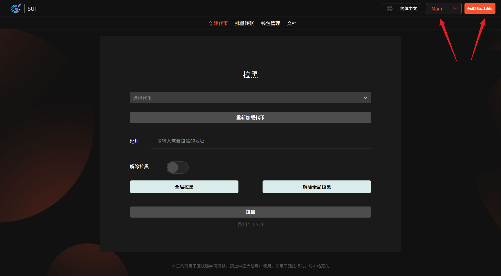<figcaption></figcaption></figure>

### 2. 选择代币

点击下拉框选择代币，若没有找到代币，点击“`重新加载代币`”。

<figure>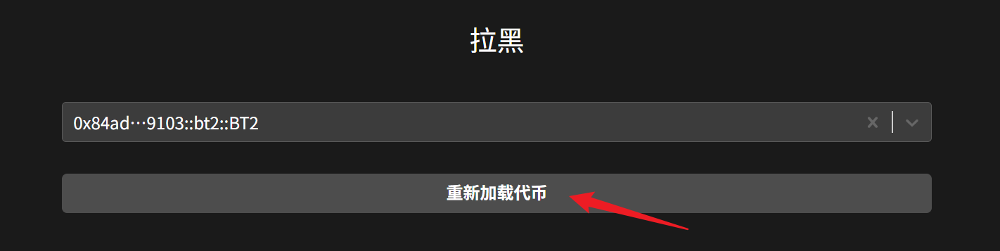<figcaption></figcaption></figure>

### 3. 输入要拉黑的地址

<figure>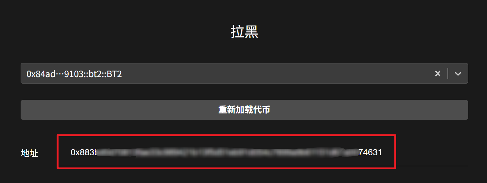<figcaption></figcaption></figure>

### 4. 点击“拉黑”

弹出钱包后，点击确认。

<figure>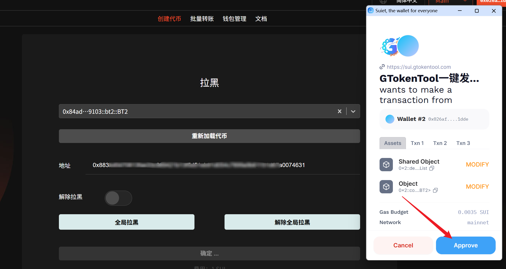<figcaption></figcaption></figure>

操作成功会显示交易哈希，点击哈希可以跳转浏览器查看交易情况。

<figure>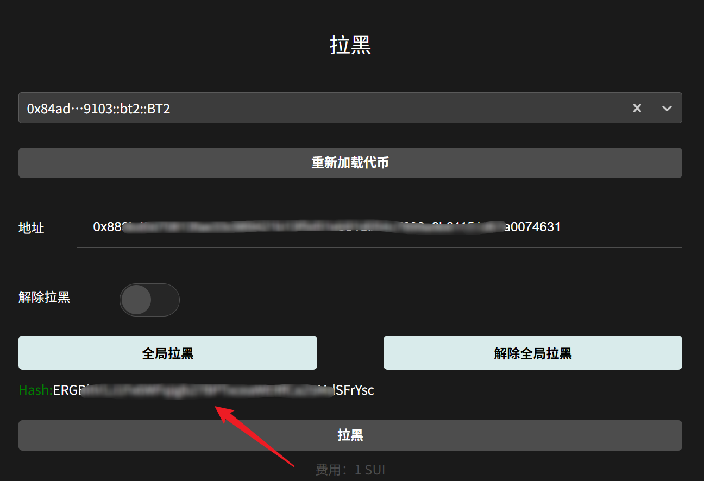<figcaption></figcaption></figure>

### 5. 解除拉黑

打开“`解除拉黑`”的开关，下面的“`拉黑`”按钮会变成“`解除拉黑`”。

<figure>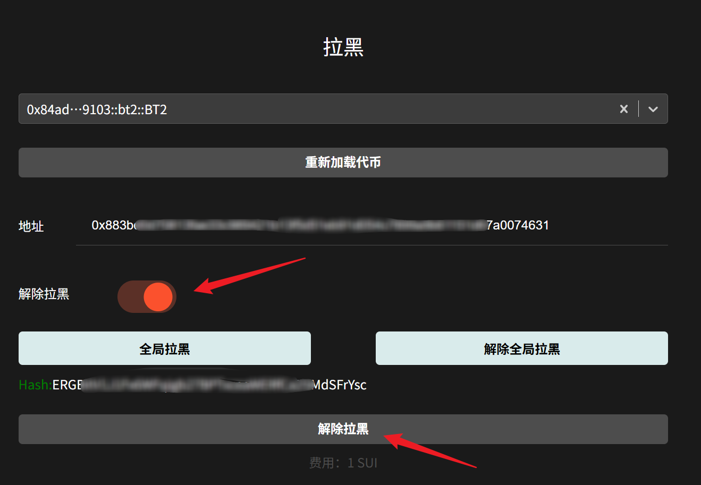<figcaption></figcaption></figure>

点击“`解除拉黑`”，弹出钱包后，点击确认。

<figure>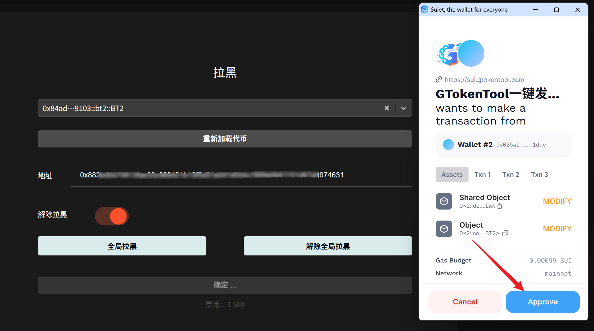<figcaption></figcaption></figure>

操作成功会显示交易哈希，点击哈希可以跳转浏览器查看交易情况。

<figure>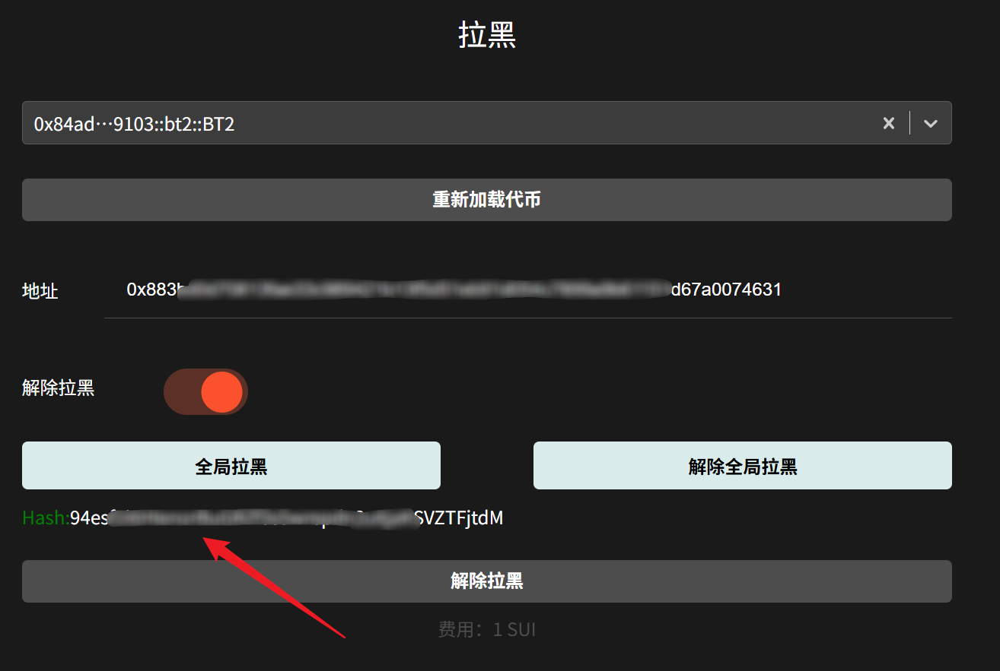<figcaption></figcaption></figure>

### 6. 全局拉黑与解除

选择代币后，点击“`全局拉黑`”。弹出钱包后，点击确认。

<figure>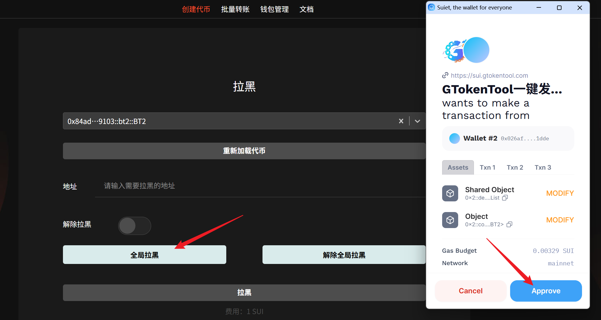<figcaption></figcaption></figure>

操作成功会显示交易哈希，点击哈希可以跳转浏览器查看交易情况。

<figure>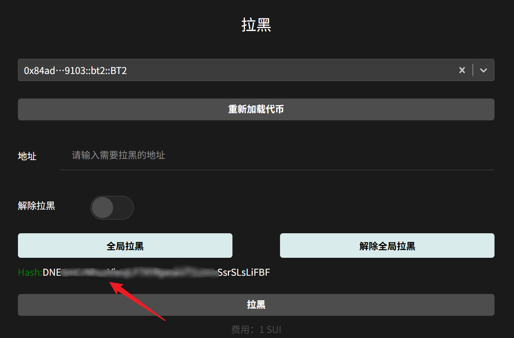<figcaption></figcaption></figure>

想要解除全局拉黑，点击“`解除全局拉黑`”。

<figure>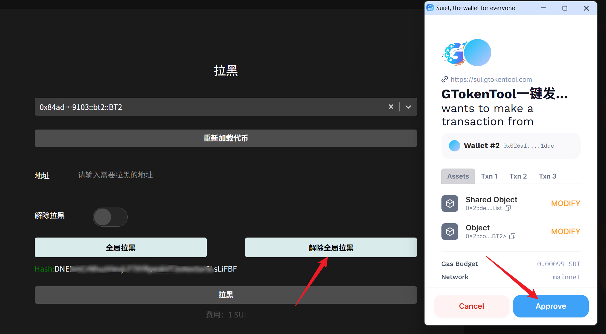<figcaption></figcaption></figure>

操作成功会显示交易哈希，点击哈希可以跳转浏览器查看交易情况。

<figure>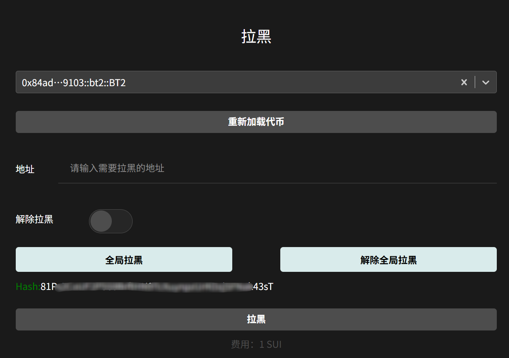<figcaption></figcaption></figure>

GTokenTool社群:

Telegram：[**https://t.me/gtokentool**](https://t.me/gtokentool)

Twitter:  [**https://x.com/gtokentool**](https://x.com/gtokentool)

Gitbook：[**https://docs.gtokentool.com/**](https://docs.gtokentool.com/)

Github：[**https://github.com/Gtokentool/docs/blob/master/SUMMARY.md**](https://github.com/Gtokentool/docs/blob/master/SUMMARY.md)

YouTube：[**https://www.youtube.com/@GTokenTool**](https://www.youtube.com/@GTokenTool)\
\
\
&#xNAN;_<mark style="color:purple;background-color:orange;">GTokenTool保留随时全权酌情因任何理由修改、变更或取消此公告的权利，无需事先通知。以上信息内容仅供参考，GTokenTool对本平台上的任何虚拟资产、产品或促销活动不做任何推荐或保证。虚拟资产的价格波动很大，投资交易虚拟资产将面临巨大风险。请谨慎投资。</mark>_
