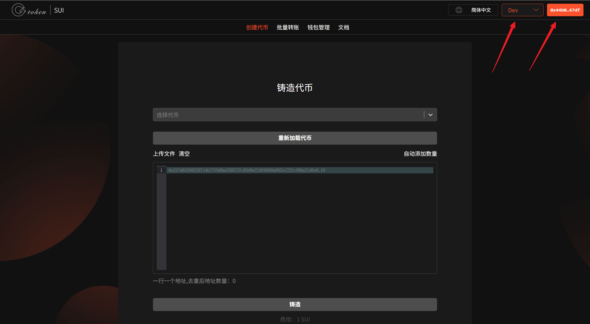
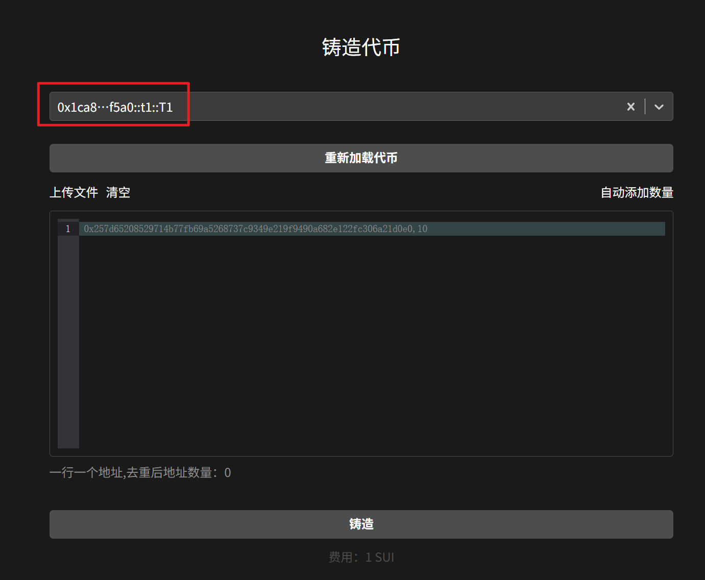
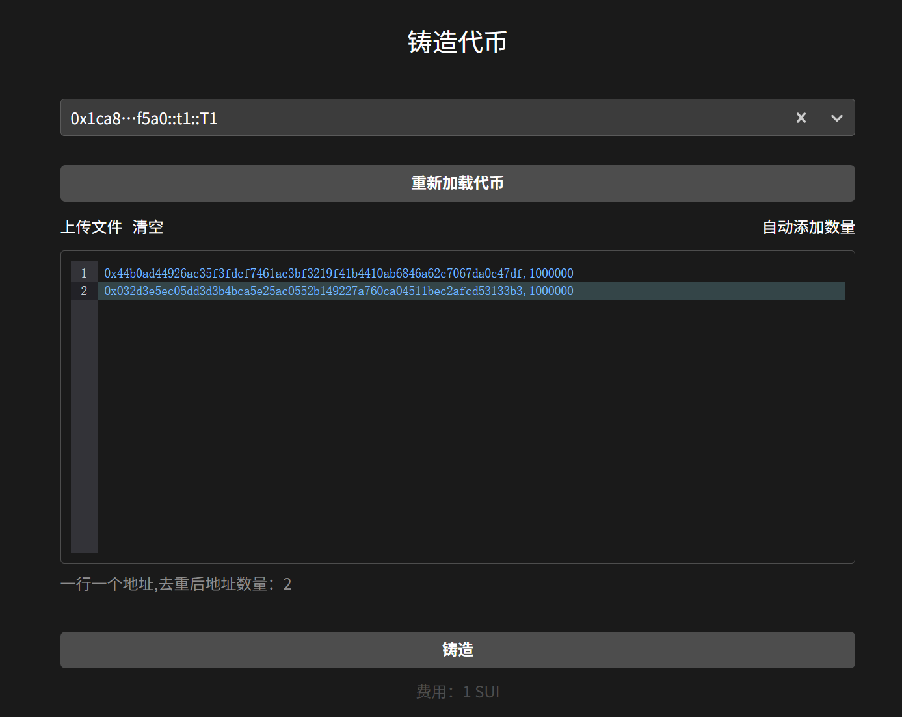
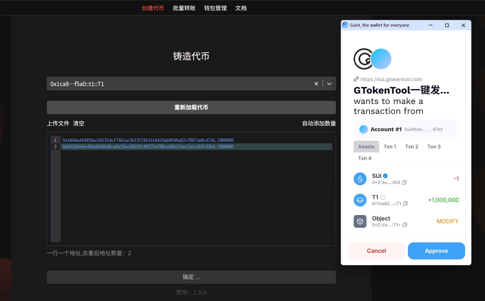
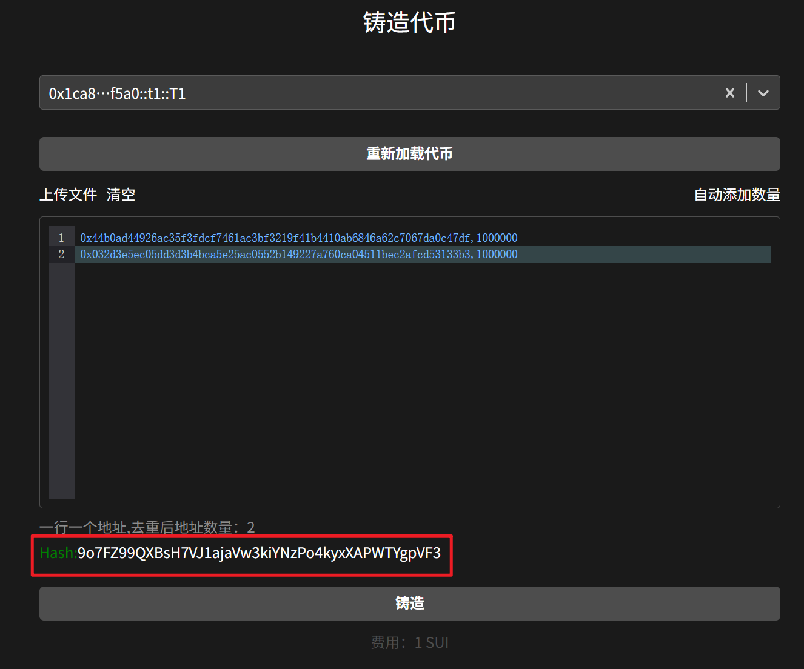

# Sui链铸造代币教程

## 准备事项

1. 安装好Suiet钱包或者SuiWallet插件：[Suiet钱包安装](suiet-installation.md)、[Suiwallet钱包安装](sui-wallet-installation.md)
2. 如果没有安装这两个钱包，欧易Web3钱包也是支持的
3. 钱包内最少准备2个SUI，如果数量不够，会导致发币失败
4. 手机发币建议使用欧易Web3钱包，不要用TP钱包，TP不能传logo

## 铸造代币流程

### 1. 连接钱包

铸造代币：[https://sui.gtokentool.com/zh-CN/Token/mint](https://sui.gtokentool.com/zh-CN/Token/mint)

进入铸造代币页面，右上角选择 Main 网络并连接钱包，建议使用 Suiet 钱包。这里使用测试网演示。

<figure><figcaption></figcaption></figure>

### 2. 选择代币

点击下拉选择框选择代币，若没有加载出代币，请点击“`重新加载代币`”。

<figure><figcaption></figcaption></figure>

### 3. 输入铸币地址和数量

选择代币后，可以在下一行输入框内依据示例输入地址和代币数量（**注意代币精度**），可以为其他地址铸造，也可以有多个地址。

<figure><figcaption></figcaption></figure>

### 4. 点击“铸造”，开始交易

<figure><figcaption></figcaption></figure>

弹出钱包后，点击“Approve"，下方出现哈希值代表交易成功，可以点击去查看交易情况。

<figure><figcaption></figcaption></figure>

GTokenTool社群:

Telegram：[**https://t.me/gtokentool**](https://t.me/gtokentool)

Twitter:  [**https://x.com/gtokentool**](https://x.com/gtokentool)

Gitbook：[**https://docs.gtokentool.com/**](https://docs.gtokentool.com/)

Github：[**https://github.com/Gtokentool/docs/blob/master/SUMMARY.md**](https://github.com/Gtokentool/docs/blob/master/SUMMARY.md)

YouTube：[**https://www.youtube.com/@GTokenTool**](https://www.youtube.com/@GTokenTool)\
\
\
&#xNAN;_<mark style="color:purple;background-color:orange;">GTokenTool保留随时全权酌情因任何理由修改、变更或取消此公告的权利，无需事先通知。以上信息内容仅供参考，GTokenTool对本平台上的任何虚拟资产、产品或促销活动不做任何推荐或保证。虚拟资产的价格波动很大，投资交易虚拟资产将面临巨大风险。请谨慎投资。</mark>_
