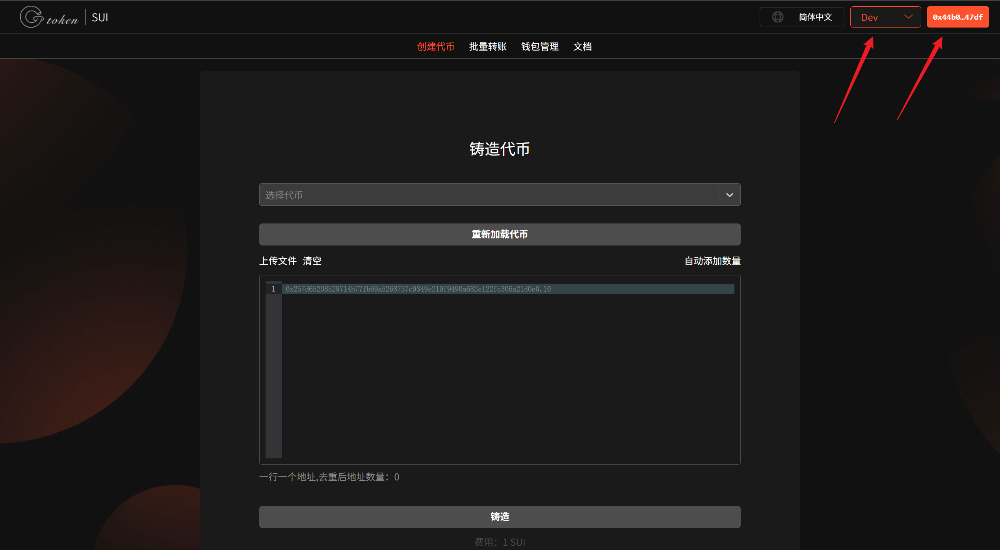
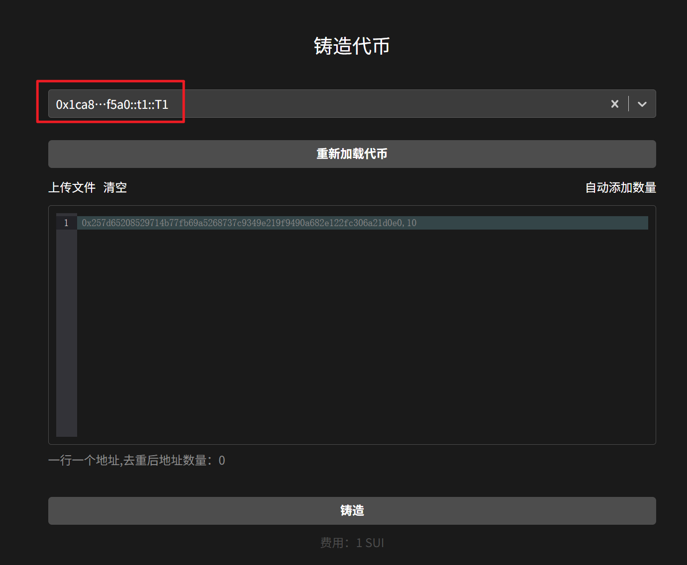
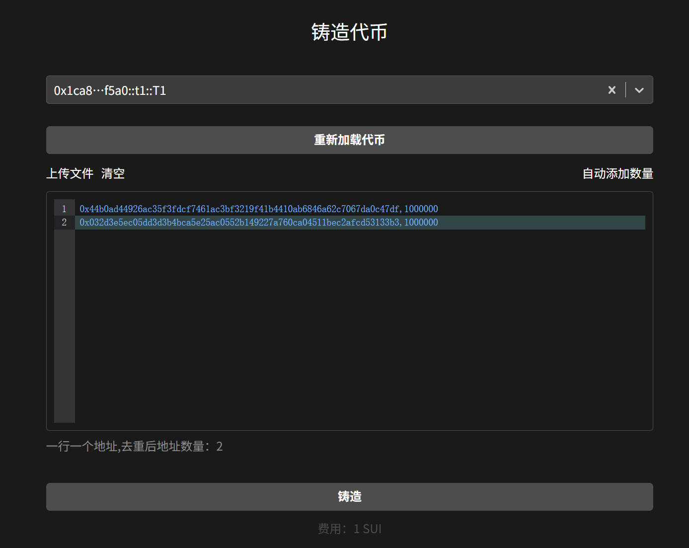
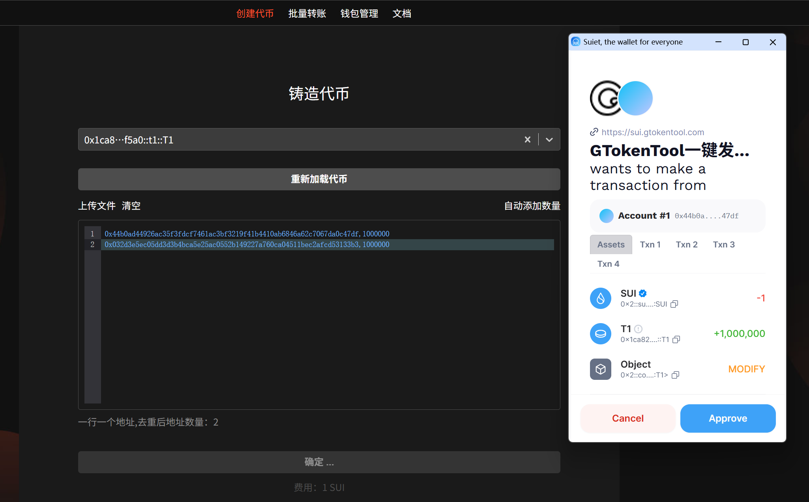
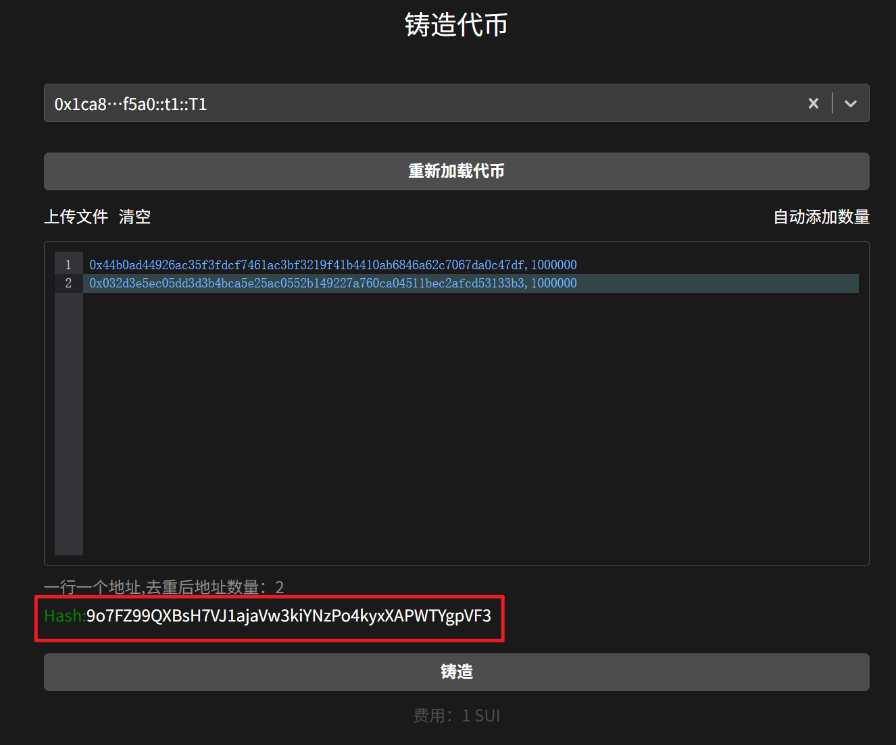

# Sui链铸造代币教程

**Sui 铸造代币工具**是专为项目方、开发者及初创团队打造的一站式发币利器。该工具利用 Sui 链的高性能优势，支持用户**低成本、零代码**快速发行个性化代币。凭借**极速确认**与**安全标准合约**，极大降低了资产发行门槛，是构建 Sui 生态应用的高效首选。

## 📌功能核心摘要：Sui 铸造代币

* **功能定位：Sui生态一站式高效发币利器。**&#x4F5C;为专为项目方、开发者及初创团队打造的底层工具，它利用Sui链的高性能优势，成为构建生态应用、实现资产快速上链的首选入口。
* **主要用途：**&#x652F;持用户在Sui链上极速发行个性化代币，自主定义代币名称、符号及总量，全面降低资产发行门槛。
* **核心优势：**
  * **低成本与零代码：**&#x65E0;需编写复杂合约，大幅削减开发投入与链上交互成本。
  * **极速确认：**&#x4F9D;托Sui并行处理技术，实现毫秒级铸造响应。
  * **安全合规：**&#x91C7;用经过验证的安全标准合约，保障资产发行的严谨性与安全性。
* **适用群体：**&#x5BFB;求高效上链的项目方、Web3开发者以及Sui生态初创团队。

***

## 准备事项

1. 安装好Suiet钱包或者SuiWallet插件：[Suiet钱包安装](suiet-qian-bao-an-zhuang-jiao-cheng.md)、[Suiwallet钱包安装](sui-wallet-qian-bao-an-zhuang-shi-yong-jiao-cheng.md)
2. 如果没有安装这两个钱包，欧易Web3钱包也是支持的
3. 钱包内最少准备2个SUI，如果数量不够，会导致交易失败
4. 手机发币建议使用欧易Web3钱包，不要用TP钱包，TP不能传logo

## 铸造代币流程

### 1. 连接钱包

铸造代币：[https://sui.gtokentool.com/zh-CN/Token/mint](https://sui.gtokentool.com/zh-CN/Token/mint)

进入铸造代币页面，右上角选择 Main 网络并连接钱包，建议使用 Suiet 钱包。这里使用测试网演示。

<figure><figcaption>
连接钱包并选择网络
</figcaption></figure>

### 2. 选择代币

点击下拉选择框选择代币，若没有加载出代币，请点击“`重新加载代币`”。

<figure><figcaption>
选择代币
</figcaption></figure>

### 3. 输入铸币地址和数量

选择代币后，可以在下一行输入框内依据示例输入地址和代币数量（**注意代币精度**），可以为其他地址铸造，也可以有多个地址。

<figure><figcaption>
输入铸币地址和数量
</figcaption></figure>

### 4. 点击“铸造”，开始交易

<figure><figcaption>
钱包确认交易
</figcaption></figure>

弹出钱包后，点击“`Approve`"，下方出现哈希值代表交易成功，可以点击去查看交易情况。

<figure><figcaption>
交易成功哈希
</figcaption></figure>

### 🤝 连接 GTokenTool 

* **💬 Telegram社群**：[点击加入官方群组](https://t.me/gtokentool)
* **🐦 Twitter (X)**：[关注我们获取最新动态](https://x.com/gtokentool)
* **📚 官方文档**：[查看 Gitbook 文档](https://docs.gtokentool.com/)
* **💻 开源代码**：[访问 GitHub 仓库](https://github.com/Gtokentool/docs/blob/master/SUMMARY.md)
* **📺 视频教程**：[订阅 YouTube 频道](https://www.youtube.com/@GTokenTool)

> ⚠️ 风险提示与免责声明
>
> GTokenTool 保留随时全权酌情因任何理由修改、变更或取消此公告的权利，无需事先通知。
>
> 以上信息内容仅供参考，GTokenTool 对本平台上的任何虚拟资产、产品或促销活动不做任何推荐或保证。虚拟资产的价格波动很大，投资交易虚拟资产将面临巨大风险。**请谨慎投资。**
