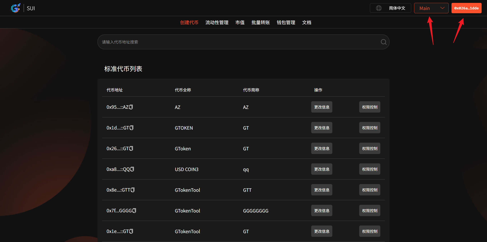
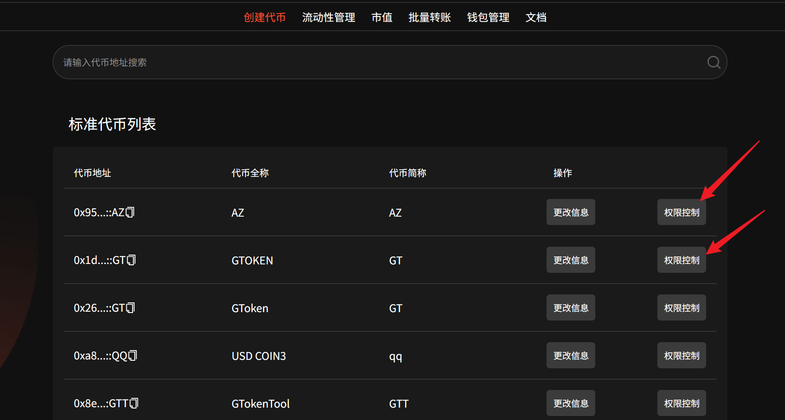
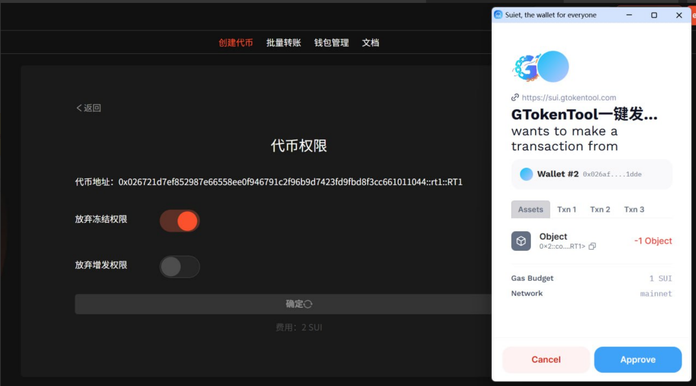
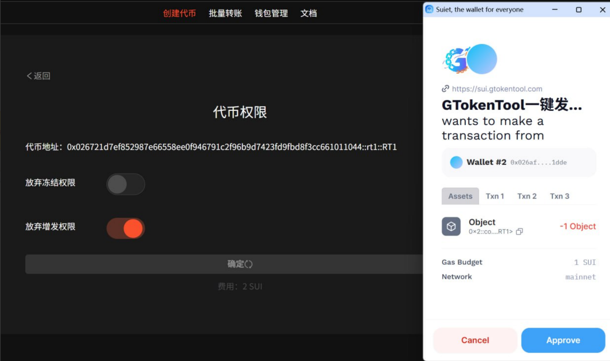

# Sui链放弃权限教程

## 准备事项

1. 安装好Suiet钱包或者SuiWallet插件：[Suiet钱包安装](suiet-qian-bao-an-zhuang-jiao-cheng.md)、[Suiwallet钱包安装](sui-wallet-qian-bao-an-zhuang-shi-yong-jiao-cheng.md)
2. 如果没有安装这两个钱包，欧易Web3钱包也是支持的
3. 钱包内最少准备3个SUI，如果数量不够，会导致交易失败
4. 手机发币建议使用欧易Web3钱包，不要用TP钱包，TP不能传logo

## Sui链放弃权限具体流程

### 1. 连接钱包

管理代币：[https://sui.gtokentool.com/zh-CN/Token/management](https://sui.gtokentool.com/zh-CN/Token/management)

进入管理代币信息页面，右上角选择 Main 网络并连接钱包，建议使用 Suiet 钱包。

<figure><figcaption>
连接钱包并选择网络
</figcaption></figure>

### 2. 选择代币并点击“权限控制”

<figure><figcaption>
选择代币进行权限控制
</figcaption></figure>

点击“`权限控制`”后，进入代币权限页面。

### 3. 放弃权限

进入页面后，选择对应的权限，点击“`确定`”。

<figure><figcaption>
选择放弃冻结权限
</figcaption></figure>

<figure><figcaption>
选择放弃增发权限
</figcaption></figure>

弹出钱包后，点击“`Approve`”。交易成功会弹出提示。

### 🤝 连接 GTokenTool 

* **💬 Telegram社群**：[点击加入官方群组](https://t.me/gtokentool)
* **🐦 Twitter (X)**：[关注我们获取最新动态](https://x.com/gtokentool)
* **📚 官方文档**：[查看 Gitbook 文档](https://docs.gtokentool.com/)
* **💻 开源代码**：[访问 GitHub 仓库](https://github.com/Gtokentool/docs/blob/master/SUMMARY.md)
* **📺 视频教程**：[订阅 YouTube 频道](https://www.youtube.com/@GTokenTool)

> ⚠️ 风险提示与免责声明
>
> GTokenTool 保留随时全权酌情因任何理由修改、变更或取消此公告的权利，无需事先通知。
>
> 以上信息内容仅供参考，GTokenTool 对本平台上的任何虚拟资产、产品或促销活动不做任何推荐或保证。虚拟资产的价格波动很大，投资交易虚拟资产将面临巨大风险。**请谨慎投资。**
