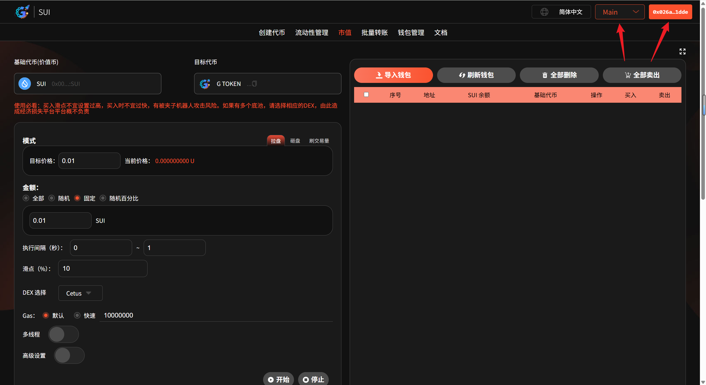
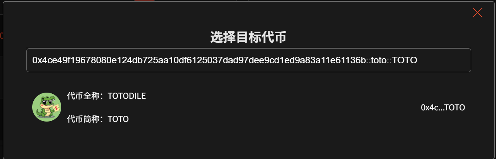
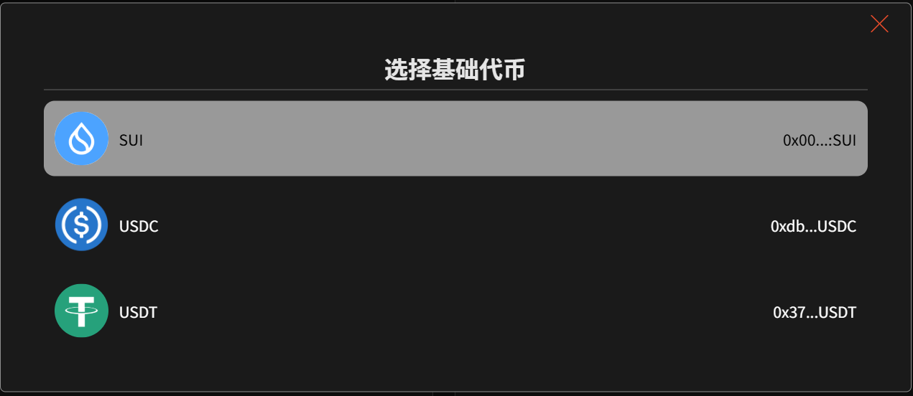
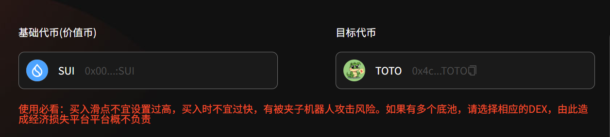
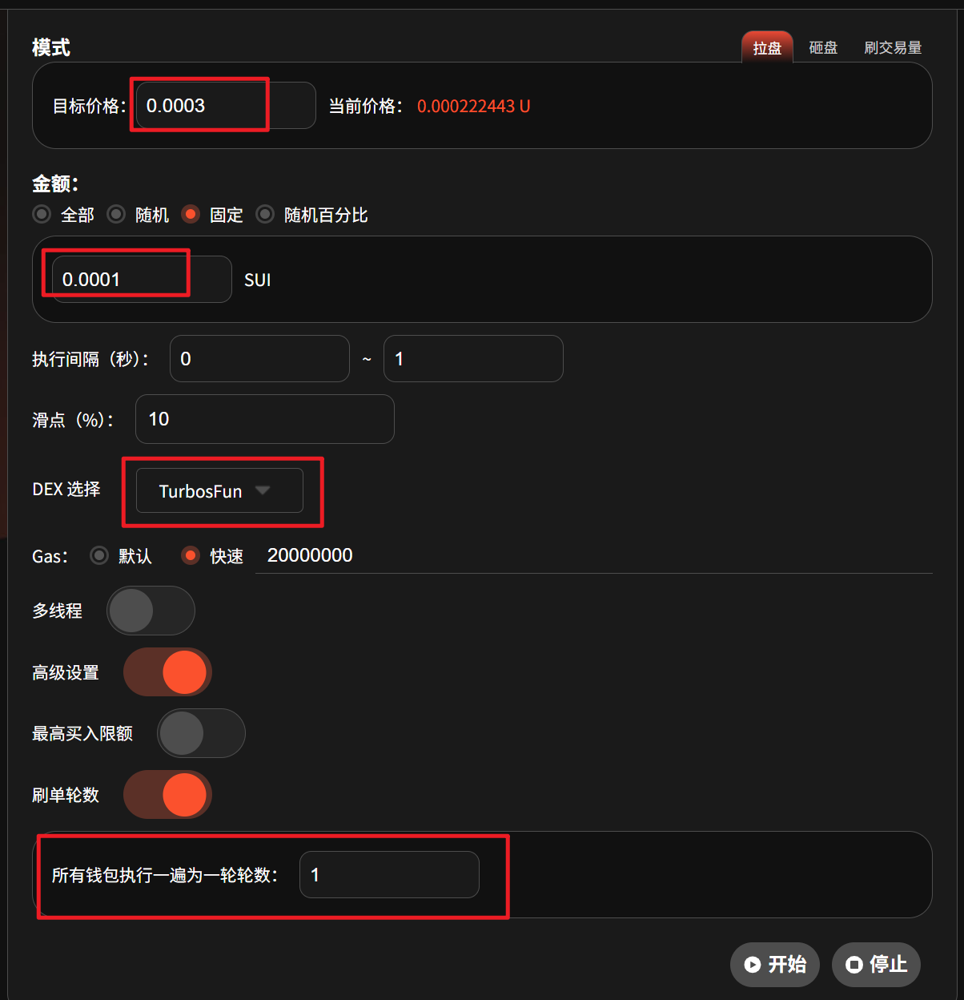
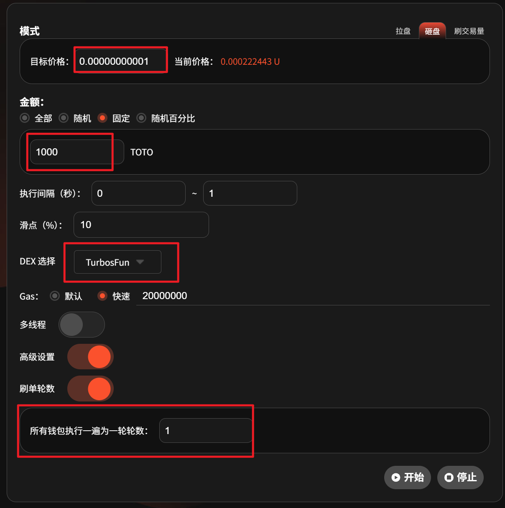
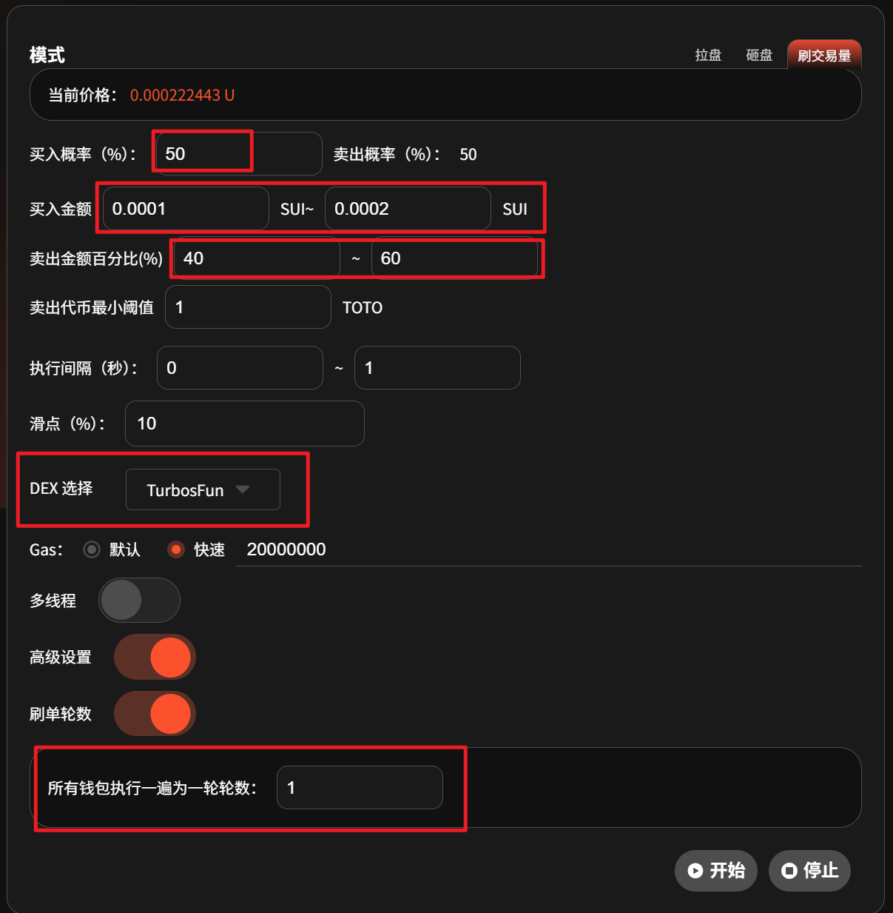
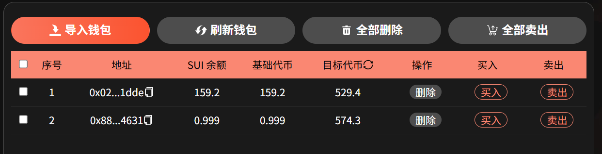
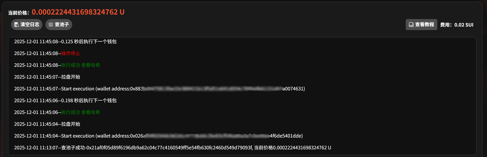
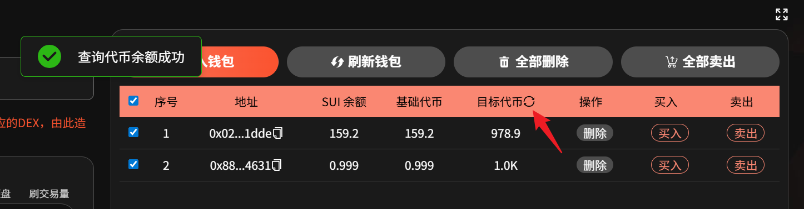

# Sui链市值管理机器人教程

### 准备事项： 

1. 一台电脑或者一部手机
2. 安装好Suiet钱包或者SuiWallet插件：[Suiet钱包安装](https://docs.gtokentool.com/sui/suiet-qian-bao-an-zhuang-jiao-cheng)、[Suiwallet钱包安装](https://docs.gtokentool.com/sui/sui-wallet-qian-bao-an-zhuang-shi-yong-jiao-cheng)
3. 要进行批量交易的钱包私钥
4. 批量交易所需代币
5. 钱包内准备充足SUI和底池代币，如果数量不够，会导致交易失败

## Sui链市值管理机器人操作流程

### 1. 连接钱包 

市值机器人：[https://sui.gtokentool.com/zh-CN/market](https://sui.gtokentool.com/zh-CN/market)

进入市值机器人页面，右上角选择 Main 网络并连接钱包，建议使用 Suiet 钱包。

<figure><figcaption>
连接钱包并选择网络
</figcaption></figure>

### 2. 输入要进行批量交易的币种 

通过输入代币合约来对代币进行搜索，并选择目标代币。

<figure><figcaption>
输入目标代币
</figcaption></figure>

之后选择对应的基础代币。

<figure><figcaption>
选择基础代币
</figcaption></figure>

<figure><figcaption>
交易的代币对
</figcaption></figure>

### 3. 设置相关配置参数

**交易模式：**&#x62C9;盘→买入代币；砸盘→卖出代币；刷交易量→随机买入和卖出。

**目标价格：**&#x62C9;盘模式下，<mark style="color:purple;">目标价格要高于当前代币价格</mark>。砸盘模式下，<mark style="color:purple;">目标价格要低于当前代币价格</mark>。

**金额：**&#x5728;拉盘模式下，这里的金额就是你所花费的SUI数量。在砸盘模式下，这里的金额就是你要出售的代币数量。

* 全部：一次性卖出所有代币，无视价格与滑点。
* 随机：根据设置的金额范围，随机买入/卖出代币。
* 固定：按照固定数额的SUI买入，或者按照固定数量的代币进行卖出。

**买入概率（%）：**&#x5237;交易量模式下，执行买入代币操作的概率。

**卖出概率（%）：**&#x5237;交易量模式下，执行卖出代币操作的概率。

**买入金额：**&#x4E70;入代币的金额范围。

**卖出金额百分比（%）：**&#x5356;出代币的百分比。

**卖出代币最小阈值：**&#x76EE;标代币还剩多少就不会卖出只会买入。

**执行间隔：**&#x6BCF;次买入或者卖出之间的执行间隔时间，以秒为单位。

**滑点：**&#x6BCF;笔交易所能接受的最大磨损成本。刚上线的代币，滑点要高一点。

**DEX 选择：**&#x9009;择对应的池子类型，否则交易可能失败。（选好后点击下方的`查池子`按钮，确认是否能够成功查到池子）

**Gas：**&#x4E00;定程度上决定了你的交易速度，矿工费给的越多，原则上交易速度相对越快。

* 默认：额外支出10000000 gas，大概是0.01 SUI左右。
* 快速：额外支出20000000 gas，大概是0.02 SUI左右。
* 其他：可以自己输入自定义gas费。

**多线程：**&#x5F00;启多线程后，钱包之间会存在竞争，有小概率导致交易失败。

**最高买入限额：**&#x4E70;入总数量达到限额时程序自动停止。

**刷单轮数：**&#x8BBE;置交易次数。<mark style="color:purple;">若设置了这个，则到指定次数会自动停止交易，无需手动停止。</mark>所有钱包执行一遍为一轮。

#### 拉盘模式参数展示：

<figure><figcaption>
拉盘模式参数展示
</figcaption></figure>

#### 砸盘模式参数展示：

<figure><figcaption>
砸盘模式参数展示
</figcaption></figure>

#### 刷交易量模式参数展示：

<figure><figcaption>
刷交易量模式参数展示
</figcaption></figure>

### 4. 导入交易钱包


**特别说明：**

* 私钥仅在本地计算并签名交易，但 Web3 仍存在很多不确定因素；
* GTokenTool 诚挚建议您在使用涉及私钥的功能后，及时更换钱包；
* 切勿因嫌麻烦而忽视安全问题，以免造成不必要的损失。


导入批量钱包，查询钱包余额，点击`刷新钱包`可刷新钱包的余额。点击`全部删除`可删除全部钱包。勾选钱包后，点击`全部卖出`可直接卖出所选钱包内的全部目标代币。点击`删除`操作按钮可单独删除钱包。点击`买入`即可买入对应金额或数量的代币。点击`卖出`即可卖出对应钱包内的全部目标代币。点击目标代币旁边的刷新图标可刷新钱包内目标代币余额。

<figure><figcaption>
导入钱包
</figcaption></figure>

### 5. 开始批量交易

勾选钱包后，点击`开始`，即可开始交易。可实时查看交易日志。交易结束后，可以点击日志里的`查看哈希`，复制哈希前往[区块链浏览器](https://suiscan.xyz/mainnet/home)查看交易记录，也可以点击目标代币旁边的刷新图标查看交易是否成功。

#### 以拉盘模式为例：

<figure><figcaption>
交易日志
</figcaption></figure>

<figure><figcaption>
刷新目标代币余额
</figcaption></figure>

### 🤝 连接 GTokenTool 

* **💬 Telegram社群**：[点击加入官方群组](https://t.me/gtokentool)
* **🐦 Twitter (X)**：[关注我们获取最新动态](https://x.com/gtokentool)
* **📚 官方文档**：[查看 Gitbook 文档](https://docs.gtokentool.com/)
* **💻 开源代码**：[访问 GitHub 仓库](https://github.com/Gtokentool/docs/blob/master/SUMMARY.md)
* **📺 视频教程**：[订阅 YouTube 频道](https://www.youtube.com/@GTokenTool)

> ⚠️ 风险提示与免责声明
>
> GTokenTool 保留随时全权酌情因任何理由修改、变更或取消此公告的权利，无需事先通知。
>
> 以上信息内容仅供参考，GTokenTool 对本平台上的任何虚拟资产、产品或促销活动不做任何推荐或保证。虚拟资产的价格波动很大，投资交易虚拟资产将面临巨大风险。**请谨慎投资。**
