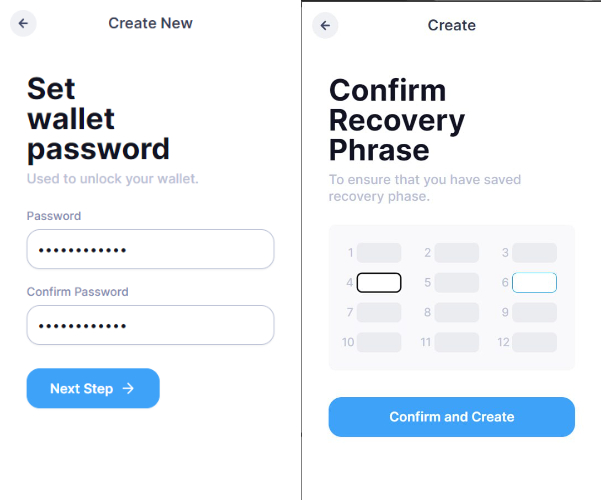
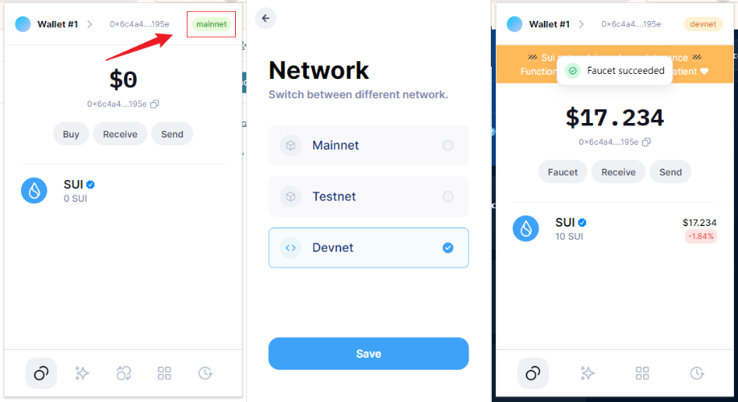
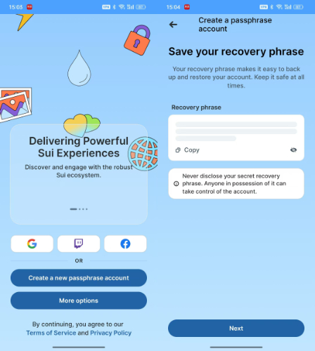

# Sui Wallet钱包安装使用教程

欢迎来到 Sui钱包的未来！作为一款前沿的数字资产管理工具，Sui钱包不仅功能强大，更是安全性和易用性的完美结合。它支持多种加密货币和代币，让你轻松管理所有数字资产，一键查看余额和交易记录，简直是区块链爱好者的必备神器！

Sui钱包的安全性无可匹敌，采用了行业领先的加密技术，确保你的资产安全无忧。同时，用户友好的界面设计，让无论是新手还是资深用户都能迅速上手。内置的DApp浏览器让你能够方便地访问各种去中心化应用，随时随地进行交易和投资。

此外，Sui钱包还提供丰富的功能，如一键备份、恢复和多重签名支持，完美满足不同用户的需求。准备好体验 Sui钱包带来的便捷与安全了吗？加入我们，尽情探索加密世界的无限可能吧。

## [使用浏览器插件](https://chromewebstore.google.com/search/sui?utm_source=ext_app_menu)

此处示例使用`suiet`钱包，[点此安装](https://chromewebstore.google.com/detail/suiet-sui-wallet/khpkpbbcccdmmclmpigdgddabeilkdpd?utm_source=ext_app_menu)   ，也可选择其他钱包 如 [sui wallet](https://chromewebstore.google.com/detail/sui-wallet/opcgpfmipidbgpenhmajoajpbobppdil?utm_source=ext_app_menu) ， [Martian Aptos](https://chromewebstore.google.com/detail/martian-aptos-sui-wallet/efbglgofoippbgcjepnhiblaibcnclgk?utm_source=ext_app_menu)  ，流程同理，如使用sui wallet 可参考下方 [手机端](sui-wallet-qian-bao-an-zhuang-shi-yong-jiao-cheng.md#shi-yong-shou-ji-duan)使用。

**密码和助记词都需要安全保存，确保记录在安全的地方，密码将被用于解锁钱包，而助记词将被用于恢复钱包。**

<figure><figcaption></figcaption></figure>

对于开发者：你可以直接在钱包内部使用水龙头获取测试 Sui代币，点击右上角的`mainnet，`然后点击`Devnet`或`Testnet`切换到对应网络网，回到主页面，能看见`Faucet`按钮，点击即可获取 SUI ( 单次获得10 SUI )。

<figure><figcaption></figcaption></figure>

## 使用手机端

1. 安卓使用 goole play商店搜索 sui wallet 下载。

<figure><figcaption></figcaption></figure>

2 创建钱包，选择支持的登录方式，或者使用 `Create a new passphrase accoun` ，安全保存下助记词即可。

<figure><figcaption></figcaption></figure>

3.对于开发者，同样可以切换网络直接在钱包内使用水龙头领取Sui ，点击主页面上右上方的齿轮按钮，接着点击`Network`选项，切换网络，然后就能在下方看见水龙头接口。

<figure><figcaption></figcaption></figure>

如有不明白或者不清楚的地方，请加入官方电报群：[**https://t.me/gtokentool**](https://t.me/gtokentool)
